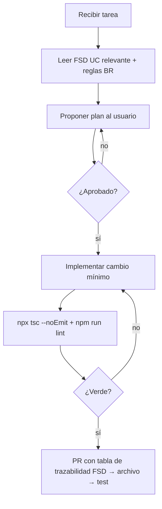

# AGENTS.md

> **¿Qué es este archivo?** Es el README para agentes de IA de este repositorio. Claude Code, Cursor y otros agentes deben leerlo antes de actuar. Declara el stack autoritativo, las reglas de dominio invariantes, la estructura del repo y los guardrails de seguridad.

<!-- BEGIN:nextjs-agent-rules -->
> **Next.js:** Esta versión puede tener cambios breaking respecto a tu conocimiento de entrenamiento. Leer `node_modules/next/dist/docs/` antes de escribir código si hay dudas sobre APIs o convenciones.
<!-- END:nextjs-agent-rules -->

---

## 1. Identidad del producto

- **Nombre:** Pronóstico Mundial 2026
- **Dominio:** Entretenimiento / Torneos privados
- **Resumen:** Aplicación web privada para gestionar un torneo de predicciones del Mundial FIFA 2026. Los participantes pronostican el marcador exacto de cada partido; el sistema calcula puntos automáticamente y distribuye el pozo al final.
- **Cliente / Sponsor:** Vladimir Mariaca Vargas
- **BRD:** `docs/BRD_v0.1.md`
- **PRD:** `docs/PRD_v0.1.md`
- **FSD:** `docs/FSD_v0.1.md`

---

## 2. Contexto que el agente MUST leer antes de actuar

Al comenzar cualquier tarea, leer en orden:

1. `docs/FSD_v0.1.md` — especialmente §4 (casos de uso), §5 (reglas de negocio) y §6 (modelo de datos).
2. El caso de uso específico tocado por la tarea (FSD-UC-NNN).
3. `CLAUDE.md` — stack, arquitectura y convenciones del proyecto.
4. Código existente en el área que se va a modificar.

---

## 3. Estructura del repositorio

```
/
├── AGENTS.md
├── CLAUDE.md
├── docs/
│   ├── BRD_v0.1.md
│   ├── PRD_v0.1.md
│   └── FSD_v0.1.md
├── .claude/skills/         # Skills del proyecto
│   ├── implement-uc/
│   ├── drizzle-schema/
│   ├── points-engine/
│   ├── supabase-rls/
│   └── review-spec/
└── src/
    ├── app/                # Next.js App Router
    │   ├── (auth)/         # Rutas protegidas
    │   ├── admin/          # Panel del organizador
    │   └── api/            # Route Handlers
    ├── components/         # shadcn/ui + componentes custom
    ├── db/
    │   ├── schema.ts       # Drizzle schema — fuente de verdad de la BD
    │   └── index.ts        # Cliente Drizzle
    ├── lib/
    │   ├── points.ts       # Motor de cálculo de puntos (función pura)
    │   └── prizes.ts       # Distribución del pozo (función pura)
    └── hooks/              # TanStack Query hooks
```

---

## 4. Stack tecnológico autoritativo

| Capa | Tecnología | Notas |
|------|------------|-------|
| Framework | Next.js 15 (App Router) + TypeScript | Server Components + Route Handlers |
| UI | Tailwind CSS + shadcn/ui | No introducir otras librerías de componentes |
| Base de datos | Supabase (PostgreSQL) | RLS habilitado en todas las tablas |
| Auth | Supabase Auth | Sin registro público; el admin crea cuentas |
| Realtime | Supabase Realtime | Solo para tabla de posiciones |
| ORM | Drizzle ORM | Solo en servidor (Route Handlers y Server Components) |
| Data fetching | TanStack Query | Solo en Client Components |
| Deploy | Vercel | |

El agente **MUST NOT** introducir dependencias fuera de esta lista sin consultar al usuario.

---

## 5. Convenciones de código

- **Idioma del código:** inglés (variables, funciones, tipos, nombres de archivos).
- **Idioma de la UI y comentarios de dominio:** español.
- **TypeScript estricto:** `strict: true`. Sin `any`.
- **Drizzle** se usa únicamente en el servidor. MUST NOT importar el cliente Drizzle en Client Components.
- **TanStack Query** se usa únicamente en Client Components.
- **Route Handlers** manejan toda la lógica de mutación y validación server-side.
- **Commits:** Conventional Commits (`feat:`, `fix:`, `refactor:`, `chore:`, `docs:`).

---

## 6. Reglas de dominio invariantes

- **MUST:** Solo los 90 minutos reglamentarios cuentan. Prórroga y penales se ignoran (`RB-03`).
- **MUST:** Un pronóstico no ingresado se evalúa como 0-0 internamente. Si el partido termina 0-0, máximo 1 punto porque `is_manually_entered = false` (`RB-05`).
- **MUST:** El plazo es las 15:00 BOT (UTC-4) del día anterior. Siempre usar `America/La_Paz` (`RB-04`).
- **MUST:** Pasado el plazo, los pronósticos se bloquean a nivel de BD (RLS) y se publican. Irreversible (`BR-005`).
- **MUST:** La elección del Campeón Mundial es irrevocable una vez registrada (`RB-06`).
- **MUST:** `is_manually_entered = true` es condición necesaria para los +2 puntos de marcador exacto (`BR-004`).
- **MUST:** El pozo se calcula solo sobre `participants` con `has_paid = true` (`RB-01`).
- **MUST NOT:** Exponer pronósticos de otros participantes antes del `deadline_at` del partido.

---

## 7. Seguridad y privacidad

- **MUST NOT:** Almacenar contraseñas en texto plano. Supabase Auth gestiona el hash.
- **MUST NOT:** Registrar tokens, contraseñas ni credenciales en logs.
- **MUST:** RLS habilitado en todas las tablas de Supabase.
- **MUST:** Toda operación de escritura crítica se valida server-side en Route Handlers.
- **MUST NOT:** Exponer el rol `admin` al cliente. Validar siempre en el servidor.
- **MUST:** El cliente Drizzle del servidor usa `service_role` key, nunca `anon`.
- **Secretos:** Solo en `.env.local`. MUST NOT aparecer en código ni commits.

---

## 8. Guardrails del agente

- **MUST** leer el FSD del caso de uso antes de implementarlo. No inventar comportamiento.
- **MUST** crear o actualizar tests en `lib/points.ts` y `lib/prizes.ts` para cada BR tocada.
- **MUST NOT** modificar `db/schema.ts` sin verificar el impacto en RLS policies.
- **MUST NOT** saltarse la validación de `deadline_at` en el servidor.
- **MUST NOT** implementar funcionalidades Out of Scope (`docs/BRD_v0.1.md §10.2`) sin aprobación.
- Si una regla del FSD no está clara, **MUST** detenerse y preguntar. No asumir.

---

## 9. Flujo de trabajo estándar



---

## 10. Comandos de verificación

```bash
npm run dev          # Desarrollo
npm run build        # Build
npm run lint         # Lint
npx tsc --noEmit     # Typecheck
npm test             # Tests

npx drizzle-kit generate   # Generar migración
npx drizzle-kit migrate    # Aplicar migración
```

---

## 11. Casos de uso implementados

| ID | Nombre | Estado |
|----|--------|--------|
| FSD-UC-001 | Iniciar sesión | Pendiente |
| FSD-UC-002 | Ingresar / modificar pronóstico | Pendiente |
| FSD-UC-003 | Ver tabla de posiciones en tiempo real | Pendiente |
| FSD-UC-004 | Admin registra resultado y dispara cálculo de puntos | Pendiente |
| FSD-UC-005 | Admin crea cuenta de participante | Pendiente |
| FSD-UC-006 | Participante elige Campeón Mundial | Pendiente |

---

## 12. Registro de cambios

| Versión | Fecha | Autor | Cambio |
|---------|-------|-------|--------|
| v0.1 | 15-May-2026 | Alberto Gomez | Versión inicial |
