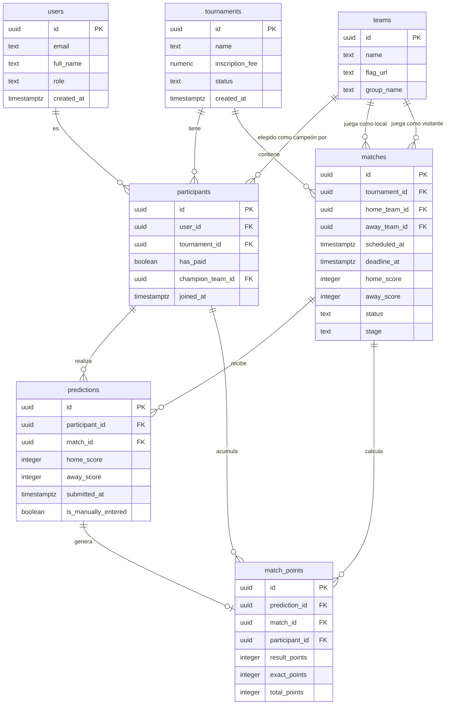

# Functional Specification Document
## Pronóstico Mundial 2026

---

| Campo | Valor |
|---|---|
| **Proyecto** | Pronóstico Mundial 2026 |
| **Documento** | Functional Specification Document (FSD) |
| **Versión** | 0.1 |
| **Estado** | Borrador |
| **Fecha** | 2026-05-15 |
| **Autor** | Alberto Gomez |
| **Revisado por** | Pendiente |
| **Aprobado por** | Pendiente |
| **Clasificación** | Privado — uso interno del equipo de desarrollo |

---

## Historial de Versiones

| Versión | Fecha | Autor | Cambios |
|---|---|---|---|
| 0.1 | 2026-05-15 | Alberto Gomez | Documento inicial — borrador completo |

---

## Tabla de Contenidos

1. [Resumen Ejecutivo](#1-resumen-ejecutivo)
2. [Alcance](#2-alcance)
3. [Actores y Roles](#3-actores-y-roles)
4. [Casos de Uso](#4-casos-de-uso)
5. [Reglas de Negocio](#5-reglas-de-negocio)
6. [Modelo de Datos](#6-modelo-de-datos)
7. [Requisitos No Funcionales](#7-requisitos-no-funcionales)
8. [Matriz de Trazabilidad](#8-matriz-de-trazabilidad)
9. [Plan de Pruebas](#9-plan-de-pruebas)
10. [Glosario](#10-glosario)

---

## 1. Resumen Ejecutivo

**Pronóstico Mundial 2026** es una aplicación web privada diseñada para gestionar un torneo de predicciones del Mundial FIFA 2026, celebrado en Estados Unidos, México y Canadá. La plataforma reemplaza la coordinación manual por WhatsApp (hojas de cálculo, mensajes de texto) con un sistema centralizado, transparente y en tiempo real.

Los participantes pagan una cuota de inscripción de Bs. 500 y compiten pronosticando el marcador exacto de cada partido del torneo. El organizador administra el fixture, registra resultados y supervisa el pozo económico. La tabla de posiciones se actualiza automáticamente tras cada partido. Al final del torneo, el pozo se distribuye entre los mejores clasificados según reglas predefinidas.

**Objetivo principal:** Proveer una plataforma confiable, justa y transparente que elimine la ambigüedad en las reglas, automatice el cálculo de puntos y garantice que todos los participantes vean la misma información al mismo tiempo.

**Stack tecnológico:** Next.js 15 + TypeScript, Tailwind CSS + shadcn/ui, Supabase (PostgreSQL + Auth + Realtime), Drizzle ORM, TanStack Query, Vercel.

---

## 2. Alcance

### 2.1 Dentro del Alcance

| ID | Funcionalidad |
|---|---|
| IN-01 | Autenticación de usuarios mediante Supabase Auth (email + contraseña) |
| IN-02 | Creación manual de cuentas de participantes por parte del admin |
| IN-03 | Registro del pago de cuota de inscripción por el admin |
| IN-04 | Selección del campeón mundial antes del partido inaugural |
| IN-05 | Ingreso y modificación de pronósticos (marcador exacto) por partido |
| IN-06 | Cierre automático de pronósticos a las 15:00 del día anterior a cada partido (BOT, UTC-4) |
| IN-07 | Publicación automática de pronósticos tras el cierre del plazo |
| IN-08 | Registro manual de resultados de partidos por el admin |
| IN-09 | Cálculo automático de puntos tras el registro de resultados |
| IN-10 | Tabla de posiciones en tiempo real con ranking actualizado |
| IN-11 | Visualización del campeón elegido por cada participante desde el inicio del torneo |
| IN-12 | Panel de administración para gestión de participantes, fixture y resultados |
| IN-13 | Carga manual de pronósticos por el admin (fallback WhatsApp) |
| IN-14 | Cálculo y presentación de la distribución del pozo al final del torneo |
| IN-15 | Visualización del mensaje "No pronosticó" para pronósticos no ingresados |

### 2.2 Fuera del Alcance

| ID | Funcionalidad excluida | Justificación |
|---|---|---|
| OUT-01 | Registro público de participantes (auto-registro) | El admin crea todas las cuentas manualmente |
| OUT-02 | Pasarela de pago integrada | El pago es en efectivo/QR externo; el admin registra manualmente |
| OUT-03 | Pronósticos de prórroga o tiros penales | Solo cuentan los 90 minutos reglamentarios |
| OUT-04 | Estadísticas avanzadas o análisis histórico | No requerido en v0.1 |
| OUT-05 | Aplicación móvil nativa (iOS/Android) | La web es responsiva; suficiente para v0.1 |
| OUT-06 | Integración directa con WhatsApp API | El fallback es manual, ejecutado por el admin |
| OUT-07 | Múltiples torneos simultáneos | Un torneo activo a la vez en v0.1 |
| OUT-08 | Sistema de notificaciones push | No requerido en v0.1 |

---

## 3. Actores y Roles

### 3.1 Participante

Persona que se ha inscrito en el torneo pagando la cuota de Bs. 500. Su cuenta es creada por el admin. Puede:

- Iniciar sesión en la plataforma.
- Ver el fixture completo del torneo.
- Ingresar y modificar su pronóstico para cada partido (antes del plazo).
- Ver sus propios pronósticos antes del cierre.
- Ver todos los pronósticos (propios y ajenos) después del cierre.
- Ver la tabla de posiciones en tiempo real.
- Ver el campeón elegido por cada participante.
- Seleccionar su campeón mundial (antes del partido inaugural).

**Restricciones:** No puede ver pronósticos ajenos antes del plazo. No puede modificar pronósticos después del cierre. No puede registrar resultados ni gestionar cuentas.

### 3.2 Admin / Organizador

Persona responsable de administrar el torneo. También puede participar como jugador. Tiene acceso a todas las funciones del participante más:

- Crear y gestionar cuentas de participantes.
- Registrar pagos de inscripción.
- Cargar manualmente pronósticos de participantes (fallback WhatsApp).
- Registrar el resultado oficial de cada partido.
- Disparar el cálculo de puntos tras registrar un resultado.
- Visualizar el estado del pozo y la distribución de premios.
- Gestionar el fixture (partidos, fechas, equipos).

**Nota:** El organizador participa en igualdad de condiciones. Sus pronósticos siguen las mismas reglas de plazo y visibilidad que los demás participantes.

### 3.3 Sistema

Actor no humano que ejecuta comportamientos automáticos:

- Calcula y aplica el plazo de cierre (15:00 BOT del día anterior a cada partido).
- Bloquea la edición de pronósticos al llegar el plazo.
- Publica automáticamente los pronósticos al llegar el plazo.
- Asigna 0-0 por defecto a pronósticos no ingresados en el momento de calcular puntos.
- Calcula puntos por partido al recibir el resultado oficial.
- Actualiza la tabla de posiciones en tiempo real vía Supabase Realtime.

---

## 4. Casos de Uso

### FSD-UC-001 — Iniciar Sesión

**Descripción:** El usuario (participante o admin) ingresa sus credenciales para autenticarse en la plataforma.

**Actor primario:** Participante, Admin

**Precondiciones:**
- El usuario tiene una cuenta creada por el admin en Supabase Auth.
- El usuario dispone de su email y contraseña.

**Postcondiciones:**
- El usuario está autenticado y tiene acceso a las funciones correspondientes a su rol.
- Se registra la sesión activa en Supabase Auth.

**Flujo Principal:**

1. El usuario accede a la URL de la aplicación.
2. El sistema muestra la pantalla de inicio de sesión.
3. El usuario ingresa su email y contraseña.
4. El usuario presiona "Iniciar sesión".
5. El sistema envía las credenciales a Supabase Auth.
6. Supabase Auth valida las credenciales y devuelve un JWT.
7. El sistema lee el campo `role` de la tabla `users` para determinar el rol del usuario.
8. Si el rol es `admin`, el sistema redirige al panel de administración.
9. Si el rol es `participant`, el sistema redirige al dashboard de pronósticos.

**Flujos Alternativos:**

| Código | Condición | Respuesta del sistema |
|---|---|---|
| UC001-A1 | Credenciales incorrectas | Mostrar mensaje: "Email o contraseña incorrectos." Sin revelar cuál campo falló. |
| UC001-A2 | Usuario no tiene cuenta | No hay opción de auto-registro. El usuario debe contactar al admin. |
| UC001-A3 | Cuenta desactivada | Mostrar mensaje genérico de error de autenticación. |
| UC001-A4 | Error de red | Mostrar mensaje: "No se pudo conectar. Intenta nuevamente." |

**Criterios de Aceptación (Gherkin):**

```gherkin
Feature: Inicio de sesión

  Scenario: Participante inicia sesión exitosamente
    Given el participante tiene una cuenta activa con email "juan@example.com"
    And su contraseña es "secreto123"
    When ingresa sus credenciales en el formulario de login
    And presiona "Iniciar sesión"
    Then es redirigido al dashboard de pronósticos
    And ve su nombre en la barra de navegación

  Scenario: Admin inicia sesión exitosamente
    Given el admin tiene una cuenta con rol "admin"
    When ingresa sus credenciales correctas
    And presiona "Iniciar sesión"
    Then es redirigido al panel de administración

  Scenario: Credenciales incorrectas
    Given el usuario ingresa una contraseña incorrecta
    When presiona "Iniciar sesión"
    Then el sistema muestra "Email o contraseña incorrectos."
    And el usuario permanece en la pantalla de login

  Scenario: Acceso a ruta protegida sin sesión
    Given el usuario no ha iniciado sesión
    When intenta acceder a "/dashboard"
    Then es redirigido a la pantalla de login
```

**Referencias:** PRD-REQ-001, PRD-REQ-002, NFR-003

---

### FSD-UC-002 — Ingresar / Modificar Pronóstico

**Descripción:** El participante ingresa o modifica el marcador exacto que predice para un partido determinado, siempre que el plazo no haya vencido.

**Actor primario:** Participante

**Precondiciones:**
- El participante está autenticado.
- El partido tiene estado `scheduled`.
- La hora actual es anterior al `deadline_at` del partido (15:00 BOT del día anterior).
- El participante está inscrito en el torneo activo y tiene `has_paid = true`.

**Postcondiciones:**
- Se crea o actualiza un registro en la tabla `predictions` con los valores ingresados, `submitted_at` con la hora actual e `is_manually_entered = true`.
- El pronóstico permanece privado (no visible para otros participantes) hasta que se alcance el `deadline_at`.

**Flujo Principal:**

1. El participante navega al fixture del torneo.
2. El sistema muestra la lista de partidos con su estado (abierto/cerrado).
3. El participante selecciona un partido con pronóstico abierto.
4. El sistema muestra el formulario de pronóstico con dos campos numéricos: goles equipo local y goles equipo visitante.
5. Si el participante ya ingresó un pronóstico previo, los campos muestran los valores guardados.
6. El participante ingresa los valores deseados (ej. 2 - 1).
7. El participante presiona "Guardar pronóstico".
8. El sistema valida que el plazo no ha vencido (verificación server-side).
9. El sistema guarda o actualiza el registro en `predictions` con `is_manually_entered = true`.
10. El sistema muestra confirmación: "Tu pronóstico ha sido guardado."

**Flujos Alternativos:**

| Código | Condición | Respuesta del sistema |
|---|---|---|
| UC002-A1 | El plazo ya venció al momento de guardar (race condition) | Rechazar con mensaje: "El plazo para este partido ya cerró." |
| UC002-A2 | El participante no tiene `has_paid = true` | Mostrar mensaje: "Tu inscripción está pendiente de confirmación de pago." |
| UC002-A3 | El partido ya tiene resultado (estado `finished`) | El formulario está deshabilitado. Solo lectura. |
| UC002-A4 | El participante no ingresó pronóstico antes del plazo | El sistema no crea registro; al calcular puntos usa 0-0 internamente con `is_manually_entered = false`. |
| UC002-A5 | Admin carga pronóstico manualmente (fallback) | El admin usa el panel de administración. Se crea el registro con `is_manually_entered = true` si fue enviado por WhatsApp antes del plazo. |

**Criterios de Aceptación (Gherkin):**

```gherkin
Feature: Ingresar pronóstico

  Scenario: Participante guarda pronóstico exitosamente
    Given el participante está autenticado
    And el partido Argentina vs Brasil tiene deadline_at en el futuro
    When ingresa "2" para Argentina y "1" para Brasil
    And presiona "Guardar pronóstico"
    Then el sistema guarda la predicción con is_manually_entered = true
    And muestra "Tu pronóstico ha sido guardado."

  Scenario: Participante modifica pronóstico existente
    Given el participante ya tiene el pronóstico "1-0" guardado
    And el plazo no ha vencido
    When cambia el pronóstico a "2-1"
    And presiona "Guardar pronóstico"
    Then el sistema actualiza el registro en predictions
    And muestra el nuevo valor "2-1" en pantalla

  Scenario: Intento de guardar pronóstico fuera de plazo
    Given el deadline_at del partido ya pasó
    When el participante intenta guardar un pronóstico
    Then el sistema rechaza la operación
    And muestra "El plazo para este partido ya cerró."

  Scenario: Partido sin pronóstico ingresado llega al plazo
    Given el participante no ingresó pronóstico para el partido X
    And el deadline_at del partido X ha pasado
    When el admin registra el resultado del partido X
    Then el sistema evalúa el pronóstico como 0-0 con is_manually_entered = false
    And la UI muestra "No pronosticó" para ese participante

  Scenario: Publicación automática de pronósticos al alcanzar el plazo
    Given son las 14:59 BOT y los pronósticos están privados
    When el reloj alcanza las 15:00 BOT del día anterior al partido
    Then todos los pronósticos del partido se hacen visibles para todos los participantes
    And el formulario de edición se desactiva para ese partido
```

**Referencias:** PRD-REQ-005, PRD-REQ-006, PRD-REQ-007, BR-003, BR-004, BR-005, NFR-003

---

### FSD-UC-003 — Ver Tabla de Posiciones en Tiempo Real

**Descripción:** El participante o admin visualiza el ranking actualizado de todos los participantes del torneo, con puntos acumulados y posición.

**Actor primario:** Participante, Admin

**Precondiciones:**
- El usuario está autenticado.
- Existe al menos un torneo activo.

**Postcondiciones:**
- El usuario ve la tabla con el ranking actual. La tabla se actualiza automáticamente cuando se registran nuevos resultados y se calculan puntos.

**Flujo Principal:**

1. El usuario navega a la sección "Tabla de Posiciones".
2. El sistema realiza una consulta inicial a la vista/query `standings` para el torneo activo.
3. El sistema establece una suscripción a Supabase Realtime en la tabla `match_points`.
4. El sistema muestra la tabla ordenada por `total_points` descendente, con `rank` calculado.
5. Cuando el admin registra un resultado y dispara el cálculo de puntos, se insertan/actualizan filas en `match_points`.
6. Supabase Realtime emite el evento al cliente.
7. TanStack Query invalida y refetch la query de standings.
8. La tabla se actualiza en la pantalla del usuario sin necesidad de refrescar la página.

**Flujos Alternativos:**

| Código | Condición | Respuesta del sistema |
|---|---|---|
| UC003-A1 | No hay partidos con resultado aún | La tabla muestra todos los participantes con 0 puntos. |
| UC003-A2 | Empate en posiciones | Los participantes empatados muestran el mismo `rank`. El siguiente rank se ajusta (ej. dos en 1ro, el siguiente es 3ro). |
| UC003-A3 | Pérdida de conexión a Realtime | La tabla muestra los datos del último fetch. Al reconectar, TanStack Query refetch automáticamente. |

**Criterios de Aceptación (Gherkin):**

```gherkin
Feature: Tabla de posiciones en tiempo real

  Scenario: Visualización inicial de la tabla
    Given el torneo tiene 10 participantes inscritos
    And se han jugado 5 partidos con resultados registrados
    When el participante navega a "Tabla de Posiciones"
    Then ve una tabla con 10 filas ordenadas por total_points descendente
    And cada fila muestra: posición, nombre del participante, puntos totales

  Scenario: Actualización automática tras registro de resultado
    Given el participante tiene la tabla de posiciones abierta
    When el admin registra el resultado del partido y dispara el cálculo de puntos
    Then la tabla del participante se actualiza automáticamente en menos de 3 segundos
    And los nuevos puntos son visibles sin que el participante recargue la página

  Scenario: Empate en primera posición
    Given Juan y María tienen ambos 45 puntos (máximo)
    When el participante ve la tabla de posiciones
    Then Juan y María aparecen ambos en la posición "1"
    And el siguiente participante aparece en la posición "3"
```

**Referencias:** PRD-REQ-011, PRD-REQ-012, BR-008, NFR-001, NFR-002

---

### FSD-UC-004 — Admin Registra Resultado y Dispara Cálculo de Puntos

**Descripción:** El admin ingresa el marcador oficial de un partido terminado (solo 90 minutos reglamentarios) y el sistema calcula automáticamente los puntos para todos los participantes.

**Actor primario:** Admin

**Precondiciones:**
- El admin está autenticado con rol `admin`.
- El partido tiene estado `scheduled` o `live`.
- El partido ha concluido sus 90 minutos reglamentarios.

**Postcondiciones:**
- El partido actualiza su estado a `finished` con `home_score` y `away_score` registrados.
- Para cada participante inscrito en el torneo, se crea o actualiza un registro en `match_points` con `result_points` y `exact_points` calculados.
- La tabla de posiciones se actualiza automáticamente vía Realtime.

**Flujo Principal:**

1. El admin navega al panel de administración → sección "Fixture".
2. El admin selecciona el partido terminado.
3. El admin ingresa el marcador oficial: goles equipo local y goles equipo visitante.
4. El admin presiona "Registrar resultado y calcular puntos".
5. El sistema actualiza el partido: `status = 'finished'`, `home_score`, `away_score`.
6. El sistema recupera todas las predicciones de ese partido.
7. Para los participantes sin predicción, el sistema usa internamente `home_score = 0, away_score = 0, is_manually_entered = false`.
8. El sistema ejecuta el motor de puntos (`lib/points.ts`) para cada predicción:
   - Determina el resultado real (local gana / empate / visitante gana).
   - Determina el resultado pronosticado.
   - Si coincide el resultado: `result_points = 1`.
   - Si coincide el score exacto Y `is_manually_entered = true`: `exact_points = 2`.
   - `total_points = result_points + exact_points`.
9. El sistema inserta/actualiza registros en `match_points` para cada participante.
10. El sistema confirma la operación al admin: "Resultado registrado. Puntos calculados para N participantes."

**Flujos Alternativos:**

| Código | Condición | Respuesta del sistema |
|---|---|---|
| UC004-A1 | El partido termina 0-0 y un participante no pronosticó | `result_points = 1` (empate acertado), `exact_points = 0` (no ingresó manualmente). Total: 1 punto. |
| UC004-A2 | El partido termina 0-0 y un participante pronosticó 0-0 manualmente | `result_points = 1`, `exact_points = 2`. Total: 3 puntos. |
| UC004-A3 | El admin ingresa un resultado incorrecto | El admin puede corregir el resultado. El sistema recalcula y sobreescribe `match_points`. |
| UC004-A4 | Error en el cálculo (excepción) | El sistema registra el error en logs, revierte la transacción y muestra mensaje de error al admin. |

**Criterios de Aceptación (Gherkin):**

```gherkin
Feature: Registro de resultado y cálculo de puntos

  Scenario: Resultado registrado con pronóstico exacto
    Given el partido España vs Alemania terminó 2-1
    And el participante Juan pronosticó 2-1 con is_manually_entered = true
    When el admin registra el resultado 2-1
    Then Juan recibe result_points = 1 y exact_points = 2
    And match_points.total_points para Juan en ese partido es 3

  Scenario: Resultado acertado pero score incorrecto
    Given el partido España vs Alemania terminó 2-1
    And el participante María pronosticó 3-1 con is_manually_entered = true
    When el admin registra el resultado 2-1
    Then María recibe result_points = 1 y exact_points = 0
    And match_points.total_points para María es 1

  Scenario: Pronóstico no ingresado, partido termina 0-0
    Given el partido Uruguay vs Japón terminó 0-0
    And el participante Pedro no ingresó pronóstico
    When el admin registra el resultado 0-0
    Then el sistema usa 0-0 con is_manually_entered = false para Pedro
    And Pedro recibe result_points = 1 y exact_points = 0
    And match_points.total_points para Pedro es 1

  Scenario: Pronóstico no ingresado, partido no termina 0-0
    Given el partido Francia vs Polonia terminó 1-0
    And el participante Ana no ingresó pronóstico
    When el admin registra el resultado 1-0
    Then el sistema usa 0-0 con is_manually_entered = false para Ana
    And Ana recibe result_points = 0 y exact_points = 0
    And match_points.total_points para Ana es 0

  Scenario: Corrección de resultado ya registrado
    Given el admin registró erróneamente el resultado 2-0 para un partido
    When el admin corrige el resultado a 1-0
    Then el sistema recalcula match_points para todos los participantes del partido
    And los nuevos valores sobreescriben los anteriores
```

**Referencias:** PRD-REQ-008, PRD-REQ-009, PRD-REQ-010, BR-005, BR-006, BR-007, NFR-001

---

### FSD-UC-005 — Admin Crea Cuenta de Participante

**Descripción:** El admin crea una nueva cuenta de usuario para un participante que ha pagado la cuota de inscripción, generando sus credenciales de acceso.

**Actor primario:** Admin

**Precondiciones:**
- El admin está autenticado con rol `admin`.
- El participante ha pagado la cuota de Bs. 500 (verificado fuera de la plataforma).
- El torneo tiene estado `active` o `draft`.

**Postcondiciones:**
- Se crea un usuario en Supabase Auth con email y contraseña temporal.
- Se inserta un registro en la tabla `users` con `role = 'participant'`.
- Se inserta un registro en la tabla `participants` con `has_paid = true`, `tournament_id` del torneo activo.
- El admin dispone de las credenciales para entregarlas al participante (ej. vía WhatsApp).

**Flujo Principal:**

1. El admin navega al panel de administración → sección "Participantes".
2. El admin presiona "Agregar participante".
3. El sistema muestra un formulario con campos: nombre completo, email, contraseña temporal.
4. El admin completa el formulario e indica que el pago fue confirmado.
5. El admin presiona "Crear cuenta".
6. El sistema llama a Supabase Auth Admin API para crear el usuario.
7. El sistema inserta el registro en `users` (`role = 'participant'`).
8. El sistema inserta el registro en `participants` (`has_paid = true`, asociado al torneo activo).
9. El sistema muestra confirmación con las credenciales generadas para que el admin las entregue al participante.
10. El admin comparte usuario y contraseña con el participante (fuera de la app, ej. WhatsApp).

**Flujos Alternativos:**

| Código | Condición | Respuesta del sistema |
|---|---|---|
| UC005-A1 | El email ya existe en Supabase Auth | Mostrar error: "Ya existe una cuenta con ese email." |
| UC005-A2 | El admin no confirma el pago | El campo `has_paid` puede quedar en `false`. El participante no puede ingresar pronósticos hasta que el admin lo active. |
| UC005-A3 | Error al crear el usuario en Supabase Auth | Mostrar error técnico. No crear registros en `users` ni `participants` (rollback). |
| UC005-A4 | El admin quiere registrar al participante antes de confirmar el pago | Crear la cuenta con `has_paid = false` y actualizarla después cuando se confirme el pago. |

**Criterios de Aceptación (Gherkin):**

```gherkin
Feature: Creación de cuenta de participante

  Scenario: Admin crea cuenta exitosamente con pago confirmado
    Given el admin está en la sección "Participantes"
    And ingresa nombre "Carlos Pérez", email "carlos@example.com", contraseña "Temp1234!"
    And marca el pago como confirmado
    When presiona "Crear cuenta"
    Then Supabase Auth crea el usuario con ese email
    And se inserta en users con role = 'participant'
    And se inserta en participants con has_paid = true
    And el admin ve las credenciales en pantalla para compartir

  Scenario: Email duplicado
    Given ya existe una cuenta con "carlos@example.com"
    When el admin intenta crear otra cuenta con el mismo email
    Then el sistema muestra "Ya existe una cuenta con ese email."
    And no se crea ningún registro

  Scenario: Cuenta creada con pago pendiente
    Given el admin crea la cuenta sin confirmar el pago
    When el participante intenta ingresar un pronóstico
    Then el sistema muestra "Tu inscripción está pendiente de confirmación de pago."
    And el formulario de pronóstico está deshabilitado
```

**Referencias:** PRD-REQ-003, PRD-REQ-004, BR-001, BR-002, NFR-003

---

### FSD-UC-006 — Participante Elige Campeón Mundial

**Descripción:** El participante selecciona el equipo que cree será campeón del Mundial FIFA 2026, antes del inicio del primer partido del torneo. Esta elección es pública desde el momento en que se realiza y no puede modificarse.

**Actor primario:** Participante

**Precondiciones:**
- El participante está autenticado.
- El participante tiene `has_paid = true`.
- El primer partido del torneo aún no ha comenzado (el torneo no ha iniciado).
- El participante no ha elegido campeón previamente (o el torneo no ha iniciado aún — se puede cambiar mientras el torneo no haya arrancado).

**Postcondiciones:**
- El campo `champion_team_id` en la tabla `participants` se actualiza con el equipo seleccionado.
- La elección es visible públicamente para todos los participantes y el admin desde ese momento.

**Flujo Principal:**

1. El participante navega a la sección "Mi Campeón" o al dashboard principal.
2. El sistema muestra un selector con todos los 48 equipos participantes del Mundial 2026, con su bandera y nombre.
3. El participante selecciona un equipo de la lista.
4. El sistema muestra confirmación: "¿Confirmas que tu campeón es [Equipo]? Esta elección será pública y no podrá cambiarse una vez iniciado el torneo."
5. El participante confirma.
6. El sistema actualiza `participants.champion_team_id` con el `team_id` seleccionado.
7. El sistema muestra la elección del participante destacada en su perfil.
8. La elección es inmediatamente visible en la vista pública de pronósticos de campeón.

**Flujos Alternativos:**

| Código | Condición | Respuesta del sistema |
|---|---|---|
| UC006-A1 | El primer partido ya inició | El selector está deshabilitado. El participante solo puede ver su elección anterior (o "Sin elección" si no eligió). |
| UC006-A2 | El participante no eligió antes del inicio del torneo | `champion_team_id` permanece `null`. Al final no recibe los 5 puntos de campeón, independientemente del resultado. |
| UC006-A3 | El participante intenta cambiar su elección antes del inicio | Se permite modificar mientras el torneo no haya iniciado (primer partido no ha comenzado). |

**Criterios de Aceptación (Gherkin):**

```gherkin
Feature: Elección del campeón mundial

  Scenario: Participante elige campeón antes del torneo
    Given el torneo aún no ha iniciado (primer partido en el futuro)
    And el participante no ha elegido campeón
    When selecciona "Argentina" de la lista de equipos
    And confirma la elección
    Then participants.champion_team_id se actualiza a team_id de Argentina
    And la elección "Argentina" aparece en la vista pública del torneo

  Scenario: Elección visible para todos los participantes
    Given María ha elegido "Brasil" como campeón
    When cualquier participante ve la sección de campeones
    Then ve que María eligió "Brasil"

  Scenario: Intento de elección después del inicio del torneo
    Given el primer partido ya ha comenzado
    When el participante intenta seleccionar un campeón
    Then el selector está deshabilitado
    And el sistema muestra "El torneo ya inició. No puedes cambiar tu elección."

  Scenario: Cálculo de puntos por campeón al final del torneo
    Given María eligió "Argentina" como campeón
    And Argentina ganó el Mundial 2026
    When el admin cierra el torneo y aplica puntos de campeón
    Then participants donde champion_team_id = Argentina reciben +5 puntos
    And el total de match_points de María refleja los 5 puntos adicionales

  Scenario: Participante sin elección de campeón
    Given Pedro no eligió campeón antes del inicio del torneo
    And Argentina ganó el Mundial
    When el admin aplica puntos de campeón
    Then Pedro no recibe puntos de campeón
    And la UI muestra "Sin elección" en la columna de campeón para Pedro
```

**Referencias:** PRD-REQ-013, PRD-REQ-014, BR-009, BR-010

---

## 5. Reglas de Negocio

| ID | Regla | Descripción | Caso especial |
|---|---|---|---|
| BR-001 | Cuota de inscripción | La cuota fija de inscripción es **Bs. 500** por participante. | El organizador también paga la cuota si participa. |
| BR-002 | Sin límite de participantes | No existe un número máximo de participantes por torneo. | La distribución del pozo cambia según el total (ver BR-008). |
| BR-003 | Plazo de pronósticos | Los pronósticos deben enviarse antes de las **15:00 hora boliviana (BOT, UTC-4) del día calendario anterior** al partido. | Si el partido es el día 15 a las 18:00, el plazo es el día 14 a las 15:00. |
| BR-004 | Bloqueo y publicación automática | A las 15:00 BOT del día anterior: todos los pronósticos del partido se **publican públicamente** y se **bloquean** (no modificables). Esto ocurre aunque el partido sea ese mismo día más tarde. | El bloqueo es server-side; la UI debe reflejar el estado bloqueado al cargar. |
| BR-005 | Pronóstico no ingresado | Si un participante no ingresó pronóstico antes del plazo, el sistema lo evalúa internamente como **0-0** con `is_manually_entered = false`. La UI muestra "**No pronosticó**" en lugar de "0-0". | El participante puede ganar máximo 1 punto (si el partido termina 0-0, acertó el empate pero no el score exacto). |
| BR-006 | Puntos por resultado | Si el resultado pronosticado (local gana / empate / visitante gana) coincide con el resultado real: **+1 punto**. | Solo cuenta el resultado de los 90 minutos reglamentarios. |
| BR-007 | Puntos por score exacto | Si el marcador exacto pronosticado coincide con el marcador real Y el pronóstico fue ingresado manualmente (`is_manually_entered = true`): **+2 puntos adicionales**. | Un pronóstico no ingresado con valor 0-0 y partido que termina 0-0 no recibe estos 2 puntos. |
| BR-008 | Puntos máximos por partido | El máximo de puntos que un participante puede obtener en un solo partido es **3** (1 resultado + 2 score exacto). | Sin bonificaciones adicionales por diferencia de goles u otros criterios. |
| BR-009 | Puntos por campeón | Si el equipo elegido como campeón gana el Mundial, el participante recibe **+5 puntos** al final del torneo. | Solo se suman al finalizar el torneo, no durante los partidos. |
| BR-010 | Elección de campeón | La elección de campeón debe realizarse **antes del inicio del primer partido** del torneo. Es **pública desde el momento de la elección**. No puede modificarse una vez iniciado el torneo. | Si no se eligió campeón, no se reciben los 5 puntos aunque el equipo sin elegir gane. |
| BR-011 | Solo 90 minutos reglamentarios | Para todos los partidos (incluidos cuartos de final, semifinales y final), **solo cuentan los goles marcados en los 90 minutos reglamentarios** más el tiempo de descuento. Prórroga y tiros penales no se toman en cuenta. | El admin debe registrar el marcador al final de los 90 minutos, antes de que inicie la prórroga. |
| BR-012 | Distribución del pozo — hasta 8 participantes | Si el número total de participantes con `has_paid = true` es **8 o menos**: el **100% del pozo** va al primer lugar. | No existe premio para el segundo lugar en este escenario. |
| BR-013 | Distribución del pozo — más de 8 participantes | Si el número total de participantes con `has_paid = true` es **más de 8**: **75% al primer lugar** y **25% al segundo lugar**. | El pozo total = cantidad de participantes × Bs. 500. |
| BR-014 | Empate en primer lugar | Si dos o más participantes empatan en el primer lugar: se fusionan los premios del 1er y 2do lugar (75% + 25% = 100%) y se dividen en partes iguales entre los empatados. El siguiente clasificado no recibe premio. | Aplica solo cuando hay más de 8 participantes. Con 8 o menos: el 100% se divide entre los empatados. |
| BR-015 | Empate en segundo lugar | Si hay un único ganador en el primer lugar y dos o más participantes empatan en el segundo lugar: el 25% se divide en partes iguales entre los empatados en segunda posición. | Solo aplica cuando hay más de 8 participantes. |

---

## 6. Modelo de Datos

### 6.1 Diagrama Entidad-Relación (Mermaid)



### 6.2 Diccionario de Datos

#### Tabla: `tournaments`

| Columna | Tipo | Nulable | Descripción |
|---|---|---|---|
| `id` | `uuid` | NO | Clave primaria, generada automáticamente. |
| `name` | `text` | NO | Nombre del torneo (ej. "Pronóstico Mundial 2026"). |
| `inscription_fee` | `numeric(10,2)` | NO | Cuota de inscripción en Bs. (ej. 500.00). |
| `status` | `text` | NO | Estado del torneo: `draft`, `active`, `finished`. |
| `created_at` | `timestamptz` | NO | Timestamp de creación (UTC). Default: `now()`. |

**Restricciones:** `status` debe ser uno de: `draft`, `active`, `finished`.

---

#### Tabla: `users`

| Columna | Tipo | Nulable | Descripción |
|---|---|---|---|
| `id` | `uuid` | NO | Clave primaria. Corresponde al UUID de Supabase Auth. |
| `email` | `text` | NO | Dirección de email del usuario. Único. |
| `full_name` | `text` | NO | Nombre completo del usuario. |
| `role` | `text` | NO | Rol del usuario: `admin` o `participant`. |
| `created_at` | `timestamptz` | NO | Timestamp de creación (UTC). Default: `now()`. |

**Restricciones:** `role` debe ser uno de: `admin`, `participant`. `email` debe ser único. El `id` es la referencia al usuario en Supabase Auth.

---

#### Tabla: `participants`

| Columna | Tipo | Nulable | Descripción |
|---|---|---|---|
| `id` | `uuid` | NO | Clave primaria, generada automáticamente. |
| `user_id` | `uuid` | NO | FK → `users.id`. El usuario asociado a este participante. |
| `tournament_id` | `uuid` | NO | FK → `tournaments.id`. El torneo en que participa. |
| `has_paid` | `boolean` | NO | Indica si el participante ha pagado la cuota. Default: `false`. |
| `champion_team_id` | `uuid` | SI | FK → `teams.id`. El equipo elegido como campeón. `null` si no ha elegido. |
| `joined_at` | `timestamptz` | NO | Timestamp en que el admin creó la inscripción. Default: `now()`. |

**Restricciones:** Combinación `(user_id, tournament_id)` debe ser única. El participante solo puede ingresar pronósticos si `has_paid = true`.

---

#### Tabla: `teams`

| Columna | Tipo | Nulable | Descripción |
|---|---|---|---|
| `id` | `uuid` | NO | Clave primaria, generada automáticamente. |
| `name` | `text` | NO | Nombre del equipo (ej. "Argentina", "Brasil"). |
| `flag_url` | `text` | SI | URL de la imagen de la bandera del equipo. |
| `group_name` | `text` | SI | Grupo del torneo al que pertenece (ej. "A", "B"). `null` para equipos en fase eliminatoria sin grupo asignado. |

**Nota:** Se pobla con los 48 equipos del Mundial 2026 como datos semilla.

---

#### Tabla: `matches`

| Columna | Tipo | Nulable | Descripción |
|---|---|---|---|
| `id` | `uuid` | NO | Clave primaria, generada automáticamente. |
| `tournament_id` | `uuid` | NO | FK → `tournaments.id`. |
| `home_team_id` | `uuid` | SI | FK → `teams.id`. Equipo local. `null` para partidos de eliminatorias cuyo fixture aún no está definido. |
| `away_team_id` | `uuid` | SI | FK → `teams.id`. Equipo visitante. `null` mismo caso. |
| `scheduled_at` | `timestamptz` | NO | Fecha y hora del partido en UTC. |
| `deadline_at` | `timestamptz` | NO | Fecha y hora límite para recibir pronósticos. Calculado como el día anterior a `scheduled_at` a las 15:00 BOT (19:00 UTC). |
| `home_score` | `integer` | SI | Goles del equipo local en 90 minutos. `null` hasta que el admin registra el resultado. |
| `away_score` | `integer` | SI | Goles del equipo visitante en 90 minutos. `null` hasta que el admin registra el resultado. |
| `status` | `text` | NO | Estado del partido: `scheduled`, `live`, `finished`. Default: `scheduled`. |
| `stage` | `text` | NO | Fase del torneo: `group`, `r16`, `qf`, `sf`, `third`, `final`. |

**Restricciones:** `status` debe ser uno de: `scheduled`, `live`, `finished`. `stage` debe ser uno de: `group`, `r16`, `qf`, `sf`, `third`, `final`.

---

#### Tabla: `predictions`

| Columna | Tipo | Nulable | Descripción |
|---|---|---|---|
| `id` | `uuid` | NO | Clave primaria, generada automáticamente. |
| `participant_id` | `uuid` | NO | FK → `participants.id`. |
| `match_id` | `uuid` | NO | FK → `matches.id`. |
| `home_score` | `integer` | NO | Goles pronosticados para el equipo local. |
| `away_score` | `integer` | NO | Goles pronosticados para el equipo visitante. |
| `submitted_at` | `timestamptz` | NO | Timestamp en que se guardó o actualizó el pronóstico. |
| `is_manually_entered` | `boolean` | NO | `true` si el participante (o el admin en su nombre, fallback) ingresó el pronóstico manualmente. `false` si fue asignado como default 0-0 por el sistema. |

**Restricciones:** Combinación `(participant_id, match_id)` debe ser única (un pronóstico por participante por partido). Solo se puede insertar/actualizar si `now() < matches.deadline_at` (enforced server-side). No se registra la fila si el participante no pronosticó — la ausencia de fila equivale a `is_manually_entered = false` con score 0-0 en el momento del cálculo.

---

#### Tabla: `match_points`

| Columna | Tipo | Nulable | Descripción |
|---|---|---|---|
| `id` | `uuid` | NO | Clave primaria, generada automáticamente. |
| `prediction_id` | `uuid` | SI | FK → `predictions.id`. `null` si el participante no ingresó pronóstico (score 0-0 por defecto). |
| `match_id` | `uuid` | NO | FK → `matches.id`. |
| `participant_id` | `uuid` | NO | FK → `participants.id`. |
| `result_points` | `integer` | NO | Puntos por acertar el resultado (0 o 1). |
| `exact_points` | `integer` | NO | Puntos por acertar el score exacto (0 o 2). |
| `total_points` | `integer` | NO | Suma de `result_points + exact_points`. |

**Restricciones:** Combinación `(participant_id, match_id)` debe ser única. Se inserta/actualiza cuando el admin registra el resultado del partido. `total_points` nunca excede 3.

---

#### Vista materializada / Query: `standings`

No es una tabla física, sino una query calculada (o vista materializada refrescada tras cada cálculo de puntos). Provee:

| Campo | Tipo | Descripción |
|---|---|---|
| `participant_id` | `uuid` | FK → `participants.id`. |
| `tournament_id` | `uuid` | FK → `tournaments.id`. |
| `user_full_name` | `text` | Nombre completo del participante (JOIN con `users`). |
| `champion_team_name` | `text` | Nombre del equipo elegido como campeón (JOIN con `teams`). `null` si no eligió. |
| `total_points` | `integer` | Suma de todos los `match_points.total_points` del participante en el torneo, incluyendo puntos de campeón si aplica. |
| `rank` | `integer` | Posición en el ranking, calculada con `RANK()` sobre `total_points` descendente. |

**Implementación sugerida:** Vista materializada de PostgreSQL, refrescada con `REFRESH MATERIALIZED VIEW CONCURRENTLY` tras cada cálculo de puntos. Alternativamente, query dinámica con TanStack Query e invalidación por Supabase Realtime.

---

## 7. Requisitos No Funcionales

### NFR-001 — Rendimiento

| Atributo | Requisito |
|---|---|
| Tiempo de carga inicial | La página principal debe cargar en menos de 2 segundos en conexión de banda ancha (LCP < 2.5 s). |
| Actualización de standings | La tabla de posiciones debe reflejarse en menos de 3 segundos tras el registro de un resultado. |
| Cálculo de puntos | El motor de puntos debe procesar todos los participantes (hasta 100) en menos de 5 segundos. |
| Concurrent users | El sistema debe soportar al menos 50 usuarios concurrentes sin degradación de rendimiento. |

**Estrategia:** TanStack Query con stale-while-revalidate. Supabase Realtime para invalidación. Drizzle queries optimizadas con índices en columnas FK y `tournament_id`.

---

### NFR-002 — Disponibilidad

| Atributo | Requisito |
|---|---|
| Disponibilidad objetivo | 99.5% de uptime durante el período del torneo (junio–julio 2026). |
| Ventanas de mantenimiento | Solo fuera del horario de partidos (preferentemente entre 02:00–06:00 BOT). |
| Degradación graciosa | Si Supabase Realtime falla, la tabla de posiciones sigue visible con datos del último fetch. La app funciona sin actualizaciones en tiempo real. |
| Fallback manual | El admin puede cargar pronósticos vía WhatsApp si la app no está disponible en el momento del plazo. |

**Infraestructura:** Vercel (Next.js) + Supabase. Ambos servicios gestionados con SLA de proveedor. No se requiere infraestructura propia adicional para v0.1.

---

### NFR-003 — Seguridad

| Atributo | Requisito |
|---|---|
| Autenticación | Todos los endpoints protegidos requieren JWT válido de Supabase Auth. |
| Autorización | Las operaciones de admin (crear usuarios, registrar resultados) verifican `role = 'admin'` server-side en el Route Handler. |
| Row Level Security | Supabase RLS habilitado en todas las tablas. Los participantes solo pueden leer sus propias predicciones antes del plazo (`deadline_at`). |
| Validación server-side | El plazo de cierre de pronósticos se verifica siempre en el servidor. La verificación client-side es solo UX. |
| Exposición de datos | Los pronósticos de otros participantes no se exponen en ninguna API response antes de `deadline_at`. |
| Contraseñas | Las contraseñas se almacenan en Supabase Auth (bcrypt). Nunca en la base de datos de la aplicación. |
| HTTPS | Toda la comunicación en HTTPS. Vercel provee TLS automáticamente. |

---

### NFR-004 — Observabilidad

| Atributo | Requisito |
|---|---|
| Logging | Los errores en Route Handlers se registran con contexto (user_id, match_id, operación). |
| Monitoreo | Vercel Analytics para métricas de rendimiento de páginas. |
| Errores | Los errores de cálculo de puntos deben ser visibles para el admin en el panel de administración. |
| Auditoría | Las operaciones críticas (registro de resultado, creación de usuario, carga manual de pronóstico) deben quedar registradas con `timestamp` y `user_id` del admin. |

---

### NFR-005 — Mantenibilidad

| Atributo | Requisito |
|---|---|
| Código | TypeScript estricto en todo el proyecto. Sin `any` explícito en lógica de negocio. |
| ORM | Drizzle ORM únicamente en servidor (Route Handlers y Server Components). Nunca en Client Components. |
| Motor de puntos | La lógica de cálculo de puntos reside exclusivamente en `lib/points.ts`, sin duplicación. |
| Lógica del pozo | La lógica de distribución del pozo reside exclusivamente en `lib/prizes.ts`. |
| Separación | Las queries de base de datos no se hacen directamente en componentes React. Siempre via hooks TanStack Query o Server Components. |

---

### NFR-006 — Usabilidad

| Atributo | Requisito |
|---|---|
| Responsividad | La aplicación debe ser usable en dispositivos móviles (mínimo 375px de ancho). |
| Claridad del estado | El estado de cada partido (abierto/cerrado, con pronóstico/sin pronóstico) debe ser evidente a simple vista. |
| Idioma | La UI completa en español. |
| Feedback inmediato | Toda acción del usuario (guardar pronóstico, elegir campeón) debe dar feedback visual en menos de 500ms (optimistic UI o loading state). |
| Mensaje "No pronosticó" | Para pronósticos no ingresados, nunca mostrar "0-0". Siempre mostrar "No pronosticó". |

---

## 8. Matriz de Trazabilidad

### BRD → PRD → FSD

| BRD | Regla de Negocio | PRD | Requisito de Producto | FSD | Implementación |
|---|---|---|---|---|---|
| BR-001 | Cuota Bs. 500 | PRD-REQ-003 | Admin registra pago | FSD-UC-005 | Campo `has_paid` en `participants` |
| BR-002 | Sin límite participantes | PRD-REQ-003 | Creación de cuentas sin cupo máximo | FSD-UC-005 | Sin restricción numérica en BD |
| BR-003 | Plazo 15:00 BOT día anterior | PRD-REQ-006 | Cálculo automático de `deadline_at` | FSD-UC-002 | Campo `deadline_at` en `matches`, verificación server-side |
| BR-004 | Bloqueo y publicación al plazo | PRD-REQ-007 | UI se bloquea y pronósticos se publican | FSD-UC-002 | RLS + lógica de visibilidad por `deadline_at` |
| BR-005 | Pronóstico no ingresado = 0-0 interno | PRD-REQ-009 | Motor de puntos maneja ausencia de pronóstico | FSD-UC-004 | Lógica en `lib/points.ts`, ausencia de fila en `predictions` |
| BR-006 | +1 por resultado | PRD-REQ-008 | Motor de puntos: resultado | FSD-UC-004 | `result_points` en `match_points` |
| BR-007 | +2 por score exacto (si manual) | PRD-REQ-008 | Motor de puntos: score exacto | FSD-UC-004 | `exact_points` + check de `is_manually_entered` |
| BR-008 | Máximo 3 puntos por partido | PRD-REQ-010 | Validación de puntos máximos | FSD-UC-004 | Constraint en `lib/points.ts` |
| BR-009 | +5 por campeón | PRD-REQ-013 | Puntos finales de campeón | FSD-UC-006 | Campo `champion_team_id` en `participants` |
| BR-010 | Elección pública antes del 1er partido | PRD-REQ-014 | Visibilidad de elección de campeón | FSD-UC-006 | RLS permite lectura pública, escritura solo antes del inicio |
| BR-011 | Solo 90 min reglamentarios | PRD-REQ-008 | Motor de puntos: 90 min | FSD-UC-004 | Nota en UI y en documentación del admin |
| BR-012 | Pozo ≤8: 100% al 1ro | PRD-REQ-015 | Lógica de distribución del pozo | — | `lib/prizes.ts` |
| BR-013 | Pozo >8: 75%/25% | PRD-REQ-015 | Lógica de distribución del pozo | — | `lib/prizes.ts` |
| BR-014 | Empate 1ro: fusión y división | PRD-REQ-015 | Manejo de empates en pozo | — | `lib/prizes.ts` |
| BR-015 | Empate 2do: división del 25% | PRD-REQ-015 | Manejo de empates en pozo | — | `lib/prizes.ts` |

### Casos de Uso → NFRs

| Caso de Uso | NFR-001 (Rendimiento) | NFR-002 (Disponibilidad) | NFR-003 (Seguridad) | NFR-004 (Observabilidad) |
|---|---|---|---|---|
| FSD-UC-001 (Login) | — | Fallback: mensaje de error si Supabase Auth no responde | JWT, HTTPS | Log de intentos fallidos |
| FSD-UC-002 (Pronóstico) | Guardado < 500ms | Fallback WhatsApp | Verificación plazo server-side, RLS | Log de operaciones |
| FSD-UC-003 (Standings) | Actualización < 3s, LCP < 2.5s | Degradación graciosa si Realtime falla | RLS: datos propios antes del plazo | Monitoreo Vercel Analytics |
| FSD-UC-004 (Resultado) | Cálculo < 5s para 100 participantes | — | Solo admin, verificado server-side | Log de resultado + puntos calculados |
| FSD-UC-005 (Crear cuenta) | — | — | Solo admin, Supabase Auth Admin API | Log de creación de usuario |
| FSD-UC-006 (Campeón) | — | — | RLS: escritura bloqueada tras inicio del torneo | Log de elección |

---

## 9. Plan de Pruebas

### 9.1 Pruebas Unitarias

| ID | Módulo | Caso de prueba |
|---|---|---|
| UT-001 | `lib/points.ts` | Score exacto pronosticado manualmente: retorna `{result: 1, exact: 2, total: 3}` |
| UT-002 | `lib/points.ts` | Resultado correcto pero score incorrecto: retorna `{result: 1, exact: 0, total: 1}` |
| UT-003 | `lib/points.ts` | Pronóstico incorrecto: retorna `{result: 0, exact: 0, total: 0}` |
| UT-004 | `lib/points.ts` | Partido termina 0-0, pronóstico no ingresado (`is_manually_entered = false`): retorna `{result: 1, exact: 0, total: 1}` |
| UT-005 | `lib/points.ts` | Partido termina 0-0, pronóstico 0-0 ingresado manualmente: retorna `{result: 1, exact: 2, total: 3}` |
| UT-006 | `lib/prizes.ts` | 8 participantes: 1ro recibe 100% del pozo |
| UT-007 | `lib/prizes.ts` | 10 participantes: 1ro recibe 75%, 2do recibe 25% |
| UT-008 | `lib/prizes.ts` | 10 participantes, empate en 1ro (2 personas): cada una recibe 50% del pozo |
| UT-009 | `lib/prizes.ts` | 10 participantes, empate en 2do (2 personas): cada una recibe 12.5% del pozo |
| UT-010 | `lib/points.ts` | Determina resultado: local gana, visitante gana, empate correctamente |

### 9.2 Pruebas de Integración

| ID | Módulo | Caso de prueba |
|---|---|---|
| IT-001 | Route Handler: guardar pronóstico | Guardar pronóstico antes del plazo crea registro en `predictions` con `is_manually_entered = true` |
| IT-002 | Route Handler: guardar pronóstico | Guardar pronóstico después del plazo retorna HTTP 403 |
| IT-003 | Route Handler: registrar resultado | Registrar resultado crea registros en `match_points` para todos los participantes |
| IT-004 | Route Handler: registrar resultado | Solo admin puede acceder — participante recibe HTTP 403 |
| IT-005 | Route Handler: crear usuario | Admin crea usuario → existe en Supabase Auth y en tabla `users` |
| IT-006 | Supabase RLS | Participante no puede leer pronósticos de otros antes del `deadline_at` |
| IT-007 | Supabase RLS | Participante puede leer pronósticos de todos después del `deadline_at` |
| IT-008 | Supabase Realtime | Inserción en `match_points` dispara evento recibido por cliente suscrito |

### 9.3 Pruebas de Aceptación (E2E)

| ID | Flujo | Pasos | Resultado esperado |
|---|---|---|---|
| E2E-001 | Ciclo completo de un partido | Admin crea partido → Participante ingresa pronóstico → Admin registra resultado → Participante ve puntos en standings | Puntos correctos reflejados en tabla en tiempo real |
| E2E-002 | Pronóstico fuera de plazo | Participante intenta guardar pronóstico después de las 15:00 | Formulario bloqueado, mensaje de error |
| E2E-003 | Visibilidad de pronósticos | Participante A ve pronósticos de B antes y después del plazo | Antes: privados. Después: visibles |
| E2E-004 | Elección de campeón | Participante elige campeón → Otro participante puede verlo → Admin aplica puntos de campeón al final | +5 puntos en standings para quien acertó |
| E2E-005 | Fallback WhatsApp | Admin carga pronóstico manualmente para participante → Se registra con `is_manually_entered = true` | Pronóstico cuenta como ingresado manualmente para cálculo de puntos |
| E2E-006 | Distribución del pozo | Torneo finaliza con 10 participantes → Se calcula la distribución | 1ro recibe 75%, 2do recibe 25% del pozo total |

### 9.4 Pruebas de Rendimiento

| ID | Escenario | Métrica objetivo |
|---|---|---|
| PERF-001 | 50 usuarios concurrentes cargando la tabla de standings | Tiempo de respuesta < 1 segundo para el 95% de las solicitudes |
| PERF-002 | Cálculo de puntos para 100 participantes en un partido | Tiempo total < 5 segundos |
| PERF-003 | Actualización de Realtime tras registro de resultado | Latencia de evento Realtime < 2 segundos en clientes conectados |

---

## 10. Glosario

| Término | Definición |
|---|---|
| **Admin / Organizador** | Usuario con rol `admin`. Gestiona el torneo, crea cuentas, registra resultados. También puede participar como jugador. |
| **Participante** | Usuario con rol `participant`. Está inscrito en el torneo, ha pagado la cuota y puede ingresar pronósticos. |
| **Pronóstico** | Predicción del marcador exacto (goles local — goles visitante) que un participante hace para un partido específico. Solo cuenta el tiempo reglamentario de 90 minutos. |
| **Campeón Mundial** | Equipo elegido por el participante como ganador del torneo. Se elige antes del primer partido del torneo y es público desde ese momento. |
| **Score exacto** | Marcador exacto al finalizar los 90 minutos reglamentarios. Acertarlo otorga +2 puntos adicionales. |
| **Resultado** | Outcome del partido: local gana, empate, o visitante gana. Acertarlo otorga +1 punto. |
| **Plazo** | Fecha y hora límite para ingresar o modificar un pronóstico. Siempre es las 15:00 BOT del día calendario anterior al partido. |
| **BOT** | Bolivia Time. Zona horaria UTC-4. Zona horaria oficial del torneo para el cálculo de plazos. |
| **Pozo** | Suma total de las cuotas de inscripción de todos los participantes con `has_paid = true`. |
| **Distribución del pozo** | Reparto del pozo entre los ganadores según las reglas BR-012 a BR-015. |
| **Fallback WhatsApp** | Mecanismo de contingencia: si la app no está disponible, los participantes envían su pronóstico al grupo de WhatsApp antes del plazo, y el admin lo carga manualmente en la plataforma. |
| **`is_manually_entered`** | Campo booleano en `predictions`. `true` si el pronóstico fue ingresado por el participante (o admin en su nombre). `false` si el sistema asignó 0-0 por defecto por falta de pronóstico. |
| **"No pronosticó"** | Texto que muestra la UI cuando un participante no ingresó pronóstico antes del plazo. Nunca se muestra "0-0" en este caso. |
| **90 minutos reglamentarios** | Tiempo oficial del partido excluyendo prórroga y tiros penales. Único período que cuenta para el cálculo de puntos y pronósticos. |
| **Standings** | Tabla de posiciones del torneo. Muestra ranking, nombre del participante, campeón elegido y puntos totales. Se actualiza en tiempo real. |
| **Drizzle ORM** | ORM de TypeScript usado para interactuar con la base de datos PostgreSQL de Supabase. Solo se usa en el servidor. |
| **TanStack Query** | Librería de fetching y caché de datos del lado del cliente. Gestiona el estado del servidor en React. |
| **Supabase Realtime** | Servicio de WebSockets de Supabase que permite suscribirse a cambios en la base de datos y actualizar la UI automáticamente. |
| **RLS** | Row Level Security. Política de seguridad a nivel de fila en PostgreSQL/Supabase que controla qué datos puede leer/escribir cada usuario. |
| **Route Handler** | Endpoint API de Next.js App Router (`/api/...`). Ejecuta código server-side para operaciones que requieren acceso a la base de datos o verificaciones de seguridad. |
| **`match_points`** | Tabla que almacena los puntos obtenidos por cada participante en cada partido. Es la fuente de verdad para el cálculo de standings. |
| **`deadline_at`** | Campo en `matches`. Timestamp exacto (en UTC) en que cierra la ventana de pronósticos para ese partido. Calculado como el día anterior al partido a las 15:00 BOT (19:00 UTC). |
| **Fixture** | Lista completa de partidos del torneo con sus fechas, equipos y estados. |
| **Stage** | Fase del torneo a la que pertenece un partido: `group` (fase de grupos), `r16` (octavos de final), `qf` (cuartos de final), `sf` (semifinales), `third` (tercer puesto), `final`. |

---

*Fin del documento — FSD v0.1 — Pronóstico Mundial 2026*

*Generado: 2026-05-15 | Próxima revisión: antes del inicio del desarrollo de cada módulo*
