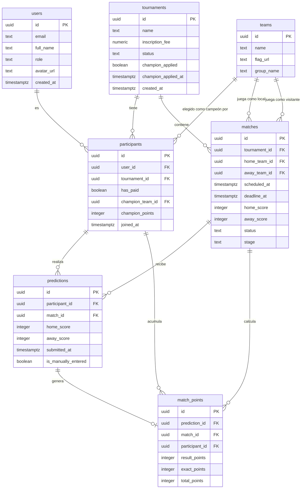

# Functional Specification Document
## Pronóstico Mundial 2026

---

| Campo | Valor |
|---|---|
| **Proyecto** | Pronóstico Mundial 2026 |
| **Documento** | Functional Specification Document (FSD) |
| **Versión** | 1.4 |
| **Estado** | En desarrollo — v1 en producción |
| **Fecha** | 2026-05-17 |
| **Autor** | Alberto Gomez |
| **Revisado por** | Pendiente |
| **Aprobado por** | Pendiente |
| **Clasificación** | Privado — uso interno del equipo de desarrollo |

---

## Historial de Versiones

| Versión | Fecha | Autor | Cambios |
|---|---|---|---|
| 0.1 | 2026-05-15 | Alberto Gomez | Documento inicial — borrador completo |
| 1.4 | 2026-05-17 | Alberto Gomez | Admin fixture 2-col grid + skeleton actualizado. Login loading state via useFormStatus (LoginForm client component). Avatar + initials fallback en standings. Champion flag badge en UserAvatar (standings + sidebar). getLayoutUserData helper compartido. BR-053..056. PRD-REQ-107..112. |
| 1.3 | 2026-05-17 | Alberto Gomez | UX loading states: spinner Loader2 en todos los botones async (match-form, result-form, tournament-form, champion-form, new-participant-form, prediction-card, participants-table). Inputs deshabilitados durante submit en new-participant-form y prediction-card. prediction-row reescrito: label "Guardando…"+spinner, inputs bloqueados, confirm()→AlertDialog. FixtureRealtime: toast "Resultados actualizados" en router.refresh(). BR-048..052. PRD-REQ-101..106. |
| 1.2 | 2026-05-17 | Alberto Gomez | Todos los dialogs nativos (confirm, prompt, alert) reemplazados por AlertDialog/Dialog de shadcn/ui. Todos los <select> nativos reemplazados por Select controlado de shadcn/ui. Eliminados reset-password-button.tsx y toggle-payment-button.tsx (obsoletos). BR-048..052 documentados. PRD-REQ-097..100. |
| 1.1 | 2026-05-17 | Alberto Gomez | FSD-UC-018 actualizado: score real para AET/PEN (homeScoreFull/awayScoreFull), badge de resolución y equipo que avanza en ambas páginas de detalle (participante + admin). Bugs corregidos: `r32` añadido a STAGE_LABELS, `hour12: false` en formatBOT de ambas páginas. BR-046..047 referenciados. PRD-REQ-097..100. |
| 1.1 | 2026-05-17 | Alberto Gomez | Decisión del cliente Opción A confirmada: BR-011 y UC-004-A8 actualizados (tiempo de descuento incluido en 90 min, un único score). FSD-UC-004 actualizado: BUG-UC004-4 (inputs default "0"), sección "Diseño visual del card (admin fixture)" con estados, CSS Grid hero, reveal condicional AET/PEN. BR-043..045 referenciados. PRD-REQ-093..096. |
| 1.0 | 2026-05-17 | Alberto Gomez | FSD-UC-002 actualizado: análisis UX de prediction card — 5 bugs documentados (BUG-UC002-1..5): score no centrado (CSS Grid fix), deadline en 12h (hour12: false), meta-line redundante, botón full-width, sin indicador de guardado. Estructura de componente propuesta incluida. BR-037..042 referenciados. PRD-REQ-087..092. |
| 0.9 | 2026-05-17 | Alberto Gomez | Análisis UX global de la app (docs/UX_BLOCKS.md). FSD-UC-015 actualizado: breadcrumbs dinámicos en header, sección Admin colapsable (sidebar-07), labels sin duplicados (Partidos / Mi Cuenta), mapa completo breadcrumb→ruta. FSD-UC-019 actualizado: stat cards en grid dashboard-01, cards clickeables. FSD-UC-022 nuevo: data-table de participantes con filtro/sort/menú contextual. IN-19 actualizado, IN-26..28 nuevos. BR-030..035 referenciados. |
| 0.8 | 2026-05-17 | Alberto Gomez | Análisis UX de resultado de partido (sesión 17-May). BR-011 actualizado: tiempo de descuento incluido en "90 min reglamentarios" con decisión pendiente del cliente sobre goles en descuento. BR-029 nuevo: multi-score en eliminatorias (90 min vs. AET) — requiere `home_score_full`/`away_score_full`. UC-004 actualizado: flujos adicionales para tiempo de descuento y AET con goles, bugs de UX documentados (falta refresh tras submit, falta confirmación en corrección, alert() nativo). |
| 0.7 | 2026-05-17 | Alberto Gomez | BR-027 y BR-028 implementados. `teams.code` añadido al schema (migración `0004_wise_marauders.sql`). 48 equipos sembrados con códigos FIFA. `prediction-card.tsx` rediseñado: hora/score como hero central, `[código][bandera]` simétrico, etapa dentro de la tarjeta, horario del partido visible en línea de metadatos cuando el pronóstico está abierto. `dashboard/page.tsx` actualizado con `homeTeamCode`, `awayTeamCode`, `stageLabel` y `scheduledTimeLabel`. Script `scripts/seed-teams.ts` eliminado (obsoleto). |
| 0.5 | 2026-05-17 | Alberto Gomez | `db:setup` auto-inscribe al admin como participante (`hasPaid = true`) al crear el torneo. Decisión técnica: evita inscripción manual posterior; el admin queda listo para pronosticar desde el primer arranque. |
| 0.4 | 2026-05-17 | Alberto Gomez | Nuevos FSD-UC-020 (tabla de clasificación de grupos) y FSD-UC-021 (fixture con banderas y agrupación por jornada). FSD-UC-004 actualizado: registro de tiempo extra y penales en eliminatorias (campos `extra_time` + `match_winner_id` en schema). Glosario y trazabilidad actualizados. |
| 0.3 | 2026-05-17 | Alberto Gomez | Seed de los 104 partidos del Mundial 2026 implementado (`src/db/seed-matches.ts`). Nueva etapa `r32` (Dieciseisavos de Final) añadida al schema, CHECK constraint actualizado, STAGE_LABELS/STAGE_ORDER/STAGE_OPTIONS actualizados en todos los componentes. Migración `drizzle/0002_fat_sauron.sql` generada. Setup completo (`db:setup`) ahora incluye los 104 partidos automáticamente. |
| 0.2 | 2026-05-16 | Alberto Gomez | Actualización post-implementación v1: FSD-UC-007 a FSD-UC-011 (gestión de fixture, puntos de campeón, desglose de puntos, distribución del pozo, foto de perfil). FSD-UC-012..013: perfil público y privado del participante. avatar_url en users. Trazabilidad actualizada (BR-011..016). BR-017: gestión de partidos eliminatorios TBD con alerta de deadline. FSD-UC-014: página de reglas del torneo (contenido estático, BR-018). FSD-UC-015..017: sidebar/layout, settings del participante, configuración del torneo admin. FSD-UC-018: detalle de partido. Decisiones técnicas globales de UI (toasts, empty states, loading states, form errors/warnings, Realtime suscripciones, páginas de error globales). FSD-UC-019: admin home. Gaps ronda 1: email_confirm, standings hasPaid, champion sin fixture, inputs mobile, score null. Gaps ronda 2: champion_points en participants (no en match_points), Realtime en matches → router.refresh(), políticas RLS completas, inventario Route Handlers, error.tsx y not-found.tsx. Gaps ronda 3: tournaments.champion_applied en modelo de datos, CHECK constraint DB en match_points, standings como query dinámica (no vista materializada), routing /profile/[userId] sin ambigüedad, creación de torneo por seed no por UI. Gaps ronda 4: GET /api/standings en inventario, POST /api/predictions body con participantId opcional para admin, tournaments.champion_applied_at para UI "aplicado el [fecha]", has_paid en standings query para badge admin, seed de usuario admin junto al seed del torneo. |

---

## Tabla de Contenidos

1. [Resumen Ejecutivo](#1-resumen-ejecutivo)
2. [Alcance](#2-alcance)
3. [Actores y Roles](#3-actores-y-roles)
4. [Casos de Uso](#4-casos-de-uso)
5. [Reglas de Negocio](#5-reglas-de-negocio)
6. [Modelo de Datos](#6-modelo-de-datos)
7. [Requisitos No Funcionales](#7-requisitos-no-funcionales)
8. [Matriz de Trazabilidad](#8-matriz-de-trazabilidad)
9. [Plan de Pruebas](#9-plan-de-pruebas)
10. [Glosario](#10-glosario)

---

## 1. Resumen Ejecutivo

**Pronóstico Mundial 2026** es una aplicación web privada diseñada para gestionar un torneo de predicciones del Mundial FIFA 2026, celebrado en Estados Unidos, México y Canadá. La plataforma reemplaza la coordinación manual por WhatsApp (hojas de cálculo, mensajes de texto) con un sistema centralizado, transparente y en tiempo real.

Los participantes pagan una cuota de inscripción de Bs. 500 y compiten pronosticando el marcador exacto de cada partido del torneo. El organizador administra el fixture, registra resultados y supervisa el pozo económico. La tabla de posiciones se actualiza automáticamente tras cada partido. Al final del torneo, el pozo se distribuye entre los mejores clasificados según reglas predefinidas.

**Objetivo principal:** Proveer una plataforma confiable, justa y transparente que elimine la ambigüedad en las reglas, automatice el cálculo de puntos y garantice que todos los participantes vean la misma información al mismo tiempo.

**Stack tecnológico:** Next.js 15 + TypeScript, Tailwind CSS + shadcn/ui, Supabase (PostgreSQL + Auth + Realtime), Drizzle ORM, TanStack Query, Vercel.

---

## 2. Alcance

### 2.1 Dentro del Alcance

| ID | Funcionalidad |
|---|---|
| IN-01 | Autenticación de usuarios mediante Supabase Auth (email + contraseña) |
| IN-02 | Creación manual de cuentas de participantes por parte del admin |
| IN-03 | Registro del pago de cuota de inscripción por el admin |
| IN-04 | Selección del campeón mundial antes del partido inaugural |
| IN-05 | Ingreso y modificación de pronósticos (marcador exacto) por partido |
| IN-06 | Cierre automático de pronósticos a las 23:59 del día anterior (BOT, UTC-4) |
| IN-07 | Publicación automática de pronósticos tras el cierre del plazo |
| IN-08 | Registro manual de resultados de partidos por el admin |
| IN-09 | Cálculo automático de puntos tras el registro de resultados |
| IN-10 | Tabla de posiciones en tiempo real con ranking actualizado |
| IN-11 | Visualización del campeón elegido por cada participante desde el inicio del torneo |
| IN-12 | Panel de administración para gestión de participantes, fixture y resultados |
| IN-13 | Carga manual de pronósticos por el admin (fallback WhatsApp) |
| IN-14 | Cálculo y presentación de la distribución del pozo al final del torneo |
| IN-15 | Visualización del mensaje "No pronosticó" para pronósticos no ingresados |
| IN-16 | Perfil público de participante con estadísticas calculadas (% resultados, % exactos, racha) |
| IN-17 | Perfil privado: estado de pago, brecha con el líder, cambio de contraseña |
| IN-18 | Página de reglas del torneo: contenido estático accesible desde navbar para todos los usuarios autenticados |
| IN-19 | Sidebar de navegación (shadcn/ui `sidebar-10`): header con breadcrumbs dinámicos + SidebarTrigger; avatar + nombre en sidebar; sección Admin colapsable (sidebar-07) visible solo para role=admin; labels sin duplicados ("Partidos" para admin fixture, "Mi Cuenta" para footer settings) |
| IN-20 | Componente UserAvatar reutilizable: foto o iniciales CSS, 4 tamaños según contexto |
| IN-21 | Página /settings: layout de cards por sección — Foto de perfil, Contraseña, Estado de inscripción (read-only) |
| IN-22 | Página /admin/settings: nombre del torneo, estado, aplicación de puntos de campeón |
| IN-23 | Página de detalle de partido: contador pre-deadline, tabla de pronósticos y puntos post-deadline |
| IN-24 | Sistema global de toasts (shadcn/ui Sonner) para confirmaciones de todas las acciones |
| IN-25 | Empty states contextuales en todas las secciones principales |
| IN-26 | Breadcrumbs dinámicos en el header de todas las páginas autenticadas (componente `AppBreadcrumb`, shadcn/ui `<Breadcrumb>`) |
| IN-27 | Admin home (`/admin`) con stat cards en grid 2×2: Participantes, Partidos, Pronósticos, Pozo — patrón dashboard-01 |
| IN-28 | Tabla de participantes admin con data-table: filtro por pago pendiente, ordenamiento, menú contextual por fila |
| IN-29 | Admin fixture — grid 2 columnas (`sm:grid-cols-2`) consistente con el fixture del participante. Skeleton actualizado para reflejar la estructura real del card admin (hero row + meta line + divisor + área del formulario de resultado) con el mismo layout de 2 columnas |
| IN-30 | Login page loading state — componente client `LoginForm` con `useFormStatus` de `react-dom`. Spinner + label "Iniciando sesión…" + inputs deshabilitados mientras el Server Action está en vuelo |
| IN-31 | Standings table — avatar de 28px por fila: foto (`avatarUrl`) o círculo de iniciales (primera letra nombre + primera letra apellido, fondo zinc). `/api/standings` incluye `avatarUrl` en SELECT + GROUP BY |
| IN-32 | Champion flag badge en avatar — standings (10×14px, `h-2.5 w-3.5`) y sidebar (45% del diámetro del avatar). Badge posicionado bottom-right con ring blanco. Visible solo si el participante tiene campeón seleccionado. `getLayoutUserData(userId)` helper compartido en `src/lib/layout-data.ts` (dos queries en paralelo: user + participant JOIN tournament JOIN teams). Los 5 layouts (dashboard, admin, settings, reglas, profile/[userId]) usan el helper y propagan `championFlagUrl`/`championTeamName` vía `AppLayout → AppSidebar → UserAvatar` |

### 2.2 Fuera del Alcance

| ID | Funcionalidad excluida | Justificación |
|---|---|---|
| OUT-01 | Registro público de participantes (auto-registro) | El admin crea todas las cuentas manualmente |
| OUT-02 | Pasarela de pago integrada | El pago es en efectivo/QR externo; el admin registra manualmente |
| OUT-03 | Pronósticos de prórroga o tiros penales | Solo cuentan los 90 minutos reglamentarios |
| OUT-04 | Estadísticas avanzadas o análisis histórico | No requerido en v0.1 |
| OUT-05 | Aplicación móvil nativa (iOS/Android) | La web es responsiva; suficiente para v0.1 |
| OUT-06 | Integración directa con WhatsApp API | El fallback es manual, ejecutado por el admin |
| OUT-07 | Múltiples torneos simultáneos | Un torneo activo a la vez en v0.1 |
| OUT-08 | Sistema de notificaciones push | No requerido en v0.1 |

---

## 3. Actores y Roles

### 3.1 Participante

Persona que se ha inscrito en el torneo pagando la cuota de Bs. 500. Su cuenta es creada por el admin. Puede:

- Iniciar sesión en la plataforma.
- Ver el fixture completo del torneo.
- Ingresar y modificar su pronóstico para cada partido (antes del plazo).
- Ver sus propios pronósticos antes del cierre.
- Ver todos los pronósticos (propios y ajenos) después del cierre.
- Ver la tabla de posiciones en tiempo real.
- Ver el campeón elegido por cada participante.
- Seleccionar su campeón mundial (antes del partido inaugural).

**Restricciones:** No puede ver pronósticos ajenos antes del plazo. No puede modificar pronósticos después del cierre. No puede registrar resultados ni gestionar cuentas.

### 3.2 Admin / Organizador

Persona responsable de administrar el torneo. También puede participar como jugador. Tiene acceso a todas las funciones del participante más:

- Crear y gestionar cuentas de participantes.
- Registrar pagos de inscripción.
- Cargar manualmente pronósticos de participantes (fallback WhatsApp).
- Registrar el resultado oficial de cada partido.
- Disparar el cálculo de puntos tras registrar un resultado.
- Visualizar el estado del pozo y la distribución de premios.
- Gestionar el fixture (partidos, fechas, equipos).

**Nota:** El organizador participa en igualdad de condiciones. Sus pronósticos siguen las mismas reglas de plazo y visibilidad que los demás participantes.

### 3.3 Sistema

Actor no humano que ejecuta comportamientos automáticos:

- Calcula y aplica el plazo de cierre (23:59 BOT del día de cada partido).
- Bloquea la edición de pronósticos al llegar el plazo.
- Publica automáticamente los pronósticos al llegar el plazo.
- Asigna 0-0 por defecto a pronósticos no ingresados en el momento de calcular puntos.
- Calcula puntos por partido al recibir el resultado oficial.
- Actualiza la tabla de posiciones en tiempo real vía Supabase Realtime.

---

## 4. Casos de Uso

### FSD-UC-001 — Iniciar Sesión

**Descripción:** El usuario (participante o admin) ingresa sus credenciales para autenticarse en la plataforma.

**Actor primario:** Participante, Admin

**Precondiciones:**
- El usuario tiene una cuenta creada por el admin en Supabase Auth.
- El usuario dispone de su email y contraseña.

**Postcondiciones:**
- El usuario está autenticado y tiene acceso a las funciones correspondientes a su rol.
- Se registra la sesión activa en Supabase Auth.

**Flujo Principal:**

1. El usuario accede a la URL de la aplicación.
2. El sistema muestra la pantalla de inicio de sesión.
3. El usuario ingresa su email y contraseña.
4. El usuario presiona "Iniciar sesión".
5. El sistema envía las credenciales a Supabase Auth.
6. Supabase Auth valida las credenciales y devuelve un JWT.
7. El sistema lee el campo `role` de la tabla `users` para determinar el rol del usuario.
8. Si el rol es `admin`, el sistema redirige al panel de administración.
9. Si el rol es `participant`, el sistema redirige al dashboard de pronósticos.

**Flujos Alternativos:**

| Código | Condición | Respuesta del sistema |
|---|---|---|
| UC001-A1 | Credenciales incorrectas | Mostrar mensaje: "Email o contraseña incorrectos." Sin revelar cuál campo falló. |
| UC001-A2 | Usuario no tiene cuenta | No hay opción de auto-registro. El usuario debe contactar al admin. |
| UC001-A3 | Cuenta desactivada | Mostrar mensaje genérico de error de autenticación. |
| UC001-A4 | Error de red | Mostrar mensaje: "No se pudo conectar. Intenta nuevamente." |

**Criterios de Aceptación (Gherkin):**

```gherkin
Feature: Inicio de sesión

  Scenario: Participante inicia sesión exitosamente
    Given el participante tiene una cuenta activa con email "juan@example.com"
    And su contraseña es "secreto123"
    When ingresa sus credenciales en el formulario de login
    And presiona "Iniciar sesión"
    Then es redirigido al dashboard de pronósticos
    And ve su nombre en la barra de navegación

  Scenario: Admin inicia sesión exitosamente
    Given el admin tiene una cuenta con rol "admin"
    When ingresa sus credenciales correctas
    And presiona "Iniciar sesión"
    Then es redirigido al panel de administración

  Scenario: Credenciales incorrectas
    Given el usuario ingresa una contraseña incorrecta
    When presiona "Iniciar sesión"
    Then el sistema muestra "Email o contraseña incorrectos."
    And el usuario permanece en la pantalla de login

  Scenario: Acceso a ruta protegida sin sesión
    Given el usuario no ha iniciado sesión
    When intenta acceder a "/dashboard"
    Then es redirigido a la pantalla de login
```

**Referencias:** PRD-REQ-001, PRD-REQ-002, NFR-003

---

### FSD-UC-002 — Ingresar / Modificar Pronóstico

**Descripción:** El participante ingresa o modifica el marcador exacto que predice para un partido determinado, siempre que el plazo no haya vencido.

**Actor primario:** Participante

**Precondiciones:**
- El participante está autenticado.
- El partido tiene estado `scheduled`.
- La hora actual es anterior al `deadline_at` del partido (23:59 BOT del día del partido).
- El participante está inscrito en el torneo activo y tiene `has_paid = true`.

**Postcondiciones:**
- Se crea o actualiza un registro en la tabla `predictions` con los valores ingresados, `submitted_at` con la hora actual e `is_manually_entered = true`.
- El pronóstico permanece privado (no visible para otros participantes) hasta que se alcance el `deadline_at`.

**Flujo Principal:**

1. El participante navega al fixture del torneo.
2. El sistema muestra la lista de partidos con su estado (abierto/cerrado). Un toggle "Solo partidos abiertos" permite filtrar para ver únicamente los partidos donde `status = 'scheduled'` AND `now() < deadline_at` AND ambos equipos están definidos (no TBD). Por defecto el toggle está desactivado (se muestran todos los partidos).
3. El participante selecciona un partido con pronóstico abierto.
4. El sistema muestra el formulario de pronóstico con dos campos numéricos: goles equipo local y goles equipo visitante.
5. Si el participante ya ingresó un pronóstico previo, los campos muestran los valores guardados.
6. El participante ingresa los valores deseados (ej. 2 - 1).
7. El participante presiona "Guardar pronóstico".
8. El sistema valida que el plazo no ha vencido (verificación server-side).
9. El sistema guarda o actualiza el registro en `predictions` con `is_manually_entered = true`.
10. El sistema muestra confirmación: "Tu pronóstico ha sido guardado."

**Flujos Alternativos:**

| Código | Condición | Respuesta del sistema |
|---|---|---|
| UC002-A1 | El plazo ya venció al momento de guardar (race condition) | Rechazar con mensaje: "El plazo para este partido ya cerró." |
| UC002-A2 | El participante no tiene `has_paid = true` | Mostrar mensaje: "Tu inscripción está pendiente de confirmación de pago." |
| UC002-A3 | El partido ya tiene resultado (estado `finished`) | El formulario está deshabilitado. Solo lectura. |
| UC002-A4 | El participante no ingresó pronóstico antes del plazo | El sistema no crea registro; al calcular puntos usa 0-0 internamente con `is_manually_entered = false`. |
| UC002-A5 | Admin carga pronóstico manualmente (fallback) | El admin usa el panel de administración. Se crea el registro con `is_manually_entered = true` si fue enviado por WhatsApp antes del plazo. |

**Criterios de Aceptación (Gherkin):**

```gherkin
Feature: Ingresar pronóstico

  Scenario: Participante guarda pronóstico exitosamente
    Given el participante está autenticado
    And el partido Argentina vs Brasil tiene deadline_at en el futuro
    When ingresa "2" para Argentina y "1" para Brasil
    And presiona "Guardar pronóstico"
    Then el sistema guarda la predicción con is_manually_entered = true
    And muestra "Tu pronóstico ha sido guardado."

  Scenario: Participante modifica pronóstico existente
    Given el participante ya tiene el pronóstico "1-0" guardado
    And el plazo no ha vencido
    When cambia el pronóstico a "2-1"
    And presiona "Guardar pronóstico"
    Then el sistema actualiza el registro en predictions
    And muestra el nuevo valor "2-1" en pantalla

  Scenario: Intento de guardar pronóstico fuera de plazo
    Given el deadline_at del partido ya pasó
    When el participante intenta guardar un pronóstico
    Then el sistema rechaza la operación
    And muestra "El plazo para este partido ya cerró."

  Scenario: Partido sin pronóstico ingresado llega al plazo
    Given el participante no ingresó pronóstico para el partido X
    And el deadline_at del partido X ha pasado
    When el admin registra el resultado del partido X
    Then el sistema evalúa el pronóstico como 0-0 con is_manually_entered = false
    And la UI muestra "No pronosticó" para ese participante

  Scenario: Publicación automática de pronósticos al alcanzar el plazo
    Given son las 14:59 BOT y los pronósticos están privados
    When el reloj alcanza las 23:59 BOT del día del partido al partido
    Then todos los pronósticos del partido se hacen visibles para todos los participantes
    And el formulario de edición se desactiva para ese partido
```

**Mejoras UX identificadas en la prediction card (análisis 17-May-2026):**

| # | ID | Descripción | Impacto | Solución |
|---|---|---|---|---|
| 1 | BUG-UC002-1 | Score no centrado matemáticamente — `flex justify-center` se desplaza con nombres de equipo asimétricos | En equipos como "Bosnia y Herzegovina" vs "Canadá", el score se corre hacia el lado más corto | Reemplazar el layout del hero por CSS Grid `grid-cols-[1fr_auto_1fr]`: laterales para código+bandera, centro para hora/score/inputs |
| 2 | BUG-UC002-2 | `deadlineAtLabel` en formato 12h — `formatBOT` no establece `hour12: false` | Muestra "03:00 p. m." en lugar de "15:00" — inconsistente con el horario del partido (que sí usa 24h) | Agregar `hour12: false` a la llamada de `formatBOT` / `Intl.DateTimeFormat` en `dashboard/page.tsx` |
| 3 | BUG-UC002-3 | Meta-line redundante — repite el horario del partido (ya es el hero visual) y la etiqueta de etapa (ya es el encabezado de sección) | Ruido cognitivo: "Grupo A · 15:00 · Cierra: mié, 10 jun, 03:00 p. m." contiene dos redundancias y un bug de formato | Simplificar meta-line a solo "Cierra: mié, 10 jun, 15:00"; eliminar horario y etiqueta de etapa del cuerpo del card |
| 4 | BUG-UC002-4 | Botón "Guardar pronóstico" full-width de fondo sólido | A escala de 104 cards, el botón satura visualmente la página y compite con CTAs de navegación | Usar `size="sm"` alineado a la derecha, sin ancho completo |
| 5 | BUG-UC002-5 | Sin indicador de pronóstico guardado en el card cerrado | El participante no puede saber de un vistazo qué partidos ya tienen pronóstico — debe expandir cada card | Mostrar ícono de check o badge "Guardado" cuando `savedHome != null && savedAway != null`, visible en el card colapsado |

**Estructura de componente actualizada (`prediction-card.tsx`):**

```tsx
// Hero zone — CSS Grid 3 columnas garantiza centrado matemático
<div className="grid grid-cols-[1fr_auto_1fr] items-center gap-2">
  {/* Columna izquierda: equipo local */}
  <div className="flex items-center justify-end gap-1.5">
    <span className="text-xs font-mono">{homeCode}</span>
    
  </div>

  {/* Columna central: hora / score / inputs */}
  <div className="flex items-center gap-2">
    {isOpen ? (
      /* inputs de pronóstico */
    ) : (
      /* hora o score */
    )}
  </div>

  {/* Columna derecha: equipo visitante */}
  <div className="flex items-center justify-start gap-1.5">
    
    <span className="text-xs font-mono">{awayCode}</span>
  </div>
</div>

{/* Indicador de pronóstico guardado — visible en card cerrado */}
{savedHome != null && savedAway != null && !isDeadlinePassed && (
  <span className="text-xs text-green-600 flex items-center gap-1">
    <CheckIcon className="h-3 w-3" /> Guardado
  </span>
)}

{/* Meta-line simplificada — solo plazo de cierre */}
{isOpen && (
  <p className="text-xs text-zinc-500">Cierra: {deadlineAtLabel}</p>
)}

{/* Botón compacto, alineado a la derecha */}
{isOpen && (
  <div className="flex justify-end">
    <Button size="sm" disabled={isPending}>
      {isPending ? <Spinner /> : "Guardar pronóstico"}
    </Button>
  </div>
)}
```

**Nota sobre `deadlineAtLabel`:** El bug BUG-UC002-2 se corrige en `dashboard/page.tsx` agregando `hour12: false` a la función de formateo del deadline, no en el componente `prediction-card.tsx`.

**Referencias:** PRD-REQ-005, PRD-REQ-006, PRD-REQ-007, PRD-REQ-087, PRD-REQ-088, PRD-REQ-089, PRD-REQ-090, PRD-REQ-091, PRD-REQ-092, BR-003, BR-004, BR-005, BR-037, BR-038, BR-039, BR-040, BR-041, BR-042, NFR-003

---

### FSD-UC-003 — Ver Tabla de Posiciones en Tiempo Real

**Descripción:** El participante o admin visualiza el ranking actualizado de todos los participantes del torneo, con puntos acumulados y posición.

**Actor primario:** Participante, Admin

**Precondiciones:**
- El usuario está autenticado.
- Existe al menos un torneo activo.

**Postcondiciones:**
- El usuario ve la tabla con el ranking actual. La tabla se actualiza automáticamente cuando se registran nuevos resultados y se calculan puntos.

**Flujo Principal:**

1. El usuario navega a la sección "Tabla de Posiciones".
2. El sistema realiza una consulta inicial a la vista/query `standings` para el torneo activo.
3. El sistema establece una suscripción a Supabase Realtime en la tabla `match_points`.
4. El sistema muestra la tabla ordenada por `total_points` descendente, con `rank` calculado.
5. Cuando el admin registra un resultado y dispara el cálculo de puntos, se insertan/actualizan filas en `match_points`.
6. Supabase Realtime emite el evento al cliente.
7. TanStack Query invalida y refetch la query de standings.
8. La tabla se actualiza en la pantalla del usuario sin necesidad de refrescar la página.

**Flujos Alternativos:**

| Código | Condición | Respuesta del sistema |
|---|---|---|
| UC003-A1 | No hay partidos con resultado aún | La tabla muestra todos los participantes con 0 puntos. |
| UC003-A2 | Empate en posiciones | Los participantes empatados muestran el mismo `rank`. El siguiente rank se ajusta (ej. dos en 1ro, el siguiente es 3ro). Dentro del empate, el orden de presentación es **alfabético por `full_name` (A→Z)** — solo para consistencia visual, no afecta la distribución del pozo. |
| UC003-A3 | Pérdida de conexión a Realtime | La tabla muestra los datos del último fetch. Al reconectar, TanStack Query refetch automáticamente. |
| UC003-A4 | Participante con has_paid = false en standings | El participante aparece en la tabla con 0 puntos. Si el usuario autenticado es admin, se muestra un badge "Pendiente" junto al nombre. Los demás participantes no ven ninguna diferencia visual. |

**Criterios de Aceptación (Gherkin):**

```gherkin
Feature: Tabla de posiciones en tiempo real

  Scenario: Visualización inicial de la tabla
    Given el torneo tiene 10 participantes inscritos
    And se han jugado 5 partidos con resultados registrados
    When el participante navega a "Tabla de Posiciones"
    Then ve una tabla con 10 filas ordenadas por total_points descendente
    And cada fila muestra: posición, nombre del participante, puntos totales

  Scenario: Actualización automática tras registro de resultado
    Given el participante tiene la tabla de posiciones abierta
    When el admin registra el resultado del partido y dispara el cálculo de puntos
    Then la tabla del participante se actualiza automáticamente en menos de 3 segundos
    And los nuevos puntos son visibles sin que el participante recargue la página

  Scenario: Empate en primera posición
    Given Juan y María tienen ambos 45 puntos (máximo)
    When el participante ve la tabla de posiciones
    Then Juan y María aparecen ambos en la posición "1"
    And el siguiente participante aparece en la posición "3"
    And dentro del empate, los participantes aparecen ordenados alfabéticamente por nombre
```

**Referencias:** PRD-REQ-011, PRD-REQ-012, BR-008, NFR-001, NFR-002

---

### FSD-UC-004 — Admin Registra Resultado y Dispara Cálculo de Puntos

**Descripción:** El admin ingresa el marcador oficial de un partido terminado (solo 90 minutos reglamentarios + tiempo de descuento) y el sistema calcula automáticamente los puntos para todos los participantes. Para partidos eliminatorios que se resuelvan más allá de los 90 minutos, el admin también registra si fue tiempo extra (AET) o penales, el marcador al final de los 120 minutos y el equipo ganador.

**Actor primario:** Admin

**Precondiciones:**
- El admin está autenticado con rol `admin`.
- El partido tiene estado `scheduled` o `live`.
- El partido ha concluido sus 90 minutos reglamentarios (incluyendo tiempo de descuento).

**Postcondiciones:**
- El partido actualiza su estado a `finished` con `home_score`, `away_score` (marcador a 90 min), y opcionalmente `home_score_full`/`away_score_full` (marcador al final de la prórroga), `extra_time` y `match_winner_id`.
- Para cada participante inscrito en el torneo, se crea o actualiza un registro en `match_points` con `result_points` y `exact_points` calculados (siempre basado en `home_score`/`away_score` de 90 min).
- La tabla de posiciones se actualiza automáticamente vía Realtime.
- El card del partido en el panel admin refleja el nuevo resultado sin necesidad de recargar la página.

**Flujo Principal:**

1. El admin navega al panel de administración → sección "Fixture".
2. El admin localiza el partido terminado en el card del fixture.
3. El admin ingresa el **marcador a los 90 minutos** (incluyendo tiempo de descuento): goles equipo local y goles equipo visitante.
4. **[Solo partidos eliminatorios (stage ≠ `group`)] Si los scores de 90 min son iguales:** el sistema muestra paso adicional: "¿Cómo se decidió el partido?" con opciones `[Tiempo extra | Penales]`.
   - Si el admin elige **Tiempo extra (AET):** aparecen dos inputs para el marcador al final de la prórroga (120 min). El ganador se deduce automáticamente del marcador de prórroga.
   - Si el admin elige **Penales:** aparecen dos inputs para el marcador al final de los 120 min (puede ser igual al de 90 min si no hubo goles en prórroga, o diferente si hubo). Luego aparece el selector del equipo ganador en penales.
5. El admin presiona "Registrar resultado".
6. Si el partido **ya tiene resultado registrado** (`status = 'finished'`): el sistema muestra un diálogo de confirmación: "Este partido ya tiene resultado. ¿Recalcular puntos para todos los participantes?" El admin debe confirmar antes de continuar.
7. El sistema actualiza el partido en una transacción: `status = 'finished'`, `home_score`, `away_score`. Si aplica: `home_score_full`, `away_score_full`, `extra_time = 'aet'|'pen'`, `match_winner_id`.
8. El sistema recupera todas las predicciones de ese partido.
9. Para los participantes sin predicción, el sistema usa internamente `home_score = 0, away_score = 0, is_manually_entered = false`.
10. El sistema ejecuta el motor de puntos (`lib/points.ts`) para cada predicción — **siempre sobre `home_score`/`away_score` (90 min), nunca sobre `home_score_full`/`away_score_full` ni sobre penales:**
    - Determina el resultado real (local gana / empate / visitante gana) basado en `home_score`/`away_score`.
    - Determina el resultado pronosticado.
    - Si coincide el resultado: `result_points = 1`.
    - Si coincide el score exacto Y `is_manually_entered = true`: `exact_points = 2`.
    - `total_points = result_points + exact_points`.
11. El sistema inserta/actualiza registros en `match_points` para cada participante.
12. El sistema muestra un toast de confirmación: "Resultado registrado · N participantes calculados."
13. El card del partido se actualiza automáticamente mostrando el nuevo marcador (sin recarga de página).

**Flujos Alternativos:**

| Código | Condición | Respuesta del sistema |
|---|---|---|
| UC004-A1 | El partido termina 0-0 y un participante no pronosticó | `result_points = 1` (empate acertado), `exact_points = 0` (no ingresó manualmente). Total: 1 punto. |
| UC004-A2 | El partido termina 0-0 y un participante pronosticó 0-0 manualmente | `result_points = 1`, `exact_points = 2`. Total: 3 puntos. |
| UC004-A3 | El admin ingresa un resultado incorrecto | El admin puede corregir el resultado. Debe confirmar en el diálogo de corrección. El sistema recalcula y sobreescribe `match_points`. El card se actualiza tras la corrección. |
| UC004-A4 | Error en el cálculo (excepción) | El sistema revierte la transacción completa. Muestra toast de error. No se modifica ni el partido ni los puntos. |
| UC004-A5 | Admin envía el formulario con un solo score o sin scores | Client-side: el botón permanece deshabilitado. Server-side: valida enteros ≥ 0; si no, HTTP 400. |
| UC004-A6 | Partido eliminatorio con 90-min igualados pero admin no completa el desempate | Client-side: el botón permanece deshabilitado hasta completar tipo de desempate y ganador. |
| UC004-A7 | Partido eliminatorio con scores distintos en 90 min (ganador claro) | No aparece el paso de desempate. `extra_time = null`, `match_winner_id = null`, `home_score_full`/`away_score_full` = null. |
| UC004-A8 | ✅ Gol en tiempo de descuento (ej. 1-2 al min 90, 2-2 al min 90+3) | **Opción A confirmada por el cliente (17-May-2026):** el admin ingresa el marcador al pitido final (2-2). Este marcador incluye los goles en descuento y es el oficial para pronósticos. La persona que pronosticó 1-2 recibe 0 puntos; quien pronosticó 2-2 recibe 3 puntos. El admin ingresa un único score — no es necesario distinguir "minuto 90 exacto" del "pitido final". |
| UC004-A9 | Partido eliminatorio en prórroga con goles en la prórroga (AET) | El admin ingresa: marcador 90 min (ej. 1-1) + marcador 120 min (ej. 2-1). El ganador se deduce del marcador de 120 min. La UI muestra "2-1 (a.e.t.)". Los puntos se calculan sobre 1-1. |
| UC004-A10 | Partido eliminatorio en prórroga con goles pero finalmente penales | El admin ingresa: marcador 90 min (ej. 1-1) + marcador 120 min (ej. 2-2) + selecciona ganador en penales. La UI muestra "2-2 (pen.)". Los puntos se calculan sobre 1-1. |

**Campos pendientes de schema (BR-029):**

```sql
-- Campos a agregar en la tabla matches para soporte completo de multi-score:
home_score_full  integer  -- marcador al final de los 120 min (null si no hubo prórroga)
away_score_full  integer  -- marcador al final de los 120 min (null si no hubo prórroga)
-- Relación: home_score / away_score = 90 min (para puntos)
--           home_score_full / away_score_full = 120 min (para display)
-- Si extra_time IS NULL: home_score_full = home_score (no se almacena por separado)
-- Si extra_time = 'aet' o 'pen': home_score_full puede diferir de home_score
```

**Bugs de UX conocidos (pendientes de corrección):**

| # | Descripción | Impacto | Solución |
|---|---|---|---|
| BUG-UC004-1 | El hero del card no se actualiza tras registrar resultado — `ResultForm` no llama `router.refresh()` | El admin ve el marcador viejo en el card hasta recargar manualmente la página | Agregar callback `onSuccess` a `ResultForm` que dispare `router.refresh()` en `fixture-client.tsx` |
| BUG-UC004-2 | Sin confirmación al corregir un resultado ya registrado | El admin puede recalcular todos los puntos del torneo accidentalmente | Mostrar dialog de confirmación antes del submit cuando `isFinished = true` |
| BUG-UC004-3 | El feedback de éxito usa `window.alert()` nativo | Bloquea el hilo, inconsistente con el resto de la UI | Reemplazar por toast de shadcn/ui Sonner |
| BUG-UC004-4 | Los inputs de resultado se inicializan con el valor `0` | Ambigüedad: el admin no distingue entre "aún no ingresé nada" y "el resultado fue 0-0" | Inicializar inputs vacíos (`value=""`) con `placeholder="—"`; deshabilitar el botón hasta que ambos tengan valor numérico ≥ 0 |

**Diseño visual del card de fixture (admin):**

El card de resultado del admin tiene tres estados visuales:

```
Estado 1 — scheduled (inputs vacíos, botón deshabilitado)
┌──────────────────────────────────────────────────────────────────┐
│  MEX 🇲🇽           15:00           🇿🇦 SUD                     │
│  Fase de Grupos · jue, 11 jun                                    │
├──────────────────────────────────────────────────────────────────┤
│  [ — ]  —  [ — ]               [Registrar resultado]  (dim)    │
└──────────────────────────────────────────────────────────────────┘

Estado 2a — scheduled, eliminatoria, scores iguales → reveal condicional
┌──────────────────────────────────────────────────────────────────┐
│  ESP 🇪🇸           22:00           🇩🇪 GER                     │
│  Octavos de Final · sáb, 28 jun                                  │
├──────────────────────────────────────────────────────────────────┤
│  Resultado 90 min: [ 1 ]  —  [ 1 ]                              │
│  ┌─ Empate al pitido — ¿cómo se resolvió? ───────────────────┐  │
│  │  ○ Tiempo extra (a.e.t.)   ● Penales                      │  │
│  │  Resultado 120 min: [ 1 ]  —  [ 1 ]                       │  │
│  │  Ganador en penales: [ España ▼ ]                         │  │
│  └────────────────────────────────────────────────────────────┘  │
│                              [Registrar resultado →]              │
└──────────────────────────────────────────────────────────────────┘

Estado 3 — finished
┌──────────────────────────────────────────────────────────────────┐
│  MEX 🇲🇽            2  —  1            🇿🇦 SUD                  │
│  Fase de Grupos · jue, 11 jun                    ✓ Finalizado   │
├──────────────────────────────────────────────────────────────────┤
│  [Corregir resultado]   ← variant=outline, dispara dialog        │
└──────────────────────────────────────────────────────────────────┘
```

**Lógica del reveal condicional (AET/PEN):**

```tsx
const isKnockout = !["group"].includes(match.stage);
const isDrawAt90 =
  homeScore !== "" && awayScore !== "" &&
  Number(homeScore) === Number(awayScore);

const showExtraTimeSection = isKnockout && isDrawAt90;
```

La sección extra se monta/desmonta en el DOM según `showExtraTimeSection`. No es un hide/show con CSS — se renderiza condicionalmente para evitar estado residual en los inputs de 120 min.

**Hero zone — CSS Grid (mismo patrón que prediction-card.tsx, BR-043):**

```tsx
<div className="grid grid-cols-[1fr_auto_1fr] items-center gap-2">
  {/* Izquierda: equipo local */}
  <div className="flex items-center justify-end gap-2">
    <span className="text-sm font-semibold">{homeTeamName}</span>
    
  </div>

  {/* Centro: hora o score */}
  <div className="text-2xl font-bold tabular-nums">
    {isFinished ? `${homeScore} — ${awayScore}` : scheduledTime}
  </div>

  {/* Derecha: equipo visitante */}
  <div className="flex items-center justify-start gap-2">
    
    <span className="text-sm font-semibold">{awayTeamName}</span>
  </div>
</div>
```

**Criterios de Aceptación (Gherkin):**

```gherkin
Feature: Registro de resultado y cálculo de puntos

  Scenario: Resultado registrado con pronóstico exacto
    Given el partido España vs Alemania terminó 2-1
    And el participante Juan pronosticó 2-1 con is_manually_entered = true
    When el admin registra el resultado 2-1
    Then Juan recibe result_points = 1 y exact_points = 2
    And match_points.total_points para Juan en ese partido es 3
    And el card del partido muestra "2 — 1" sin necesidad de recargar

  Scenario: Resultado acertado pero score incorrecto
    Given el partido España vs Alemania terminó 2-1
    And el participante María pronosticó 3-1 con is_manually_entered = true
    When el admin registra el resultado 2-1
    Then María recibe result_points = 1 y exact_points = 0
    And match_points.total_points para María es 1

  Scenario: Pronóstico no ingresado, partido termina 0-0
    Given el partido Uruguay vs Japón terminó 0-0
    And el participante Pedro no ingresó pronóstico
    When el admin registra el resultado 0-0
    Then el sistema usa 0-0 con is_manually_entered = false para Pedro
    And Pedro recibe result_points = 1 y exact_points = 0

  Scenario: Corrección de resultado ya registrado
    Given el admin registró erróneamente el resultado 2-0 para un partido con status finished
    When el admin cambia los inputs a 1-0 y presiona "Corregir resultado"
    Then el sistema muestra un diálogo de confirmación antes de proceder
    And al confirmar, recalcula match_points para todos los participantes
    And el card muestra el nuevo marcador "1 — 0"

  Scenario: Partido eliminatorio decidido en penales (sin goles en prórroga)
    Given el partido Argentina vs Francia terminó 1-1 en 90 min y 1-1 en 120 min
    And el participante Juan pronosticó 1-1
    When el admin registra: score 90 min = 1-1, score 120 min = 1-1, penales, ganador Argentina
    Then matches.home_score = 1, matches.away_score = 1 (para puntos)
    And matches.home_score_full = 1, matches.away_score_full = 1
    And matches.extra_time = 'pen', matches.match_winner_id = id de Argentina
    And Juan recibe 3 puntos (1-1 en 90 min acertado)
    And en la UI el partido muestra "1 — 1 (pen.)" con Argentina como ganador

  Scenario: Partido eliminatorio decidido en penales (con goles en prórroga)
    Given el partido Brasil vs Croacia terminó 1-1 en 90 min y 2-2 en 120 min
    And el participante Ana pronosticó 1-1
    When el admin registra: score 90 min = 1-1, score 120 min = 2-2, penales, ganador Brasil
    Then matches.home_score = 1, matches.away_score = 1 (para puntos)
    And matches.home_score_full = 2, matches.away_score_full = 2
    And Ana recibe 3 puntos (acertó 1-1 en 90 min)
    And en la UI el partido muestra "2 — 2 (pen.)" con Brasil como ganador

  Scenario: Partido eliminatorio decidido en tiempo extra (AET)
    Given el partido España vs Alemania terminó 1-1 en 90 min
    And España marcó en el minuto 104 (2-1 al final de la prórroga)
    When el admin registra: score 90 min = 1-1, score 120 min = 2-1, tipo = AET
    Then matches.home_score = 1, matches.away_score = 1 (para puntos)
    And matches.home_score_full = 2, matches.away_score_full = 1
    And matches.extra_time = 'aet', matches.match_winner_id = id de España
    And en la UI el partido muestra "2 — 1 (a.e.t.)" con España como ganador
    And los puntos se calculan sobre 1-1, no sobre 2-1
```

**Referencias:** PRD-REQ-008, PRD-REQ-009, PRD-REQ-010, PRD-REQ-058, PRD-REQ-063, PRD-REQ-064, PRD-REQ-093, PRD-REQ-094, PRD-REQ-095, PRD-REQ-096, BR-005, BR-006, BR-007, BR-011, BR-023, BR-029, BR-043, BR-044, BR-045, NFR-001

---

### FSD-UC-005 — Admin Crea Cuenta de Participante

**Descripción:** El admin crea una nueva cuenta de usuario para un participante que ha pagado la cuota de inscripción, generando sus credenciales de acceso.

**Actor primario:** Admin

**Precondiciones:**
- El admin está autenticado con rol `admin`.
- El participante ha pagado la cuota de Bs. 500 (verificado fuera de la plataforma).
- El torneo tiene estado `active` o `draft`.

**Postcondiciones:**
- Se crea un usuario en Supabase Auth con email y contraseña temporal.
- Se inserta un registro en la tabla `users` con `role = 'participant'`.
- Se inserta un registro en la tabla `participants` con `has_paid = true`, `tournament_id` del torneo activo.
- El admin dispone de las credenciales para entregarlas al participante (ej. vía WhatsApp).
- El email del participante queda marcado como confirmado en Supabase Auth (`email_confirm: true`) — no se envía ningún email automático al participante.

**Flujo Principal:**

1. El admin navega al panel de administración → sección "Participantes".
2. El admin presiona "Agregar participante".
3. El sistema muestra un formulario con campos: nombre completo, email, contraseña temporal.
4. El admin completa el formulario e indica que el pago fue confirmado.
5. El admin presiona "Crear cuenta".
6. El sistema llama a Supabase Auth Admin API para crear el usuario.
7. El sistema inserta el registro en `users` (`role = 'participant'`).
8. El sistema inserta el registro en `participants` (`has_paid = true`, asociado al torneo activo).
9. El sistema muestra confirmación con las credenciales generadas para que el admin las entregue al participante.
10. El admin comparte usuario y contraseña con el participante (fuera de la app, ej. WhatsApp).

**Flujo Secundario — Admin restablece contraseña de participante:**

1. El admin navega a `/admin/participants`.
2. El admin selecciona un participante de la lista y hace clic en "Restablecer contraseña".
3. El sistema muestra un dialog con un campo para la nueva contraseña temporal.
4. El admin ingresa la nueva contraseña y confirma.
5. El Route Handler `POST /api/admin/participants/[id]/reset-password` llama a `adminClient.auth.admin.updateUserById(userId, { password: newPassword })`.
6. El sistema muestra confirmación: "Contraseña actualizada. Comparte la nueva contraseña con el participante."
7. El admin entrega la nueva contraseña al participante por WhatsApp u otro medio externo.

**Flujos Alternativos:**

| Código | Condición | Respuesta del sistema |
|---|---|---|
| UC005-A1 | El email ya existe en Supabase Auth | Mostrar error: "Ya existe una cuenta con ese email." |
| UC005-A2 | El admin no confirma el pago | El campo `has_paid` puede quedar en `false`. El participante no puede ingresar pronósticos hasta que el admin lo active. |
| UC005-A3 | Error al crear el usuario en Supabase Auth | Mostrar error técnico. No crear registros en `users` ni `participants` (rollback). |
| UC005-A4 | El admin quiere registrar al participante antes de confirmar el pago | Crear la cuenta con `has_paid = false` y actualizarla después cuando se confirme el pago. |
| UC005-A5 | Participante olvidó su contraseña | El admin usa el flujo de restablecimiento desde `/admin/participants`. No existe flujo de "olvidé mi contraseña" para el participante — la gestión de credenciales es exclusivamente del admin. |

**Criterios de Aceptación (Gherkin):**

```gherkin
Feature: Creación de cuenta de participante

  Scenario: Admin crea cuenta exitosamente con pago confirmado
    Given el admin está en la sección "Participantes"
    And ingresa nombre "Carlos Pérez", email "carlos@example.com", contraseña "Temp1234!"
    And marca el pago como confirmado
    When presiona "Crear cuenta"
    Then Supabase Auth crea el usuario con ese email
    And se inserta en users con role = 'participant'
    And se inserta en participants con has_paid = true
    And el admin ve las credenciales en pantalla para compartir

  Scenario: Email duplicado
    Given ya existe una cuenta con "carlos@example.com"
    When el admin intenta crear otra cuenta con el mismo email
    Then el sistema muestra "Ya existe una cuenta con ese email."
    And no se crea ningún registro

  Scenario: Cuenta creada con pago pendiente
    Given el admin crea la cuenta sin confirmar el pago
    When el participante intenta ingresar un pronóstico
    Then el sistema muestra "Tu inscripción está pendiente de confirmación de pago."
    And el formulario de pronóstico está deshabilitado
```

**Estructura de la página `/admin/participants`:**

| Columna | Descripción |
|---|---|
| Nombre | Nombre completo del participante |
| Email | Email de la cuenta |
| Pago | Badge "Confirmado" (verde) / "Pendiente" (amarillo) + botón toggle |
| Campeón | Nombre del equipo elegido o "Sin elección" |
| Inscripto | Fecha de `joined_at` formateada en BOT |
| Acciones | Botón "Restablecer contraseña" |

Hacer clic en una fila (fuera de los botones de acción) navega al perfil público del participante `/profile/[userId]`.

**Decisión técnica — email_confirm:** Al llamar a `adminClient.auth.admin.createUser()`, incluir `email_confirm: true` para evitar que Supabase envíe un email de verificación al participante. Las credenciales se entregan manualmente por el admin.

**Referencias:** PRD-REQ-003, PRD-REQ-004, BR-001, BR-002, NFR-003

---

### FSD-UC-006 — Participante Elige Campeón Mundial

**Descripción:** El participante selecciona el equipo que cree será campeón del Mundial FIFA 2026, antes del inicio del primer partido del torneo. Esta elección es pública desde el momento en que se realiza y no puede modificarse.

**Estructura de la página `/dashboard/champion`:**

```
Sección 1 — Mi selección (visible solo si el torneo no ha iniciado o ya elegí)
  [Selector de equipo con bandera]
  Botón: "Confirmar mi campeón"
  → Si ya elegí: muestra mi pick actual con opción de cambiar (hasta el inicio del torneo)
  → Si el torneo ya inició: muestra mi pick en modo solo lectura

Sección 2 — Picks de todos los participantes (siempre visible)
  Lista con: avatar, nombre, equipo elegido (con bandera)
  Ordenado por: nombre alfabético
  → Si un participante no eligió: muestra "Sin elección"
```

**Actor primario:** Participante

**Precondiciones:**
- El participante está autenticado.
- El participante tiene `has_paid = true`.
- El primer partido del torneo aún no ha comenzado (el torneo no ha iniciado).
- El participante no ha elegido campeón previamente (o el torneo no ha iniciado aún — se puede cambiar mientras el torneo no haya arrancado).

**Postcondiciones:**
- El campo `champion_team_id` en la tabla `participants` se actualiza con el equipo seleccionado.
- La elección es visible públicamente para todos los participantes y el admin desde ese momento.

**Flujo Principal:**

1. El participante navega a la sección "Mi Campeón" o al dashboard principal.
2. El sistema muestra un selector con todos los 48 equipos participantes del Mundial 2026, con su bandera y nombre.
3. El participante selecciona un equipo de la lista.
4. El sistema muestra confirmación: "¿Confirmas que tu campeón es [Equipo]? Esta elección será pública y no podrá cambiarse una vez iniciado el torneo."
5. El participante confirma.
6. El sistema actualiza `participants.champion_team_id` con el `team_id` seleccionado.
7. El sistema muestra la elección del participante destacada en su perfil.
8. La elección es inmediatamente visible en la vista pública de pronósticos de campeón.

**Flujos Alternativos:**

| Código | Condición | Respuesta del sistema |
|---|---|---|
| UC006-A1 | El primer partido ya inició | El selector está deshabilitado. El participante solo puede ver su elección anterior (o "Sin elección" si no eligió). |
| UC006-A2 | El participante no eligió antes del inicio del torneo | `champion_team_id` permanece `null`. Al final no recibe los 5 puntos de campeón, independientemente del resultado. |
| UC006-A3 | El participante intenta cambiar su elección antes del inicio | Se permite modificar mientras el torneo no haya iniciado (primer partido no ha comenzado). |
| UC006-A4 | No hay partidos cargados en el torneo | El selector de campeón aparece deshabilitado con el mensaje: "El fixture aún no está cargado. La selección de campeón estará disponible próximamente." La sección de picks de otros participantes muestra el empty state correspondiente. |

**Criterios de Aceptación (Gherkin):**

```gherkin
Feature: Elección del campeón mundial

  Scenario: Participante elige campeón antes del torneo
    Given el torneo aún no ha iniciado (primer partido en el futuro)
    And el participante no ha elegido campeón
    When selecciona "Argentina" de la lista de equipos
    And confirma la elección
    Then participants.champion_team_id se actualiza a team_id de Argentina
    And la elección "Argentina" aparece en la vista pública del torneo

  Scenario: Elección visible para todos los participantes
    Given María ha elegido "Brasil" como campeón
    When cualquier participante ve la sección de campeones
    Then ve que María eligió "Brasil"

  Scenario: Intento de elección después del inicio del torneo
    Given el primer partido ya ha comenzado
    When el participante intenta seleccionar un campeón
    Then el selector está deshabilitado
    And el sistema muestra "El torneo ya inició. No puedes cambiar tu elección."

  Scenario: Cálculo de puntos por campeón al final del torneo
    Given María eligió "Argentina" como campeón
    And Argentina ganó el Mundial 2026
    When el admin cierra el torneo y aplica puntos de campeón
    Then participants donde champion_team_id = Argentina reciben +5 puntos
    And el total de match_points de María refleja los 5 puntos adicionales

  Scenario: Participante sin elección de campeón
    Given Pedro no eligió campeón antes del inicio del torneo
    And Argentina ganó el Mundial
    When el admin aplica puntos de campeón
    Then Pedro no recibe puntos de campeón
    And la UI muestra "Sin elección" en la columna de campeón para Pedro
```

**Referencias:** PRD-REQ-013, PRD-REQ-014, BR-009, BR-010

---

### FSD-UC-007 — Admin Gestiona Fixture

**Descripción:** El admin crea, edita o elimina partidos del fixture desde el panel de administración, permitiendo cargar el calendario oficial y mantenerlo actualizado ante cambios de la FIFA.

**Actor primario:** Admin

**Precondiciones:**
- El admin está autenticado con rol `admin`.
- Existe un torneo activo o en estado `draft`.

**Postcondiciones:**
- Los partidos creados/editados son inmediatamente visibles para todos los participantes en el fixture.
- El campo `deadline_at` se recalcula automáticamente como el día anterior al `scheduled_at` a las 23:59 BOT (03:59 UTC).

**Flujo Principal — Crear partido:**

1. El admin navega a "Admin → Fixture".
2. El admin presiona "Agregar partido".
3. El sistema muestra formulario con campos: fase (`stage`), equipo local, equipo visitante, fecha/hora (`scheduled_at`).
4. El admin completa los campos y presiona "Guardar".
5. El sistema calcula `deadline_at = día anterior al partido a las 23:59 BOT` (= 03:59 UTC del día del partido en BOT).
6. El sistema inserta el registro en `matches` con `status = 'scheduled'`.
7. El partido aparece en el fixture para todos los usuarios.

**Flujo Principal — Editar partido:**

1. El admin selecciona un partido existente del fixture.
2. El sistema muestra el formulario con los valores actuales.
3. El admin modifica los campos deseados y presiona "Guardar".
4. El sistema recalcula `deadline_at` si `scheduled_at` cambió.
5. El sistema actualiza el registro en `matches`.

**Flujo Principal — Eliminar partido:**

1. El admin selecciona un partido y presiona "Eliminar".
2. El sistema solicita confirmación.
3. El admin confirma.
4. El sistema elimina el partido de `matches` (solo si `status = 'scheduled'` y no tiene predicciones asociadas).

**Flujo Principal — Asignar equipos a partido eliminatorio (TBD):**

1. El admin navega al panel de fixture.
2. El sistema muestra los partidos eliminatorios con equipos pendientes marcados visualmente como "Por definir" (badge o color diferenciado).
3. Si algún partido TBD tiene `deadline_at` dentro de las próximas 24 horas, el sistema muestra una alerta prominente: "⚠ [Nombre partido] — el plazo de pronósticos cierra en menos de 24 h y aún no tiene equipos asignados."
4. El admin selecciona el partido TBD y hace clic en "Asignar equipos".
5. El sistema muestra el formulario de asignación con dos dropdowns: equipo local y equipo visitante (lista de todos los equipos del torneo).
6. El admin selecciona los dos equipos y presiona "Guardar".
7. El sistema actualiza `matches.home_team_id` y `matches.away_team_id`.
8. El partido aparece en el fixture con los equipos reales para todos los participantes.
9. El formulario de pronóstico de ese partido se habilita automáticamente (siempre que `now() < deadline_at`).

**Flujo Secundario — Admin carga pronóstico manual desde detalle del partido:**

1. El admin navega a `/admin/fixture` y hace clic en un partido específico.
2. El sistema muestra la página `/admin/fixture/[matchId]` con:
   - Información del partido (equipos, fecha, deadline, estado).
   - Lista de todos los participantes del torneo con su pronóstico actual (o "Sin pronóstico" si aún no ingresaron).
3. Para los participantes sin pronóstico y con deadline aún abierto, el admin puede hacer clic en "Cargar pronóstico".
4. El sistema muestra un formulario inline con dos campos numéricos (goles local / visitante).
5. El admin ingresa el pronóstico recibido por WhatsApp y presiona "Guardar".
6. El sistema llama al Route Handler existente `POST /api/predictions` con el `participantId` del participante seleccionado, creando el registro con `is_manually_entered = true`.
7. El sistema muestra confirmación y actualiza la fila del participante en la lista.

**Restricción:** Esta acción solo está disponible si `now() < deadline_at`. Pasado el plazo, el campo queda en modo solo lectura para todos los participantes.

**Flujos Alternativos:**

| Código | Condición | Respuesta del sistema |
|---|---|---|
| UC007-A1 | Partido con `status = 'finished'` | No se puede eliminar. Mostrar: "Los partidos con resultado registrado no pueden eliminarse." |
| UC007-A2 | Partido tiene predicciones asociadas | Advertir antes de eliminar: "Este partido tiene N pronósticos. Eliminar el partido borrará los pronósticos." |
| UC007-A3 | `scheduled_at` en el pasado | Permitir la edición pero mostrar advertencia: "La fecha seleccionada ya pasó." |
| UC007-A4 | `home_team_id` o `away_team_id` nulo | Permitir partidos "Por definir" para fases eliminatorias cuyo cuadro aún no está cerrado. |
| UC007-A5 | Admin intenta guardar con solo un equipo asignado | Rechazar: "Debes asignar ambos equipos para habilitar el partido." |
| UC007-A6 | Deadline ya pasó cuando el admin asigna los equipos | Permitir la asignación (para poder registrar el resultado luego), pero mostrar advertencia: "El plazo de pronósticos ya cerró. Los participantes no podrán pronosticar este partido." |
| UC007-A7 | Alerta TBD con deadline < 24h | El sistema muestra la alerta en la parte superior del panel de fixture. La alerta se descarta automáticamente cuando se asignan los equipos. |
| UC007-A8 | Admin intenta cargar pronóstico manual después del deadline | Mostrar: "El plazo para este partido ya cerró. No es posible ingresar pronósticos." |
| UC007-A9 | Participante ya tiene pronóstico y el admin intenta sobreescribirlo | Permitir sobreescribir (UPSERT) con confirmación: "Este participante ya ingresó un pronóstico. ¿Deseas reemplazarlo?" |

**Criterios de Aceptación (Gherkin):**

```gherkin
Feature: Gestión del fixture por el admin

  Scenario: Admin crea un partido nuevo
    Given el admin está en la sección "Fixture"
    When completa fase="group", local="Argentina", visitante="México", fecha="2026-06-15 20:00 BOT"
    And presiona "Guardar"
    Then el partido aparece en el fixture
    And deadline_at = "2026-06-14 03:59 UTC" (23:59 BOT del día anterior)

  Scenario: Admin edita la fecha de un partido
    Given existe el partido "España vs Alemania" con fecha incorrecta
    When el admin cambia scheduled_at a la fecha correcta
    And presiona "Guardar"
    Then el partido muestra la nueva fecha
    And deadline_at se recalcula automáticamente

  Scenario: Admin intenta eliminar partido con pronósticos
    Given "Brasil vs Croacia" tiene 5 pronósticos ingresados
    When el admin intenta eliminar el partido
    Then el sistema muestra "Este partido tiene 5 pronósticos. ¿Confirmas eliminarlo?"
    And solo se elimina si el admin confirma

  Scenario: Admin ve alerta de deadline próximo con equipo TBD
    Given que "Octavo de Final 3" tiene deadline_at en 18 horas
    And home_team_id = null
    When el admin accede al panel de fixture
    Then ve una alerta: "⚠ Octavo de Final 3 — el plazo cierra en menos de 24 h y aún sin equipos"

  Scenario: Pronóstico deshabilitado con equipos TBD
    Given que "Cuarto de Final 1" tiene home_team_id = null
    When el participante accede al fixture
    Then ve "Por definir vs Por definir" y no puede ingresar pronóstico
    And el card muestra "Equipos aún no definidos"

  Scenario: Admin asigna equipos antes del deadline
    Given que "Octavo 1" tiene home_team_id = null y deadline en 20 horas
    When el admin asigna "España" y "Alemania" y guarda
    Then el fixture muestra "España vs Alemania"
    And el formulario de pronóstico se habilita para los participantes
```

**Referencias:** PRD-REQ-016, PRD-REQ-017, PRD-REQ-029, PRD-REQ-030, PRD-REQ-031, BR-011, BR-017, RSK-001

---

### FSD-UC-008 — Admin Aplica Puntos de Campeón Mundial

**Descripción:** Al finalizar el torneo, el admin ejecuta la acción que otorga +5 puntos a todos los participantes que acertaron el campeón mundial. Esta acción se ejecuta una sola vez y es idempotente.

**Actor primario:** Admin

**Precondiciones:**
- El admin está autenticado con rol `admin`.
- El torneo tiene estado `finished` o todos los partidos están en estado `finished`.
- El equipo campeón del Mundial 2026 es conocido.
- La acción de puntos de campeón no fue ejecutada previamente (campo `champion_applied` en `tournaments` es `false`).

**Postcondiciones:**
- Se actualiza `participants.champion_points = 5` para cada participante cuyo `champion_team_id` coincide con el equipo campeón. **No** se inserta ningún registro en `match_points` — esa tabla tiene un constraint `CHECK total_points <= 3` y no puede almacenar 5 puntos.
- El campo `champion_applied` en `tournaments` se actualiza a `true`.
- La tabla de posiciones se actualiza automáticamente vía Realtime (el query de standings incluye `participants.champion_points` en el total).

**Flujo Principal:**

1. El admin navega a "Admin → Campeón".
2. El sistema muestra el equipo campeón seleccionado por cada participante.
3. El admin identifica el equipo campeón del Mundial (ej. "Argentina") y lo selecciona en el panel.
4. El admin presiona "Aplicar puntos de Campeón Mundial".
5. El sistema verifica que `tournaments.champion_applied = false`.
6. El sistema identifica los participantes con `champion_team_id = [equipo_campeón]`.
7. El sistema ejecuta `UPDATE participants SET champion_points = 5 WHERE champion_team_id = [equipo_campeón] AND tournament_id = [torneo]`.
8. El sistema actualiza `tournaments.champion_applied = true` y `tournaments.champion_applied_at = now()`.
9. El sistema muestra: "Puntos de campeón aplicados a N participantes."

**Flujos Alternativos:**

| Código | Condición | Respuesta del sistema |
|---|---|---|
| UC008-A1 | `champion_applied = true` (ya ejecutado) | Mostrar: "Los puntos de campeón ya fueron aplicados el [fecha]. Esta acción no puede repetirse." Sin modificar puntos. |
| UC008-A2 | Ningún participante acertó el campeón | Mostrar: "Ningún participante eligió [equipo campeón]. No se modificaron puntajes." |
| UC008-A3 | Múltiples participantes acertaron | Cada uno recibe +5 puntos independientemente. |

**Criterios de Aceptación (Gherkin):**

```gherkin
Feature: Aplicación de puntos de campeón mundial

  Scenario: Admin aplica puntos con ganadores
    Given Argentina es el campeón del Mundial 2026
    And "Juan Pérez" y "María López" seleccionaron Argentina como campeón
    When el admin presiona "Aplicar puntos de Campeón"
    Then Juan y María reciben +5 puntos en su total
    And tournaments.champion_applied = true
    And la tabla de posiciones se actualiza

  Scenario: Acción idempotente — intento de aplicar dos veces
    Given tournaments.champion_applied = true
    When el admin intenta ejecutar la acción nuevamente
    Then el sistema muestra "Los puntos de campeón ya fueron aplicados"
    And ningún puntaje es modificado

  Scenario: Nadie acertó el campeón
    Given ningún participante eligió al campeón correcto
    When el admin ejecuta la acción
    Then el sistema confirma "0 participantes reciben puntos de campeón"
    And tournaments.champion_applied = true
```

**Referencias:** PRD-REQ-018, PRD-REQ-019, BR-007, BR-012

---

### FSD-UC-009 — Participante Ve Desglose de Puntos por Partido

**Descripción:** El participante accede a una vista que muestra, partido por partido, sus pronósticos vs. los resultados reales, con el desglose de puntos obtenidos en cada partido.

**UI home:** Tab "Desglose" dentro de la página de perfil `/profile/[userId]` (FSD-UC-012). No es un ítem de navegación separado en el sidebar.

**Actor primario:** Participante

**Precondiciones:**
- El participante está autenticado.
- Existe al menos un partido con resultado registrado.

**Postcondiciones:**
- El participante puede verificar el cálculo de sus puntos partido por partido.

**Flujo Principal:**

1. El participante navega a "Mi puntaje" o al detalle de la tabla de posiciones.
2. El sistema consulta `match_points` + `matches` + `predictions` para el participante autenticado.
3. El sistema muestra una lista de partidos finalizados con:
   - Nombres de equipos y resultado real (ej. Argentina 2 — México 1).
   - Pronóstico del participante (ej. "2 - 1") o "No pronosticó".
   - Puntos obtenidos: "+3 (resultado + exacto)", "+1 (resultado)", o "0 pts".
4. Al final se muestra el total acumulado.

**Flujos Alternativos:**

| Código | Condición | Respuesta del sistema |
|---|---|---|
| UC009-A1 | No hay partidos finalizados | Mostrar: "Aún no se han jugado partidos. Tu puntaje aparecerá aquí una vez que se registren resultados." |
| UC009-A2 | El participante no ingresó ningún pronóstico | Todos los partidos muestran "No pronosticó — 0 pts". |
| UC009-A3 | Puntos de campeón aplicados | El desglose muestra una fila adicional: "Campeón Mundial: [equipo] — +5 pts". |

**Criterios de Aceptación (Gherkin):**

```gherkin
Feature: Desglose de puntos por partido

  Scenario: Participante ve su desglose completo
    Given los partidos "Argentina 2-1 México" y "Brasil 0-0 Japón" están finalizados
    And el participante pronosticó 2-1 para Argentina vs México (acertó exacto)
    And el participante no pronosticó para Brasil vs Japón
    When el participante navega a "Mi puntaje"
    Then ve "Argentina 2-1 México | Mi pronóstico: 2-1 | +3 pts"
    And ve "Brasil 0-0 Japón | No pronosticó | +1 pt" (acertó el empate, pero no el exacto)
    And ve el total acumulado de puntos

  Scenario: Ningún partido finalizado
    Given el torneo acaba de comenzar y no hay resultados
    When el participante accede al desglose
    Then ve "Aún no se han jugado partidos."

  Scenario: Puntos de campeón incluidos en el desglose
    Given Argentina es el campeón y el admin aplicó los puntos
    And el participante eligió Argentina
    When ve el desglose
    Then aparece una fila "Campeón Mundial: Argentina — +5 pts"
    And el total refleja los 5 puntos adicionales
```

**Referencias:** PRD-REQ-020, BR-004, BR-005, BR-006, BR-007, BR-013

---

### FSD-UC-010 — Admin Ve Distribución del Pozo

**Descripción:** El admin accede a una vista que muestra en tiempo real la distribución proyectada del pozo según el ranking actual, aplicando las reglas de negocio de `lib/prizes.ts`.

**Actor primario:** Admin

**Precondiciones:**
- El admin está autenticado con rol `admin`.
- Existe un torneo activo con al menos un participante con `has_paid = true`.

**Postcondiciones:**
- El admin ve la distribución del pozo calculada con los datos más recientes.

**Flujo Principal:**

1. El admin navega a "Admin → Distribución del Pozo".
2. El sistema consulta el ranking actual (`standings`) y el conteo de participantes con `has_paid = true`.
3. El sistema llama a `lib/prizes.ts` con los datos actuales.
4. El sistema muestra:
   - Pozo total: cantidad de participantes × Bs. 500.
   - Distribución por puesto según las reglas (BR-012 a BR-015).
   - Nombre del participante líder, su puntaje y el monto que recibiría.
   - Si hay empates: se muestra el monto dividido entre los empatados.
5. La vista incluye una nota: "Esta es la distribución proyectada. Se actualiza con cada resultado registrado."

**Flujos Alternativos:**

| Código | Condición | Respuesta del sistema |
|---|---|---|
| UC010-A1 | 8 o menos participantes | Mostrar: "Con N participantes, el ganador recibe el 100% del pozo (Bs. X.XXX)." |
| UC010-A2 | Más de 8, empate en 1er lugar | Mostrar: "Empate en 1er lugar: [Participante A] y [Participante B] — Bs. X.XXX cada uno (50% del pozo total)." |
| UC010-A3 | Más de 8, empate en 2do lugar | Mostrar: "Empate en 2do lugar: [Participante C] y [Participante D] — Bs. X.XXX cada uno (12.5% del pozo total)." |
| UC010-A4 | Torneo finalizado con campeón aplicado | La distribución refleja los puntos finales incluyendo los +5 del campeón. |

**Criterios de Aceptación (Gherkin):**

```gherkin
Feature: Vista de distribución del pozo (Admin)

  Scenario: Distribución con más de 8 participantes, sin empate
    Given hay 10 participantes (Bs. 5.000 en el pozo)
    And "Sofía Ramos" lidera con 48 pts y "Pedro Alva" es 2do con 40 pts
    When el admin accede a "Distribución del Pozo"
    Then ve: Pozo total: Bs. 5.000
    And ve: 1ro: Sofía Ramos — Bs. 3.750 (75%)
    And ve: 2do: Pedro Alva — Bs. 1.250 (25%)

  Scenario: Empate en primer lugar
    Given "Ana" y "Luis" empatan en 1er lugar con 50 pts
    And hay 12 participantes (Bs. 6.000 en el pozo)
    When el admin ve la distribución
    Then ve: "Empate en 1er lugar: Ana y Luis — Bs. 3.000 cada uno (50% del pozo total)"
    And no aparece premio para el 2do lugar

  Scenario: 8 o menos participantes
    Given hay 6 participantes (Bs. 3.000 en el pozo)
    When el admin ve la distribución
    Then ve: "Ganador único: [líder] — Bs. 3.000 (100%)"
```

**Referencias:** PRD-REQ-021, BR-009, BR-010, BR-014, BR-015

---

### FSD-UC-011 — Participante Gestiona Foto de Perfil

**Descripción:** El participante sube o reemplaza su foto de perfil. La foto es almacenada en Supabase Storage y queda visible públicamente en la tabla de posiciones, la navbar y la vista de pronósticos de otros participantes.

**Actor primario:** Participante

**Precondiciones:**
- El participante está autenticado.
- El participante tiene `has_paid = true`.

**Postcondiciones:**
- El campo `avatar_url` en la tabla `users` apunta a la URL pública del archivo en Supabase Storage.
- La foto anterior (si existe) es eliminada del bucket.
- La foto es inmediatamente visible para todos los participantes autenticados.

**Flujo Principal:**

1. El participante navega a su perfil.
2. El sistema muestra la foto actual (o avatar de iniciales si no tiene).
3. El participante presiona "Cambiar foto" y selecciona una imagen desde su dispositivo.
4. El cliente valida el tipo (JPG, PNG, WebP) y el tamaño (máx. 2 MB) antes de enviar.
5. El cliente sube el archivo al Route Handler `POST /api/profile/avatar`.
6. El servidor valida tipo y tamaño nuevamente (validación server-side).
7. El servidor sube el archivo a Supabase Storage en el bucket `avatars`, con path `{user_id}/{timestamp}.{ext}`.
8. El servidor elimina el archivo anterior del bucket (si existía).
9. El servidor actualiza `users.avatar_url` con la URL pública del nuevo archivo.
10. El cliente muestra la nueva foto inmediatamente.

**Flujos Alternativos:**

| Código | Condición | Respuesta del sistema |
|---|---|---|
| UC011-A1 | Archivo no es imagen o supera 2 MB | Rechazar con: "Solo se aceptan imágenes JPG, PNG o WebP de hasta 2 MB." |
| UC011-A2 | Error al subir a Supabase Storage | Mostrar error genérico. No actualizar `avatar_url`. El archivo anterior se mantiene. |
| UC011-A3 | Participante sin foto (nunca subió) | Mostrar avatar de iniciales generado con CSS (ej. "JP" para Juan Pérez). |

**Criterios de Aceptación (Gherkin):**

```gherkin
Feature: Foto de perfil del participante

  Scenario: Participante sube foto por primera vez
    Given que no tengo foto de perfil cargada
    When selecciono una imagen JPG de 500 KB y presiono "Guardar"
    Then la foto se sube al bucket "avatars" en Supabase Storage
    And users.avatar_url se actualiza con la URL pública
    And la foto aparece en mi fila de la tabla de posiciones

  Scenario: Participante reemplaza foto existente
    Given que ya tengo una foto de perfil cargada
    When selecciono una nueva imagen y presiono "Guardar"
    Then la nueva foto reemplaza a la anterior en el storage
    And users.avatar_url apunta al nuevo archivo

  Scenario: Archivo inválido rechazado
    Given que selecciono un archivo PDF de 1 MB
    When presiono "Guardar"
    Then el sistema muestra "Solo se aceptan imágenes JPG, PNG o WebP de hasta 2 MB."
    And no se realiza ningún upload

  Scenario: Foto visible para todos los participantes
    Given que "María López" tiene foto de perfil cargada
    When cualquier participante autenticado ve la tabla de posiciones
    Then ve la foto de María en su fila del ranking

  Scenario: Avatar de iniciales para participante sin foto
    Given que "Carlos Soto" no ha subido foto
    When otros participantes ven el ranking
    Then ven un avatar con las iniciales "CS" en lugar de una foto
```

**Decisiones técnicas:**
- Bucket `avatars`: público (lectura sin autenticación), escritura solo autenticada.
- Path del archivo: `{user_id}/{timestamp}.{ext}` — evita colisiones y facilita la eliminación del archivo anterior.
- Validación de tipo: verificar `Content-Type` en el servidor, no solo la extensión del cliente.
- No se aplica redimensionado en v1 — el cliente es responsable de subir una imagen de tamaño razonable.

**Referencias:** PRD-REQ-022, PRD-REQ-023, PRD-REQ-024, BR-014

**UI home:** Esta funcionalidad se ejecuta desde `/settings` (FSD-UC-016). El componente `UserAvatar` reutilizable consume `users.avatar_url` en los demás contextos.

---

### FSD-UC-012 — Ver Perfil Público de Participante

**Descripción:** Cualquier participante autenticado puede acceder al perfil público de cualquier otro participante (o al suyo propio) y ver su información competitiva: foto, ranking, campeón elegido, estadísticas calculadas y pronósticos post-deadline.

**Actor primario:** Participante, Admin

**Precondiciones:**
- El usuario está autenticado.
- Existe el participante cuyo perfil se solicita.

**Postcondiciones:**
- El usuario ve el perfil público del participante con datos actualizados.

**Flujo Principal:**

1. El usuario hace clic en el nombre o foto de un participante en la tabla de posiciones.
2. El sistema navega a `/profile/[userId]`.
3. El sistema ejecuta una query Server Component que JOIN:
   - `users` (nombre, avatar_url)
   - `participants` (champion_team_id)
   - `match_points` (para calcular estadísticas)
   - `predictions` + `matches` (para mostrar pronósticos post-deadline)
4. El sistema calcula las estadísticas:
   - Total partidos finalizados: COUNT de match_points del participante
   - % resultados correctos: COUNT donde result_points > 0 / total
   - % scores exactos: COUNT donde exact_points > 0 / total
   - Racha actual: partidos más recientes consecutivos donde total_points > 0
5. El sistema muestra la página de perfil con:
   - **Encabezado:** foto/avatar (80px), nombre, posición actual, puntos totales
   - **Tab 1 — Resumen (default):** campeón elegido · estadísticas (% resultados, % exactos, racha actual)
   - **Tab 2 — Desglose:** lista de partidos finalizados con resultado real, pronóstico del participante y puntos obtenidos (implementa FSD-UC-009)
6. Si el perfil es del propio usuario autenticado, se muestra adicionalmente la sección privada (FSD-UC-013).

**Flujos Alternativos:**

| Código | Condición | Respuesta del sistema |
|---|---|---|
| UC012-A1 | Perfil del propio usuario | Se muestra también la sección privada (estado de pago, brecha, cambio de contraseña). |
| UC012-A2 | No hay partidos finalizados | Las estadísticas muestran "—" o "0 partidos jugados". |
| UC012-A3 | Participante no eligió campeón | La sección de campeón muestra "Sin elección". |
| UC012-A4 | userId no existe o no es participante del torneo | Retornar 404. |

**Criterios de Aceptación (Gherkin):**

```gherkin
Feature: Perfil público de participante

  Scenario: Ver perfil de otro participante
    Given que "María López" tiene 15 partidos finalizados
    And acertó 10 resultados y 4 scores exactos
    And su racha actual es de 3 partidos consecutivos con puntos
    When accedo a /profile/[userId de María]
    Then veo su foto, nombre "María López", posición y puntos
    And veo estadísticas: "67% resultados · 27% exactos · Racha: 3"
    And veo sus pronósticos de todos los partidos con deadline pasado

  Scenario: Estadísticas en cero al inicio del torneo
    Given que no hay partidos finalizados
    When accedo al perfil de cualquier participante
    Then las estadísticas muestran "0 partidos jugados"

  Scenario: Perfil propio muestra sección privada adicional
    Given que accedo a mi propio perfil (/profile/[mi userId])
    Then veo la misma sección pública que cualquier otro participante
    And veo adicionalmente: estado de pago, brecha con el líder, formulario de cambio de contraseña
```

**Tabs:** Client Component con estado local para el tab activo. Los datos de ambos tabs se cargan en el Server Component inicial — sin fetching adicional al cambiar de tab.

**Routing de perfil:**
- La única ruta de perfil es `/profile/[userId]`, donde `userId` es el `users.id` (UUID de Supabase Auth).
- No existe una ruta `/profile` sin parámetro. El sidebar enlaza al perfil propio como `/profile/[session.user.id]` — el `userId` se resuelve en el layout Server Component al leer la sesión.
- Si el `userId` en la URL coincide con el usuario autenticado (`userId === session.user.id`), el Server Component renderiza la sección privada adicional (FSD-UC-013). De lo contrario, renderiza solo la vista pública.
- Esta lógica ocurre íntegramente server-side — nunca se expone el rol o estado de pago de otro usuario al cliente.

**Referencias:** PRD-REQ-025, PRD-REQ-026, BR-015

---

### FSD-UC-013 — Participante Gestiona Perfil Privado

**Descripción:** El participante accede a la sección privada de su propio perfil, donde puede ver su estado de pago, la brecha de puntos con el líder y cambiar su contraseña. Esta sección es invisible para otros participantes. La foto de perfil y el cambio de contraseña se gestionan en /settings (FSD-UC-016). La brecha con el líder se muestra en la vista de perfil propio (FSD-UC-012).

**Actor primario:** Participante

**Precondiciones:**
- El participante está autenticado.
- Está accediendo a su propio perfil (`/profile/[su propio userId]`).

**Postcondiciones:**
- El participante puede ver su estado de cuenta.
- Si cambia la contraseña, Supabase Auth la actualiza. La contraseña anterior queda invalidada.

**Flujo Principal — Ver sección privada:**

1. El participante accede a su propio perfil.
2. El sistema detecta que `userId === session.user.id`.
3. El sistema muestra la sección privada con:
   - **Estado de pago:** "Cuota confirmada ✓" (verde) si `has_paid = true`, o "Cuota pendiente de confirmación" (amarillo) si `has_paid = false`.
   - **Brecha con el líder:** consulta el standings actual y calcula `líder.totalPoints - propio.totalPoints`. Si es 0, muestra "Eres el líder del torneo".
   - **Formulario de cambio de contraseña:** campos "Nueva contraseña" y "Confirmar contraseña".

**Flujo Principal — Cambiar contraseña:**

1. El participante ingresa la nueva contraseña y la confirmación.
2. El cliente valida que ambos campos coincidan (mínimo 8 caracteres).
3. El cliente envía `POST /api/profile/password` con la nueva contraseña.
4. El Route Handler llama a `supabase.auth.updateUser({ password: newPassword })` con la sesión del usuario.
5. Supabase Auth actualiza la contraseña (bcrypt). Nunca se almacena en la BD de la app.
6. El sistema muestra: "Contraseña actualizada exitosamente."

**Flujos Alternativos:**

| Código | Condición | Respuesta del sistema |
|---|---|---|
| UC013-A1 | Las contraseñas no coinciden | Mostrar: "Las contraseñas no coinciden." Sin llamada al servidor. |
| UC013-A2 | Contraseña menor a 8 caracteres | Mostrar: "La contraseña debe tener al menos 8 caracteres." |
| UC013-A3 | Error en Supabase Auth | Mostrar error genérico: "No se pudo cambiar la contraseña. Intenta nuevamente." |
| UC013-A4 | El participante es el líder | Mostrar: "Eres el líder del torneo" en lugar de la brecha. |

**Criterios de Aceptación (Gherkin):**

```gherkin
Feature: Perfil privado del participante

  Scenario: Cuota confirmada
    Given que mi cuota fue marcada como pagada por el admin (has_paid = true)
    When accedo a mi perfil privado
    Then veo "Cuota confirmada ✓" en verde

  Scenario: Cuota pendiente
    Given que mi cuota no fue confirmada aún (has_paid = false)
    When accedo a mi perfil
    Then veo "Cuota pendiente de confirmación" en amarillo

  Scenario: Brecha con el líder
    Given que el líder tiene 45 pts y yo tengo 38 pts
    When accedo a mi perfil
    Then veo "Te faltan 7 puntos para el 1er lugar"

  Scenario: Soy el líder
    Given que tengo el mayor puntaje del torneo
    When accedo a mi perfil
    Then veo "Eres el líder del torneo"

  Scenario: Cambio de contraseña exitoso
    Given que estoy en mi perfil
    When ingreso "nuevaPass123" en "Nueva contraseña" y "Confirmar"
    And presiono "Cambiar contraseña"
    Then Supabase Auth actualiza la contraseña
    And veo "Contraseña actualizada exitosamente"

  Scenario: La sección privada es invisible para otros
    Given que "Pedro" visita el perfil de "María"
    Then Pedro no ve el estado de pago de María
    And no ve la brecha ni el formulario de contraseña de María
```

**Decisiones técnicas:**
- La brecha se calcula en el Server Component desde el query de standings — no requiere tabla adicional.
- El cambio de contraseña usa `supabase.auth.updateUser()` desde el Route Handler con la sesión del usuario autenticado (no la service_role key).
- La visibilidad condicional de la sección privada se determina server-side (`userId === session.user.id`), nunca client-side.

**Referencias:** PRD-REQ-027, PRD-REQ-028, BR-016

---

### FSD-UC-014 — Ver Página de Reglas del Torneo

**Descripción:** El participante accede a una página estática `/reglas` desde la navbar que presenta todas las reglas del torneo en lenguaje claro y de usuario.

**Actor primario:** Participante, Admin

**Precondiciones:**
- El usuario está autenticado.

**Postcondiciones:**
- El usuario puede leer todas las reglas del torneo sin necesitar contactar al organizador.

**Flujo Principal:**

1. El usuario hace clic en "Reglas" en la barra de navegación.
2. El sistema navega a `/reglas`.
3. El Server Component renderiza el contenido estático organizado en secciones:
   - **Sistema de puntos:** +1 resultado · +2 score exacto · máx. 3 por partido · solo 90 min.
   - **"No pronosticó":** evaluado como 0-0 internamente; máx. 1 punto si el partido termina 0-0; nunca recibe los +2.
   - **Plazo de cierre:** 23:59 BOT (hora Bolivia UTC-4) del día de cada partido. Pasado el plazo, los pronósticos se publican y se bloquean.
   - **Campeón Mundial:** elegir antes del partido inaugural; elección pública e irrevocable; +5 puntos si acertás al finalizar el torneo.
   - **Distribución del pozo:** ≤8 participantes → 100% al 1ro; >8 → 75% al 1ro y 25% al 2do; reglas de empate explicadas.
4. El usuario lee las reglas y puede navegar de vuelta a cualquier sección de la app.

**Flujos Alternativos:**

| Código | Condición | Respuesta del sistema |
|---|---|---|
| UC014-A1 | Usuario no autenticado | Redirigir a `/login` (comportamiento estándar del proxy de autenticación). |

**Criterios de Aceptación (Gherkin):**

```gherkin
Feature: Página de reglas del torneo

  Scenario: Acceso desde la navbar
    Given que estoy autenticado y en cualquier página
    When hago clic en "Reglas" en la navbar
    Then soy dirigido a /reglas
    And veo las secciones: Sistema de Puntos, Plazos, Campeón Mundial, Distribución del Pozo

  Scenario: Regla del "No pronosticó" explicada claramente
    When veo la página de reglas
    Then encuentro una explicación explícita del caso de pronóstico no ingresado
    And queda claro que el sistema lo evalúa como 0-0 pero que no recibo los +2 puntos adicionales

  Scenario: Responsive en mobile
    Given que accedo desde un smartphone de 375px de ancho
    When navego a /reglas
    Then el texto es legible sin zoom y las secciones están bien espaciadas
```

**Decisiones técnicas:**
- Server Component puro: sin `use client`, sin queries, sin TanStack Query.
- Contenido hardcodeado en el componente (no en DB) — las reglas no cambian durante el torneo.
- Enlace "Reglas" agregado al componente `Navbar` existente en `components/navbar.tsx`.
- Ruta: `app/reglas/page.tsx` (dentro del layout autenticado que ya incluye la Navbar).

**Referencias:** PRD-REQ-032, PRD-REQ-033, BR-018

---

### FSD-UC-015 — Layout con Sidebar, Breadcrumbs y Avatar

**Descripción:** Define la estructura de navegación global de la app. El sidebar (shadcn/ui `sidebar-10`) incluye breadcrumbs dinámicos en el header y sección Admin colapsable (patrón `sidebar-07`). El componente `UserAvatar` es reutilizable en todos los contextos donde aparece un avatar.

**Actor primario:** Participante, Admin (Sistema)

**Precondiciones:**
- El usuario está autenticado.

**Postcondiciones:**
- El usuario puede navegar entre secciones y siempre sabe en qué sección está gracias a los breadcrumbs.

**Estructura del Layout (`app-layout.tsx`):**

```
SidebarProvider
  AppSidebar
    [Header]  [Avatar 40px] [Nombre completo]
    ─────────────────────────────────
    [Nav]     📋 Fixture              → /dashboard
              🏆 Tabla de Posiciones  → /dashboard/standings
              ⭐ Mi Campeón           → /dashboard/champion
              📖 Reglas               → /reglas
              👤 Mi Perfil            → /profile/[userId]
    ─────────────────────────────────
    [Admin]   ▼ Admin  (colapsable — expande auto en /admin/*)
                📋 Partidos           → /admin/fixture
                👥 Participantes      → /admin/participants
                💰 Distribución Pozo  → /admin/prizes
                ⚙️  Configuración      → /admin/settings
    ─────────────────────────────────
    [Footer]  👤 Mi Cuenta            → /settings
              [Cerrar sesión]
  SidebarInset
    <header>
      [SidebarTrigger] | [Breadcrumb dinámico]
    </header>
    <main>{children}</main>
```

**Breadcrumb dinámico — mapa de rutas:**

| Ruta | Breadcrumbs mostrados |
|---|---|
| `/dashboard` | Fixture |
| `/dashboard/standings` | Tabla de Posiciones |
| `/dashboard/champion` | Mi Campeón |
| `/dashboard/grupos` | Grupos |
| `/dashboard/matches/[id]` | Fixture › [Local vs Visitante] |
| `/admin` | Admin |
| `/admin/fixture` | Admin › Partidos |
| `/admin/fixture/[id]` | Admin › Partidos › [Local vs Visitante] |
| `/admin/participants` | Admin › Participantes |
| `/admin/prizes` | Admin › Distribución del Pozo |
| `/admin/settings` | Admin › Configuración |
| `/profile/[userId]` | Perfil |
| `/settings` | Mi Cuenta |
| `/reglas` | Reglas |

**Flujo Principal:**

1. El layout raíz autentica al usuario y obtiene `{ fullName, avatarUrl, role, userId }` desde la tabla `users`.
2. El Server Component pasa estas props al componente `AppSidebar` y `AppBreadcrumb`.
3. El `AppBreadcrumb` lee el `pathname` actual y genera los ítems del breadcrumb según el mapa de rutas.
4. Para rutas con `[id]` dinámico (partido), el nombre se pasa desde el Server Component de la page (no del layout) — el breadcrumb acepta un prop `dynamicLabel?: string`.
5. En desktop: el sidebar es visible permanentemente, colapsable a íconos.
6. En mobile: el sidebar se oculta; el SidebarTrigger abre un `Sheet` (drawer lateral). El breadcrumb actúa como título de página.
7. La sección "Panel Admin" solo se renderiza si `role === 'admin'` (verificado server-side). Su estado inicial (expandido/colapsado) se determina comparando `pathname.startsWith('/admin')`.
8. El footer contiene "Mi Cuenta" → `/settings` y el botón de cerrar sesión.

**Bugs corregidos respecto a implementación anterior:**

| Bug | Descripción | Fix |
|---|---|---|
| P1 | Header vacío — solo `<SidebarTrigger>` | Agregar `<AppBreadcrumb>` al header |
| P3 | Dos ítems "Fixture" con mismo ícono | Admin fixture → label "Partidos" |
| P4 | Dos ítems con ícono de engranaje | Footer → label "Mi Cuenta" |
| P5 | Sección Admin siempre visible/expandida | Usar `<Collapsible>` con estado inicial por pathname |

**Componente `UserAvatar` — ubicaciones y tamaños:**

| Contexto | Tamaño | Fallback |
|---|---|---|
| Sidebar header | 40px | Iniciales (2 letras) |
| Tabla de posiciones (por fila) | 32px | Iniciales |
| Pronósticos post-deadline (por participante) | 32px | Iniciales |
| Página de perfil `/profile/[userId]` (header) | 80px | Iniciales |
| Settings `/settings` (preview) | 64px | Iniciales |

**Decisiones técnicas:**
- `components/app-sidebar.tsx`: Client Component (necesita `usePathname` para activos y estado del Collapsible).
- `components/app-breadcrumb.tsx`: nuevo componente Client que lee `usePathname()` y genera breadcrumbs.
- `components/user-avatar.tsx`: sin cambios — recibe `avatarUrl`, `fullName`, `size`.
- El `role` se lee en el layout Server Component y se pasa como prop — nunca se expone al cliente directamente.
- Nuevos componentes shadcn a instalar: `breadcrumb`, `collapsible`.

**Referencias:** PRD-REQ-034, PRD-REQ-035, PRD-REQ-036, PRD-REQ-076, PRD-REQ-077, PRD-REQ-078, PRD-REQ-079, BR-019, BR-030, BR-031, BR-032

---

### FSD-UC-016 — Participante Gestiona Settings de Cuenta

**Descripción:** El participante accede a `/settings` desde el sidebar y gestiona su configuración de cuenta: foto de perfil, contraseña y puede ver su estado de pago.

**Actor primario:** Participante

**Precondiciones:**
- El participante está autenticado.

**Postcondiciones:**
- Los cambios de foto y contraseña se persisten inmediatamente.
- El estado de pago es solo lectura — no puede modificarse desde aquí.

**Estructura de la página `/settings`:**

```
Sección 1 — Foto de perfil
  [Preview avatar 64px] [Botón: Cambiar foto]
  Formatos: JPG, PNG, WebP · Máx. 2 MB

Sección 2 — Contraseña
  [Nueva contraseña] [Confirmar contraseña]
  [Botón: Actualizar contraseña]

Sección 3 — Estado de cuenta (read-only)
  Cuota: [Confirmada ✓ / Pendiente ⚠]
  Torneo: [Nombre del torneo activo]
```

**Flujo Principal:**

1. El participante hace clic en el ícono de settings en el sidebar footer.
2. El sistema navega a `/settings`.
3. El Server Component obtiene `{ avatarUrl, fullName, hasPaid, tournamentName }` y renderiza las tres secciones.
4. El participante puede realizar las acciones de FSD-UC-011 (foto) y FSD-UC-013 (contraseña) desde esta página.
5. Cambios guardados con feedback inmediato (toast de confirmación o mensaje inline).

**Flujos Alternativos:**

| Código | Condición | Respuesta del sistema |
|---|---|---|
| UC016-A1 | Error al guardar foto | Toast: "No se pudo guardar la foto. Intenta nuevamente." |
| UC016-A2 | Error al cambiar contraseña | Toast: "No se pudo cambiar la contraseña. Intenta nuevamente." |

**Criterios de Aceptación (Gherkin):**

```gherkin
Feature: Settings de cuenta del participante

  Scenario: Acceso desde sidebar
    Given que estoy autenticado
    When hago clic en Settings en el sidebar
    Then navego a /settings
    And veo las secciones: Foto de perfil, Contraseña, Estado de cuenta

  Scenario: Foto actualizada refleja en sidebar inmediatamente
    Given que subo una nueva foto en /settings
    When la foto se guarda correctamente
    Then el avatar en el header del sidebar se actualiza sin recargar la página

  Scenario: Estado de pago read-only
    When veo la sección "Estado de cuenta"
    Then el campo de cuota no tiene botón de edición
    And muestra "Confirmada" (verde) o "Pendiente" (amarillo) según has_paid
```

**Referencias:** PRD-REQ-037, BR-020 · Implementa FSD-UC-011 y FSD-UC-013

---

### FSD-UC-017 — Admin Configura el Torneo

**Descripción:** El administrador accede a `/admin/settings` para configurar los parámetros globales del torneo: nombre, estado y la acción de aplicar puntos de Campeón Mundial al finalizar.

**Actor primario:** Admin

**Precondiciones:**
- El admin está autenticado con `role = 'admin'`.

**Postcondiciones:**
- Los cambios de nombre y estado del torneo se persisten en la tabla `tournaments`.
- La acción de puntos de campeón es idempotente (FSD-UC-008).

**Estructura de la página `/admin/settings`:**

```
Sección 1 — Información del torneo
  Nombre: [campo editable]
  Cuota de inscripción: Bs. 500 [read-only]
  Estado: [draft | active | finished] [selector]
  [Botón: Guardar cambios]

Sección 2 — Puntos de Campeón Mundial
  [Solo visible si status = 'finished']
  Equipo campeón: [selector de equipos]
  [Botón: Aplicar puntos de Campeón]
  → Si champion_applied = true: "Puntos aplicados el [fecha]" (deshabilitado)
```

**Matriz de estados del torneo — efectos en la UI:**

| Funcionalidad | `draft` | `active` | `finished` |
|---|---|---|---|
| Ver fixture | ✅ visible | ✅ visible | ✅ visible |
| Ingresar pronósticos | ❌ bloqueado | ✅ habilitado (si deadline no pasó) | ❌ bloqueado |
| Elegir campeón | ✅ habilitado (si primer partido no empezó) | ✅ habilitado (si primer partido no empezó) | ❌ bloqueado |
| Ver tabla de posiciones | ✅ visible | ✅ visible | ✅ visible |
| Ver perfiles y detalles | ✅ visible | ✅ visible | ✅ visible |
| Aplicar puntos de campeón (admin) | ❌ no disponible | ❌ no disponible | ✅ disponible |

**Implementación:** El estado del torneo se lee en cada Server Component relevante. Si `tournament.status === 'draft'`, el `PredictionCard` renderiza en modo solo lectura aunque `isOpen` sea `true`. La verificación es siempre server-side.

**Flujo Principal:**

1. El admin navega a "Panel Admin" → "Settings" desde el sidebar.
2. El sistema muestra la página con los datos actuales del torneo.
3. El admin edita el nombre o cambia el estado y presiona "Guardar cambios".
4. El Route Handler `PATCH /api/admin/tournament` actualiza la tabla `tournaments`.
5. Si `status = 'finished'` y `champion_applied = false`, aparece la sección de puntos de campeón.
6. El admin selecciona el equipo campeón y ejecuta la acción (FSD-UC-008).

**Flujos Alternativos:**

| Código | Condición | Respuesta del sistema |
|---|---|---|
| UC017-A1 | `champion_applied = true` | Sección muestra "Puntos aplicados el [fecha]". Botón deshabilitado. |
| UC017-A2 | Admin intenta retroceder estado (ej. finished → active) | Mostrar advertencia: "Retroceder el estado puede afectar la visibilidad del torneo. ¿Confirmar?" |
| UC017-A3 | Nombre vacío | Rechazar: "El nombre del torneo no puede estar vacío." |

**Criterios de Aceptación (Gherkin):**

```gherkin
Feature: Configuración del torneo por el admin

  Scenario: Admin cambia el nombre del torneo
    Given que estoy en /admin/settings
    When cambio el nombre a "Pronóstico Mundial 2026 — Edición Especial" y guardo
    Then el nuevo nombre aparece en el header del dashboard de todos los participantes

  Scenario: Admin avanza estado a "active"
    Given que el torneo está en "draft"
    When el admin cambia estado a "active" y guarda
    Then los participantes pueden ingresar pronósticos

  Scenario: Sección de campeón visible solo al terminar
    Given que el torneo está en estado "active"
    When el admin ve /admin/settings
    Then la sección "Puntos de Campeón Mundial" no es visible

  Scenario: Admin aplica puntos de campeón
    Given que el torneo está en "finished" y champion_applied = false
    When el admin selecciona "Argentina" y presiona "Aplicar puntos"
    Then se ejecuta FSD-UC-008
    And el botón queda deshabilitado mostrando la fecha de aplicación
```

**Decisiones técnicas:**
- La cuota de inscripción (`inscription_fee`) es read-only en esta pantalla — modificarla requeriría recalcular el pozo, lo cual está fuera del alcance.
- El avance de estado (`draft → active → finished`) es el único flujo normal; retroceder requiere confirmación explícita.
- Route Handler: `PATCH /api/admin/tournament` recibe `{ name?, status? }` — campos opcionales, solo actualiza lo enviado.

**Referencias:** PRD-REQ-038, BR-021 · Delega en FSD-UC-008 para la aplicación de puntos de campeón

---

### FSD-UC-018 — Ver Detalle de Partido

**Descripción:** Al hacer clic en un partido del fixture, el participante accede a una página de detalle que muestra los pronósticos de todos los participantes (post-deadline) y los puntos obtenidos (si el partido terminó). Antes del deadline, solo muestra un contador de cuántos ya pronosticaron.

**Actor primario:** Participante, Admin

**Precondiciones:**
- El usuario está autenticado.
- El partido existe en la base de datos.

**Postcondiciones:**
- El usuario puede ver el estado social del partido (quién pronosticó qué, cuántos puntos ganó cada uno).

**Estructura de la página `/dashboard/matches/[matchId]`:**

```
Header del partido
  Etapa (ej. "Octavos de Final")

  [Equipo Local]     SCORE    [Equipo Visitante]
                  (badge)
              Avanza: [Equipo]         ← solo AET/PEN

  Fecha y hora · Estado (Programado / Finalizado)

Reglas de score en el header (BR-046):
  - status != 'finished'         → "vs"
  - status = 'finished'
      extraTime IS NULL          → homeScore — awayScore
      extraTime IS NOT NULL      → homeScoreFull — awayScoreFull

Badge y ganador (BR-047):
  - extraTime = 'aet'  → "(a.e.t.)"  + "Avanza: [nombre]"
  - extraTime = 'pen'  → "(pen.)"    + "Avanza: [nombre]"
  - extraTime IS NULL  → nada

─────────────────────────────────────────────────────
ANTES del deadline:
  "X de N participantes ya ingresaron su pronóstico"
  Los pronósticos individuales están ocultos.

DESPUÉS del deadline (o partido finalizado):
  Tabla de pronósticos:
  | Participante | Pronóstico | Puntos |
  |-------------|------------|--------|
  | Juan Pérez  | 2 - 1      | +3     |
  | María López | 1 - 0      | +1     |
  | Carlos Soto | No pronosticó | 0   |

  Ordenado por: puntos obtenidos desc, luego nombre asc.
  Si el partido no tiene resultado aún: columna Puntos oculta.
```

**Campos requeridos en la query del Server Component:**

```ts
// matches
id, scheduledAt, deadlineAt, homeScore, awayScore,
homeScoreFull, awayScoreFull,   // ← BR-046 / BR-029
extraTime, matchWinnerId,       // ← BR-047 / BR-023
homeTeamId, awayTeamId,         // ← para resolver winnerName
status, stage, tournamentId,
// via JOIN
homeTeamName, awayTeamName
```

**Bugs corregidos en esta revisión (v1.2):**

| Bug | Síntoma | Fix |
|---|---|---|
| `r32` faltaba en `STAGE_LABELS` | La UI mostraba el slug `"r32"` en lugar de "Dieciseisavos de Final" | Añadir `r32: "Dieciseisavos de Final"` a la constante local |
| `formatBOT` sin `hour12: false` | Mostraba "3:00 p. m." en lugar de "15:00" | Añadir `hour12: false` a las opciones de `Intl.DateTimeFormat` en ambas páginas de detalle |

**Flujo Principal:**

1. El participante hace clic en una tarjeta de partido en el fixture (`/dashboard`).
2. El sistema navega a `/dashboard/matches/[matchId]`.
3. El Server Component obtiene: datos del partido, lista de participantes, predicciones y puntos.
4. Si `now() < deadline_at`: muestra header del partido + contador de pronósticos enviados (sin contenido).
5. Si `now() >= deadline_at`: muestra header + tabla completa de pronósticos.
6. Si `status = 'finished'`: muestra resultado oficial y columna de puntos.

**Flujos Alternativos:**

| Código | Condición | Respuesta del sistema |
|---|---|---|
| UC018-A1 | Partido con equipos TBD (null) | Muestra "Por definir vs Por definir" en el header. Sin pronósticos posibles. |
| UC018-A2 | `matchId` no existe | Retornar 404. |
| UC018-A3 | Partido programado con deadline no pasado | Muestra solo el contador: "X de N participantes ya pronosticaron." |
| UC018-A4 | Partido eliminatorio finalizado en AET | Score = `homeScoreFull — awayScoreFull`, badge `(a.e.t.)`, winner deducido del score. |
| UC018-A5 | Partido eliminatorio finalizado en penales | Score = `homeScoreFull — awayScoreFull`, badge `(pen.)`, winner = `matchWinnerId`. |

**Criterios de Aceptación (Gherkin):**

```gherkin
Feature: Página de detalle de partido

  Scenario: Partido finalizado en 90 min
    Given que "Argentina vs Francia" terminó 3-2 sin prórroga
    When hago clic en el partido desde el fixture
    Then veo "3 — 2" en el header
    And no veo ningún badge de resolución
    And veo la tabla con los participantes ordenados por puntos

  Scenario: Partido finalizado en AET
    Given que "España vs Alemania" terminó 1-1 en 90 min y 2-1 en 120 min
    When veo el detalle del partido
    Then veo "2 — 1" en el header
    And veo el badge "(a.e.t.)"
    And veo "Avanza: España"

  Scenario: Partido finalizado en penales
    Given que "Brasil vs Croacia" terminó 1-1 en 120 min y Brasil ganó en penales
    When veo el detalle del partido
    Then veo "1 — 1" en el header
    And veo el badge "(pen.)"
    And veo "Avanza: Brasil"

  Scenario: Deadline pasado pero sin resultado aún
    Given que el deadline ya pasó pero el partido no tiene resultado
    When veo el detalle del partido
    Then veo los pronósticos de todos los participantes
    And la columna de puntos no aparece

  Scenario: Antes del deadline
    Given que el deadline no ha pasado aún
    When veo el detalle del partido
    Then veo solo "7 de 10 participantes ya pronosticaron"
    And no veo el contenido de ningún pronóstico individual

  Scenario: Participante sin pronóstico post-deadline
    Given que "Carlos" no ingresó pronóstico
    When veo el detalle del partido con deadline pasado
    Then veo a Carlos en la tabla con "No pronosticó" y sus puntos correspondientes
```

**Decisiones técnicas:**
- Server Component puro: todos los datos se obtienen en el servidor con un único query que hace JOIN de `matches`, `participants`, `predictions`, `match_points` y `users`.
- El fixture existente (`/dashboard`) convierte cada `PredictionCard` en un link a `/dashboard/matches/[matchId]`.
- La visibilidad de pronósticos se decide server-side comparando `now() >= deadline_at` — nunca en el cliente.
- El score del header se resuelve en el Server Component: si `extraTime IS NOT NULL` se usa `homeScoreFull`/`awayScoreFull`; si no, `homeScore`/`awayScore`.
- El nombre del equipo ganador se resuelve comparando `matchWinnerId === homeTeamId ? homeTeamName : awayTeamName`.

**Referencias:** PRD-REQ-039, PRD-REQ-040, PRD-REQ-097, PRD-REQ-098, PRD-REQ-099, PRD-REQ-100, BR-022, BR-003, BR-006, BR-046, BR-047

---

### FSD-UC-019 — Admin: Página de Inicio del Panel

**Descripción:** Cuando el admin inicia sesión o navega a `/admin`, ve una página de resumen con el estado actual del torneo y accesos rápidos a cada sección del panel.

**Actor primario:** Admin

**Precondiciones:**
- El admin está autenticado con `role = 'admin'`.
- Existe un torneo activo o en estado draft.

**Estructura de la página `/admin`:**

```
Encabezado: [Nombre del torneo] — Estado: [Draft / Activo / Finalizado]

Tarjetas de resumen:
┌──────────────────┐ ┌──────────────────┐
│ Participantes    │ │ Partidos         │
│ X pagados        │ │ X jugados        │
│ Y pendientes     │ │ Y pendientes     │
└──────────────────┘ └──────────────────┘
┌──────────────────┐ ┌──────────────────┐
│ Predicciones     │ │ Pozo total       │
│ X enviadas       │ │ Bs. X.XXX        │
│ (de N posibles)  │ │ X participantes  │
└──────────────────┘ └──────────────────┘

Accesos rápidos:
[📋 Gestionar Fixture] [👥 Participantes] [💰 Distribución del Pozo] [⚙ Configuración]
```

**Flujo Principal:**

1. El admin navega a `/admin` (redirect post-login o click en sidebar).
2. El Server Component ejecuta queries en paralelo (`Promise.all()`):
   - COUNT participants con `has_paid = true` y `has_paid = false`.
   - COUNT matches con `status = 'finished'`, `status = 'scheduled'`, y matches sin resultado con deadline pasado.
   - COUNT predictions del torneo activo.
   - SUM del pozo: `COUNT(participants WHERE has_paid = true) * inscription_fee`.
3. El sistema renderiza 4 stat cards en grid 2×2 (desktop) / 1×4 (mobile), cada una clickeable.
4. Cada stat card navega a su sección al hacer clic.

**Layout de stat cards (patrón dashboard-01):**

```
┌──────────────────┐ ┌──────────────────┐
│       24         │ │       104        │
│  Participantes   │ │    Partidos      │
│ 22 pagados       │ │ 96 jugados       │
│ 2 pendientes ⚠  │ │ 8 sin resultado ⚠│
└──────────────────┘ └──────────────────┘
┌──────────────────┐ ┌──────────────────┐
│     1,872        │ │   Bs. 12,000     │
│  Pronósticos     │ │      Pozo        │
│ de 2,496 posib.  │ │ 24 inscritos     │
└──────────────────┘ └──────────────────┘
```

El subtítulo de advertencia (⚠) solo aparece cuando hay valores pendientes de atención.

**Flujos Alternativos:**

| Código | Condición | Respuesta del sistema |
|---|---|---|
| UC019-A1 | No hay torneo activo o draft | Mostrar: "No hay un torneo activo. Crea uno desde Configuración." |
| UC019-A2 | Torneo sin participantes ni partidos | Las tarjetas muestran 0 en todos los valores, sin badges de advertencia. |

**Criterios de Aceptación (Gherkin):**

```gherkin
Feature: Admin home page con stat cards

  Scenario: Admin ve resumen del torneo activo
    Given que hay 24 participantes (22 pagados, 2 pendientes)
    And 96 partidos jugados y 8 sin resultado registrado
    And 1872 predicciones enviadas
    When el admin navega a /admin
    Then ve 4 stat cards: Participantes (24), Partidos (104), Pronósticos (1872), Pozo (Bs. 12.000)
    And la card de Participantes muestra "2 pendientes" con indicador de advertencia
    And la card de Partidos muestra "8 sin resultado" con indicador de advertencia

  Scenario: Clic en stat card navega a sección
    Given que veo la card de Participantes
    When hago clic en la card
    Then navego a /admin/participants

  Scenario: Sin torneo activo
    Given que no hay torneo en estado active o draft
    When el admin navega a /admin
    Then ve "No hay un torneo activo. Crea uno desde Configuración."
```

**Decisiones técnicas:**
- Todas las queries se ejecutan en paralelo con `Promise.all()` en el Server Component.
- No requiere Realtime — la página se refresca en cada navegación (Server Component).
- Las stat cards se implementan con `<Card>` + `<CardHeader>` + `<CardContent>` de shadcn/ui, envueltos en `<Link>`.

**Referencias:** PRD-REQ-051, PRD-REQ-081, PRD-REQ-082, BR-021, BR-034

---

### Inventario de Route Handlers

Todos los endpoints API de la aplicación (`/api/...`). Todos requieren JWT válido de Supabase Auth salvo donde se indica. Los handlers de admin verifican `role = 'admin'` server-side antes de ejecutar cualquier operación de BD.

| Método | Ruta | Descripción | Auth | Solo Admin |
|---|---|---|---|---|
| POST | `/api/auth/login` | Inicia sesión con email y contraseña (Supabase Auth) | No | No |
| POST | `/api/auth/logout` | Cierra la sesión activa | Sí | No |
| GET | `/api/standings` | Devuelve el ranking completo del torneo activo (query dinámica con Drizzle) | Sí | No |
| POST | `/api/predictions` | Crear o actualizar pronóstico. Body: `{ matchId, homeScore, awayScore, participantId? }`. El campo `participantId` es opcional: si está ausente, el handler usa el `participant.id` del usuario autenticado. Si está presente y el usuario es admin, crea el pronóstico para ese participante (fallback WhatsApp — FSD-UC-007). | Sí | No (admin puede usar `participantId`) |
| POST | `/api/profile/avatar` | Subir o reemplazar foto de perfil | Sí | No |
| POST | `/api/profile/password` | Cambiar contraseña del usuario autenticado | Sí | No |
| POST | `/api/admin/participants` | Crear cuenta de participante (Supabase Auth + DB) | Sí | Sí |
| PATCH | `/api/admin/participants/[id]` | Actualizar datos del participante (ej. `has_paid`) | Sí | Sí |
| POST | `/api/admin/participants/[id]/reset-password` | Restablecer contraseña de un participante | Sí | Sí |
| POST | `/api/admin/matches` | Crear un nuevo partido en el fixture | Sí | Sí |
| PATCH | `/api/admin/matches/[matchId]` | Editar datos de un partido (fecha, equipos, estado) | Sí | Sí |
| DELETE | `/api/admin/matches/[matchId]` | Eliminar un partido del fixture | Sí | Sí |
| POST | `/api/admin/matches/[matchId]/result` | Registrar resultado oficial y disparar cálculo de puntos | Sí | Sí |
| POST | `/api/admin/champion-points` | Aplicar +5 puntos (`participants.champion_points`) a quienes acertaron el campeón | Sí | Sí |
| PATCH | `/api/admin/tournament` | Actualizar nombre o estado del torneo | Sí | Sí |

**Convenciones:**
- Los handlers de admin usan `createAdminClient()` con `service_role` key (bypassa RLS). Los handlers de participantes usan el cliente autenticado del usuario (RLS aplica).
- Errores de validación: HTTP 400 con `{ error: "mensaje descriptivo" }`.
- Errores de autorización: HTTP 401 (no autenticado) o HTTP 403 (autenticado, sin permisos).
- Errores inesperados: HTTP 500 con log server-side del error y contexto (`user_id`, `matchId`, operación).

---

### Decisiones Técnicas Globales de UI

#### Toast / Feedback System
- **Componente:** shadcn/ui `Sonner` (`<Toaster />` en `app/layout.tsx`)
- **Uso:** `toast.success()`, `toast.error()` importados en Client Components tras mutations
- **Contextos:** pronóstico guardado, foto de perfil actualizada, contraseña cambiada, resultado registrado, puntos de campeón aplicados, equipos TBD asignados
- **No usar:** para errores de validación inline (esos van en el formulario mismo)

#### Empty States
Cada sección muestra un mensaje contextual cuando no hay datos:

| Sección | Empty state |
|---|---|
| Fixture sin partidos | "El fixture aún no está cargado. El administrador lo publicará próximamente." |
| Tabla de posiciones sin resultados | "Aún no hay resultados registrados. Los puntos aparecerán aquí una vez que se jueguen los primeros partidos." |
| Campeón — sin picks | "Sé el primero en elegir tu Campeón Mundial." |
| Perfil — tab Desglose sin partidos | "Aún no hay partidos finalizados. Tu desglose de puntos aparecerá aquí." |
| Detalle de partido antes del deadline | "X de N participantes ya ingresaron su pronóstico." |
| Admin — sin participantes | "Aún no hay participantes registrados. Usa el botón 'Agregar participante' para comenzar." |

#### Loading States

Two mechanisms used throughout the app:

**A) Route-level skeletons — Next.js `loading.tsx`**

Each route with server-side data fetching has a `loading.tsx` file that renders immediately while the page data loads (Suspense boundary automatic):

| Ruta | Skeleton |
|---|---|
| `app/dashboard/loading.tsx` | Grid de 6 tarjetas skeleton (2 cols mobile, 3 cols desktop) |
| `app/dashboard/standings/loading.tsx` | Tabla con 8 filas skeleton (avatar + nombre + puntos) |
| `app/dashboard/matches/[matchId]/loading.tsx` | Header skeleton + tabla con 8 filas skeleton |
| `app/dashboard/champion/loading.tsx` | Bloque de selector skeleton + lista de 10 filas skeleton |
| `app/profile/[userId]/loading.tsx` | Avatar skeleton (80px) + nombre + 2 tabs + contenido |
| `app/settings/loading.tsx` | 3 secciones de formulario skeleton |
| `app/reglas/loading.tsx` | No necesario — contenido completamente estático |
| `app/admin/*/loading.tsx` | Skeleton de tabla o formulario según la página |

Componente base: `<Skeleton />` de shadcn/ui (`className="animate-pulse rounded-md bg-muted"`).

**B) Action loading states — botones con spinner**

Todos los botones que disparan una mutación muestran un spinner mientras la operación está en curso. El botón se deshabilita durante la ejecución para evitar doble submit:

| Acción | Botón | Estado loading |
|---|---|---|
| Guardar pronóstico | "Guardar" en PredictionCard | Spinner + "Guardando…" · deshabilitado |
| Confirmar campeón | "Confirmar mi campeón" | Spinner + "Guardando…" · deshabilitado |
| Subir / cambiar foto | "Guardar foto" en Settings | Spinner + "Subiendo…" · deshabilitado |
| Cambiar contraseña | "Actualizar contraseña" | Spinner + "Actualizando…" · deshabilitado |
| Registrar resultado (admin) | "Registrar resultado" | Spinner + "Guardando…" · deshabilitado |
| Crear / editar partido (admin) | "Guardar partido" | Spinner + "Guardando…" · deshabilitado |
| Asignar equipos TBD (admin) | "Asignar equipos" | Spinner + "Guardando…" · deshabilitado |
| Aplicar puntos de campeón | "Aplicar puntos" | Spinner + "Aplicando…" · deshabilitado |
| Crear participante (admin) | "Crear cuenta" | Spinner + "Creando…" · deshabilitado |
| Cambiar estado del torneo | "Guardar cambios" | Spinner + "Guardando…" · deshabilitado |

Implementación: `useTransition()` de React o el estado `isPending` de TanStack Mutation + `<Loader2 className="animate-spin" />` de lucide-react.

**C) TanStack Query — isLoading**

Para componentes Client que usan TanStack Query (principalmente StandingsTable):
- `isLoading === true`: mostrar skeleton del componente
- `isFetching === true` (refetch en background): mantener datos anteriores visibles, sin skeleton

---

#### Supabase Realtime — Suscripciones activas

La app mantiene dos canales de Realtime activos mientras el usuario está en la app:

| Tabla suscrita | Eventos | Componente / ruta | Acción al recibir evento |
|---|---|---|---|
| `match_points` | `INSERT`, `UPDATE` | `StandingsTable` (Client Component en `/dashboard/standings`) | `queryClient.invalidateQueries(['standings'])` → TanStack Query refetch automático |
| `matches` | `UPDATE` | Layout wrapper del fixture (`/dashboard`) | `router.refresh()` → re-ejecuta el Server Component y refleja cambios de estado, resultado y visibilidad de pronósticos |

**Fixture Realtime — detalle:** Cuando el admin registra un resultado (el campo `status` pasa a `'finished'`), el evento `UPDATE` llega a todos los clientes suscritos a la tabla `matches`. El layout del dashboard llama a `router.refresh()` de Next.js App Router, lo que re-ejecuta el Server Component `DashboardPage` en el servidor y reemplaza el HTML de las tarjetas de partido sin navegación completa. Esto actualiza el estado del partido, el resultado y la visibilidad de pronósticos de forma automática para todos los usuarios conectados.

**Implementación:** Un Client Component wrapper (`MatchesRealtimeListener`) envuelve el contenido del dashboard. En su `useEffect`, establece el canal Realtime y retorna el cleanup `channel.unsubscribe()`. No renderiza nada visible — solo gestiona la suscripción.

---

#### Form Errors y Warnings

**Jerarquía de feedback por severidad:**

```
AlertDialog  →  acción destructiva que requiere confirmación explícita
Alert (rojo) →  error de servidor no específico a un campo
FormMessage  →  error inline por campo (validación o servidor)
Alert (amarillo) → warning no bloqueante
toast.error()→  error ocurrido después de que la acción ya se despachó
```

**Regla global:** nunca mostrar `toast.error()` Y `FormMessage` / `Alert` para el mismo error. Usar el más específico disponible.

---

**FormMessage — errores inline por campo**

Componente de react-hook-form + shadcn/ui `Form`. Aparece debajo del input, en rojo. Validación en `onBlur` y `onSubmit`:

| Campo | Validaciones |
|---|---|
| Score (pronóstico) | Entero · entre 0 y 99 · requerido si el otro campo tiene valor |
| Nueva contraseña | Mínimo 8 caracteres |
| Confirmar contraseña | Debe coincidir con "Nueva contraseña" |
| Nombre del torneo | No puede estar vacío · máximo 100 caracteres |
| Foto de perfil | Tipo JPG/PNG/WebP · máximo 2 MB (validado client-side antes del upload) |
| Email (crear participante) | Formato de email válido · requerido |
| Contraseña temporal (crear participante) | Mínimo 8 caracteres · requerido |
| Resultado (admin) | Entero · entre 0 y 30 · requerido ambos campos |

---

**Alert variant destructive — errores de servidor**

Mostrado en la parte superior del formulario cuando el servidor rechaza la operación por una razón no atribuible a un campo específico:

| Situación | Mensaje |
|---|---|
| Deadline pasó (race condition al guardar pronóstico) | "El plazo para este partido ya cerró. Tu pronóstico no fue guardado." |
| Participante sin pago confirmado | "Tu inscripción está pendiente de confirmación de pago. Contacta al organizador." |
| Email ya existe (crear participante) | "Ya existe una cuenta registrada con ese email." |
| Error al subir foto | "No se pudo subir la imagen. Verifica tu conexión e intenta nuevamente." |
| Error al cambiar contraseña | "No se pudo actualizar la contraseña. Intenta nuevamente." |
| Error general de servidor | "Ocurrió un error inesperado. Intenta nuevamente." |

---

**Alert variant warning — advertencias no bloqueantes**

Mostrado con fondo amarillo/amber. El usuario puede ignorarlas y continuar:

| Situación | Contexto | Mensaje |
|---|---|---|
| Fecha en el pasado (admin crea/edita partido) | Formulario de fixture | "⚠ La fecha seleccionada ya pasó. El partido quedará con deadline vencido." |
| Partido TBD con deadline < 24h | Banner en `/admin/fixture` | "⚠ [Partido] — el plazo cierra en menos de 24 h y aún no tiene equipos asignados." |
| Partido con pronósticos al intentar eliminar | Debajo del botón eliminar | "⚠ Este partido tiene N pronósticos ingresados. Eliminar el partido también borrará esos pronósticos." |

---

**AlertDialog — confirmaciones de acciones destructivas o irreversibles**

Modal de confirmación que requiere acción explícita del usuario ("Confirmar" o "Cancelar"). Nunca se ejecuta la acción sin confirmación previa:

| Acción | Título | Descripción en el dialog |
|---|---|---|
| Eliminar partido | "¿Eliminar partido?" | "Esta acción no se puede deshacer. Si el partido tiene pronósticos asociados, también serán eliminados." |
| Aplicar puntos de campeón | "¿Aplicar puntos de Campeón Mundial?" | "Esta acción solo puede ejecutarse una vez. Los +5 puntos se asignarán a todos los participantes que eligieron a [equipo] como campeón." |
| Avanzar torneo a 'finished' | "¿Finalizar el torneo?" | "Una vez finalizado, los participantes no podrán ingresar nuevos pronósticos. Esta acción requiere confirmación." |
| Avanzar torneo a 'active' | "¿Activar el torneo?" | "Al activar el torneo, los participantes podrán comenzar a ingresar pronósticos." |

Componente: `AlertDialog` de shadcn/ui con `AlertDialogAction` (botón de confirmación, variant destructive si aplica) y `AlertDialogCancel`.

#### Páginas de error globales

**`app/error.tsx` — Error boundary de React**

Error boundary que captura excepciones no manejadas en las rutas protegidas. Next.js lo renderiza automáticamente cuando un componente hijo lanza una excepción. Requiere `'use client'`.

Contenido mínimo: mensaje genérico de error, botón "Intentar nuevamente" (llama a `reset()`), link "Volver al inicio" → `/dashboard`.

**`app/not-found.tsx` — Página 404**

Se renderiza cuando algún Server Component llama a `notFound()` de Next.js. Server Component puro (sin `'use client'`).

Contenido mínimo: código "404", mensaje "La página que buscás no existe.", link "Volver al inicio" → `/dashboard`.

**Rutas que llaman a `notFound()`:**
- `app/profile/[userId]/page.tsx`: cuando `userId` no existe o no es participante del torneo activo.
- `app/dashboard/matches/[matchId]/page.tsx`: cuando `matchId` no existe en la BD.

---

#### Estado `live` de partidos

El campo `matches.status` acepta `'live'` en el schema de BD (reservado para v1+), pero en v1 la app no lo usa. Los partidos transicionan directamente de `scheduled` → `finished` cuando el admin registra el resultado. La UI trata cualquier partido no `finished` como `scheduled` para efectos de visibilidad y edición.

#### Inputs numéricos en mobile

Todos los campos de ingreso de score (pronósticos y resultados) usan los atributos:
```html
type="number" inputMode="numeric" min="0" max="99"  <!-- pronósticos -->
type="number" inputMode="numeric" min="0" max="30"   <!-- resultados admin -->
```
Esto activa el teclado numérico en iOS y Android sin necesidad de que el usuario cambie manualmente el modo de entrada. El atributo `max` previene valores obviamente incorrectos en el cliente (la validación definitiva es server-side).

---

### FSD-UC-020 — Ver Tabla de Clasificación de Grupos

**Descripción:** El participante accede a una vista de clasificación de grupos que muestra la tabla de posiciones de cada uno de los 12 grupos (A–L) calculada en tiempo real desde los resultados registrados.

**Actor primario:** Participante (también visible para Admin)

**Precondiciones:**
- El usuario está autenticado.
- El torneo tiene estado `active` o `finished`.

**Postcondiciones:** ninguna (vista de solo lectura).

**Flujo Principal:**

1. El usuario está en la página del fixture y presiona "Ver grupos".
2. El sistema calcula para cada equipo de cada grupo, desde los partidos con `stage = 'group'` y `status = 'finished'`:
   - **PJ:** partidos jugados
   - **G:** victorias (team score > rival score)
   - **E:** empates
   - **P:** derrotas
   - **GF:** goles a favor
   - **GC:** goles en contra
   - **DG:** diferencia de goles (GF − GC)
   - **Pts:** G×3 + E×1
3. El sistema ordena cada tabla aplicando criterios FIFA en cascada: Pts desc → DG desc → GF desc → resultado directo (cabeza a cabeza: Pts, DG, GF en partidos mutuos) → orden alfabético como último fallback.
4. La UI muestra las 12 tablas de grupos con: posición, bandera, nombre del equipo, PJ, G, E, P, GF, GC, DG, Pts.
5. Los primeros 2 de cada grupo aparecen resaltados visualmente como "clasificados" una vez que el grupo ha completado sus 3 jornadas.

**Flujos Alternativos:**

| Código | Condición | Respuesta del sistema |
|---|---|---|
| UC020-A1 | No se ha jugado ningún partido | Todas las tablas muestran los equipos con 0 en todas las columnas, ordenados alfabéticamente. |
| UC020-A2 | Grupo con jornadas incompletas | La tabla muestra el estado parcial sin marcar clasificados aún. |

**Decisiones técnicas:**
- La clasificación se calcula con una query server-side sobre `matches` JOIN `teams` — no requiere tabla materializada.
- La lógica de desempate por resultado directo requiere sub-queries o cómputo en memoria; por simplicidad en v1 se puede omitir el desempate por resultado directo y usar solo Pts → DG → GF → alfabético.

**Criterios de Aceptación (Gherkin):**

```gherkin
Feature: Tabla de clasificación de grupos

  Scenario: Ver clasificación con partidos jugados
    Given que México ganó 2-1 a Sudáfrica y Corea del Sur empató 1-1 con Chequia (Grupo A)
    When abro la vista "Ver grupos"
    Then veo el Grupo A con:
      | Pos | Equipo        | PJ | G | E | P | GF | GC | DG | Pts |
      | 1   | México        |  1 | 1 | 0 | 0 |  2 |  1 | +1 |   3 |
      | 2   | Corea del Sur |  1 | 0 | 1 | 0 |  1 |  1 |  0 |   1 |
      | 2   | Chequia       |  1 | 0 | 1 | 0 |  1 |  1 |  0 |   1 |
      | 4   | Sudáfrica     |  1 | 0 | 0 | 1 |  1 |  2 | -1 |   0 |

  Scenario: Grupo sin partidos jugados
    When abro la vista "Ver grupos" antes de que empiece el torneo
    Then veo todos los equipos con PJ=0, G=0, E=0, P=0, GF=0, GC=0, DG=0, Pts=0
```

**Referencias:** PRD-REQ-061, PRD-REQ-062, BR-025

---

### FSD-UC-021 — Fixture con Banderas y Agrupación por Jornada

**Descripción:** La página del fixture muestra los partidos agrupados por fecha (hora Bolivia), con las banderas de los equipos y la etiqueta de grupo para partidos de fase de grupos.

**Actor primario:** Participante (también visible para Admin)

**Precondiciones:**
- El usuario está autenticado.
- El fixture tiene partidos cargados.

**Flujo Principal:**

1. El usuario accede a `/dashboard` (fixture del participante).
2. Los partidos se agrupan por fecha en BOT. Cada grupo de fecha tiene un encabezado ("jueves 11 junio 2026").
3. Cada partido muestra:
   - Bandera + nombre del equipo local
   - Hora del partido (BOT)
   - Bandera + nombre del equipo visitante
   - Para `stage = 'group'`: etiqueta del grupo (ej. "Grupo A")
   - Estado: marcador si `status = 'finished'` (con badge `(pen.)`/`(a.e.t.)` si aplica), o plazo de cierre si abierto
4. Un botón "Ver grupos" abre la vista de clasificación (FSD-UC-020).

**Decisiones técnicas:**
- Las banderas se obtienen del campo `teams.flag_url` (ya disponible en la query de partidos).
- El grupo se deriva de `teams.group_name` del equipo local (ambos equipos del mismo grupo en fase de grupos).
- Para partidos eliminatorios con `home_team_id = null`, se muestra "Por definir" con un icono placeholder en lugar de bandera.
- El badge `(pen.)`/`(a.e.t.)` se renderiza cuando `matches.extra_time` no es `null`.

**Display de resultado con tiempo extra:**

| `extra_time` | `match_winner_id` | Display |
|---|---|---|
| `null` | `null` | "2 - 1" (normal) |
| `'pen'` | equipo X | "1 - 1 · (pen.) → Equipo X" |
| `'aet'` | equipo X | "1 - 1 · (a.e.t.) → Equipo X" |

**Referencias:** PRD-REQ-059, PRD-REQ-060, PRD-REQ-064, BR-024

---

## 5. Reglas de Negocio

| ID | Regla | Descripción | Caso especial |
|---|---|---|---|
| BR-001 | Cuota de inscripción | La cuota fija de inscripción es **Bs. 500** por participante. | El organizador también paga la cuota si participa. |
| BR-002 | Sin límite de participantes | No existe un número máximo de participantes por torneo. | La distribución del pozo cambia según el total (ver BR-008). |
| BR-003 | Plazo de pronósticos | Los pronósticos deben enviarse antes de la **23:59 BOT del día del partido**. | Si el partido es el día 15 a las 18:00, el plazo es la las 23:59 del día 15. |
| BR-004 | Bloqueo y publicación automática | A las 23:59 BOT del día del partido: todos los pronósticos del partido se **publican públicamente** y se **bloquean** (no modificables). Esto ocurre aunque el partido sea ese mismo día más tarde. | El bloqueo es server-side; la UI debe reflejar el estado bloqueado al cargar. |
| BR-005 | Pronóstico no ingresado | Si un participante no ingresó pronóstico antes del plazo, el sistema lo evalúa internamente como **0-0** con `is_manually_entered = false`. La UI muestra "**No pronosticó**" en lugar de "0-0". | El participante puede ganar máximo 1 punto (si el partido termina 0-0, acertó el empate pero no el score exacto). |
| BR-006 | Puntos por resultado | Si el resultado pronosticado (local gana / empate / visitante gana) coincide con el resultado real: **+1 punto**. | Solo cuenta el resultado de los 90 minutos reglamentarios. |
| BR-007 | Puntos por score exacto | Si el marcador exacto pronosticado coincide con el marcador real Y el pronóstico fue ingresado manualmente (`is_manually_entered = true`): **+2 puntos adicionales**. | Un pronóstico no ingresado con valor 0-0 y partido que termina 0-0 no recibe estos 2 puntos. |
| BR-008 | Puntos máximos por partido | El máximo de puntos que un participante puede obtener en un solo partido es **3** (1 resultado + 2 score exacto). | Sin bonificaciones adicionales por diferencia de goles u otros criterios. |
| BR-009 | Puntos por campeón | Si el equipo elegido como campeón gana el Mundial, el participante recibe **+5 puntos** al final del torneo. | Solo se suman al finalizar el torneo, no durante los partidos. |
| BR-010 | Elección de campeón | La elección de campeón debe realizarse **antes del inicio del primer partido** del torneo. Es **pública desde el momento de la elección**. No puede modificarse una vez iniciado el torneo. | Si no se eligió campeón, no se reciben los 5 puntos aunque el equipo sin elegir gane. |
| BR-011 | Solo 90 minutos reglamentarios | Para todos los partidos (incluidos cuartos de final, semifinales y final), **solo cuentan los goles marcados en los 90 minutos reglamentarios más el tiempo de descuento** (tiempo añadido, ej. 90+3, 90+6). El marcador oficial para pronósticos y puntos es el marcador **al pitido final**, incluyendo los goles en descuento. Prórroga (los 30 min extra de la eliminatoria) y tiros penales no se toman en cuenta. **Decisión del cliente: Opción A, confirmada 17-May-2026.** El admin ingresa un único marcador (el del pitido final). No es necesario distinguir "marcador al 90' exacto" del "marcador al pitido final". |
| BR-012 | Distribución del pozo — hasta 8 participantes | Si el número total de participantes con `has_paid = true` es **8 o menos**: el **100% del pozo** va al primer lugar. | No existe premio para el segundo lugar en este escenario. |
| BR-013 | Distribución del pozo — más de 8 participantes | Si el número total de participantes con `has_paid = true` es **más de 8**: **75% al primer lugar** y **25% al segundo lugar**. | El pozo total = cantidad de participantes × Bs. 500. |
| BR-014 | Empate en primer lugar | Si dos o más participantes empatan en el primer lugar: se fusionan los premios del 1er y 2do lugar (75% + 25% = 100%) y se dividen en partes iguales entre los empatados. El siguiente clasificado no recibe premio. | Aplica solo cuando hay más de 8 participantes. Con 8 o menos: el 100% se divide entre los empatados. |
| BR-015 | Empate en segundo lugar | Si hay un único ganador en el primer lugar y dos o más participantes empatan en el segundo lugar: el 25% se divide en partes iguales entre los empatados en segunda posición. | Solo aplica cuando hay más de 8 participantes. |

---

## 6. Modelo de Datos

### 6.1 Diagrama Entidad-Relación (Mermaid)



### 6.2 Diccionario de Datos

#### Tabla: `tournaments`

| Columna | Tipo | Nulable | Descripción |
|---|---|---|---|
| `id` | `uuid` | NO | Clave primaria, generada automáticamente. |
| `name` | `text` | NO | Nombre del torneo (ej. "Pronóstico Mundial 2026"). |
| `inscription_fee` | `numeric(10,2)` | NO | Cuota de inscripción en Bs. (ej. 500.00). |
| `status` | `text` | NO | Estado del torneo: `draft`, `active`, `finished`. |
| `champion_applied` | `boolean` | NO | Indica si ya se aplicaron los puntos de campeón (+5). Default: `false`. Protege la idempotencia de FSD-UC-008 — una vez `true`, la acción no puede repetirse. |
| `champion_applied_at` | `timestamptz` | SI | Timestamp (UTC) en que el admin aplicó los puntos de campeón. `null` hasta que se ejecute FSD-UC-008. La UI en `/admin/settings` muestra "Puntos aplicados el [fecha formateada en BOT]" leyendo este campo. |
| `created_at` | `timestamptz` | NO | Timestamp de creación (UTC). Default: `now()`. |

**Restricciones:** `status` debe ser uno de: `draft`, `active`, `finished`. `champion_applied` solo puede cambiar de `false` a `true` — nunca a la inversa (enforced en el Route Handler).

**Seed inicial (migración SQL):** Se ejecuta una sola vez al configurar el entorno de producción o desarrollo. Crea tres registros:

1. **Usuario admin en Supabase Auth** — mediante `adminClient.auth.admin.createUser({ email, password, email_confirm: true })`. Credenciales definidas en variables de entorno (`SEED_ADMIN_EMAIL`, `SEED_ADMIN_PASSWORD`). No se codifican en el seed file.
2. **Registro en tabla `users`** — `{ id: [uuid de Supabase Auth], email, full_name: "Organizador", role: "admin" }`.
3. **Registro en tabla `tournaments`** — `{ name: "Pronóstico Mundial 2026", inscription_fee: 500.00, status: "draft", champion_applied: false }`.

El admin configura nombre y estado desde `/admin/settings` (FSD-UC-017) una vez que el torneo está creado. No existe UI para crear ni eliminar torneos. Dado que el sistema soporta un único torneo activo a la vez (OUT-07), esta restricción es aceptable para v1.

---

#### Tabla: `users`

| Columna | Tipo | Nulable | Descripción |
|---|---|---|---|
| `id` | `uuid` | NO | Clave primaria. Corresponde al UUID de Supabase Auth. |
| `email` | `text` | NO | Dirección de email del usuario. Único. |
| `full_name` | `text` | NO | Nombre completo del usuario. |
| `role` | `text` | NO | Rol del usuario: `admin` o `participant`. |
| `avatar_url` | `text` | SI | URL pública del archivo en Supabase Storage bucket `avatars`. `null` si el usuario no ha subido foto — la UI muestra un avatar de iniciales. |
| `created_at` | `timestamptz` | NO | Timestamp de creación (UTC). Default: `now()`. |

**Restricciones:** `role` debe ser uno de: `admin`, `participant`. `email` debe ser único. El `id` es la referencia al usuario en Supabase Auth.

---

#### Tabla: `participants`

| Columna | Tipo | Nulable | Descripción |
|---|---|---|---|
| `id` | `uuid` | NO | Clave primaria, generada automáticamente. |
| `user_id` | `uuid` | NO | FK → `users.id`. El usuario asociado a este participante. |
| `tournament_id` | `uuid` | NO | FK → `tournaments.id`. El torneo en que participa. |
| `has_paid` | `boolean` | NO | Indica si el participante ha pagado la cuota. Default: `false`. |
| `champion_team_id` | `uuid` | SI | FK → `teams.id`. El equipo elegido como campeón. `null` si no ha elegido. |
| `champion_points` | `integer` | NO | Puntos otorgados por acertar al campeón mundial. `0` hasta que el admin aplique los puntos de campeón (FSD-UC-008). Máximo: `5`. Default: `0`. Se almacena aquí — y **no** en `match_points` — porque la tabla `match_points` tiene un constraint `total_points <= 3`. |
| `joined_at` | `timestamptz` | NO | Timestamp en que el admin creó la inscripción. Default: `now()`. |

**Restricciones:** Combinación `(user_id, tournament_id)` debe ser única. El participante solo puede ingresar pronósticos si `has_paid = true`.

---

#### Tabla: `teams`

| Columna | Tipo | Nulable | Descripción |
|---|---|---|---|
| `id` | `uuid` | NO | Clave primaria, generada automáticamente. |
| `name` | `text` | NO | Nombre del equipo (ej. "Argentina", "Brasil"). |
| `code` | `text` | NO | Código FIFA de 3 letras (ej. "ARG", "BRA", "BIH"). Se usa en la prediction card para identificación compacta en móvil (BR-027). |
| `flag_url` | `text` | SI | URL de la imagen de la bandera del equipo. |
| `group_name` | `text` | SI | Grupo del torneo al que pertenece (ej. "A", "B"). `null` para equipos en fase eliminatoria sin grupo asignado. |

**Nota:** Se pobla con los 48 equipos del Mundial 2026 como datos semilla. El campo `code` es el código oficial FIFA (no siempre coincide con ISO 3166-2).

---

#### Tabla: `matches`

| Columna | Tipo | Nulable | Descripción |
|---|---|---|---|
| `id` | `uuid` | NO | Clave primaria, generada automáticamente. |
| `tournament_id` | `uuid` | NO | FK → `tournaments.id`. |
| `home_team_id` | `uuid` | SI | FK → `teams.id`. Equipo local. `null` para partidos de eliminatorias cuyo fixture aún no está definido. |
| `away_team_id` | `uuid` | SI | FK → `teams.id`. Equipo visitante. `null` mismo caso. |
| `scheduled_at` | `timestamptz` | NO | Fecha y hora del partido en UTC. |
| `deadline_at` | `timestamptz` | NO | Fecha y hora límite para recibir pronósticos. Calculado como el día anterior a `scheduled_at` a las 23:59 BOT (03:59 UTC). |
| `home_score` | `integer` | SI | Goles del equipo local en 90 minutos. `null` hasta que el admin registra el resultado. |
| `away_score` | `integer` | SI | Goles del equipo visitante en 90 minutos. `null` hasta que el admin registra el resultado. |
| `status` | `text` | NO | Estado del partido: `scheduled`, `live`, `finished`. Default: `scheduled`. |
| `stage` | `text` | NO | Fase del torneo: `group`, `r32`, `r16`, `qf`, `sf`, `third`, `final`. |
| `extra_time` | `text` | SI | Cómo se decidió el partido más allá de los 90 min. `'aet'` = gol en tiempo extra; `'pen'` = tanda de penales. `null` si se decidió en 90 min regulares. Solo aplica a partidos eliminatorios. |
| `match_winner_id` | `uuid` | SI | FK → `teams.id`. Equipo ganador del partido. Se establece cuando `extra_time` no es `null` (el ganador no es evidente solo por el marcador de 90 min). `null` cuando el ganador es claro por diferencia de goles en 90 min. |

**Restricciones:** `status` debe ser uno de: `scheduled`, `live`, `finished`. **Nota v1:** El estado `live` está definido en el schema para uso futuro pero no se usa en v1 — los partidos pasan directamente de `scheduled` a `finished` cuando el admin registra el resultado. `stage` debe ser uno de: `group`, `r32`, `r16`, `qf`, `sf`, `third`, `final`. `extra_time` debe ser uno de: `'aet'`, `'pen'` (o `null`). `match_winner_id` solo se establece cuando `extra_time` no es `null`.

---

#### Tabla: `predictions`

| Columna | Tipo | Nulable | Descripción |
|---|---|---|---|
| `id` | `uuid` | NO | Clave primaria, generada automáticamente. |
| `participant_id` | `uuid` | NO | FK → `participants.id`. |
| `match_id` | `uuid` | NO | FK → `matches.id`. |
| `home_score` | `integer` | NO | Goles pronosticados para el equipo local. |
| `away_score` | `integer` | NO | Goles pronosticados para el equipo visitante. |
| `submitted_at` | `timestamptz` | NO | Timestamp en que se guardó o actualizó el pronóstico. |
| `is_manually_entered` | `boolean` | NO | `true` si el participante (o el admin en su nombre, fallback) ingresó el pronóstico manualmente. `false` si fue asignado como default 0-0 por el sistema. |

**Restricciones:** Combinación `(participant_id, match_id)` debe ser única (un pronóstico por participante por partido). Solo se puede insertar/actualizar si `now() < matches.deadline_at` (enforced server-side). No se registra la fila si el participante no pronosticó — la ausencia de fila equivale a `is_manually_entered = false` con score 0-0 en el momento del cálculo.

---

#### Tabla: `match_points`

| Columna | Tipo | Nulable | Descripción |
|---|---|---|---|
| `id` | `uuid` | NO | Clave primaria, generada automáticamente. |
| `prediction_id` | `uuid` | SI | FK → `predictions.id`. `null` si el participante no ingresó pronóstico (score 0-0 por defecto). |
| `match_id` | `uuid` | NO | FK → `matches.id`. |
| `participant_id` | `uuid` | NO | FK → `participants.id`. |
| `result_points` | `integer` | NO | Puntos por acertar el resultado (0 o 1). |
| `exact_points` | `integer` | NO | Puntos por acertar el score exacto (0 o 2). |
| `total_points` | `integer` | NO | Suma de `result_points + exact_points`. |

**Restricciones:** Combinación `(participant_id, match_id)` debe ser única. Se inserta/actualiza cuando el admin registra el resultado del partido. `total_points` nunca excede 3 — enforced como `CHECK (total_points <= 3)` a nivel de base de datos en la migración Drizzle. Esta restricción de BD es la razón técnica por la que los +5 puntos del campeón se almacenan en `participants.champion_points` y no en esta tabla.

---

#### Query dinámica: `standings`

No es una tabla física. Es una query Drizzle ejecutada en el servidor (Route Handler o Server Component), calculada en tiempo real con un JOIN entre varias tablas. Provee:

| Campo | Tipo | Descripción |
|---|---|---|
| `participant_id` | `uuid` | FK → `participants.id`. |
| `tournament_id` | `uuid` | FK → `tournaments.id`. |
| `user_full_name` | `text` | Nombre completo del participante (JOIN con `users`). |
| `avatar_url` | `text` | URL del avatar del participante (JOIN con `users`). `null` si no tiene foto. |
| `has_paid` | `boolean` | Estado de pago del participante (de `participants`). Incluido para que el admin pueda mostrar el badge "Pendiente" en la tabla de posiciones (UC-003-A4) sin una query adicional. La UI solo muestra este dato cuando el usuario autenticado tiene `role = 'admin'`. |
| `champion_team_name` | `text` | Nombre del equipo elegido como campeón (JOIN con `teams`). `null` si no eligió. |
| `total_points` | `integer` | `SUM(match_points.total_points) + participants.champion_points`. Calculado en el GROUP BY. |
| `rank` | `integer` | Posición en el ranking calculada con la función de ventana `RANK() OVER (ORDER BY total_points DESC)`. |

**Decisión de implementación — query dinámica (no vista materializada):**
La app tiene como máximo ~100 participantes y un torneo. La query con JOINs entre `match_points`, `participants`, `users` y `teams` es suficientemente rápida para este volumen. Una vista materializada añadiría complejidad operacional (necesita `REFRESH` explícito post-cálculo). Se opta por query dinámica: Supabase Realtime notifica el cambio en `match_points` → TanStack Query invalida la cache → el Route Handler `/api/standings` recalcula la query con Drizzle y devuelve los datos frescos.

---

## 7. Requisitos No Funcionales

### NFR-001 — Rendimiento

| Atributo | Requisito |
|---|---|
| Tiempo de carga inicial | La página principal debe cargar en menos de 2 segundos en conexión de banda ancha (LCP < 2.5 s). |
| Actualización de standings | La tabla de posiciones debe reflejarse en menos de 3 segundos tras el registro de un resultado. |
| Cálculo de puntos | El motor de puntos debe procesar todos los participantes (hasta 100) en menos de 5 segundos. |
| Concurrent users | El sistema debe soportar al menos 50 usuarios concurrentes sin degradación de rendimiento. |

**Estrategia:** TanStack Query con stale-while-revalidate. Supabase Realtime para invalidación. Drizzle queries optimizadas con índices en columnas FK y `tournament_id`.

---

### NFR-002 — Disponibilidad

| Atributo | Requisito |
|---|---|
| Disponibilidad objetivo | 99.5% de uptime durante el período del torneo (junio–julio 2026). |
| Ventanas de mantenimiento | Solo fuera del horario de partidos (preferentemente entre 02:00–06:00 BOT). |
| Degradación graciosa | Si Supabase Realtime falla, la tabla de posiciones sigue visible con datos del último fetch. La app funciona sin actualizaciones en tiempo real. |
| Fallback manual | El admin puede cargar pronósticos vía WhatsApp si la app no está disponible en el momento del plazo. |

**Infraestructura:** Vercel (Next.js) + Supabase. Ambos servicios gestionados con SLA de proveedor. No se requiere infraestructura propia adicional para v0.1.

---

### NFR-003 — Seguridad

| Atributo | Requisito |
|---|---|
| Autenticación | Todos los endpoints protegidos requieren JWT válido de Supabase Auth. |
| Autorización | Las operaciones de admin (crear usuarios, registrar resultados) verifican `role = 'admin'` server-side en el Route Handler. |
| Row Level Security | Supabase RLS habilitado en todas las tablas. Los participantes solo pueden leer sus propias predicciones antes del plazo (`deadline_at`). |
| Validación server-side | El plazo de cierre de pronósticos se verifica siempre en el servidor. La verificación client-side es solo UX. |
| Exposición de datos | Los pronósticos de otros participantes no se exponen en ninguna API response antes de `deadline_at`. |
| Contraseñas | Las contraseñas se almacenan en Supabase Auth (bcrypt). Nunca en la base de datos de la aplicación. |
| HTTPS | Toda la comunicación en HTTPS. Vercel provee TLS automáticamente. |

**Políticas RLS por tabla:**

| Tabla | Operación | Condición |
|---|---|---|
| `tournaments` | SELECT | Cualquier usuario autenticado (`auth.uid() IS NOT NULL`) |
| `tournaments` | INSERT / UPDATE / DELETE | Solo `service_role` (vía Route Handler de admin) |
| `users` | SELECT | Cualquier usuario autenticado — todos los campos son públicos (nombre, avatar) excepto los que solo el propio usuario necesita, pero sin restricción de fila |
| `users` | UPDATE | Solo el propio usuario: `id = auth.uid()` |
| `teams` | SELECT | Cualquier usuario autenticado |
| `teams` | INSERT / UPDATE / DELETE | Solo `service_role` |
| `participants` | SELECT | Cualquier usuario autenticado (campeón y stats son públicos) |
| `participants` | INSERT / UPDATE | Solo `service_role` (toda modificación de participantes pasa por Route Handler de admin) |
| `matches` | SELECT | Cualquier usuario autenticado |
| `matches` | INSERT / UPDATE / DELETE | Solo `service_role` |
| `predictions` | SELECT (propias, antes del deadline) | `participant_id IN (SELECT id FROM participants WHERE user_id = auth.uid())` |
| `predictions` | SELECT (ajenas, post-deadline) | `match_id IN (SELECT id FROM matches WHERE deadline_at <= now())` |
| `predictions` | INSERT / UPDATE (participante) | `participant_id IN (SELECT id FROM participants WHERE user_id = auth.uid())` AND deadline no pasado (verificado server-side en el Route Handler) |
| `predictions` | INSERT / UPDATE (admin fallback) | Solo `service_role` — el Route Handler no usa la sesión del participante |
| `match_points` | SELECT | Cualquier usuario autenticado (puntos son públicos) |
| `match_points` | INSERT / UPDATE | Solo `service_role` |

**Nota:** El cliente Drizzle del servidor usa `service_role` key y bypassa RLS. Las políticas RLS son la última línea de defensa para accesos directos a la BD (ej. Supabase Studio, peticiones con `anon` key). La lógica de autorización primaria siempre está en los Route Handlers.

---

### NFR-004 — Observabilidad

| Atributo | Requisito |
|---|---|
| Logging | Los errores en Route Handlers se registran con contexto (user_id, match_id, operación). |
| Monitoreo | Vercel Analytics para métricas de rendimiento de páginas. |
| Errores | Los errores de cálculo de puntos deben ser visibles para el admin en el panel de administración. |
| Auditoría | Las operaciones críticas (registro de resultado, creación de usuario, carga manual de pronóstico) deben quedar registradas con `timestamp` y `user_id` del admin. |

---

### NFR-005 — Mantenibilidad

| Atributo | Requisito |
|---|---|
| Código | TypeScript estricto en todo el proyecto. Sin `any` explícito en lógica de negocio. |
| ORM | Drizzle ORM únicamente en servidor (Route Handlers y Server Components). Nunca en Client Components. |
| Motor de puntos | La lógica de cálculo de puntos reside exclusivamente en `lib/points.ts`, sin duplicación. |
| Lógica del pozo | La lógica de distribución del pozo reside exclusivamente en `lib/prizes.ts`. |
| Separación | Las queries de base de datos no se hacen directamente en componentes React. Siempre via hooks TanStack Query o Server Components. |

---

### NFR-006 — Usabilidad

| Atributo | Requisito |
|---|---|
| Responsividad | La aplicación debe ser usable en dispositivos móviles (mínimo 375px de ancho). |
| Claridad del estado | El estado de cada partido (abierto/cerrado, con pronóstico/sin pronóstico) debe ser evidente a simple vista. |
| Idioma | La UI completa en español. |
| Feedback inmediato | Toda acción del usuario (guardar pronóstico, elegir campeón) debe dar feedback visual en menos de 500ms (optimistic UI o loading state). |
| Mensaje "No pronosticó" | Para pronósticos no ingresados, nunca mostrar "0-0". Siempre mostrar "No pronosticó". |

---

## 8. Matriz de Trazabilidad

### BRD → PRD → FSD

| BRD | Regla de Negocio | PRD | Requisito de Producto | FSD | Implementación |
|---|---|---|---|---|---|
| BR-001 | Cuota Bs. 500 | PRD-REQ-003 | Admin registra pago | FSD-UC-005 | Campo `has_paid` en `participants` |
| BR-002 | Sin límite participantes | PRD-REQ-003 | Creación de cuentas sin cupo máximo | FSD-UC-005 | Sin restricción numérica en BD |
| BR-003 | Plazo 23:59 BOT día anterior | PRD-REQ-006 | Cálculo automático de `deadline_at` | FSD-UC-002 | Campo `deadline_at` en `matches`, verificación server-side |
| BR-004 | Bloqueo y publicación al plazo | PRD-REQ-007 | UI se bloquea y pronósticos se publican | FSD-UC-002 | RLS + lógica de visibilidad por `deadline_at` |
| BR-005 | Pronóstico no ingresado = 0-0 interno | PRD-REQ-009 | Motor de puntos maneja ausencia de pronóstico | FSD-UC-004 | Lógica en `lib/points.ts`, ausencia de fila en `predictions` |
| BR-006 | +1 por resultado | PRD-REQ-008 | Motor de puntos: resultado | FSD-UC-004 | `result_points` en `match_points` |
| BR-007 | +2 por score exacto (si manual) | PRD-REQ-008 | Motor de puntos: score exacto | FSD-UC-004 | `exact_points` + check de `is_manually_entered` |
| BR-008 | Máximo 3 puntos por partido | PRD-REQ-010 | Validación de puntos máximos | FSD-UC-004 | Constraint en `lib/points.ts` |
| BR-009 | +5 por campeón | PRD-REQ-013 | Puntos finales de campeón | FSD-UC-006 | Campo `champion_team_id` en `participants` |
| BR-010 | Elección pública antes del 1er partido | PRD-REQ-014 | Visibilidad de elección de campeón | FSD-UC-006 | RLS permite lectura pública, escritura solo antes del inicio |
| BR-011 | Solo 90 min reglamentarios | PRD-REQ-008 | Motor de puntos: 90 min | FSD-UC-004 | Nota en UI y en documentación del admin |
| BR-012 | Pozo ≤8: 100% al 1ro | PRD-REQ-015 | Lógica de distribución del pozo | FSD-UC-010 | `lib/prizes.ts` |
| BR-013 | Pozo >8: 75%/25% | PRD-REQ-015 | Lógica de distribución del pozo | FSD-UC-010 | `lib/prizes.ts` |
| BR-014 | Empate 1ro: fusión y división | PRD-REQ-015 | Manejo de empates en pozo | FSD-UC-010 | `lib/prizes.ts` |
| BR-015 | Empate 2do: división del 25% | PRD-REQ-015 | Manejo de empates en pozo | FSD-UC-010 | `lib/prizes.ts` |
| BR-011 (nuevo) | Fixture editable por admin | PRD-REQ-016, PRD-REQ-017 | Admin gestiona fixture | FSD-UC-007 | `app/admin/fixture` + `PATCH /api/admin/matches` |
| BR-012 (nuevo) | Puntos campeón aplicados una vez | PRD-REQ-018, PRD-REQ-019 | Acción idempotente de campeón | FSD-UC-008 | `tournaments.champion_applied` + `POST /api/admin/champion-points` |
| BR-013 (nuevo) | Desglose de puntos por partido | PRD-REQ-020 | Vista de desglose para participantes | FSD-UC-009 | `app/dashboard/breakdown` + `match_points` JOIN |
| BR-014 (nuevo) | Vista de distribución del pozo | PRD-REQ-021 | Admin ve distribución en tiempo real | FSD-UC-010 | `app/admin/prizes` + `lib/prizes.ts` |
| BR-014 (perfil) | Foto de perfil: subida, cambio, visibilidad | PRD-REQ-022..024 | Participante gestiona foto de perfil | FSD-UC-011 | `app/profile` + bucket `avatars` + `users.avatar_url` |
| BR-015 (perfil público) | Estadísticas y pronósticos públicos | PRD-REQ-025..026 | Vista pública de perfil | FSD-UC-012 | `app/profile/[userId]` + match_points computed stats |
| BR-016 (perfil privado) | Estado de pago, brecha, contraseña | PRD-REQ-027..028 | Gestión perfil privado | FSD-UC-013 | `app/profile` + `POST /api/profile/password` |
| BR-017 | Partidos eliminatorios TBD + alerta admin | PRD-REQ-029..031 | Gestión de equipos TBD | FSD-UC-007 (flujo asignación TBD) | `matches` null teams + admin alert query |
| BR-018 | Página de reglas del torneo | PRD-REQ-032..033 | Información / UX estático | FSD-UC-014 | `app/reglas/page.tsx` · Server Component · sin DB |
| BR-019 | Sidebar + avatar global | PRD-REQ-034..036 | Layout con sidebar y avatar | FSD-UC-015 | `components/app-sidebar.tsx` + `components/user-avatar.tsx` |
| BR-020 | Settings del participante | PRD-REQ-037 | Gestión de settings | FSD-UC-016 | `app/settings/page.tsx` |
| BR-021 | Configuración del torneo (admin) | PRD-REQ-038 | Admin configura torneo | FSD-UC-017 | `app/admin/settings/page.tsx` + `PATCH /api/admin/tournament` |
| BR-022 | Detalle de partido post-deadline | PRD-REQ-039..040 | Vista de pronósticos por partido | FSD-UC-018 | `app/dashboard/matches/[matchId]/page.tsx` · Server Component |
| BR-046 | Detalle de partido — score real para AET/PEN | PRD-REQ-097..098 | Score correcto en ambas páginas de detalle | FSD-UC-018 | `homeScoreFull`/`awayScoreFull` cuando `extraTime IS NOT NULL` |
| BR-047 | Detalle de partido — badge resolución y equipo que avanza | PRD-REQ-099 | Información completa de resolución eliminatoria | FSD-UC-018 | `extraTime` badge + `matchWinnerId` → nombre ganador |

### Casos de Uso → NFRs

| Caso de Uso | NFR-001 (Rendimiento) | NFR-002 (Disponibilidad) | NFR-003 (Seguridad) | NFR-004 (Observabilidad) |
|---|---|---|---|---|
| FSD-UC-001 (Login) | — | Fallback: mensaje de error si Supabase Auth no responde | JWT, HTTPS | Log de intentos fallidos |
| FSD-UC-002 (Pronóstico) | Guardado < 500ms | Fallback WhatsApp | Verificación plazo server-side, RLS | Log de operaciones |
| FSD-UC-003 (Standings) | Actualización < 3s, LCP < 2.5s | Degradación graciosa si Realtime falla | RLS: datos propios antes del plazo | Monitoreo Vercel Analytics |
| FSD-UC-004 (Resultado) | Cálculo < 5s para 100 participantes | — | Solo admin, verificado server-side | Log de resultado + puntos calculados |
| FSD-UC-005 (Crear cuenta) | — | — | Solo admin, Supabase Auth Admin API | Log de creación de usuario |
| FSD-UC-006 (Campeón) | — | — | RLS: escritura bloqueada tras inicio del torneo | Log de elección |
| FSD-UC-007 (Fixture) | — | — | Solo admin, verificado server-side | Log de creación/edición de partidos |
| FSD-UC-008 (Puntos campeón) | — | — | Solo admin, guard idempotente server-side | Log de ejecución con timestamp y user_id |
| FSD-UC-009 (Desglose) | — | — | RLS: solo datos del participante autenticado | — |
| FSD-UC-010 (Pozo) | — | — | Solo admin | — |
| FSD-UC-011 (Foto) | Upload < 3s en conexión móvil | — | Validación tipo/tamaño server-side; path con user_id | Log de upload con user_id y timestamp |
| FSD-UC-012 (Perfil público) | Query con JOINs < 500ms | — | Solo datos post-deadline para otros usuarios (RLS) | — |
| FSD-UC-013 (Perfil privado) | — | — | Sección privada condicional server-side; nunca expuesta a otros | Log de cambio de contraseña |
| FSD-UC-007/TBD (Asignación eliminatoria) | — | Alerta disponible aunque Realtime falle (server-side render) | Solo admin puede asignar equipos | Log de asignación con timestamp y user_id |
| FSD-UC-014 (Reglas) | LCP < 1s (contenido estático, sin queries) | — | Solo usuarios autenticados (proxy redirige a /login) | — |
| FSD-UC-015 (Sidebar) | LCP < 1s (layout Server Component, sin queries adicionales) | Sidebar se renderiza aunque Realtime falle | role verificado server-side; nunca expuesto al cliente | — |
| FSD-UC-016 (Settings) | — | — | Solo el propio usuario puede acceder a sus settings | Log de cambio de foto y contraseña |
| FSD-UC-017 (Admin settings) | — | — | Solo admin, verificado server-side | Log de cambios de nombre, estado y aplicación de campeón |
| FSD-UC-018 (Detalle partido) | Query con JOINs < 500ms | — | Pronósticos ocultos server-side antes del deadline | — |
| Global (Toasts) | Feedback < 200ms tras acción | — | — | — |

---

## 9. Plan de Pruebas

### 9.1 Pruebas Unitarias

| ID | Módulo | Caso de prueba |
|---|---|---|
| UT-001 | `lib/points.ts` | Score exacto pronosticado manualmente: retorna `{result: 1, exact: 2, total: 3}` |
| UT-002 | `lib/points.ts` | Resultado correcto pero score incorrecto: retorna `{result: 1, exact: 0, total: 1}` |
| UT-003 | `lib/points.ts` | Pronóstico incorrecto: retorna `{result: 0, exact: 0, total: 0}` |
| UT-004 | `lib/points.ts` | Partido termina 0-0, pronóstico no ingresado (`is_manually_entered = false`): retorna `{result: 1, exact: 0, total: 1}` |
| UT-005 | `lib/points.ts` | Partido termina 0-0, pronóstico 0-0 ingresado manualmente: retorna `{result: 1, exact: 2, total: 3}` |
| UT-006 | `lib/prizes.ts` | 8 participantes: 1ro recibe 100% del pozo |
| UT-007 | `lib/prizes.ts` | 10 participantes: 1ro recibe 75%, 2do recibe 25% |
| UT-008 | `lib/prizes.ts` | 10 participantes, empate en 1ro (2 personas): cada una recibe 50% del pozo |
| UT-009 | `lib/prizes.ts` | 10 participantes, empate en 2do (2 personas): cada una recibe 12.5% del pozo |
| UT-010 | `lib/points.ts` | Determina resultado: local gana, visitante gana, empate correctamente |

### 9.2 Pruebas de Integración

| ID | Módulo | Caso de prueba |
|---|---|---|
| IT-001 | Route Handler: guardar pronóstico | Guardar pronóstico antes del plazo crea registro en `predictions` con `is_manually_entered = true` |
| IT-002 | Route Handler: guardar pronóstico | Guardar pronóstico después del plazo retorna HTTP 403 |
| IT-003 | Route Handler: registrar resultado | Registrar resultado crea registros en `match_points` para todos los participantes |
| IT-004 | Route Handler: registrar resultado | Solo admin puede acceder — participante recibe HTTP 403 |
| IT-005 | Route Handler: crear usuario | Admin crea usuario → existe en Supabase Auth y en tabla `users` |
| IT-006 | Supabase RLS | Participante no puede leer pronósticos de otros antes del `deadline_at` |
| IT-007 | Supabase RLS | Participante puede leer pronósticos de todos después del `deadline_at` |
| IT-008 | Supabase Realtime | Inserción en `match_points` dispara evento recibido por cliente suscrito |

### 9.3 Pruebas de Aceptación (E2E)

| ID | Flujo | Pasos | Resultado esperado |
|---|---|---|---|
| E2E-001 | Ciclo completo de un partido | Admin crea partido → Participante ingresa pronóstico → Admin registra resultado → Participante ve puntos en standings | Puntos correctos reflejados en tabla en tiempo real |
| E2E-002 | Pronóstico fuera de plazo | Participante intenta guardar pronóstico después de las 23:59 | Formulario bloqueado, mensaje de error |
| E2E-003 | Visibilidad de pronósticos | Participante A ve pronósticos de B antes y después del plazo | Antes: privados. Después: visibles |
| E2E-004 | Elección de campeón | Participante elige campeón → Otro participante puede verlo → Admin aplica puntos de campeón al final | +5 puntos en standings para quien acertó |
| E2E-005 | Fallback WhatsApp | Admin carga pronóstico manualmente para participante → Se registra con `is_manually_entered = true` | Pronóstico cuenta como ingresado manualmente para cálculo de puntos |
| E2E-006 | Distribución del pozo | Torneo finaliza con 10 participantes → Se calcula la distribución | 1ro recibe 75%, 2do recibe 25% del pozo total |

### 9.4 Pruebas de Rendimiento

| ID | Escenario | Métrica objetivo |
|---|---|---|
| PERF-001 | 50 usuarios concurrentes cargando la tabla de standings | Tiempo de respuesta < 1 segundo para el 95% de las solicitudes |
| PERF-002 | Cálculo de puntos para 100 participantes en un partido | Tiempo total < 5 segundos |
| PERF-003 | Actualización de Realtime tras registro de resultado | Latencia de evento Realtime < 2 segundos en clientes conectados |

---

## 10. Glosario

| Término | Definición |
|---|---|
| **Admin / Organizador** | Usuario con rol `admin`. Gestiona el torneo, crea cuentas, registra resultados. También puede participar como jugador. |
| **Participante** | Usuario con rol `participant`. Está inscrito en el torneo, ha pagado la cuota y puede ingresar pronósticos. |
| **Pronóstico** | Predicción del marcador exacto (goles local — goles visitante) que un participante hace para un partido específico. Solo cuenta el tiempo reglamentario de 90 minutos. |
| **Campeón Mundial** | Equipo elegido por el participante como ganador del torneo. Se elige antes del primer partido del torneo y es público desde ese momento. |
| **Score exacto** | Marcador exacto al finalizar los 90 minutos reglamentarios. Acertarlo otorga +2 puntos adicionales. |
| **Resultado** | Outcome del partido: local gana, empate, o visitante gana. Acertarlo otorga +1 punto. |
| **Plazo** | Fecha y hora límite para ingresar o modificar un pronóstico. Siempre es la 23:59 BOT del día del partido. |
| **BOT** | Bolivia Time. Zona horaria UTC-4. Zona horaria oficial del torneo para el cálculo de plazos. |
| **Pozo** | Suma total de las cuotas de inscripción de todos los participantes con `has_paid = true`. |
| **Distribución del pozo** | Reparto del pozo entre los ganadores según las reglas BR-012 a BR-015. |
| **Fallback WhatsApp** | Mecanismo de contingencia: si la app no está disponible, los participantes envían su pronóstico al grupo de WhatsApp antes del plazo, y el admin lo carga manualmente en la plataforma. |
| **`is_manually_entered`** | Campo booleano en `predictions`. `true` si el pronóstico fue ingresado por el participante (o admin en su nombre). `false` si el sistema asignó 0-0 por defecto por falta de pronóstico. |
| **"No pronosticó"** | Texto que muestra la UI cuando un participante no ingresó pronóstico antes del plazo. Nunca se muestra "0-0" en este caso. |
| **90 minutos reglamentarios** | Tiempo oficial del partido excluyendo prórroga y tiros penales. Único período que cuenta para el cálculo de puntos y pronósticos. |
| **Standings** | Tabla de posiciones del torneo. Muestra ranking, nombre del participante, campeón elegido y puntos totales. Se actualiza en tiempo real. |
| **Drizzle ORM** | ORM de TypeScript usado para interactuar con la base de datos PostgreSQL de Supabase. Solo se usa en el servidor. |
| **TanStack Query** | Librería de fetching y caché de datos del lado del cliente. Gestiona el estado del servidor en React. |
| **Supabase Realtime** | Servicio de WebSockets de Supabase que permite suscribirse a cambios en la base de datos y actualizar la UI automáticamente. |
| **RLS** | Row Level Security. Política de seguridad a nivel de fila en PostgreSQL/Supabase que controla qué datos puede leer/escribir cada usuario. |
| **Route Handler** | Endpoint API de Next.js App Router (`/api/...`). Ejecuta código server-side para operaciones que requieren acceso a la base de datos o verificaciones de seguridad. |
| **`match_points`** | Tabla que almacena los puntos obtenidos por cada participante en cada partido. Es la fuente de verdad para el cálculo de standings. |
| **`deadline_at`** | Campo en `matches`. Timestamp exacto (en UTC) en que cierra la ventana de pronósticos para ese partido. Calculado como el día del partido a las 23:59 BOT (03:59 UTC). |
| **Fixture** | Lista completa de partidos del torneo con sus fechas, equipos y estados. |
| **Stage** | Fase del torneo a la que pertenece un partido: `group` (fase de grupos), `r32` (dieciseisavos de final), `r16` (octavos de final), `qf` (cuartos de final), `sf` (semifinales), `third` (tercer puesto), `final`. |

---

### FSD-UC-022 — Admin: Tabla de Participantes con Filtros y Menú Contextual

**Descripción:** El admin gestiona la lista de participantes desde una data-table con capacidad de filtrado por estado de pago, ordenamiento y acciones por fila. Reemplaza la lista plana actual de `/admin/participants`.

**Actor primario:** Admin

**Precondiciones:**
- El admin está autenticado con `role = 'admin'`.

**Postcondiciones:**
- El admin puede identificar, filtrar y operar sobre participantes individualmente.

**Estructura de la tabla:**

| Columna | Descripción |
|---|---|
| Avatar + Nombre | `UserAvatar` (32px) + nombre completo |
| Email | Dirección de correo |
| Estado pago | Badge: "Pagado" (verde) / "Pendiente" (amber) |
| Campeón | Bandera + código del equipo elegido, o "—" si no eligió |
| Inscrito el | Fecha de `joined_at` en formato "12 may. 2026" |
| Acciones | Menú `⋮` (DropdownMenu) |

**Acciones del menú contextual (`⋮`) por fila:**

| Acción | Condición de visibilidad | Efecto |
|---|---|---|
| "Marcar como pagado" | Solo si `has_paid = false` | PATCH `/api/admin/participants/[id]` → `has_paid = true` · actualiza badge inline |
| "Marcar como pendiente" | Solo si `has_paid = true` | PATCH → `has_paid = false` · actualiza badge inline |
| "Resetear contraseña" | Siempre | POST `/api/admin/participants/[id]/reset-password` · muestra nueva contraseña en toast o modal |

**Controles de la tabla:**

- **Filtro por pago:** selector `[Todos | Pendientes]` en la toolbar — filtra client-side sobre los datos cargados.
- **Ordenamiento:** click en columna "Nombre" y "Estado pago" alterna asc/desc — también client-side.
- **Buscador por nombre (opcional):** input de texto para filtrar por `fullName`.

**Flujo Principal:**

1. El admin navega a `/admin/participants`.
2. El Server Component carga todos los participantes del torneo activo con JOIN a `users` y `teams` (para campeón).
3. Los datos se pasan como prop al componente Client `ParticipantsTable`.
4. El cliente renderiza la data-table con filtros y ordenamiento client-side (sin re-queries al servidor para filtrar).
5. Al ejecutar una acción (toggle pago / reset contraseña), el componente llama al Route Handler correspondiente y actualiza el estado local sin recargar la página.

**Criterios de Aceptación (Gherkin):**

```gherkin
Feature: Data-table de participantes

  Scenario: Ver tabla completa
    Given hay 24 participantes (22 pagados, 2 pendientes)
    When el admin navega a /admin/participants
    Then ve una tabla con 24 filas
    And cada fila muestra: avatar, nombre, email, badge de pago, campeón, fecha

  Scenario: Filtrar pendientes de pago
    Given que estoy en la tabla con filtro "Todos"
    When selecciono el filtro "Pendientes"
    Then la tabla muestra solo las 2 filas con has_paid = false

  Scenario: Toggle de pago desde menú contextual
    Given que Juan Pérez tiene has_paid = false
    When hago clic en "⋮" de Juan → "Marcar como pagado"
    Then el badge de Juan cambia a "Pagado" inmediatamente
    And se muestra un toast "Pago confirmado para Juan Pérez"

  Scenario: Reset contraseña
    Given que hago clic en "⋮" de María → "Resetear contraseña"
    Then aparece un modal/toast con la nueva contraseña temporal
    And la contraseña queda cambiada en Supabase Auth
```

**Decisiones técnicas:**
- Patrón shadcn/ui `data-table` con `@tanstack/react-table` (columnas con `columnDef`, estado de sorting/filtering en el componente).
- El filtrado y ordenamiento son **client-side** sobre los datos ya cargados — no se re-consulta la BD.
- El menú contextual usa el componente `DropdownMenu` ya instalado.
- Las acciones mutantes (toggle pago, reset) llaman a Route Handlers existentes y actualizan el estado local optimísticamente.

**Referencias:** PRD-REQ-083, PRD-REQ-084, BR-035

---

*Fin del documento — FSD v1.1 — Pronóstico Mundial 2026 — Casos de uso documentados: FSD-UC-001 a FSD-UC-022*

*Generado: 2026-05-15 | Actualizado: 2026-05-17 | Próxima revisión: implementar BR-030..035 (UX global)*
