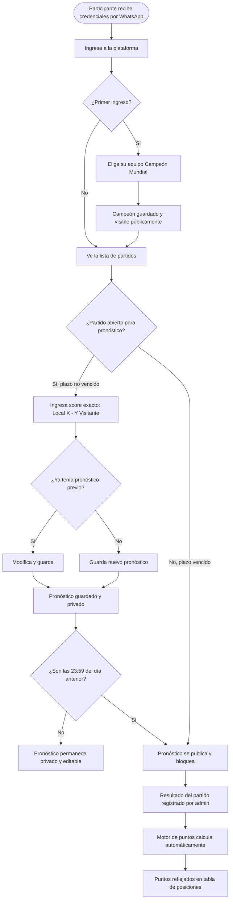
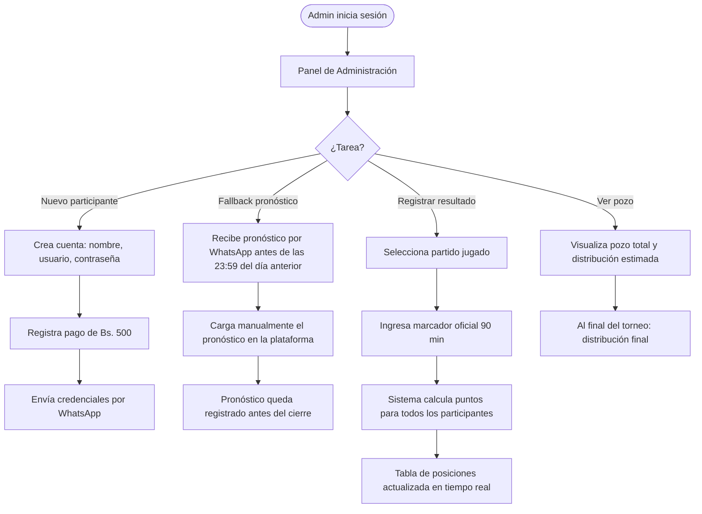

# PRD — Pronóstico Mundial 2026
## Product Requirements Document · v0.1

---

## Metadatos

| Campo            | Valor                                                    |
|------------------|----------------------------------------------------------|
| **Proyecto**     | Pronóstico Mundial 2026                                  |
| **Versión**      | 1.2                                                      |
| **Fecha**        | 2026-05-17                                               |
| **Autor**        | Alberto Gomez (carlos@brilliant.tech)                    |
| **Cliente**      | Vladimir Mariaca Vargas (organizador del torneo)         |
| **Estado**       | En revisión                                              |
| **Próxima revisión** | Aprobación por el cliente antes de iniciar el FSD   |

---

## Historial de Versiones

| Versión | Fecha      | Autor           | Descripción                          |
|---------|------------|-----------------|--------------------------------------|
| 0.1     | 2026-05-15 | Alberto Gomez   | Borrador inicial basado en reglas del cliente y documento de invitación |
| 0.2     | 2026-05-16 | Alberto Gomez   | v1 implementada y en producción. Agregadas US-018..025: gestión de fixture, puntos de campeón, desglose de puntos, vista del pozo, perfil de participante y partidos eliminatorios TBD y página de reglas (US-026). US-027..029: sidebar, settings y configuración del torneo. US-030: detalle de partido |
| 1.2     | 2026-05-17 | Alberto Gomez   | US-049..052: admin fixture 2-col grid, login loading state (useFormStatus), avatar en standings, champion flag badge en avatar (standings + sidebar). REQ-107..112. BR-053..056. |
| 1.1     | 2026-05-17 | Alberto Gomez   | US-048: UX loading states — spinner Loader2 en todos los botones async, inputs deshabilitados durante submit, toast Realtime, prediction-row label/AlertDialog. REQ-101..106. BR-048..052. |
| 1.0     | 2026-05-17 | Alberto Gomez   | US-047: detalle de partido — score real para AET/PEN (120 min), badge de resolución y equipo que avanza. REQ-097..100. BR-046..047. |
| 0.9     | 2026-05-17 | Alberto Gomez   | Decisión del cliente Opción A confirmada (tiempo de descuento incluido en 90 min). US-046: admin fixture card UX — hero CSS Grid, inputs vacíos, reveal condicional AET/PEN. REQ-093..096. BR-043..045. |
| 0.8     | 2026-05-17 | Alberto Gomez   | US-045: prediction card UX polish — score centrado (CSS Grid), deadline 24h, meta-line sin redundancias, sin etiqueta de etapa duplicada, botón compacto, indicador de guardado. REQ-087..092. BR-037..042. |
| 0.7     | 2026-05-17 | Alberto Gomez   | US-039..044: UX global — breadcrumbs, sidebar colapsable, login-01, admin home dashboard-01, data-table participantes, settings layout. REQ-076..086. BR-030..035. |
| 0.6     | 2026-05-17 | Alberto Gomez   | US-038: registro de resultado complejo (multi-score: 90 min + AET + penales). REQ-072..075. US-031 actualizado con escenarios correctos (AET muestra score de 120 min, no de 90). Pendiente decisión del cliente sobre goles en tiempo de descuento. |
| 0.5     | 2026-05-17 | Alberto Gomez   | US-037: rediseño de tarjeta de partido — layout FIFA con hora/score como protagonista. REQ-068..071 correspondientes. |
| 0.4     | 2026-05-17 | Alberto Gomez   | US-036: código FIFA de 3 letras en tarjeta de partido (mobile UX). REQ-066..067 correspondientes. |
| 0.3     | 2026-05-17 | Alberto Gomez   | Nuevas US-031..034: resultado completo en eliminatoria (a.e.t./pen.), fixture con banderas y agrupación por jornada, tabla de clasificación de grupos. US-035 pendiente de análisis: auto-bracket eliminatorio. REQ-058..065 correspondientes. |

---

## 1. Resumen Ejecutivo

**Pronóstico Mundial 2026** es una aplicación web privada diseñada para gestionar un torneo de predicciones del Mundial FIFA 2026 (EE.UU., México, Canadá). El torneo es organizado por Vladimir Mariaca Vargas para un grupo cerrado de participantes que compiten pronosticando el marcador exacto de cada partido.

Los participantes pagan una cuota única de Bs. 500 para inscribirse. Al final del torneo, el pozo acumulado se distribuye entre los mejores clasificados según reglas predefinidas. La plataforma centraliza la gestión de pronósticos, el cálculo de puntos, la tabla de posiciones en tiempo real y la administración del torneo — reemplazando métodos manuales como hojas de cálculo o grupos de WhatsApp.

---

## 2. Objetivos del Producto

### 2.1 Objetivo General

Proveer al organizador y a los participantes una plataforma web confiable, transparente y fácil de usar que gestione de principio a fin el torneo de pronósticos del Mundial FIFA 2026.

### 2.2 Objetivos Específicos

| ID      | Objetivo                                                                                                        |
|---------|-----------------------------------------------------------------------------------------------------------------|
| OBJ-001 | Centralizar el ingreso y la gestión de pronósticos, eliminando la dependencia de WhatsApp o Excel.             |
| OBJ-002 | Garantizar la transparencia del proceso: pronósticos publicados públicamente a las 23:59 del día anterior.     |
| OBJ-003 | Automatizar el cálculo de puntos tras el ingreso de resultados oficiales.                                       |
| OBJ-004 | Ofrecer una tabla de posiciones pública y en tiempo real durante todo el torneo.                                |
| OBJ-005 | Proveer al admin herramientas de gestión del torneo: cuentas, pagos, resultados y fallback de pronósticos.     |
| OBJ-006 | Calcular y mostrar la distribución del pozo de manera automática y auditable.                                   |

### 2.3 Indicadores de Éxito

- 100% de los partidos tienen resultados registrados antes de que inicie el siguiente partido de cada participante.
- 0 discrepancias en el cálculo de puntos reportadas por los participantes.
- La tabla de posiciones se actualiza dentro de los 60 segundos posteriores al registro de un resultado.
- El organizador puede crear una cuenta y entregar credenciales en menos de 2 minutos.

---

## 3. Contexto y Problema

### 3.1 Problema Actual

Los torneos de pronósticos entre amigos o grupos pequeños suelen gestionarse mediante hojas de cálculo compartidas o mensajes de WhatsApp, lo que genera:

- Pérdida de pronósticos enviados fuera de horario o en el hilo incorrecto.
- Errores de cálculo manual de puntos.
- Falta de transparencia: los participantes no pueden verificar qué pronosticaron los demás antes o después del cierre.
- Dificultad para rastrear pagos de cuotas y el estado del pozo.
- Disputas sobre si un pronóstico fue enviado a tiempo.

### 3.2 Solución Propuesta

Una aplicación web privada que actúa como árbitro neutral del torneo: recibe pronósticos con sello de tiempo, los bloquea automáticamente al cumplirse el plazo, los publica simultáneamente a todos, calcula puntos sin intervención humana y mantiene una tabla de posiciones confiable y pública.

### 3.3 Partes Interesadas

| Rol           | Nombre / Descripción                                      | Interés Principal                                   |
|---------------|-----------------------------------------------------------|-----------------------------------------------------|
| Organizador / Admin | Vladimir Mariaca Vargas                          | Gestionar el torneo con mínimo esfuerzo manual      |
| Participantes | Grupo cerrado de jugadores inscritos (incluye al admin)   | Ingresar pronósticos, seguir su posición, ganar     |
| Desarrollador | Brilliant Tech (carlos@brilliant.tech)                    | Entregar un producto funcional, mantenible y a tiempo |

---

## 4. Alcance

### 4.1 Dentro del Alcance — v1.0

- Autenticación de usuarios (login con usuario y contraseña gestionado por Supabase Auth).
- Gestión de cuentas por el admin: creación manual, activación, asignación de rol.
- Registro de pago de cuota de inscripción por el admin.
- Fixture del Mundial 2026 con cálculo automático del plazo de cierre (23:59 BOT del día del partido).
- Ingreso y modificación de pronósticos (score exacto) antes del plazo.
- Selección del Campeón Mundial por parte de cada participante (antes del partido inaugural).
- Visibilidad del Campeón: pública desde el inicio del torneo.
- Publicación automática de pronósticos a las 23:59 del día anterior; bloqueo inmediato.
- Fallback: el admin puede cargar manualmente pronósticos recibidos por WhatsApp antes del plazo.
- Motor de puntos: +1 resultado, +2 score exacto (solo si ingresado manualmente), +5 campeón. Máx. 3 por partido.
- Caso especial "No pronosticó": evaluado como 0-0 pero sin derecho a los +2, máximo 1 punto si el partido termina 0-0.
- Solo cuentan los 90 minutos reglamentarios (sin prórroga ni penales).
- Registro de resultado oficial por el admin con cálculo automático de puntos al guardar.
- Tabla de posiciones pública, permanente y en tiempo real (Supabase Realtime).
- Vista de detalle de puntos por participante y por partido.
- Cálculo y visualización del pozo y distribución estimada de premios.
- Reglas de distribución: ≤8 participantes → 100% al 1ro; >8 → 75% al 1ro y 25% al 2do.
- Reglas de empate en 1er y 2do lugar.
- Panel de administración para gestionar todas las funciones del admin.

### 4.2 Fuera del Alcance — v1.0

- Registro público de usuarios (autoregistro).
- Integración directa con WhatsApp API (el fallback es manual por el admin).
- Pasarela de pago en línea (el pago de cuota se verifica manualmente).
- Notificaciones push o SMS automatizadas.
- Aplicación móvil nativa (iOS / Android).
- Soporte para múltiples torneos simultáneos.
- Estadísticas avanzadas o analytics de predicciones.
- Prórroga y tiros penales en el motor de puntos.
- Exportación de reportes en PDF o Excel.
- Integración con APIs externas de resultados en vivo del Mundial.

---

## 5. Restricciones y Supuestos

### 5.1 Restricciones

| ID     | Restricción                                                                                           |
|--------|-------------------------------------------------------------------------------------------------------|
| RST-001 | El plazo de cierre de pronósticos es siempre 23:59 BOT del día del partido. |
| RST-002 | Solo el administrador puede crear cuentas; no existe registro público.                                |
| RST-003 | Una vez inscrito (cuota pagada y cuenta activada), el participante no puede retirarse.                |
| RST-004 | El motor de puntos evalúa únicamente los 90 minutos reglamentarios.                                   |
| RST-005 | Un pronóstico no ingresado manualmente se marca como "No pronosticó" y se evalúa como 0-0, pero nunca puede ganar los +2 puntos adicionales por score exacto. |

### 5.2 Supuestos

| ID     | Supuesto                                                                                              |
|--------|-------------------------------------------------------------------------------------------------------|
| ASM-001 | El fixture del Mundial 2026 (fechas, horarios, equipos) estará disponible antes del inicio del desarrollo y se cargará manualmente en la base de datos. |
| ASM-002 | El organizador tiene acceso a internet y dispositivo móvil para cargar resultados y gestionar cuentas. |
| ASM-003 | Los participantes acceden a la plataforma desde navegadores web modernos (móvil o escritorio).        |
| ASM-004 | El número total de participantes no superará los 200 (dimensionamiento de la infraestructura).        |
| ASM-005 | La distribución del pozo se calcula sobre el total de cuotas pagadas registradas en la plataforma.    |

---

## 6. User Journeys

### 6.1 Journey: Participante — Pronosticar un partido



### 6.2 Journey: Admin — Gestionar el torneo



### 6.3 Journey: Participante — Ver tabla de posiciones


---

## 7. User Stories

### Épica E1 — Autenticación y Acceso

---

#### PRD-US-001: Iniciar sesión con usuario y contraseña

**Como** participante,
**quiero** iniciar sesión en la plataforma con el usuario y contraseña que me entregó el organizador,
**para** acceder a mis pronósticos, la tabla de posiciones y la información del torneo.

**Criterios de Aceptación:**

```gherkin
Feature: Inicio de sesión de participante

  Scenario: Inicio de sesión exitoso
    Given que soy un participante con cuenta activa
    And tengo el usuario "jperez" y contraseña "abc123"
    When ingreso mis credenciales en el formulario de login
    And presiono "Iniciar sesión"
    Then soy redirigido al dashboard del torneo
    And veo mi nombre en la esquina superior

  Scenario: Credenciales incorrectas
    Given que ingreso una contraseña incorrecta
    When presiono "Iniciar sesión"
    Then veo el mensaje de error "Usuario o contraseña incorrectos"
    And permanezco en la pantalla de login

  Scenario: Cuenta inactiva
    Given que el admin creó mi cuenta pero no registró mi pago
    When intento iniciar sesión con mis credenciales
    Then veo el mensaje "Tu cuenta aún no está activada. Contacta al organizador."
```

**Reglas de negocio referenciadas:** BR-001 (acceso por credenciales), BR-002 (cuentas creadas por admin)
**Prioridad:** Alta | **Story Points:** 3

---

#### PRD-US-002: Crear cuentas manualmente (Admin)

**Como** administrador del torneo,
**quiero** crear cuentas de participantes manualmente desde el panel de administración,
**para** habilitar el acceso a nuevos jugadores sin depender de un registro público.

**Criterios de Aceptación:**

```gherkin
Feature: Creación manual de cuentas por el admin

  Scenario: Crear cuenta exitosamente
    Given que estoy en el panel de administración
    When ingreso el nombre completo, usuario y contraseña del nuevo participante
    And presiono "Crear cuenta"
    Then la cuenta queda creada con estado "pendiente de pago"
    And aparece en la lista de participantes del panel

  Scenario: Usuario duplicado
    Given que el usuario "jperez" ya existe en el sistema
    When intento crear otra cuenta con el mismo usuario
    Then veo el error "El nombre de usuario ya está en uso"

  Scenario: Campos obligatorios vacíos
    Given que no completo el campo de nombre de usuario
    When presiono "Crear cuenta"
    Then veo la validación "El nombre de usuario es obligatorio"
```

**Reglas de negocio referenciadas:** BR-002 (registro manual)
**Prioridad:** Alta | **Story Points:** 3

---

### Épica E2 — Pronósticos de Partidos

---

#### PRD-US-003: Ver lista de partidos con plazos

**Como** participante,
**quiero** ver la lista completa de partidos del Mundial con la fecha del partido y el plazo límite para pronosticar,
**para** organizar mis predicciones con anticipación y no perder ningún plazo.

**Criterios de Aceptación:**

```gherkin
Feature: Lista de partidos y plazos

  Scenario: Ver partidos próximos con plazo abierto
    Given que estoy en la sección de pronósticos
    When la lista de partidos carga
    Then veo cada partido con: equipos, fecha y hora del partido, plazo límite (23:59 del día anterior)
    And los partidos con plazo abierto muestran el estado "Abierto"

  Scenario: Ver partidos con plazo vencido
    Given que ya pasaron las 23:59 del día anterior
    When veo la lista de partidos
    Then ese partido muestra el estado "Cerrado"
    And ya no puedo modificar mi pronóstico para ese partido

  Scenario: Ordenamiento de la lista
    Given que hay partidos de distintas fases
    When cargo la lista de partidos
    Then los partidos están ordenados cronológicamente por fecha y hora
```

**Reglas de negocio referenciadas:** BR-003 (plazo de cierre 23:59 BOT del día del partido)
**Prioridad:** Alta | **Story Points:** 2

---

#### PRD-US-004: Ingresar pronóstico de score exacto

**Como** participante,
**quiero** ingresar mi pronóstico de marcador exacto (goles Local y goles Visitante) para un partido antes del plazo,
**para** participar en el sistema de puntos y optar a los +3 puntos disponibles por ese partido.

**Criterios de Aceptación:**

```gherkin
Feature: Ingreso de pronóstico

  Scenario: Ingresar pronóstico exitosamente
    Given que el plazo de un partido no ha vencido
    And no tengo pronóstico ingresado para ese partido
    When ingreso "2" para el equipo local y "1" para el visitante
    And presiono "Guardar pronóstico"
    Then mi pronóstico queda registrado como "2 - 1"
    And el sistema muestra confirmación "Pronóstico guardado"
    And el pronóstico permanece privado hasta las 23:59 del día anterior

  Scenario: Intentar ingresar pronóstico con plazo vencido
    Given que ya son las 23:59 del día anterior
    When intento acceder al formulario de pronóstico
    Then el formulario aparece bloqueado (solo lectura)
    And veo el mensaje "El plazo para pronosticar este partido ha vencido"

  Scenario: Pronóstico no ingresado
    Given que no ingresé pronóstico antes del plazo
    When el plazo vence
    Then el sistema registra internamente 0-0 para ese partido
    And en la UI se muestra "No pronosticó" (no "0 - 0")
```

**Reglas de negocio referenciadas:** BR-003 (plazo), BR-004 (score exacto), BR-005 (pronóstico no ingresado)
**Prioridad:** Alta | **Story Points:** 5

---

#### PRD-US-005: Modificar pronóstico antes del plazo

**Como** participante,
**quiero** poder modificar mi pronóstico para un partido hasta que venza el plazo,
**para** corregir mi predicción si cambio de opinión.

**Criterios de Aceptación:**

```gherkin
Feature: Modificación de pronóstico

  Scenario: Modificar pronóstico exitosamente
    Given que tengo un pronóstico "1 - 0" guardado para un partido
    And el plazo aún no ha vencido
    When cambio el marcador a "2 - 1" y presiono "Guardar"
    Then mi pronóstico se actualiza a "2 - 1"
    And veo la confirmación "Pronóstico actualizado"

  Scenario: Intentar modificar después del plazo
    Given que ya son las 23:59 del día anterior
    And tengo un pronóstico guardado "1 - 0"
    When intento editar el formulario
    Then el campo está deshabilitado
    And veo el mensaje "Los pronósticos están bloqueados"
```

**Reglas de negocio referenciadas:** BR-003 (plazo de modificación)
**Prioridad:** Alta | **Story Points:** 2

---

#### PRD-US-006: Ver estado de mis pronósticos

**Como** participante,
**quiero** ver el estado de cada uno de mis pronósticos (ingresado, no pronosticado, o bloqueado),
**para** saber en qué partidos participé activamente y en cuáles no.

**Criterios de Aceptación:**

```gherkin
Feature: Estado de pronósticos propios

  Scenario: Pronóstico ingresado antes del plazo
    Given que ingresé "2 - 0" para un partido
    When veo mi lista de pronósticos
    Then ese partido muestra "2 - 0" con estado "Guardado"

  Scenario: Pronóstico no ingresado después del plazo
    Given que no ingresé pronóstico para un partido
    When vence el plazo y veo mi lista
    Then ese partido muestra "No pronosticó" (sin revelar el 0-0 interno)

  Scenario: Pronóstico bloqueado
    Given que ya pasaron las 23:59 del día anterior
    When veo mi pronóstico guardado
    Then el estado muestra "Bloqueado" y el campo no es editable
```

**Reglas de negocio referenciadas:** BR-005 (visualización "No pronosticó"), BR-003 (bloqueo)
**Prioridad:** Alta | **Story Points:** 2

---

#### PRD-US-007: Ver pronósticos de todos los participantes después del plazo

**Como** participante,
**quiero** ver los pronósticos de todos los demás participantes para un partido una vez que el plazo haya vencido,
**para** comparar predicciones y generar debate antes y durante el partido.

**Criterios de Aceptación:**

```gherkin
Feature: Visibilidad pública de pronósticos post-cierre

  Scenario: Ver pronósticos de todos después del plazo
    Given que ya son las 23:59 del día anterior
    When accedo a la vista de ese partido
    Then veo una tabla con todos los participantes, su pronóstico o "No pronosticó"

  Scenario: Pronósticos privados antes del plazo
    Given que el plazo aún no ha vencido
    When accedo a la vista de un partido
    Then no veo los pronósticos de los demás participantes
    And solo veo si yo ya ingresé el mío o no

  Scenario: Participante que no pronosticó
    Given que un participante no ingresó pronóstico antes del plazo
    When se publican los pronósticos a las 15:00
    Then ese participante aparece en la tabla con "No pronosticó" (no se muestra "0 - 0")
```

**Reglas de negocio referenciadas:** BR-006 (visibilidad pública post-cierre), BR-005 (texto "No pronosticó")
**Prioridad:** Alta | **Story Points:** 3

---

### Épica E3 — Campeón Mundial

---

#### PRD-US-008: Elegir equipo Campeón Mundial

**Como** participante,
**quiero** elegir mi equipo Campeón Mundial antes del primer partido del torneo,
**para** participar en el bono de +5 puntos que se otorga al final si acierto.

**Criterios de Aceptación:**

```gherkin
Feature: Elección del Campeón Mundial

  Scenario: Elegir campeón exitosamente
    Given que el torneo aún no ha iniciado (primer partido no jugado)
    And no he elegido campeón aún
    When selecciono "Argentina" del listado de selecciones
    And presiono "Confirmar mi Campeón"
    Then mi elección queda guardada como "Argentina"
    And se muestra públicamente a todos los participantes desde ese momento

  Scenario: Plazo vencido para elegir campeón
    Given que el primer partido ya comenzó
    When intento cambiar mi elección de campeón
    Then el selector está bloqueado
    And veo "Ya no es posible cambiar tu elección de Campeón"

  Scenario: Sin elección de campeón
    Given que no elegí campeón antes del inicio del torneo
    Then mi fila en la tabla de campeones muestra "No eligió"
    And no puedo ganar los +5 puntos del bono
```

**Reglas de negocio referenciadas:** BR-007 (campeón mundial, bono +5 puntos)
**Prioridad:** Alta | **Story Points:** 3

---

#### PRD-US-009: Ver elecciones de campeón de todos los participantes

**Como** participante,
**quiero** ver la elección de Campeón Mundial de todos los participantes desde el inicio del torneo,
**para** tener transparencia sobre quién apostó por qué selección.

**Criterios de Aceptación:**

```gherkin
Feature: Visibilidad pública del Campeón

  Scenario: Ver tabla de campeones desde el inicio
    Given que el torneo ha iniciado (o el primer partido ya se cargó en el fixture)
    When accedo a la sección "Campeón Mundial"
    Then veo una tabla con todos los participantes y su elección de campeón
    And si un participante no eligió, aparece "No eligió"

  Scenario: Visibilidad antes del inicio del torneo
    Given que el torneo aún no ha iniciado
    When accedo a la sección "Campeón Mundial"
    Then las elecciones ya registradas son visibles públicamente
```

**Reglas de negocio referenciadas:** BR-007 (transparencia, campeón visible desde el inicio)
**Prioridad:** Media | **Story Points:** 2

---

### Épica E4 — Tabla de Posiciones

---

#### PRD-US-010: Ver tabla de posiciones en tiempo real

**Como** participante,
**quiero** ver la tabla de posiciones con los puntos acumulados de todos los participantes actualizada en tiempo real,
**para** conocer mi posición en el torneo sin necesidad de recargar la página.

**Criterios de Aceptación:**

```gherkin
Feature: Tabla de posiciones en tiempo real

  Scenario: Ver tabla actualizada tras registrar resultado
    Given que el admin registra el resultado de un partido
    When los puntos se calculan automáticamente
    Then la tabla de posiciones se actualiza en mi pantalla sin recargar la página
    And el cambio ocurre dentro de los 60 segundos posteriores al registro

  Scenario: Ver posición propia destacada
    Given que estoy en la tabla de posiciones
    Then mi fila aparece resaltada visualmente para identificarme fácilmente

  Scenario: Ver tabla con empates
    Given que dos participantes tienen el mismo puntaje
    When veo la tabla
    Then ambos comparten la misma posición (ej. ambos en 2do lugar)
```

**Reglas de negocio referenciadas:** BR-008 (tabla de posiciones pública y en tiempo real)
**Prioridad:** Alta | **Story Points:** 5

---

#### PRD-US-011: Ver detalle de puntos por partido

**Como** participante,
**quiero** ver el desglose de puntos que obtuve partido por partido,
**para** entender por qué tengo ese puntaje total y qué partidos me dieron más o menos puntos.

**Criterios de Aceptación:**

```gherkin
Feature: Detalle de puntos por partido

  Scenario: Ver desglose de puntos de un participante
    Given que estoy en la tabla de posiciones
    When selecciono mi nombre (o el de otro participante)
    Then veo una tabla con todos los partidos disputados
    And para cada partido veo: mi pronóstico, el resultado oficial, puntos obtenidos (0, 1, 2 o 3)

  Scenario: Partido con resultado aún no registrado
    Given que un partido no tiene resultado oficial registrado
    When veo el detalle de ese partido en mi perfil
    Then ese partido muestra "Pendiente de resultado"

  Scenario: Partido no pronosticado con resultado 0-0
    Given que no ingresé pronóstico para un partido que terminó 0-0
    When veo el detalle de ese partido
    Then muestra "No pronosticó" en mi pronóstico y "1 punto" (acertó empate pero no score exacto)
```

**Reglas de negocio referenciadas:** BR-004 (sistema de puntos), BR-005 (caso "No pronosticó")
**Prioridad:** Media | **Story Points:** 3

---

### Épica E5 — Gestión del Torneo (Admin)

---

#### PRD-US-012: Registrar pago de inscripción

**Como** administrador,
**quiero** registrar el pago de la cuota de inscripción de un participante,
**para** activar su cuenta y contabilizar su aporte al pozo.

**Criterios de Aceptación:**

```gherkin
Feature: Registro de pago de inscripción

  Scenario: Activar cuenta tras confirmar pago
    Given que existe una cuenta en estado "pendiente de pago"
    When presiono "Marcar como pagado" para ese participante
    Then la cuenta cambia a estado "Activo"
    And el pozo total se incrementa en Bs. 500

  Scenario: Ver estado de pagos de todos los participantes
    Given que estoy en el panel de administración
    When accedo a la sección de participantes
    Then veo la lista con nombre, estado (pendiente / activo) y si pagó la cuota

  Scenario: No permitir participar sin pago registrado
    Given que una cuenta tiene estado "pendiente de pago"
    When el participante intenta ingresar un pronóstico
    Then el sistema no lo permite y muestra "Tu cuenta no está activada"
```

**Reglas de negocio referenciadas:** BR-001 (inscripción con cuota Bs. 500), BR-002 (gestión por admin)
**Prioridad:** Alta | **Story Points:** 3

---

#### PRD-US-013: Ver pozo acumulado y distribución estimada

**Como** administrador,
**quiero** ver el total del pozo acumulado y cómo se distribuiría entre los ganadores según las reglas actuales,
**para** informar a los participantes sobre el premio en juego en cualquier momento del torneo.

**Criterios de Aceptación:**

```gherkin
Feature: Visualización del pozo y distribución

  Scenario: Ver pozo con 8 o menos participantes activos
    Given que hay 6 participantes con pago registrado
    When accedo a la vista del pozo
    Then veo "Pozo total: Bs. 3.000"
    And veo "Distribución: 100% al 1er lugar (Bs. 3.000)"

  Scenario: Ver pozo con más de 8 participantes activos
    Given que hay 10 participantes con pago registrado
    When accedo a la vista del pozo
    Then veo "Pozo total: Bs. 5.000"
    And veo "1er lugar: Bs. 3.750 (75%) · 2do lugar: Bs. 1.250 (25%)"

  Scenario: Distribución con empate en 1er lugar
    Given que al final del torneo dos participantes empatan en 1er lugar
    When se calcula la distribución final
    Then la vista muestra: "Empate en 1er lugar: cada ganador recibe Bs. 2.500 (50%)"
```

**Reglas de negocio referenciadas:** BR-009 (distribución del pozo), BR-010 (reglas de empate)
**Prioridad:** Alta | **Story Points:** 3

---

#### PRD-US-014: Cargar pronóstico manual (Fallback WhatsApp)

**Como** administrador,
**quiero** poder ingresar manualmente el pronóstico de un participante recibido por WhatsApp antes del plazo,
**para** garantizar que ningún jugador pierda su pronóstico por problemas técnicos de la plataforma.

**Criterios de Aceptación:**

```gherkin
Feature: Carga manual de pronóstico por el admin (fallback)

  Scenario: Cargar pronóstico válido antes del plazo
    Given que el plazo de un partido no ha vencido
    And recibí el pronóstico "2-1" de "jperez" por WhatsApp
    When selecciono al participante "jperez" y el partido correspondiente en el panel admin
    And ingreso "2" local y "1" visitante
    And presiono "Guardar pronóstico manual"
    Then el pronóstico queda registrado para "jperez" como si él lo hubiera ingresado
    And se registra un log indicando "cargado manualmente por admin"

  Scenario: Intentar cargar pronóstico después del plazo
    Given que ya son las 23:59 del día anterior
    When intento cargar un pronóstico manual para ese partido
    Then el sistema no lo permite
    And veo el mensaje "El plazo de cierre ya venció para este partido"

  Scenario: Pronóstico cargado manualmente cuenta como ingresado
    Given que el admin cargó "0-0" para "jperez"
    And el partido termina 0-0
    When se calculan los puntos
    Then "jperez" recibe 3 puntos (acertó resultado + score exacto)
    (porque el pronóstico fue ingresado explícitamente, aunque fuera por el admin)
```

**Reglas de negocio referenciadas:** BR-005 (pronóstico ingresado manualmente = tiene derecho a +2), BR-003 (plazo)
**Prioridad:** Alta | **Story Points:** 5

---

#### PRD-US-015: Registrar resultado oficial de un partido

**Como** administrador,
**quiero** registrar el resultado oficial (marcador a 90 minutos) de cada partido terminado,
**para** que el sistema calcule automáticamente los puntos de todos los participantes.

**Criterios de Aceptación:**

```gherkin
Feature: Registro de resultado oficial

  Scenario: Registrar resultado y calcular puntos
    Given que un partido ha terminado
    When ingreso el marcador "3 - 1" para el partido y presiono "Guardar resultado"
    Then el sistema calcula los puntos de todos los participantes para ese partido
    And la tabla de posiciones se actualiza en tiempo real
    And el partido aparece marcado como "Finalizado" con el resultado visible

  Scenario: Modificar resultado ya registrado
    Given que registré "2 - 1" por error y el resultado real fue "2 - 0"
    When corrijo el marcador y guardo nuevamente
    Then el sistema recalcula los puntos para ese partido
    And la tabla de posiciones se actualiza con los nuevos valores

  Scenario: Solo contar 90 minutos reglamentarios
    Given que un partido terminó 1-1 en 90 minutos y fue al alargue
    When registro el resultado
    Then debo ingresar "1 - 1" (el marcador de los 90 minutos), no el resultado final del alargue
    And el sistema calcula puntos sobre "1 - 1"
```

**Reglas de negocio referenciadas:** BR-004 (solo 90 minutos), BR-008 (cálculo automático de puntos)
**Prioridad:** Alta | **Story Points:** 5

---

### Épica E6 — Resultados y Premios

---

#### PRD-US-016: Ver puntos obtenidos por partido

**Como** participante,
**quiero** ver cuántos puntos obtuve en cada partido una vez que se registra el resultado oficial,
**para** entender cómo evoluciona mi puntaje total y qué tan acertadas fueron mis predicciones.

**Criterios de Aceptación:**

```gherkin
Feature: Visualización de puntos obtenidos por partido

  Scenario: Ver puntos de partido con pronóstico ingresado
    Given que pronostiqué "2 - 1" y el resultado fue "2 - 1"
    When el admin registra el resultado
    Then en mi perfil veo: "Pronóstico: 2-1 | Resultado: 2-1 | Puntos: 3 (resultado + score exacto)"

  Scenario: Ver puntos de partido sin pronóstico
    Given que no ingresé pronóstico y el partido terminó "0 - 0"
    When el admin registra el resultado
    Then veo: "No pronosticó | Resultado: 0-0 | Puntos: 1 (acertó empate, no score exacto)"

  Scenario: Ver puntos de partido con resultado diferente al pronóstico
    Given que pronostiqué "1 - 0" y el resultado fue "2 - 1"
    When el admin registra el resultado
    Then veo: "Pronóstico: 1-0 | Resultado: 2-1 | Puntos: 1 (acertó resultado, no score exacto)"
```

**Reglas de negocio referenciadas:** BR-004 (sistema de puntos), BR-005 (caso "No pronosticó")
**Prioridad:** Media | **Story Points:** 3

---

#### PRD-US-017: Ver distribución final del pozo (Admin)

**Como** administrador,
**quiero** ver la distribución final del pozo al concluir el torneo con los ganadores identificados y los montos exactos,
**para** proceder al pago de premios de manera transparente y auditada.

**Criterios de Aceptación:**

```gherkin
Feature: Distribución final del pozo

  Scenario: Distribución con ganador único (más de 8 participantes)
    Given que el torneo terminó con 12 participantes
    And "Juan Pérez" tiene el mayor puntaje y "María López" el segundo
    When accedo a la vista de distribución final
    Then veo "Ganador: Juan Pérez — Bs. 4.500 (75%)" y "2do lugar: María López — Bs. 1.500 (25%)"

  Scenario: Distribución con 8 o menos participantes
    Given que el torneo terminó con 7 participantes (Bs. 3.500 en el pozo)
    And "Carlos Soto" tiene el mayor puntaje
    When veo la distribución final
    Then veo "Ganador: Carlos Soto — Bs. 3.500 (100%)"

  Scenario: Empate en el primer lugar
    Given que "Ana" y "Luis" empatan en primer lugar con el mismo puntaje
    And hay más de 8 participantes
    When veo la distribución final
    Then veo "Empate en 1er lugar: Ana y Luis — Bs. X.XXX cada uno (50% del pozo total)"
    And no se otorga premio al 2do lugar
```

**Reglas de negocio referenciadas:** BR-009 (distribución del pozo), BR-010 (reglas de empate)
**Prioridad:** Media | **Story Points:** 3

---

#### PRD-US-018: Gestionar fixture (Admin)

**Como** administrador,
**quiero** poder crear, editar y eliminar partidos del fixture desde el panel de administración,
**para** cargar el calendario oficial del torneo y mantenerlo actualizado ante cualquier cambio de la FIFA.

**Criterios de Aceptación:**

```gherkin
Feature: Gestión del fixture por el admin

  Scenario: Admin crea un partido
    Given que estoy en el panel de administración, sección "Fixture"
    When completo los campos: fase, equipo local, equipo visitante, fecha/hora, y guardo
    Then el partido aparece en el fixture visible para todos los participantes

  Scenario: Admin edita fecha/hora de un partido existente
    Given que existe el partido "Argentina vs México" con fecha errónea
    When edito la fecha y guardo
    Then el fixture muestra la fecha correcta
    And los plazos de cierre se recalculan automáticamente (23:59 BOT del día del partido)

  Scenario: Admin intenta editar un partido ya finalizado
    Given que el partido "España vs Alemania" tiene status "finished"
    When intento editar el marcador desde el formulario de fixture
    Then el sistema muestra un error: "Usa el formulario de resultados para modificar marcadores de partidos finalizados"
```

**Reglas de negocio referenciadas:** BR-011 (fixture editable), RSK-001
**Prioridad:** Alta | **Story Points:** 5

---

#### PRD-US-019: Aplicar puntos de Campeón Mundial (Admin)

**Como** administrador,
**quiero** ejecutar la acción de aplicar los +5 puntos de Campeón Mundial al finalizar el torneo,
**para** actualizar el marcador final con el bonus de campeón y determinar el ganador definitivo.

**Criterios de Aceptación:**

```gherkin
Feature: Aplicación de puntos de Campeón Mundial

  Scenario: Admin aplica puntos de campeón con ganador conocido
    Given que el torneo terminó y "Argentina" es el Campeón Mundial
    And "Juan Pérez" y "María López" seleccionaron "Argentina" como campeón
    When el admin ejecuta "Aplicar puntos de Campeón" en el panel
    Then "Juan Pérez" y "María López" reciben +5 puntos en su total
    And la tabla de posiciones se actualiza automáticamente

  Scenario: Acción idempotente — no se aplican puntos dos veces
    Given que los puntos de campeón ya fueron aplicados
    When el admin vuelve a ejecutar la acción por error
    Then el sistema responde "Los puntos de campeón ya fueron aplicados" sin modificar puntajes

  Scenario: Nadie acertó el campeón
    Given que ningún participante seleccionó al campeón correcto
    When el admin ejecuta la acción
    Then el sistema confirma "0 participantes reciben puntos de campeón" y no modifica puntajes
```

**Reglas de negocio referenciadas:** BR-007 (+5 puntos campeón), BR-012
**Prioridad:** Alta | **Story Points:** 3

---

#### PRD-US-020: Ver desglose de puntos por partido (Participante)

**Como** participante,
**quiero** ver un desglose de mis puntos partido por partido,
**para** entender cómo se formó mi puntaje total y verificar que los cálculos son correctos.

**Criterios de Aceptación:**

```gherkin
Feature: Desglose de puntos por partido

  Scenario: Participante ve su propio desglose
    Given que el partido "Francia vs Brasil" terminó 2-1 y yo pronostiqué 2-1
    When accedo a mi perfil o a la vista de desglose
    Then veo "Francia vs Brasil: 2-1 (mi pronóstico: 2-1) — 3 pts (+1 resultado, +2 exacto)"

  Scenario: Participante no ingresó pronóstico
    Given que no ingresé pronóstico para "Portugal vs Uruguay"
    When veo el desglose
    Then veo "Portugal vs Uruguay: No pronosticó — 0 pts"

  Scenario: Partido aún no finalizado
    Given que "Marruecos vs Croacia" tiene status "scheduled"
    When veo el desglose
    Then ese partido no aparece en el desglose (solo partidos finalizados)
```

**Reglas de negocio referenciadas:** BR-004, BR-005, BR-013
**Prioridad:** Media | **Story Points:** 3

---

#### PRD-US-021: Ver distribución del pozo (Admin)

**Como** administrador,
**quiero** ver en tiempo real la distribución del pozo basada en el ranking actual,
**para** conocer en todo momento quiénes son los líderes y cuánto ganarían si el torneo terminara ahora.

**Criterios de Aceptación:**

```gherkin
Feature: Vista de distribución del pozo (Admin)

  Scenario: Distribución proyectada durante el torneo
    Given que hay 10 participantes y el torneo está en curso
    And "Sofía Ramos" lidera con 45 pts y "Pedro Alva" es 2do con 38 pts
    When accedo a "Distribución del Pozo" en el panel admin
    Then veo: Pozo total: Bs. 5.000 | 1ro: Sofía Ramos — Bs. 3.750 (75%) | 2do: Pedro Alva — Bs. 1.250 (25%)

  Scenario: Distribución final con empate en 1er lugar
    Given que "Ana" y "Luis" empatan en 1er lugar al finalizar el torneo
    When veo la distribución
    Then veo: "Empate en 1er lugar: Ana y Luis — Bs. 2.500 cada uno"
    And no aparece premio para el 2do lugar

  Scenario: 8 o menos participantes
    Given que hay 6 participantes (Bs. 3.000 en el pozo)
    When veo la distribución
    Then veo: "Ganador único: [líder] — Bs. 3.000 (100%)"
```

**Reglas de negocio referenciadas:** BR-009, BR-010, BR-014
**Prioridad:** Media | **Story Points:** 2

---

#### PRD-US-022: Gestionar foto de perfil (Participante)

**Como** participante,
**quiero** poder subir y cambiar mi foto de perfil,
**para** que los demás participantes me reconozcan en la tabla de posiciones y en la vista de pronósticos.

**Criterios de Aceptación:**

```gherkin
Feature: Foto de perfil del participante

  Scenario: Participante sube foto de perfil por primera vez
    Given que no tengo foto de perfil cargada
    When accedo a mi perfil y selecciono una imagen (JPG/PNG/WebP, máx. 2 MB)
    And presiono "Guardar"
    Then la foto se almacena en Supabase Storage
    And aparece en mi fila de la tabla de posiciones y en la barra de navegación

  Scenario: Participante cambia su foto de perfil existente
    Given que ya tengo una foto de perfil cargada
    When selecciono una nueva imagen y presiono "Guardar"
    Then la nueva foto reemplaza a la anterior
    And la foto anterior se elimina del storage

  Scenario: Archivo inválido
    Given que selecciono un archivo que no es imagen o supera los 2 MB
    When presiono "Guardar"
    Then el sistema muestra "Solo se aceptan imágenes JPG, PNG o WebP de hasta 2 MB."
    And no se realiza ningún upload

  Scenario: Foto visible para otros participantes
    Given que "Juan Pérez" tiene foto de perfil cargada
    When cualquier otro participante ve la tabla de posiciones
    Then ve la foto de Juan en su fila del ranking

  Scenario: Participante sin foto de perfil
    Given que un participante no ha subido foto
    When otros participantes ven el ranking
    Then ven un avatar genérico (iniciales del nombre) en lugar de una foto
```

**Reglas de negocio referenciadas:** BR-014
**Prioridad:** Media | **Story Points:** 3

---

#### PRD-US-023: Ver perfil público de participante

**Como** participante,
**quiero** poder ver el perfil público de cualquier participante del torneo (incluido el mío),
**para** conocer sus estadísticas, pronósticos y campeón elegido, y comparar su rendimiento con el mío.

**Criterios de Aceptación:**

```gherkin
Feature: Perfil público de participante

  Scenario: Participante ve el perfil público de otro
    Given que "María López" tiene 12 partidos finalizados con pronósticos
    When accedo al perfil público de María
    Then veo: foto de perfil (o iniciales), nombre, posición actual, puntos totales
    And veo: campeón elegido, % resultados correctos, % scores exactos, racha actual
    And veo: sus pronósticos de todos los partidos cuyo deadline ya pasó

  Scenario: Estadísticas sin partidos finalizados
    Given que el torneo acaba de empezar y no hay resultados
    When accedo al perfil de cualquier participante
    Then las estadísticas muestran "—" o "0%" hasta que haya partidos finalizados

  Scenario: Perfil propio vs perfil ajeno
    Given que accedo a mi propio perfil público
    Then veo exactamente la misma información que vería cualquier otro participante
    And adicionalmente veo mi sección privada (estado de pago, brecha, cambio de contraseña)
```

**Reglas de negocio referenciadas:** BR-015
**Prioridad:** Media | **Story Points:** 3

---

#### PRD-US-024: Gestionar perfil privado

**Como** participante,
**quiero** ver mi estado de pago, cuántos puntos me separan del 1er lugar, y poder cambiar mi contraseña,
**para** gestionar mi cuenta sin necesitar contactar al administrador.

**Criterios de Aceptación:**

```gherkin
Feature: Perfil privado del participante

  Scenario: Participante ve su estado de pago
    Given que mi cuota fue confirmada por el admin (has_paid = true)
    When accedo a mi perfil
    Then veo "Cuota confirmada ✓" en verde
    
  Scenario: Cuota pendiente
    Given que mi cuota aún no fue confirmada (has_paid = false)
    When accedo a mi perfil
    Then veo "Cuota pendiente de confirmación" en amarillo
    And no puedo ingresar pronósticos

  Scenario: Brecha con el líder
    Given que el líder tiene 45 puntos y yo tengo 38 puntos
    When accedo a mi perfil
    Then veo "Te faltan 7 puntos para el 1er lugar"
    
  Scenario: Participante es el líder
    Given que soy el participante con más puntos
    When accedo a mi perfil
    Then veo "Eres el líder del torneo 🏆"

  Scenario: Cambio de contraseña exitoso
    Given que estoy en mi perfil privado
    When ingreso mi contraseña actual, la nueva contraseña y la confirmación
    And presiono "Cambiar contraseña"
    Then Supabase Auth actualiza la contraseña
    And el sistema muestra "Contraseña actualizada exitosamente"

  Scenario: Contraseñas no coinciden
    Given que ingreso dos contraseñas nuevas diferentes
    When presiono "Cambiar contraseña"
    Then el sistema muestra "Las contraseñas no coinciden"
    And no se realiza ningún cambio
```

**Reglas de negocio referenciadas:** BR-016
**Prioridad:** Media | **Story Points:** 3

---

#### PRD-US-025: Gestionar equipos de partidos eliminatorios (Admin)

**Como** administrador,
**quiero** poder asignar los equipos a los partidos eliminatorios una vez que se conocen los clasificados, y recibir una alerta cuando el plazo de cierre se acerca con equipos sin asignar,
**para** garantizar que los participantes puedan pronosticar los partidos eliminatorios sin perder la ventana disponible.

**Criterios de Aceptación:**

```gherkin
Feature: Gestión de partidos eliminatorios TBD

  Scenario: Partido eliminatorio pre-cargado sin equipos
    Given que el partido "Octavo 1 — Por definir vs Por definir" está cargado con fecha y hora
    When un participante accede al fixture
    Then ve el partido con "Por definir vs Por definir"
    And el formulario de pronóstico está deshabilitado para ese partido

  Scenario: Admin asigna equipos a un partido eliminatorio
    Given que el partido "Octavo 1" tiene home_team_id = null y away_team_id = null
    When el admin selecciona "Argentina" como local y "Francia" como visitante y guarda
    Then el partido muestra "Argentina vs Francia" en el fixture
    And el formulario de pronóstico se habilita para los participantes

  Scenario: Alerta cuando el deadline se acerca con equipos TBD
    Given que el partido "Octavo 3" tiene deadline_at en menos de 24 horas
    And home_team_id o away_team_id es null
    When el admin accede al panel de fixture
    Then ve una alerta: "⚠ Octavo 3 — faltan menos de 24 h para el cierre y aún no tiene equipos asignados"

  Scenario: Partido cierra sin equipos asignados
    Given que el deadline de "Octavo 5" llegó con home_team_id = null
    Then el partido queda bloqueado sin pronósticos posibles
    And no se considera un error del sistema (comportamiento aceptado)
    And el admin puede aún asignar equipos y registrar el resultado al finalizar

  Scenario: Participante ve predicción deshabilitada por equipos TBD
    Given que "Cuarto de Final 2" aún tiene equipos sin asignar
    When el participante accede al fixture
    Then ve "Por definir vs Por definir" con un mensaje "Equipos aún no definidos"
    And no puede interactuar con el formulario de pronóstico
```

**Reglas de negocio referenciadas:** BR-017, RSK-001
**Prioridad:** Alta | **Story Points:** 3

---

#### PRD-US-026: Ver reglas del torneo

**Como** participante,
**quiero** poder consultar las reglas del torneo desde la aplicación en cualquier momento,
**para** resolver mis dudas sobre el sistema de puntos, los plazos y la distribución del pozo sin tener que contactar al organizador.

**Criterios de Aceptación:**

```gherkin
Feature: Página de reglas del torneo

  Scenario: Participante accede a las reglas desde la navbar
    Given que estoy autenticado y en cualquier sección de la app
    When hago clic en "Reglas" en la barra de navegación
    Then soy dirigido a la página /reglas
    And veo las reglas organizadas por sección: puntos, plazos, campeón, pozo

  Scenario: Contenido de la sección de puntos
    When veo la sección de sistema de puntos
    Then veo claramente: "+1 por acertar el resultado (V/E/D)"
    And veo: "+2 adicionales por acertar el marcador exacto (si ingresaste el pronóstico)"
    And veo: "Máximo 3 puntos por partido"
    And veo: "Solo cuentan los 90 minutos reglamentarios — sin prórroga ni penales"

  Scenario: Contenido del caso "No pronosticó"
    When veo la sección de plazos y pronósticos
    Then veo una explicación del caso: "Si no ingresás tu pronóstico antes del plazo, el sistema lo toma como 0-0. Si el partido termina 0-0 recibís 1 punto (acertaste el empate), pero no los 2 puntos adicionales."

  Scenario: Contenido de distribución del pozo
    When veo la sección de distribución del pozo
    Then veo las dos reglas: "8 o menos participantes → 100% al 1er lugar" y "Más de 8 participantes → 75% al 1er lugar, 25% al 2do lugar"
    And veo las reglas de empate explicadas en lenguaje simple

  Scenario: Página accesible en mobile
    Given que accedo desde un smartphone
    When navego a /reglas
    Then el contenido es legible y bien organizado en pantalla pequeña
    And no necesito hacer zoom para leer el texto
```

**Reglas de negocio referenciadas:** BR-018 (todas las reglas de negocio del torneo)
**Prioridad:** Media | **Story Points:** 1

---

#### PRD-US-027: Navegar con sidebar y ver mi avatar (Participante / Admin)

**Como** participante o administrador,
**quiero** usar una barra lateral de navegación que muestre mi avatar y nombre,
**para** identificarme de un vistazo y navegar rápidamente entre las secciones de la app, tanto en escritorio como en mobile.

**Criterios de Aceptación:**

```gherkin
Feature: Sidebar de navegación

  Scenario: Sidebar en escritorio
    Given que estoy autenticado y en cualquier página
    When veo el layout en escritorio
    Then veo el sidebar con mi avatar y nombre en el header
    And veo los ítems: Fixture, Tabla de Posiciones, Mi Campeón, Reglas, Mi Perfil
    And veo el ícono de settings en el footer del sidebar

  Scenario: Sidebar en mobile
    Given que accedo desde un smartphone
    When presiono el botón de menú (hamburger)
    Then el sidebar se abre como un drawer desde el lado izquierdo
    And veo los mismos ítems de navegación que en escritorio

  Scenario: Sección Admin solo visible para admin
    Given que estoy autenticado como admin
    When veo el sidebar
    Then veo adicionalmente la sección "Panel Admin" en el sidebar
    
  Scenario: Sección Admin invisible para participante
    Given que estoy autenticado como participante
    When veo el sidebar
    Then no veo ningún ítem de administración en el sidebar

  Scenario: Avatar en tabla de posiciones
    Given que los participantes tienen fotos de perfil cargadas
    When veo la tabla de posiciones
    Then cada fila muestra el avatar (32px) del participante
    And los participantes sin foto muestran un avatar de iniciales
```

**Reglas de negocio referenciadas:** BR-019
**Prioridad:** Alta | **Story Points:** 3

---

#### PRD-US-028: Gestionar configuración de cuenta en Settings (Participante)

**Como** participante,
**quiero** acceder a una página de configuración de mi cuenta (`/settings`),
**para** actualizar mi foto de perfil, cambiar mi contraseña y consultar el estado de mi pago, todo en un único lugar.

**Criterios de Aceptación:**

```gherkin
Feature: Página de Settings del participante

  Scenario: Acceder a settings desde el sidebar
    Given que estoy autenticado
    When hago clic en el ícono de settings en el sidebar
    Then soy dirigido a /settings
    And veo tres secciones: Foto de perfil, Contraseña, Estado de cuenta

  Scenario: Cambiar foto de perfil desde settings
    Given que estoy en /settings
    When selecciono una nueva imagen y guardo
    Then la foto se actualiza en mi avatar del sidebar inmediatamente
    And la nueva foto aparece en la tabla de posiciones y en mi perfil público

  Scenario: Estado de pago visible en settings
    Given que mi cuota fue confirmada (has_paid = true)
    When veo la sección "Estado de cuenta" en settings
    Then veo "Cuota confirmada" en verde
    And este campo es de solo lectura (no puedo modificarlo)

  Scenario: Cambio de contraseña desde settings
    Given que estoy en /settings
    When ingreso una nueva contraseña válida y confirmo
    Then Supabase Auth actualiza la contraseña
    And veo "Contraseña actualizada exitosamente"
```

**Reglas de negocio referenciadas:** BR-020, BR-014, BR-016
**Prioridad:** Media | **Story Points:** 2

---

#### PRD-US-029: Configurar el torneo desde panel admin (Admin)

**Como** administrador,
**quiero** acceder a una página de configuración del torneo (`/admin/settings`),
**para** editar el nombre del torneo, avanzar su estado y aplicar los puntos de Campeón Mundial al finalizar.

**Criterios de Aceptación:**

```gherkin
Feature: Configuración del torneo (Admin)

  Scenario: Admin edita el nombre del torneo
    Given que estoy en /admin/settings
    When modifico el nombre del torneo y guardo
    Then el nuevo nombre aparece en el encabezado del dashboard y en la tabla de posiciones

  Scenario: Admin avanza el estado del torneo
    Given que el torneo está en estado "draft"
    When el admin cambia el estado a "active" y guarda
    Then el torneo pasa a estado activo y los participantes pueden ingresar pronósticos

  Scenario: Admin aplica puntos de campeón desde settings
    Given que el torneo está en estado "finished" y champion_applied = false
    When el admin selecciona el equipo campeón y presiona "Aplicar puntos de Campeón"
    Then se ejecuta la acción de FSD-UC-008
    And el botón queda deshabilitado con el texto "Puntos aplicados el [fecha]"

  Scenario: Cuota de inscripción es de solo lectura
    Given que hay participantes con has_paid = true
    When el admin ve la sección de cuota en /admin/settings
    Then ve "Bs. 500" como valor informativo
    And no puede modificar el valor (campo read-only)
```

**Reglas de negocio referenciadas:** BR-021
**Prioridad:** Media | **Story Points:** 3

---

#### PRD-US-030: Ver detalle de partido con pronósticos (Participante)

**Como** participante,
**quiero** hacer clic en un partido del fixture y ver una página de detalle con todos los pronósticos de los participantes y los puntos obtenidos,
**para** comparar mis predicciones con las del resto del grupo y entender el impacto de cada partido en el ranking.

**Criterios de Aceptación:**

```gherkin
Feature: Página de detalle de partido

  Scenario: Ver detalle de partido con deadline pasado y sin resultado
    Given que el partido "España vs Alemania" tiene deadline pasado pero aún no tiene resultado
    When hago clic en el partido desde el fixture
    Then veo la página de detalle con: equipos, fecha, etapa
    And veo los pronósticos de todos los participantes con sus avatares y nombres
    And no veo puntos (aún no hay resultado)

  Scenario: Ver detalle de partido finalizado
    Given que el partido "Argentina vs Francia" terminó 3-3 (penales 4-2)
    And el admin registró el resultado como 3-3 (90 min)
    When hago clic en el partido desde el fixture
    Then veo el resultado oficial: 3-3
    And veo cada pronóstico con: avatar, nombre, predicción, puntos obtenidos (0, 1 o 3)
    And los participantes están ordenados por puntos obtenidos (descendente)

  Scenario: Partido con deadline no pasado
    Given que el partido "Brasil vs México" aún tiene el plazo abierto
    When hago clic en el partido desde el fixture
    Then veo la información del partido (equipos, fecha)
    And veo cuántos participantes ya ingresaron pronóstico (sin revelar el contenido)
    And no veo los pronósticos individuales

  Scenario: Participante sin pronóstico en partido finalizado
    Given que "Pedro" no ingresó pronóstico para el partido
    When veo el detalle del partido
    Then veo a Pedro en la lista con "No pronosticó" y 0 pts (o 1 pt si terminó 0-0)
```

**Reglas de negocio referenciadas:** BR-022, BR-003, BR-004, BR-005
**Prioridad:** Media | **Story Points:** 3

---

#### PRD-US-031: Ver resultado completo de partido eliminatorio (Participante)

**Como** participante,
**quiero** ver si un partido eliminatorio se decidió en tiempo extra o penales, y quién ganó,
**para** entender el desenlace del partido sin confundir el marcador de 90 minutos (el que cuenta para mi pronóstico) con el resultado final.

**Criterios de Aceptación:**

```gherkin
Feature: Resultado completo en eliminatoria

  Scenario: Partido eliminatorio decidido en penales
    Given que el partido "Argentina vs Francia" terminó 1-1 en 90 minutos
    And se decidió en penales ganando Argentina
    When veo el partido en el fixture o en la página de detalle
    Then veo el marcador "1 - 1" con el badge "pen."
    And veo que Argentina es el equipo ganador del partido

  Scenario: Partido eliminatorio decidido en tiempo extra
    Given que el partido "España vs Alemania" terminó 1-1 en 90 minutos
    And España marcó en el minuto 104, terminando 2-1 al final de la prórroga
    When veo el partido en el fixture o en la página de detalle
    Then veo el marcador "2 - 1" con el badge "a.e.t."
    And veo que España es el equipo ganador del partido
    # Nota: se muestra el score de AET (2-1), no el de 90 min (1-1)
    # El score de 90 min (1-1) se usa para los puntos, pero la UI muestra el resultado final

  Scenario: Los puntos se calculan sobre el marcador de 90 minutos
    Given que yo pronostiqué 1-1 para el partido "Argentina vs Francia"
    And el partido terminó 1-1 en 90 minutos y Argentina ganó en penales
    Then recibo 3 puntos (resultado acertado + score exacto)
    And el badge "pen." no afecta mis puntos

  Scenario: Admin registra resultado eliminatorio en penales (sin goles en prórroga)
    Given que soy admin y el partido "Argentina vs Francia" terminó 1-1 en 90 min y 1-1 en 120 min
    When ingreso: score 90 min = 1-1, score 120 min = 1-1, tipo = Penales, ganador = Argentina
    Then el resultado queda registrado con home_score=1, away_score=1, home_score_full=1, away_score_full=1
    And badge "pen." y ganador Argentina

  Scenario: Admin registra resultado eliminatorio en prórroga (AET con goles)
    Given que soy admin y el partido "España vs Alemania" terminó 1-1 en 90 min y 2-1 en prórroga
    When ingreso: score 90 min = 1-1, score 120 min = 2-1, tipo = Tiempo extra
    Then home_score = 1, away_score = 1 (para puntos)
    And home_score_full = 2, away_score_full = 1 (para display)
    And ganador se deduce automáticamente del score de 120 min (España)
```

**Reglas de negocio referenciadas:** BR-023, BR-029, BR-011, RB-03
**Prioridad:** Alta | **Story Points:** 5

---

#### PRD-US-038: Admin registra resultado completo con múltiples marcadores

**Como** administrador,
**quiero** poder ingresar el marcador a los 90 minutos Y el marcador al finalizar los 120 minutos (cuando aplique) en partidos eliminatorios,
**para** que el sistema calcule puntos correctamente (sobre los 90 min) y muestre el resultado real del partido (120 min) a los participantes.

**Criterios de Aceptación:**

```gherkin
Feature: Formulario de resultado con multi-score

  Scenario: Partido de grupos — solo un marcador
    Given que soy admin registrando un partido de fase de grupos
    When abro el formulario de resultado
    Then solo veo dos inputs: marcador local y marcador visitante
    And no hay opciones de tiempo extra ni penales

  Scenario: Partido eliminatorio decidido en 90 min — solo un marcador
    Given que soy admin registrando un partido eliminatorio con marcador 2-0
    When ingreso 2-0 (scores distintos)
    Then no aparece paso de desempate
    And no se solicita marcador de 120 min

  Scenario: Partido eliminatorio igualado — flujo completo
    Given que soy admin registrando un partido eliminatorio con 1-1 en 90 min
    When ingreso 1-1
    Then el formulario muestra: "¿Cómo se decidió? [Tiempo extra | Penales]"

  Scenario: Admin corrige un resultado ya registrado
    Given que el partido ya tiene status = finished con resultado 2-0
    When el admin modifica los inputs y presiona "Corregir resultado"
    Then aparece un diálogo: "¿Recalcular puntos para todos los participantes con el nuevo marcador?"
    And al confirmar, el sistema recalcula y actualiza el card
```

**⚠ Decisión pendiente:** Si hay goles en el tiempo de descuento (ej. 1-2 al min 90, 2-2 al min 90+3), ¿el marcador para pronósticos es el del minuto 90 exacto o el del pitido final? Enviado al cliente el 17-May-2026. Ver análisis en FSD-UC-004 flujo UC004-A8.

**Reglas de negocio referenciadas:** BR-011, BR-023, BR-029, RB-03
**Prioridad:** Alta | **Story Points:** 8

---

#### PRD-US-032: Ver fixture con banderas y agrupado por jornada (Participante)

**Como** participante,
**quiero** ver el fixture con las banderas de los equipos y los partidos agrupados por día,
**para** identificar los equipos rápidamente y encontrar fácilmente los partidos de cada jornada.

**Criterios de Aceptación:**

```gherkin
Feature: Fixture enriquecido

  Scenario: Ver fixture con banderas
    Given que el fixture tiene partidos cargados
    When abro la página del fixture
    Then cada partido muestra la bandera del equipo local y del visitante junto a su nombre
    And los partidos están agrupados por fecha (hora Bolivia)
    And cada grupo de fecha tiene un encabezado con el día y la fecha (ej. "jueves 11 junio 2026")

  Scenario: Identificar grupo de un partido en fase de grupos
    Given que el partido "México vs Sudáfrica" pertenece al Grupo A
    When veo ese partido en el fixture
    Then veo la etiqueta "Grupo A" junto a la información del partido
```

**Reglas de negocio referenciadas:** BR-024
**Prioridad:** Media | **Story Points:** 2

---

#### PRD-US-033: Ver tabla de clasificación de grupos (Participante)

**Como** participante,
**quiero** ver la tabla de clasificación de cada grupo con puntos, goles a favor, diferencia de goles y posición,
**para** saber qué equipos clasifican a la fase eliminatoria y contextualizar mis pronósticos.

**Criterios de Aceptación:**

```gherkin
Feature: Tabla de clasificación de grupos

  Scenario: Ver clasificación de grupos con partidos jugados
    Given que en el Grupo A se han jugado 2 partidos
    When abro la vista "Ver grupos"
    Then veo una tabla por cada grupo (A al L) con columnas: Pos, Equipo, PJ, G, E, P, GF, GC, DG, Pts
    And los equipos están ordenados por Pts (desc) → DG (desc) → GF (desc)
    And cada equipo muestra su bandera

  Scenario: Ver clasificación con todos los grupos en cero
    Given que no se ha jugado ningún partido
    When abro la vista "Ver grupos"
    Then veo las tablas con todos los equipos en 0 puntos, ordenados alfabéticamente

  Scenario: Equipo con partidos jugados
    Given que México ganó 2-1 a Sudáfrica
    When veo el Grupo A
    Then México aparece primero con: PJ=1, G=1, E=0, P=0, GF=2, GC=1, DG=+1, Pts=3
    And Sudáfrica aparece con: PJ=1, G=0, E=0, P=1, GF=1, GC=2, DG=-1, Pts=0
```

**Reglas de negocio referenciadas:** BR-025
**Prioridad:** Media | **Story Points:** 5

---

#### PRD-US-037: Ver tarjeta de partido con layout centrado en hora/score (Participante)

**Como** participante,
**quiero** que las tarjetas de partido muestren la hora o el score como elemento central y dominante, flanqueado por código + bandera de cada equipo,
**para** identificar de un vistazo cuándo juega cada partido y cuál fue el resultado, sin tener que buscar la hora entre líneas de texto secundario.

**Layout esperado (partido programado, pronóstico abierto):**
```
[CODE] [flag]   [input — input]   [flag] [CODE]
              Primera fase
        Grupo A  ·  Cierra: mié 10 jun 15:00
        [Guardar pronóstico]
```

**Layout esperado (partido finalizado):**
```
[CODE] [flag]   2 — 1   [flag] [CODE]
                (pen.)
             Avanza: México
              Primera fase
           Grupo A  ·  Finalizado
```

**Layout esperado (partido programado, plazo cerrado):**
```
[CODE] [flag]   1 — 0 (mi pronóstico)   [flag] [CODE]
              Primera fase
              Grupo A
              [Ver pronósticos →]
```

**Criterios de aceptación:**
```gherkin
Scenario: Hora visible como elemento principal
  Given el partido tiene estado "scheduled"
  When visualizo la tarjeta del partido
  Then la hora (ej. "15:00") es el elemento más grande y centrado de la tarjeta
  And los equipos aparecen como "[CODE] [bandera]" a cada lado de la hora

Scenario: Score como elemento principal en partido finalizado
  Given el partido tiene estado "finished"
  When visualizo la tarjeta
  Then el score "2 — 1" ocupa el lugar central de la tarjeta
  And si aplica, el badge "(pen.)" o "(a.e.t.)" aparece debajo del score
  And "Avanza: [nombre equipo]" aparece si hubo tiempo extra o penales

Scenario: Etapa visible dentro de la tarjeta
  Given cualquier partido del fixture
  When visualizo la tarjeta
  Then la etiqueta de la etapa ("Primera fase", "Cuartos de Final", etc.) es visible dentro de la tarjeta
  And la fecha del partido NO aparece dentro de la tarjeta (ya es encabezado de sección)
```

**Reglas de negocio referenciadas:** BR-027, BR-028
**Prioridad:** Media — depende de BR-027 (campo `teams.code`)

---

#### PRD-US-036: Ver tarjeta de partido con código de equipo en móvil (Participante)

**Como** participante,
**quiero** que las tarjetas de partido muestren el código FIFA de 3 letras de cada equipo (ej. MEX, ARG) junto a la bandera en la zona del score,
**para** identificar los equipos de un vistazo sin que los nombres largos se corten en pantalla pequeña.

**Criterios de aceptación:**
```gherkin
Scenario: Tarjeta muestra código FIFA en zona de score
  Given soy participante y veo el fixture en móvil
  When visualizo la tarjeta del partido México vs Bosnia y Herzegovina
  Then veo "MEX" y "BIH" junto a las banderas en la zona del score
  And no hay texto truncado ni "..." en esa zona

Scenario: Código siempre presente aunque no haya score
  Given el partido aún no ha comenzado
  When visualizo la tarjeta del partido
  Then los campos de ingreso de pronóstico muestran "MEX" y "BIH" con sus banderas
  And el código es visible tanto en desktop como en móvil
```

**Reglas de negocio referenciadas:** BR-027
**Prioridad:** Media

---

#### PRD-US-034: Auto-bracket eliminatorio *(Análisis pendiente — v2)*

**Como** admin,
**quiero** que el sistema proponga automáticamente los emparejamientos de R32 al terminar la fase de grupos,
**para** evitar errores manuales al asignar los 32 clasificados a los 16 partidos de dieciseisavos.

> **Estado:** Pendiente de análisis. Requiere estudiar y hardcodear la tabla de distribución de terceros de la FIFA 2026 (reglas para qué grupos avanza su 3er lugar a qué bracket de R32). El admin puede asignar los equipos manualmente en v1.

**Reglas de negocio referenciadas:** BR-036
**Prioridad:** Could Have — v2

---

#### PRD-US-039: Ver breadcrumbs de navegación en el header (Participante / Admin)

**Como** usuario autenticado,
**quiero** ver en el header de cada página el camino de navegación actual (breadcrumbs),
**para** saber siempre en qué sección estoy, especialmente en rutas profundas como el detalle de un partido.

**Criterios de Aceptación:**

```gherkin
Feature: Breadcrumbs en header

  Scenario: Participante en fixture
    Given que soy participante y estoy en /dashboard
    When cargo la página
    Then el header muestra: "Fixture"

  Scenario: Admin en detalle de partido
    Given que soy admin y estoy en /admin/fixture/[matchId]
    When cargo la página
    Then el header muestra: "Admin › Partidos › Argentina vs Francia"

  Scenario: Mobile — breadcrumb como título de página
    Given que estoy en /dashboard/standings en un dispositivo móvil
    When el sidebar está cerrado
    Then el header muestra "Tabla de Posiciones" como único texto visible (sin sidebar)
```

**Referencia de implementación:** shadcn/ui block `sidebar-10` · componente `<Breadcrumb>` de shadcn/ui
**Reglas de negocio referenciadas:** BR-030
**Prioridad:** Alta | **Story Points:** 3

---

#### PRD-US-040: Sidebar con sección Admin colapsable (Admin)

**Como** administrador,
**quiero** que la sección "Panel Admin" del sidebar sea colapsable y se expanda automáticamente cuando navego por rutas de admin,
**para** que el sidebar no sea visualmente largo cuando estoy usando la app como participante.

**Criterios de Aceptación:**

```gherkin
Feature: Admin sidebar colapsable

  Scenario: Admin en ruta de participante
    Given que soy admin y estoy en /dashboard
    When cargo la página
    Then la sección "Admin" del sidebar está colapsada por defecto
    And puedo expandirla manualmente con un click

  Scenario: Admin en ruta de admin
    Given que soy admin y estoy en /admin/fixture
    When cargo la página
    Then la sección "Admin" del sidebar está expandida automáticamente
    And el ítem "Partidos" aparece como activo

  Scenario: Labels sin duplicados
    Given que soy admin y veo el sidebar
    Then el ítem de fixture del admin dice "Partidos" (no "Fixture")
    And el ítem de configuración del footer dice "Mi Cuenta" (no "Settings")
```

**Referencia de implementación:** shadcn/ui block `sidebar-07` · componente `<Collapsible>` de shadcn/ui
**Reglas de negocio referenciadas:** BR-031, BR-032
**Prioridad:** Media | **Story Points:** 2

---

#### PRD-US-041: Login page con card centrado (Participante / Admin)

**Como** usuario,
**quiero** una página de login limpia con formulario en card centrado,
**para** ingresar mis credenciales de forma clara sin elementos distractores ni confusión sobre auto-registro.

**Criterios de Aceptación:**

```gherkin
Feature: Login page

  Scenario: Página de login limpia
    Given que no estoy autenticado
    When navego a /login
    Then veo un card centrado con el nombre del torneo como título
    And veo campos de email y contraseña
    And NO veo ningún link de "Registrarse" ni "Crear cuenta"
    And NO veo imágenes decorativas ni sidebar

  Scenario: Error de credenciales
    Given que ingreso credenciales incorrectas
    When presiono "Iniciar sesión"
    Then veo un mensaje de error dentro del card

  Scenario: Redirect post-login
    Given que soy admin y me autentico correctamente
    Then soy redirigido a /admin
    Given que soy participante y me autentico correctamente
    Then soy redirigido a /dashboard
```

**Referencia de implementación:** shadcn/ui block `login-01`
**Reglas de negocio referenciadas:** BR-033
**Prioridad:** Media | **Story Points:** 2

---

#### PRD-US-042: Admin home con stat cards (Admin)

**Como** administrador,
**quiero** ver en la página de inicio del panel las estadísticas clave del torneo en stat cards visuales,
**para** captar el estado del torneo de un vistazo y detectar acciones urgentes (ej. partidos sin resultado).

**Layout esperado:**
```
┌──────────────┐ ┌──────────────┐ ┌──────────────┐ ┌──────────────┐
│     24       │ │     104      │ │    1,872     │ │  Bs. 12,000  │
│ Participantes│ │   Partidos   │ │  Pronósticos │ │     Pozo     │
│ 2 pendientes │ │ 8 sin result.│ │              │ │              │
└──────────────┘ └──────────────┘ └──────────────┘ └──────────────┘
```

**Criterios de Aceptación:**

```gherkin
Feature: Admin home stat cards

  Scenario: Ver resumen del torneo
    Given hay 24 participantes (22 pagados, 2 pendientes)
    And 104 partidos (8 sin resultado registrado)
    And 1872 pronósticos ingresados
    When navego a /admin
    Then veo 4 stat cards con esos valores
    And la card de participantes muestra "2 pendientes de pago" en subtítulo
    And la card de partidos muestra "8 sin resultado" en subtítulo

  Scenario: Clic en stat card navega a la sección
    Given que veo la card de participantes
    When hago clic en la card
    Then navego a /admin/participants
```

**Referencia de implementación:** shadcn/ui block `dashboard-01`
**Reglas de negocio referenciadas:** BR-034
**Prioridad:** Media | **Story Points:** 3

---

#### PRD-US-043: Tabla de participantes admin con filtros y menú contextual (Admin)

**Como** administrador,
**quiero** filtrar y ordenar la tabla de participantes, y ejecutar acciones sobre cada fila desde un menú contextual,
**para** gestionar pagos y contraseñas eficientemente sin tener que recorrer la lista completa.

**Criterios de Aceptación:**

```gherkin
Feature: Data table de participantes

  Scenario: Filtrar participantes con pago pendiente
    Given hay 24 participantes (22 pagados, 2 pendientes)
    When aplico el filtro "Pago pendiente"
    Then la tabla muestra solo los 2 participantes con has_paid = false

  Scenario: Ordenar por nombre
    Given que veo la tabla de participantes
    When hago click en la columna "Nombre"
    Then los participantes se ordenan alfabéticamente

  Scenario: Acciones por fila
    Given que veo la tabla
    When hago click en el menú "⋮" de la fila de Juan Pérez
    Then veo opciones: "Marcar como pagado" y "Resetear contraseña"
    And al seleccionar "Marcar como pagado" se actualiza el estado inline sin recargar

  Scenario: Columnas de la tabla
    Given que veo la tabla
    Then cada fila muestra: Avatar, Nombre, Email, Estado de pago (badge), Campeón (bandera/código), Fecha de inscripción, Menú de acciones
```

**Referencia de implementación:** shadcn/ui `data-table` + `dropdown-menu` por fila
**Reglas de negocio referenciadas:** BR-035
**Prioridad:** Media | **Story Points:** 5

---

#### PRD-US-044: Settings con layout de cards por sección (Participante)

**Como** participante,
**quiero** que la página de configuración de mi cuenta organice cada sección (foto, contraseña, estado de pago) en cards separados,
**para** entender claramente qué puedo modificar y qué es solo informativo.

**Layout esperado:**
```
Configuración de cuenta
├─ [Card] Foto de perfil
│    [Avatar 64px]  [Subir nueva foto]
│
├─ [Card] Contraseña
│    Contraseña actual ___
│    Nueva contraseña ___
│    [Guardar contraseña]
│
└─ [Card] Estado de inscripción  (read-only)
     ✓ Cuota pagada · Bs. 500
     Inscrito el 12 may. 2026
```

**Criterios de Aceptación:**

```gherkin
Feature: Settings con cards

  Scenario: Layout de cards
    Given que estoy en /settings
    Then veo tres cards separados: Foto de perfil, Contraseña, Estado de inscripción
    And el card de estado de inscripción no tiene campos editables

  Scenario: Feedback visual por sección
    Given que cambio mi contraseña exitosamente
    Then el card de contraseña muestra un toast de éxito
    And el card de foto muestra el nuevo avatar inmediatamente
```

**Reglas de negocio referenciadas:** BR-020
**Prioridad:** Baja | **Story Points:** 2

---

#### PRD-US-045: Prediction card — pulido visual (Participante)

**Como** participante,
**quiero** que cada tarjeta de partido en el fixture tenga un layout limpio, sin información redundante y con un indicador visible de si ya guardé mi pronóstico,
**para** navegar el fixture de 104 partidos de manera eficiente y no perder ningún pronóstico por olvido.

**Layout esperado (card abierto — partido con inputs):**
```
┌─────────────────────────────────────────────────────────────────┐
│  MEX 🏴  [  ]  —  [  ]  🏴 CAN                   ✓ Guardado  │
│  Cierra: mar, 10 jun, 15:00           [ Guardar pronóstico → ]  │
└─────────────────────────────────────────────────────────────────┘
```

**Layout esperado (card cerrado — partido programado sin pronóstico):**
```
┌─────────────────────────────────────────────────────────────────┐
│  MEX 🏴     15:00     🏴 CAN                                   │
│  Cierra: mar, 10 jun, 15:00                                     │
└─────────────────────────────────────────────────────────────────┘
```

**Criterios de Aceptación:**

```gherkin
Feature: Prediction card — pulido visual

  Scenario: Score centrado con equipos de nombres asimétricos
    Given la tarjeta muestra "Bosnia y Herzegovina" vs "Canadá"
    Then el score o los inputs están centrados matemáticamente en el card
    And ningún equipo "empuja" el score hacia un lado

  Scenario: Plazo en formato 24h
    Given un partido con deadline a 23:59 BOT
    When veo la tarjeta del partido
    Then el plazo muestra "Cierra: mar, 10 jun, 00:00"
    And no aparece el formato "03:00 p. m." ni "a. m."

  Scenario: Meta-line sin redundancia
    Given un partido con horario 15:00 y deadline mié 10 jun 00:00
    When el card está en estado abierto (con inputs)
    Then la meta-line muestra solo "Cierra: mié, 10 jun, 15:00"
    And no repite el horario "15:00" como dato separado en la meta-line

  Scenario: Sin etiqueta de etapa duplicada
    Given que el fixture muestra la sección "Primera fase"
    Then los cards dentro de esa sección no muestran "Primera fase" en su cuerpo

  Scenario: Botón compacto
    Given el partido está abierto para pronósticos
    When veo el card
    Then el botón "Guardar pronóstico" tiene tamaño sm y no es full-width
    And está alineado a la derecha del card

  Scenario: Indicador de pronóstico guardado
    Given que guardé el pronóstico "2-1" para un partido
    When veo el card en estado cerrado (collapsed)
    Then veo un indicador visible (ej. ✓ Guardado) sin tener que expandir el card

  Scenario: Sin indicador cuando no hay pronóstico
    Given que no he ingresado pronóstico para un partido
    When veo el card cerrado
    Then no hay indicador de "Guardado"
```

**Reglas de negocio referenciadas:** BR-037, BR-038, BR-039, BR-040, BR-041, BR-042
**Prioridad:** Media | **Story Points:** 3

---

#### PRD-US-046: Admin fixture card — UX del formulario de resultado (Admin)

**Como** administrador del torneo,
**quiero** que el card de fixture del panel admin presente un formulario de resultado claro, con inputs vacíos por defecto y una sección de desempate que aparezca solo cuando el partido lo requiera,
**para** registrar resultados rápidamente sin riesgo de errores, tanto en partidos simples de grupo como en eliminatorias que van a prórroga o penales.

**Estados del card:**

```
Estado 1 — scheduled (sin resultado)
┌──────────────────────────────────────────────────────────────────┐
│  MEX 🇲🇽           15:00           🇿🇦 SUD                     │
│  Fase de Grupos · jue, 11 jun                                    │
├──────────────────────────────────────────────────────────────────┤
│  [ — ]  —  [ — ]               [Registrar resultado →] (dim)   │
└──────────────────────────────────────────────────────────────────┘

Estado 2 — scheduled, partido eliminatorio, scores iguales ingresados
┌──────────────────────────────────────────────────────────────────┐
│  ESP 🇪🇸           22:00           🇩🇪 GER                     │
│  Octavos de Final · sáb, 28 jun                                  │
├──────────────────────────────────────────────────────────────────┤
│  Resultado 90 min: [ 1 ]  —  [ 1 ]                              │
│  ┌─ Empate al pitido ─────────────────────────────────────────┐  │
│  │  ○ Tiempo extra (a.e.t.)   ● Penales                      │  │
│  │  Resultado 120 min: [ 1 ]  —  [ 1 ]                       │  │
│  │  Ganador en penales: [ España ▼ ]                         │  │
│  └────────────────────────────────────────────────────────────┘  │
│                              [Registrar resultado →]              │
└──────────────────────────────────────────────────────────────────┘

Estado 3 — finished (resultado registrado)
┌──────────────────────────────────────────────────────────────────┐
│  MEX 🇲🇽            2  —  1            🇿🇦 SUD                  │
│  Fase de Grupos · jue, 11 jun                    ✓ Finalizado   │
├──────────────────────────────────────────────────────────────────┤
│  [Corregir resultado]  ← variant=outline, no primario            │
└──────────────────────────────────────────────────────────────────┘
```

**Criterios de Aceptación:**

```gherkin
Feature: Admin fixture card — formulario de resultado

  Scenario: Inputs vacíos por defecto
    Given el partido está en estado scheduled
    When el admin ve el card
    Then los inputs de resultado muestran placeholder "—" (no el valor "0")
    And el botón "Registrar resultado" está deshabilitado

  Scenario: Botón se activa al completar ambos inputs
    Given el admin ingresa "2" en el input local y "1" en el visitante
    Then el botón "Registrar resultado" se habilita

  Scenario: Sin sección de desempate en fase de grupos
    Given el partido tiene stage = 'group'
    When el admin ingresa "2" — "2"
    Then NO aparece la sección "¿Cómo se resolvió?"
    And el botón "Registrar resultado" está habilitado

  Scenario: Reveal de sección AET/PEN en eliminatoria con empate
    Given el partido tiene stage = 'r16'
    When el admin ingresa "1" — "1"
    Then aparece la sección "¿Cómo se resolvió?" con opciones AET / Penales
    And el botón "Registrar resultado" permanece deshabilitado hasta completar

  Scenario: Sin sección de desempate en eliminatoria sin empate
    Given el partido tiene stage = 'qf'
    When el admin ingresa "2" — "1"
    Then NO aparece la sección de desempate
    And el botón "Registrar resultado" está habilitado

  Scenario: Score centrado con equipos asimétricos
    Given el card muestra "Bosnia y Herzegovina" vs "Canadá"
    Then la hora o el score están centrados matemáticamente
    And el nombre largo no desplaza el hero hacia un lado

  Scenario: Card post-registro muestra el score como hero
    Given el admin acaba de registrar el resultado 2-1
    Then el card muestra "2 — 1" como hero visual
    And no muestra los inputs de registro
    And muestra el botón "Corregir resultado" en estilo discreto

  Scenario: Confirmación antes de corregir resultado ya registrado
    Given el partido tiene status = 'finished'
    When el admin hace clic en "Corregir resultado"
    Then aparece un diálogo: "Corregir este resultado recalculará los puntos de todos los participantes. ¿Continuar?"
    And solo al confirmar se habilita el formulario en modo edición
```

**Reglas de negocio referenciadas:** BR-023, BR-029, BR-043, BR-044, BR-045
**Prioridad:** Alta | **Story Points:** 5

---

#### PRD-US-047: Detalle de partido — score real AET/PEN y badge de resolución (Participante / Admin)

**Como** participante o administrador,
**quiero** que la página de detalle de un partido finalizado muestre el marcador real del partido (el del pitido final de los 120 min si hubo prórroga o penales) junto con el badge que indica cómo se resolvió y el nombre del equipo que avanzó,
**para** tener una imagen completa del resultado sin tener que volver al fixture principal.

**Comportamiento esperado en el encabezado de la página:**

```
Partido resuelto en 90 min:
  Argentina  3 — 2  Francia
  Semifinales · lun, 8 jun  ·  Finalizado

Partido resuelto en AET:
  Argentina  2 — 2  Francia     ← score de 90 min visible solo si difiere
  Argentina  3 — 2  Francia
              (a.e.t.)
  Avanza: Argentina
  Semifinales · lun, 8 jun  ·  Finalizado

Partido resuelto en penales:
  Argentina  1 — 1  Francia     ← score de 120 min
              (pen.)
  Avanza: Argentina
  Semifinales · lun, 8 jun  ·  Finalizado
```

**Criterios de Aceptación:**

```gherkin
Feature: Detalle de partido — score AET/PEN

  Scenario: Partido finalizado en 90 min
    Given "Argentina vs Francia" finalizó 3-2 sin prórroga
    When accedo al detalle del partido
    Then el header muestra "3 — 2"
    And no aparece ningún badge de resolución

  Scenario: Partido finalizado en AET
    Given "España vs Alemania" terminó 1-1 en 90 min y 2-1 en 120 min
    When accedo al detalle del partido
    Then el header muestra "2 — 1"
    And veo el badge "(a.e.t.)"
    And veo "Avanza: España"

  Scenario: Partido finalizado en penales
    Given "Brasil vs Croacia" terminó 1-1 en 120 min, Brasil ganó en penales
    When accedo al detalle del partido
    Then el header muestra "1 — 1"
    And veo el badge "(pen.)"
    And veo "Avanza: Brasil"
```

**Reglas de negocio referenciadas:** BR-029, BR-046, BR-047
**Prioridad:** Alta | **Story Points:** 2

---

#### PRD-US-048: UX — Loading states y feedback visual en acciones async (Participante / Admin)

**Como** usuario (participante o administrador),
**quiero** recibir feedback visual inmediato y claro (spinner animado, label descriptivo, inputs bloqueados) cuando cualquier acción asíncrona está en curso,
**para** saber que mi interacción fue registrada y que el sistema está procesando — sin que la UI quede congelada ni ambigua.

**Criterios de Aceptación:**

```gherkin
Feature: Loading states en acciones async

  Scenario: Botón con spinner durante fetch
    Given que presiono cualquier botón de acción (guardar, crear, aplicar, etc.)
    Then el botón se deshabilita
    And aparece un spinner animado (Loader2) a la izquierda del texto
    And el texto cambia a una variante en gerundio ("Guardando…", "Creando…", etc.)
    Until el request completa

  Scenario: Inputs bloqueados durante submit
    Given que envío un formulario con campos de texto
    Then todos los inputs del formulario quedan deshabilitados mientras el POST está en vuelo
    And no puedo editar valores ni reenviar el formulario hasta que el request complete

  Scenario: Toast Realtime
    Given que el admin registra un resultado mientras yo tengo el dashboard abierto
    Then aparece un toast informativo "Resultados actualizados" (duración 2.5 s)
    And la pantalla se refresca con los nuevos datos
```

**Reglas de negocio referenciadas:** BR-048, BR-049, BR-050, BR-051, BR-052
**Prioridad:** Media | **Story Points:** 2

---

#### PRD-US-049: Admin fixture — grid de 2 columnas y skeleton actualizado (Admin)

**Como** administrador del torneo,
**quiero** que el listado de partidos del panel admin use el mismo layout de 2 columnas que el fixture del participante,
**para** tener una experiencia visual consistente y poder ver más partidos a la vez en pantallas medianas y grandes.

**Criterios de Aceptación:**

```gherkin
Feature: Admin fixture — layout 2 columnas

  Scenario: Grid 2 columnas en pantallas sm+
    Given que soy admin y navego a /admin/fixture
    When la pantalla es de ancho sm o mayor
    Then los cards de partidos se muestran en 2 columnas

  Scenario: 1 columna en mobile
    Given que soy admin y navego a /admin/fixture en mobile
    Then los cards se muestran en 1 columna

  Scenario: Skeleton refleja estructura real del card
    Given que la página está cargando
    Then el skeleton muestra: hero row (nombre/bandera/hora), meta line, divisor y área de formulario con inputs de score y botón
    And el skeleton usa el mismo grid de 2 columnas
```

**Reglas de negocio referenciadas:** BR-053
**Prioridad:** Media | **Story Points:** 1

---

#### PRD-US-050: Login page — loading state via useFormStatus (Participante)

**Como** participante,
**quiero** que el formulario de login muestre feedback visual mientras la autenticación está en curso,
**para** saber que mi solicitud fue recibida y evitar pulsar el botón múltiples veces.

**Criterios de Aceptación:**

```gherkin
Feature: Login form loading state

  Scenario: Botón con spinner durante autenticación
    Given que ingreso mis credenciales y presiono "Iniciar sesión"
    Then el botón cambia su label a "Iniciando sesión…"
    And aparece un spinner Loader2 animado en el botón
    And el botón queda deshabilitado
    Until la autenticación completa o falla

  Scenario: Inputs deshabilitados durante submit
    Given que el Server Action de login está en vuelo
    Then los campos de email y contraseña quedan deshabilitados
    And no puedo editar los valores hasta que el request complete
```

**Reglas de negocio referenciadas:** BR-054, BR-048, BR-049
**Prioridad:** Media | **Story Points:** 1

---

#### PRD-US-051: Avatar en tabla de posiciones (Participante)

**Como** participante,
**quiero** ver el avatar de cada participante en la tabla de posiciones,
**para** identificar a mis rivales más fácilmente y tener una experiencia más personalizada.

**Criterios de Aceptación:**

```gherkin
Feature: Avatar en standings table

  Scenario: Participante con foto de perfil
    Given que un participante tiene foto de perfil cargada
    When veo la tabla de posiciones
    Then aparece su foto como avatar de 28px en su fila

  Scenario: Participante sin foto de perfil
    Given que un participante no tiene foto de perfil
    When veo la tabla de posiciones
    Then aparece un círculo con sus iniciales (primera letra del nombre + primera del apellido) sobre fondo zinc
    And el tamaño es 28px

  Scenario: API incluye avatarUrl
    Given que se consulta /api/standings
    Then la respuesta incluye el campo avatarUrl por participante
```

**Reglas de negocio referenciadas:** BR-055, BR-014, BR-019
**Prioridad:** Media | **Story Points:** 2

---

#### PRD-US-052: Champion flag badge en avatar — standings y sidebar (Participante)

**Como** participante,
**quiero** ver la bandera del campeón elegido de cada participante como un pequeño badge sobre su avatar,
**para** conocer la elección estratégica de cada uno de un vistazo sin necesitar ir a la página de campeón.

**Criterios de Aceptación:**

```gherkin
Feature: Champion flag badge en avatar

  Scenario: Badge visible en standings cuando hay campeón seleccionado
    Given que un participante ha elegido su campeón
    When veo la tabla de posiciones
    Then su avatar muestra el badge de bandera del equipo campeón (10×14px)
    And el badge está posicionado en la esquina inferior derecha del avatar
    And el badge tiene un ring blanco de contraste
    And al pasar el cursor sobre el badge se muestra el nombre del equipo

  Scenario: Sin badge cuando no hay campeón seleccionado
    Given que un participante aún no eligió su campeón
    When veo la tabla de posiciones
    Then su avatar no muestra ningún badge

  Scenario: Badge en sidebar proporcional al tamaño del avatar
    Given que soy un participante con campeón elegido
    When veo el sidebar de navegación
    Then mi avatar muestra el badge de bandera del campeón al 45% del diámetro del avatar
    And está posicionado en la esquina inferior derecha

  Scenario: API incluye datos del campeón
    Given que se consulta /api/standings
    Then la respuesta incluye championFlagUrl y championTeamName para cada participante con campeón

  Scenario: Layouts usan getLayoutUserData helper
    Given que navego cualquier página autenticada
    Then el sidebar recibe championFlagUrl y championTeamName del usuario autenticado
    And los obtiene vía el helper getLayoutUserData(userId) en src/lib/layout-data.ts
```

**Reglas de negocio referenciadas:** BR-056, BR-007, BR-014
**Prioridad:** Media | **Story Points:** 3

---

## 8. Requerimientos Funcionales

| ID          | Descripción                                                                                                   | US Relacionadas              | Prioridad |
|-------------|---------------------------------------------------------------------------------------------------------------|------------------------------|-----------|
| PRD-REQ-001 | El sistema debe permitir el inicio de sesión mediante usuario y contraseña gestionados por Supabase Auth.     | PRD-US-001                   | Alta      |
| PRD-REQ-002 | El admin debe poder crear cuentas de participantes manualmente con nombre, usuario y contraseña.             | PRD-US-002                   | Alta      |
| PRD-REQ-003 | El admin debe poder registrar el pago de la cuota (Bs. 500) para activar cada cuenta.                       | PRD-US-012                   | Alta      |
| PRD-REQ-004 | El fixture del torneo debe mostrar partidos con fecha, hora y plazo de cierre calculado automáticamente.     | PRD-US-003                   | Alta      |
| PRD-REQ-005 | Los participantes deben poder ingresar y modificar pronósticos de score exacto mientras el plazo esté abierto. | PRD-US-004, PRD-US-005      | Alta      |
| PRD-REQ-006 | A las 23:59 BOT del día del partido, los pronósticos deben bloquearse y publicarse automáticamente.             | PRD-US-006, PRD-US-007       | Alta      |
| PRD-REQ-007 | Un pronóstico no ingresado debe registrarse internamente como 0-0 y mostrarse como "No pronosticó" en la UI. | PRD-US-006, PRD-US-016       | Alta      |
| PRD-REQ-008 | Los participantes deben poder elegir su Campeón Mundial antes del partido inaugural; la elección es pública. | PRD-US-008, PRD-US-009       | Alta      |
| PRD-REQ-009 | El admin debe poder registrar el resultado oficial (marcador 90 min) de cada partido.                        | PRD-US-015                   | Alta      |
| PRD-REQ-010 | Al registrar un resultado, el sistema debe calcular automáticamente los puntos de todos los participantes.   | PRD-US-015, PRD-US-016       | Alta      |
| PRD-REQ-011 | El motor de puntos debe aplicar: +1 resultado, +2 score exacto (solo si ingresado manualmente), +5 campeón. | PRD-US-016                   | Alta      |
| PRD-REQ-012 | La tabla de posiciones debe ser pública, permanente y actualizarse en tiempo real vía Supabase Realtime.     | PRD-US-010, PRD-US-011       | Alta      |
| PRD-REQ-013 | El admin debe poder cargar pronósticos manualmente (fallback) para un participante antes del plazo de cierre. | PRD-US-014                  | Alta      |
| PRD-REQ-014 | El sistema debe calcular y mostrar el pozo total y la distribución estimada/final de premios.                | PRD-US-013, PRD-US-017       | Alta      |
| PRD-REQ-015 | La distribución del pozo debe aplicar las reglas de empate: fusionar premios en 1ro, dividir en 2do.        | PRD-US-017                   | Alta      |
| PRD-REQ-016 | El admin debe poder crear, editar y eliminar partidos del fixture desde el panel de administración.          | PRD-US-018                   | Alta      |
| PRD-REQ-017 | Al editar un partido, el plazo de cierre debe recalcularse automáticamente (23:59 BOT del día del partido).    | PRD-US-018                   | Alta      |
| PRD-REQ-018 | El admin debe poder ejecutar la acción "Aplicar puntos de Campeón" una sola vez al finalizar el torneo.     | PRD-US-019                   | Alta      |
| PRD-REQ-019 | La acción de puntos de campeón debe ser idempotente — ejecutarla dos veces no duplica puntos.               | PRD-US-019                   | Alta      |
| PRD-REQ-020 | Los participantes deben poder ver un desglose de sus puntos partido por partido (solo partidos finalizados). | PRD-US-020                   | Media     |
| PRD-REQ-021 | El admin debe poder ver la distribución del pozo en tiempo real basada en el ranking actual.                 | PRD-US-021                   | Media     |
| PRD-REQ-022 | El participante debe poder subir y cambiar su foto de perfil (JPG/PNG/WebP, máx. 2 MB) desde su perfil.     | PRD-US-022                   | Media     |
| PRD-REQ-023 | La foto de perfil debe mostrarse en la tabla de posiciones, en la navbar y en la vista de pronósticos.       | PRD-US-022                   | Media     |
| PRD-REQ-024 | Si el participante no tiene foto, el sistema muestra un avatar genérico con sus iniciales.                   | PRD-US-022                   | Media     |
| PRD-REQ-025 | El sistema debe mostrar el perfil público de cada participante con foto, rank, puntos, campeón, pronósticos post-deadline y estadísticas. | PRD-US-023 | Media |
| PRD-REQ-026 | Las estadísticas del perfil (% resultados, % exactos, racha) deben calcularse en tiempo real desde la tabla match_points. | PRD-US-023 | Media |
| PRD-REQ-027 | El participante debe ver en su propio perfil: estado de pago, brecha de puntos con el líder y opción de cambio de contraseña. | PRD-US-024 | Media |
| PRD-REQ-028 | El cambio de contraseña debe realizarse via Supabase Auth updateUser(). La contraseña nunca se almacena en la base de datos de la app. | PRD-US-024 | Media |
| PRD-REQ-029 | El admin debe poder asignar equipos a partidos eliminatorios pre-cargados con teams TBD (home_team_id o away_team_id = null). | PRD-US-025 | Alta |
| PRD-REQ-030 | El formulario de pronóstico de un partido debe estar deshabilitado si cualquiera de los dos equipos es aún "Por definir" (null). | PRD-US-025 | Alta |
| PRD-REQ-031 | El panel admin debe mostrar una alerta visible cuando un partido tiene equipos TBD y su deadline_at está a menos de 24 horas. | PRD-US-025 | Alta |
| PRD-REQ-032 | El sistema debe proveer una página /reglas accesible desde la navbar con las reglas del torneo en lenguaje de usuario. | PRD-US-026 | Media |
| PRD-REQ-033 | La página de reglas no requiere consultas a la base de datos — el contenido es estático y siempre actualizado con las reglas vigentes del torneo. | PRD-US-026 | Media |
| PRD-REQ-034 | El sistema debe usar un sidebar como estructura principal de navegación (shadcn/ui Sidebar), con avatar + nombre del usuario en el header. | PRD-US-027 | Alta |
| PRD-REQ-035 | El avatar del usuario debe mostrarse en: sidebar header, tabla de posiciones (32px/fila), vista de pronósticos post-deadline y página de perfil (80px). | PRD-US-027 | Alta |
| PRD-REQ-036 | La sección "Admin" en el sidebar solo debe ser visible para usuarios con rol admin — verificado server-side. | PRD-US-027 | Alta |
| PRD-REQ-037 | La página /settings debe centralizar: foto de perfil, cambio de contraseña y estado de pago (read-only) del participante autenticado. | PRD-US-028 | Media |
| PRD-REQ-038 | La página /admin/settings debe permitir al admin editar el nombre del torneo, avanzar su estado y aplicar puntos de Campeón Mundial. | PRD-US-029 | Media |
| PRD-REQ-039 | El sistema debe mostrar una página de detalle por partido accesible desde el fixture, con pronósticos post-deadline y puntos de todos los participantes. | PRD-US-030 | Media |
| PRD-REQ-040 | Antes del deadline, la página de detalle solo muestra cuántos participantes ya pronosticaron (sin revelar el contenido). | PRD-US-030 | Media |
| PRD-REQ-041 | El sistema debe usar shadcn/ui Sonner como sistema global de toasts para todas las confirmaciones de acciones (pronóstico guardado, foto actualizada, contraseña cambiada, resultado registrado, puntos de campeón aplicados, equipos TBD asignados, etc.). | Transversal | Media |
| PRD-REQ-042 | Todos los botones de mutación deben mostrar un spinner y deshabilitarse mientras la operación está en curso, para prevenir doble submit. | Transversal | Alta |
| PRD-REQ-043 | Las rutas con datos server-side deben tener un `loading.tsx` con skeletons representativos del contenido que se está cargando. | Transversal | Media |
| PRD-REQ-044 | Las acciones destructivas o irreversibles (eliminar partido, aplicar puntos de campeón, finalizar torneo) deben requerir confirmación explícita mediante AlertDialog antes de ejecutarse. | Transversal | Alta |
| PRD-REQ-045 | Los errores de validación de formulario deben mostrarse inline debajo del campo correspondiente. Los errores de servidor no específicos a un campo se muestran como Alert en el formulario. | Transversal | Alta |
| PRD-REQ-046 | El estado `draft` del torneo debe permitir ver el fixture y elegir campeón, pero bloquear el ingreso de pronósticos. El estado `finished` debe bloquear todas las acciones del participante. | Transversal | Alta |
| PRD-REQ-047 | En la página de fixture, debe haber un toggle "Solo partidos abiertos" que filtre los partidos donde aún se puede pronosticar. | PRD-US-003 | Media |
| PRD-REQ-048 | El admin debe poder restablecer la contraseña de cualquier participante desde el panel de administración de participantes. | PRD-US-002 | Media |
| PRD-REQ-049 | El admin debe poder ingresar un pronóstico manual en nombre de cualquier participante desde el detalle del partido en el panel admin, siempre que sea antes del deadline. | PRD-US-014 | Alta |
| PRD-REQ-050 | Cuando dos participantes tienen el mismo puntaje, comparten el mismo rango. El orden de presentación dentro del empate es alfabético por nombre. | PRD-US-010 | Media |
| PRD-REQ-051 | La página de inicio del admin (/admin) debe mostrar un resumen del torneo activo: participantes pagados/pendientes, partidos jugados/pendientes, total de predicciones enviadas y monto del pozo. | PRD-US-002 | Media |
| PRD-REQ-052 | La lista de participantes en el panel admin debe mostrar: nombre, email, estado de pago (con toggle inline), campeón elegido y fecha de inscripción. | PRD-US-002, PRD-US-012 | Alta |
| PRD-REQ-053 | Al crear un participante via Supabase Auth Admin API, el email debe marcarse como confirmado automáticamente (email_confirm: true) para evitar el envío de emails de confirmación al participante. | PRD-US-002 | Alta |
| PRD-REQ-054 | Los participantes con has_paid = false deben aparecer en la tabla de posiciones con 0 puntos. El badge "Pendiente" es visible únicamente para el admin. | PRD-US-010 | Media |
| PRD-REQ-055 | Si no hay partidos cargados en el torneo, el selector de campeón debe estar deshabilitado con un mensaje informativo. | PRD-US-008 | Media |
| PRD-REQ-056 | Todos los campos numéricos de score (pronóstico y resultado) deben usar type="number" inputMode="numeric" para activar el teclado numérico en dispositivos móviles. | PRD-US-004 | Alta |
| PRD-REQ-057 | El formulario de registro de resultado debe requerir ambos scores (local y visitante) antes de permitir el envío. El servidor debe validar que ambos valores sean enteros ≥ 0 antes de actualizar el estado del partido a "finished". | PRD-US-015 | Alta |

---

## 9. Requerimientos No Funcionales

| ID          | Categoría       | Descripción                                                                                                        |
|-------------|-----------------|--------------------------------------------------------------------------------------------------------------------|
| PRD-NFR-001 | Rendimiento     | La tabla de posiciones debe reflejar actualizaciones dentro de los 60 segundos posteriores al registro de un resultado, sin necesidad de recargar la página. |
| PRD-NFR-002 | Disponibilidad  | La plataforma debe estar disponible al menos el 99% del tiempo durante el período del torneo (junio-julio 2026). El fallback de WhatsApp mitiga interrupciones cortas. |
| PRD-NFR-003 | Seguridad       | Los pronósticos deben ser completamente privados hasta el momento del cierre. Ningún participante puede acceder a los pronósticos de otros antes del plazo, ni siquiera inspeccionando la API. |
| PRD-NFR-004 | Usabilidad      | La interfaz debe ser responsiva y funcional en navegadores móviles modernos (iOS Safari, Android Chrome). El ingreso de un pronóstico no debe requerir más de 3 interacciones desde la pantalla principal. |
| PRD-NFR-005 | Mantenibilidad  | El código debe seguir la arquitectura definida en CLAUDE.md (App Router, Drizzle en servidor, TanStack Query en cliente). Las reglas de negocio de puntos y premios deben estar en módulos aislados (`lib/points.ts`, `lib/prizes.ts`) con pruebas unitarias. |
| PRD-NFR-006 | Feedback inmediato | Toda acción del usuario debe dar feedback visual en menos de 500ms: botones con spinner durante ejecución, skeletons en carga inicial de datos (shadcn/ui Skeleton + Next.js loading.tsx), toasts de confirmación/error post-acción (Sonner). |
| PRD-NFR-006 | Errores de formulario | Los errores de validación deben mostrarse inline por campo (FormMessage) en onBlur y onSubmit. Los errores de servidor se muestran como Alert en el formulario. Las acciones destructivas requieren confirmación explícita mediante AlertDialog antes de ejecutarse. |
| PRD-NFR-006 | Warnings | Las advertencias no bloqueantes (fecha en el pasado, deadline TBD próximo, partido con pronósticos al eliminar) se muestran con Alert variant warning sin impedir la acción. |

---

## 10. Diseño de Datos (Resumen)

### Entidades principales

| Entidad          | Atributos clave                                                                                   |
|------------------|---------------------------------------------------------------------------------------------------|
| `users`          | id, nombre, username, role (admin/participante), estado (pendiente/activo), cuota_pagada         |
| `partidos`       | id, fase, equipo_local, equipo_visitante, fecha_hora, plazo_cierre, resultado_local, resultado_visitante, finalizado |
| `pronosticos`    | id, user_id, partido_id, goles_local, goles_visitante, ingresado_manualmente, puntos_obtenidos, creado_en |
| `campeon_picks`  | id, user_id, seleccion, creado_en                                                                 |
| `inscripciones`  | id, user_id, monto (500), fecha_pago, registrado_por_admin                                       |

---

## 11. Reglas de Negocio (Referencia BRD)

| ID     | Regla de Negocio                                                                                                    |
|--------|---------------------------------------------------------------------------------------------------------------------|
| BR-001 | La cuota de inscripción es de Bs. 500 por participante. No hay límite de participantes.                            |
| BR-002 | El registro es manual: el admin crea todas las cuentas y entrega credenciales. No existe autoregistro.             |
| BR-003 | El plazo de cierre de pronósticos es 23:59 BOT del día del partido. Pasado ese plazo, los pronósticos se publican y se bloquean. |
| BR-004 | Sistema de puntos por partido: +1 por acertar resultado (V/E/D), +2 adicionales por score exacto (solo si ingresado manualmente). Máximo 3 por partido. Solo cuentan los 90 minutos reglamentarios. |
| BR-005 | Un pronóstico no ingresado se muestra como "No pronosticó" en la UI y se evalúa internamente como 0-0. Si el partido termina 0-0, el jugador gana 1 punto pero no los +2 adicionales. |
| BR-006 | Los pronósticos son privados hasta las 23:59 del día anterior. Después, todos los pronósticos (incluyendo "No pronosticó") son visibles públicamente. |
| BR-007 | El Campeón Mundial se elige antes del partido inaugural. Si se acierta, se suman +5 puntos al final del torneo. La elección es pública desde el inicio. |
| BR-008 | La tabla de posiciones es pública, permanente y se actualiza en tiempo real tras el registro de cada resultado. |
| BR-009 | Distribución del pozo: ≤8 participantes → 100% al 1er lugar. >8 participantes → 75% al 1er lugar y 25% al 2do lugar. |
| BR-010 | Empate en 1er lugar: se fusionan el 75% y el 25% (100%) y se dividen en partes iguales; el siguiente clasificado no recibe premio. Empate en 2do lugar: el 25% se divide en partes iguales entre los empatados. |

---

## 12. Matriz de Trazabilidad

### BRD → PRD (Reglas de Negocio → Requerimientos)

| BR ID  | Descripción (resumen)                         | PRD-REQ                              | PRD-US                           |
|--------|-----------------------------------------------|--------------------------------------|----------------------------------|
| BR-001 | Cuota Bs. 500, sin límite de participantes    | PRD-REQ-003, PRD-REQ-014            | PRD-US-012, PRD-US-013           |
| BR-002 | Registro manual por admin                     | PRD-REQ-001, PRD-REQ-002            | PRD-US-001, PRD-US-002           |
| BR-003 | Plazo 23:59 BOT día anterior, bloqueo         | PRD-REQ-004, PRD-REQ-005, PRD-REQ-006 | PRD-US-003, PRD-US-004, PRD-US-005, PRD-US-006 |
| BR-004 | Sistema de puntos (+1/+2/max 3, solo 90 min)  | PRD-REQ-010, PRD-REQ-011            | PRD-US-015, PRD-US-016           |
| BR-005 | "No pronosticó": 0-0 interno, max 1 pt        | PRD-REQ-007, PRD-REQ-011            | PRD-US-006, PRD-US-016           |
| BR-006 | Privacidad pronósticos hasta el plazo         | PRD-REQ-006                         | PRD-US-007                       |
| BR-007 | Campeón Mundial: +5 pts, visible desde inicio | PRD-REQ-008                         | PRD-US-008, PRD-US-009           |
| BR-008 | Tabla de posiciones pública y en tiempo real  | PRD-REQ-012                         | PRD-US-010, PRD-US-011           |
| BR-009 | Distribución del pozo ≤8 / >8 participantes   | PRD-REQ-014, PRD-REQ-015            | PRD-US-013, PRD-US-017           |
| BR-010 | Reglas de empate 1ro y 2do lugar              | PRD-REQ-015                         | PRD-US-017                       |
| BR-011 | Fixture editable por el admin                 | PRD-REQ-016, PRD-REQ-017            | PRD-US-018                       |
| BR-012 | Puntos campeón aplicados una sola vez (admin) | PRD-REQ-018, PRD-REQ-019            | PRD-US-019                       |
| BR-013 | Desglose de puntos por partido (participante) | PRD-REQ-020                         | PRD-US-020                       |
| BR-014 | Vista de distribución del pozo (admin)        | PRD-REQ-021                         | PRD-US-021                       |
| BR-014 (perfil) | Foto de perfil: subida, cambio, visibilidad | PRD-REQ-022, PRD-REQ-023, PRD-REQ-024 | PRD-US-022                  |
| BR-015 | Vista pública del perfil (estadísticas) | PRD-REQ-025, PRD-REQ-026 | PRD-US-023 |
| BR-016 | Vista privada (estado de pago, brecha, contraseña) | PRD-REQ-027, PRD-REQ-028 | PRD-US-024 |
| BR-017 | Partidos eliminatorios TBD + alerta admin | PRD-REQ-029, PRD-REQ-030, PRD-REQ-031 | PRD-US-025 |
| BR-018 | Página de reglas del torneo | PRD-REQ-032, PRD-REQ-033 | PRD-US-026 |
| BR-019 | Sidebar de navegación con avatar | PRD-REQ-034, PRD-REQ-035, PRD-REQ-036 | PRD-US-027 |
| BR-020 | Settings del participante | PRD-REQ-037 | PRD-US-028 |
| BR-021 | Configuración del torneo (admin) | PRD-REQ-038 | PRD-US-029 |
| BR-022 | Página de detalle de partido | PRD-REQ-039, PRD-REQ-040 | PRD-US-030 |

### PRD → FSD (Requerimientos → Componentes del Sistema)

| PRD-REQ     | Módulo / Componente (FSD)                                           |
|-------------|----------------------------------------------------------------------|
| PRD-REQ-001 | `app/(auth)/login` · Supabase Auth                                  |
| PRD-REQ-002 | `app/admin/users` · Route Handler `POST /api/admin/users`           |
| PRD-REQ-003 | `app/admin/users` · Route Handler `PATCH /api/admin/users/[id]/pago` |
| PRD-REQ-004 | `app/(auth)/fixture` · Server Component · Tabla de partidos         |
| PRD-REQ-005 | `app/(auth)/fixture/[partidoId]` · Route Handler `POST /api/pronosticos` |
| PRD-REQ-006 | Cron job o Supabase Edge Function · Bloqueo automático 23:59 BOT (00:00)    |
| PRD-REQ-007 | `lib/points.ts` · Lógica de evaluación pronóstico vacío             |
| PRD-REQ-008 | `app/(auth)/campeon` · Route Handler `POST /api/campeon`            |
| PRD-REQ-009 | `app/admin/resultados` · Route Handler `POST /api/admin/resultados` |
| PRD-REQ-010 | `lib/points.ts` · Función `calcularPuntos(partido, pronosticos[])`  |
| PRD-REQ-011 | `lib/points.ts` · Motor de puntos completo                          |
| PRD-REQ-012 | `app/(auth)/tabla` · Supabase Realtime subscription                 |
| PRD-REQ-013 | `app/admin/fallback` · Route Handler `POST /api/admin/pronosticos/manual` |
| PRD-REQ-014 | `lib/prizes.ts` · Función `calcularPozo(participantes[])`           |
| PRD-REQ-015 | `lib/prizes.ts` · Función `resolverEmpates(ranking[])`              |
| PRD-REQ-016 | `app/admin/fixture` · Route Handlers `POST/PATCH/DELETE /api/admin/matches` |
| PRD-REQ-017 | `app/admin/fixture` · Cálculo automático de `deadlineAt` al guardar |
| PRD-REQ-018 | `app/admin/champion` · Route Handler `POST /api/admin/champion-points` |
| PRD-REQ-019 | `app/admin/champion` · Guard idempotente en Route Handler           |
| PRD-REQ-020 | `app/dashboard/breakdown` · Server Component + `match_points` table |
| PRD-REQ-021 | `app/admin/prizes` · Server Component + `lib/prizes.ts`             |
| PRD-REQ-022 | `app/profile` · Route Handler `POST /api/profile/avatar` · Supabase Storage bucket `avatars` |
| PRD-REQ-023 | `components/avatar.tsx` · usado en navbar, standings y fixture      |
| PRD-REQ-024 | `components/avatar.tsx` · fallback de iniciales con CSS             |
| PRD-REQ-025 | `app/profile/[userId]` · Server Component · JOIN match_points + standings |
| PRD-REQ-026 | `app/profile/[userId]` · Estadísticas calculadas desde match_points (sin tabla adicional) |
| PRD-REQ-027 | `app/profile` (propio) · Sección privada condicional (userId === session.user.id) |
| PRD-REQ-028 | `app/api/profile/password` · Route Handler · Supabase Auth updateUser() |
| PRD-REQ-029 | `app/admin/fixture` · PATCH /api/admin/matches/[id] con team assignment |
| PRD-REQ-030 | `app/dashboard/prediction-card.tsx` · prop `isOpen` ya contempla este caso; agregar chequeo de null teams |
| PRD-REQ-031 | `app/admin/fixture` · Server Component · query de matches con null teams y deadline < now + 24h |
| PRD-REQ-032 | `app/reglas/page.tsx` · Server Component estático · enlace en `components/navbar.tsx` |
| PRD-REQ-033 | Sin queries DB — contenido hardcodeado en el componente |
| PRD-REQ-034 | `components/app-sidebar.tsx` · shadcn/ui Sidebar · layout en `app/dashboard/layout.tsx` y `app/admin/layout.tsx` |
| PRD-REQ-035 | `components/user-avatar.tsx` · componente reutilizable · usado en sidebar, standings, predictions, profile |
| PRD-REQ-036 | `components/app-sidebar.tsx` · prop `role` pasada desde Server Component del layout |
| PRD-REQ-037 | `app/settings/page.tsx` · Server Component + Route Handlers para avatar y password |
| PRD-REQ-038 | `app/admin/settings/page.tsx` · Server Component + Route Handler `PATCH /api/admin/tournament` |
| PRD-REQ-039 | `app/dashboard/matches/[matchId]/page.tsx` · Server Component · JOIN matches + predictions + match_points |
| PRD-REQ-040 | `app/dashboard/matches/[matchId]/page.tsx` · condicional server-side según `now() >= deadline_at` |
| PRD-REQ-041 | `components/ui/sonner.tsx` · `<Toaster />` en `app/layout.tsx` · `toast()` importado en Client Components |
| PRD-REQ-042 | `useTransition()` o TanStack Mutation `isPending` + `<Loader2 className="animate-spin" />` en todos los formularios |
| PRD-REQ-043 | `app/**/loading.tsx` · `<Skeleton />` de shadcn/ui |
| PRD-REQ-044 | `AlertDialog` de shadcn/ui · en fixture admin, admin settings, admin champion points |
| PRD-REQ-045 | `Form` + `FormField` + `FormMessage` de shadcn/ui (react-hook-form) · `Alert` variant destructive para errores de servidor |
| PRD-REQ-046 | Matriz de estados del torneo en FSD · checks en Server Components según `tournament.status` |
| PRD-REQ-047 | `app/dashboard/page.tsx` · toggle client-side o query param `?filter=open` |
| PRD-REQ-048 | `app/admin/participants/page.tsx` · Route Handler `POST /api/admin/participants/[id]/reset-password` · Supabase Auth Admin API |
| PRD-REQ-049 | `app/admin/fixture/[matchId]/page.tsx` · Route Handler `POST /api/admin/predictions/manual` |
| PRD-REQ-050 | `app/api/standings/route.ts` · ORDER BY total_points DESC, full_name ASC |
| PRD-REQ-051 | `app/admin/page.tsx` · Server Component · queries de COUNT sobre participants, matches, predictions |
| PRD-REQ-052 | `app/admin/participants/page.tsx` · tabla con columnas definidas · `PATCH /api/admin/participants/[id]/payment` |
| PRD-REQ-053 | `app/api/admin/participants/route.ts` · `createUser({ email_confirm: true, ... })` |
| PRD-REQ-054 | `app/dashboard/standings/standings-table.tsx` · prop `isAdmin` pasada desde Server Component · badge condicional |
| PRD-REQ-055 | `app/dashboard/champion/page.tsx` · Server Component · check de `matchRows.length === 0` |
| PRD-REQ-056 | `app/dashboard/prediction-card.tsx` · `app/admin/fixture/[matchId]/page.tsx` · atributos HTML en inputs |
| PRD-REQ-057 | `app/api/admin/results/route.ts` · validación Zod · `app/admin/fixture/[matchId]/page.tsx` · botón deshabilitado si algún campo vacío |
| PRD-REQ-058 | El sistema debe permitir registrar si un partido eliminatorio se decidió en tiempo extra (`aet`) o penales (`pen`) y el equipo ganador final. Esto no modifica `homeScore`/`awayScore` ni el cálculo de puntos. | PRD-US-031 | Alta |
| PRD-REQ-059 | El fixture debe mostrar banderas de equipos (`teams.flag_url`) junto a los nombres y agrupar los partidos por fecha (hora BOT). | PRD-US-032 | Media |
| PRD-REQ-060 | Los partidos de fase de grupos deben mostrar la etiqueta de grupo (Grupo A, B, etc.) derivada de `teams.group_name`. | PRD-US-032 | Media |
| PRD-REQ-061 | Debe existir una vista "Ver grupos" accesible desde el fixture que muestre la tabla de clasificación de todos los grupos calculada en tiempo real desde los resultados registrados. | PRD-US-033 | Media |
| PRD-REQ-062 | El orden en la tabla de grupos debe seguir criterios FIFA: Pts → DG → GF → resultado directo. En caso de igualdad total, orden alfabético como fallback. | PRD-US-033 | Media |
| PRD-REQ-063 | El formulario de registro de resultado (admin) debe mostrar campos de tiempo extra y equipo ganador condicionalmente, solo cuando el partido es de fase eliminatoria y los scores son iguales. | PRD-US-031 | Alta |
| PRD-REQ-064 | La vista de detalle de partido y el fixture deben mostrar el badge `(pen.)` o `(a.e.t.)` cuando corresponda. Para AET (`extra_time = 'aet'`): mostrar `home_score_full`/`away_score_full` (score al fin de los 120 min). Para penales (`extra_time = 'pen'`): mostrar `home_score_full`/`away_score_full` con badge. El score de 90 min queda implícito pero no se muestra por separado. | PRD-US-031, PRD-US-038 | Alta |
| PRD-REQ-065 | *(v2)* El sistema debe proponer automáticamente los emparejamientos de R32 basándose en la tabla de distribución de terceros de la FIFA 2026, requiriendo confirmación del admin. | PRD-US-034 | Could Have |
| PRD-REQ-066 | La tabla `teams` debe incluir un campo `code` (texto, 3 letras, ej. "MEX", "ARG") con el código FIFA oficial de cada equipo. El seed debe poblarlo para los 48 equipos del Mundial 2026. | PRD-US-036 | Media |
| PRD-REQ-067 | La prediction card debe mostrar `teams.code` junto a la bandera en la zona del score/inputs, en lugar del nombre completo, para evitar truncados en móvil. El nombre completo se sigue mostrando en vistas con mayor espacio (detalle de partido, tabla de grupos). | PRD-US-036 | Media |
| PRD-REQ-068 | La hora del partido (para partidos programados) o el score (para partidos finalizados) deben ser el elemento visual central y dominante de la prediction card — fuente grande, centrada horizontalmente. | PRD-US-037 | Media |
| PRD-REQ-069 | La prediction card debe mostrar la etiqueta de la etapa del partido ("Primera fase", "Octavos de Final", etc.) derivada del campo `matches.stage`. La fecha se omite de la tarjeta porque ya actúa como encabezado de sección del fixture. | PRD-US-037 | Media |
| PRD-REQ-070 | En la zona del score/hora, los equipos se disponen simétricamente: `[código][bandera]` a la izquierda y `[bandera][código]` a la derecha. Los campos de ingreso de pronóstico reemplazan la hora cuando el partido está abierto. | PRD-US-037 | Media |
| PRD-REQ-071 | El plazo de cierre ("Cierra: fecha") se muestra en la línea de metadatos secundaria dentro de la tarjeta, solo para partidos con estado "scheduled". | PRD-US-037 | Media |
| PRD-REQ-072 | El schema de `matches` debe incluir `home_score_full` / `away_score_full` (integer, nullable) para almacenar el marcador al finalizar la prórroga en partidos eliminatorios. El campo `home_score`/`away_score` permanece como marcador a los 90 min (base para puntos). | PRD-US-038, BR-029 | Alta |
| PRD-REQ-073 | El formulario de registro de resultado del admin debe solicitar, para partidos eliminatorios con marcadores iguales: (1) tipo de desempate (AET o Penales), (2) marcador al finalizar los 120 min, (3) equipo ganador (solo para penales — para AET se deduce del score). | PRD-US-038 | Alta |
| PRD-REQ-074 | Tras registrar un resultado, el card del partido en el panel admin debe actualizarse automáticamente sin recargar la página. El `ResultForm` debe disparar `router.refresh()` vía callback `onSuccess`. | PRD-US-038, BUG-UC004-1 | Alta |
| PRD-REQ-075 | Al presionar "Corregir resultado" en un partido con `status = 'finished'`, el sistema debe mostrar un diálogo de confirmación advirtiendo que se recalcularán los puntos de todos los participantes antes de proceder. | PRD-US-038, BUG-UC004-2 | Alta |
| PRD-REQ-076 | El componente `AppLayout` debe incluir un `<Breadcrumb>` dinámico en el header, a la derecha del `<SidebarTrigger>`. El breadcrumb debe generarse a partir del `pathname` actual y el mapa de rutas definido en `UX_BLOCKS.md §5`. | PRD-US-039, BR-030 | Alta |
| PRD-REQ-077 | El breadcrumb debe mostrar el nombre del partido (equipos) en rutas `/admin/fixture/[matchId]` y `/dashboard/matches/[matchId]`, consultando el match desde el Server Component del layout o pasándolo como prop desde la page. | PRD-US-039, BR-030 | Alta |
| PRD-REQ-078 | La sección "Panel Admin" del sidebar debe implementarse con el componente `<Collapsible>` de shadcn/ui. El estado inicial (abierto/cerrado) se determina server-side comparando el `pathname` con el prefijo `/admin`. | PRD-US-040, BR-031 | Media |
| PRD-REQ-079 | El ítem de fixture del panel admin en el sidebar debe usar el label "Partidos" (no "Fixture"). El ítem de configuración del footer debe usar el label "Mi Cuenta" (no "Settings"). | PRD-US-040, BR-032 | Media |
| PRD-REQ-080 | La página `/login` debe usar el patrón de card centrado (shadcn/ui `login-01`): `<Card>` con título del torneo, campos email y contraseña, botón de submit. Sin links de registro, sin imágenes laterales. | PRD-US-041, BR-033 | Media |
| PRD-REQ-081 | La página `/admin` debe mostrar 4 stat cards en grid de 2×2 (desktop) o 1×4 (mobile): Participantes (pagados / pendientes), Partidos (jugados / sin resultado), Pronósticos (total), Pozo (Bs. total). Cada card debe ser clickeable y navegar a la sección correspondiente. | PRD-US-042, BR-034 | Media |
| PRD-REQ-082 | Las queries de la página `/admin` (counts de participantes, partidos, predicciones, pozo) deben ejecutarse en paralelo con `Promise.all()` en el Server Component. | PRD-US-042, BR-034 | Media |
| PRD-REQ-083 | La tabla de participantes (`/admin/participants`) debe implementar el patrón `data-table` de shadcn/ui con columnas: Avatar+Nombre, Email, Estado pago (badge), Campeón (bandera+código), Fecha inscripción, Menú de acciones (`⋮`). | PRD-US-043, BR-035 | Media |
| PRD-REQ-084 | La tabla de participantes debe incluir: (a) filtro por estado de pago ("Todos" / "Pendientes"), (b) ordenamiento por nombre y estado de pago, (c) menú contextual por fila con acciones "Marcar como pagado/pendiente" y "Resetear contraseña". | PRD-US-043, BR-035 | Media |
| PRD-REQ-085 | La página `/settings` debe organizar sus secciones en cards independientes: (1) Foto de perfil, (2) Contraseña, (3) Estado de inscripción (read-only). Cada card tiene su propio estado de loading y error. | PRD-US-044 | Baja |
| PRD-REQ-086 | Los nuevos componentes shadcn necesarios para estos cambios deben instalarse vía CLI: `npx shadcn@latest add breadcrumb collapsible table`. | PRD-US-039..044 | Media |
| PRD-REQ-087 | La zona del score/inputs de la prediction card debe implementarse con CSS Grid de 3 columnas (`grid-cols-[1fr_auto_1fr]`): columnas laterales (`1fr`) para código+bandera de cada equipo, columna central (`auto`) para la hora, score o inputs. El centrado del elemento central no debe depender de la longitud de los nombres de equipo. | PRD-US-045, BR-037 | Media |
| PRD-REQ-088 | La función de formateo de `deadlineAtLabel` en `dashboard/page.tsx` debe incluir `hour12: false` en las opciones de `Intl.DateTimeFormat`, igual que `formatBOTTime`. El resultado debe ser "mié, 10 jun, 00:00" en lugar de "mié, 10 jun, 12:00 a. m.". | PRD-US-045, BR-038 | Media |
| PRD-REQ-089 | La línea de metadatos de la prediction card para partidos en estado `scheduled` debe mostrar únicamente "Cierra: [fecha y hora BOT]". El horario del partido no debe repetirse en esta línea. | PRD-US-045, BR-039 | Media |
| PRD-REQ-090 | La etiqueta de etapa del partido no debe renderizarse dentro del cuerpo de la prediction card para partidos de fase de grupos (el fixture agrupa estos partidos bajo un encabezado de sección con esa misma etiqueta). | PRD-US-045, BR-040 | Baja |
| PRD-REQ-091 | El botón "Guardar pronóstico" de la prediction card debe renderizarse con `size="sm"`, alineado a la derecha del card, sin ocupar el ancho completo. | PRD-US-045, BR-041 | Media |
| PRD-REQ-092 | La prediction card debe mostrar un indicador visual de pronóstico guardado (ej. ícono de check + texto "Guardado") cuando `savedHome` y `savedAway` tienen valores definidos. El indicador debe ser visible en el estado colapsado del card sin necesidad de expandirlo. | PRD-US-045, BR-042 | Media |
| PRD-REQ-093 | El hero del card de fixture del admin debe usar CSS Grid de 3 columnas (`grid-cols-[1fr_auto_1fr]`) para centrar matemáticamente la hora/score — consistente con el card del participante (PRD-REQ-087). | PRD-US-046, BR-043 | Media |
| PRD-REQ-094 | Los inputs de resultado del card del admin deben iniciar vacíos con `placeholder="—"`. El botón "Registrar resultado" debe estar deshabilitado hasta que ambos inputs tengan un valor numérico ≥ 0. | PRD-US-046, BR-044 | Alta |
| PRD-REQ-095 | La sección de desempate (AET / Penales) debe implementarse como reveal condicional: solo se renderiza en el DOM cuando `matches.stage ≠ 'group'` Y los dos scores ingresados son iguales. Fuera de esta condición, la sección no existe. | PRD-US-046, BR-045 | Alta |
| PRD-REQ-096 | La sección de desempate debe incluir: (a) selector binario AET / Penales, (b) dos inputs para el marcador final de los 120 min, (c) selector de equipo ganador visible únicamente cuando se selecciona "Penales" (para AET el ganador se deduce del score de 120 min). | PRD-US-046, BR-045 | Alta |
| PRD-REQ-097 | La página `/dashboard/matches/[matchId]` debe consultar `homeScoreFull`, `awayScoreFull`, `extraTime` y `matchWinnerId` del partido. El score mostrado en el encabezado debe ser `homeScoreFull — awayScoreFull` cuando `extraTime IS NOT NULL`; de lo contrario, `homeScore — awayScore`. | PRD-US-047, BR-046 | Alta |
| PRD-REQ-098 | La página `/admin/fixture/[matchId]` debe consultar y mostrar el mismo score corregido que PRD-REQ-097. El encabezado del admin debe ser consistente con el del participante. | PRD-US-047, BR-046 | Alta |
| PRD-REQ-099 | Ambas páginas de detalle deben mostrar — debajo del score — el badge `(a.e.t.)` o `(pen.)` según corresponda, y la línea "Avanza: [nombre del equipo]" cuando `matchWinnerId IS NOT NULL`. El nombre del equipo ganador se resuelve comparando `matchWinnerId` con `homeTeamId` / `awayTeamId`. | PRD-US-047, BR-047 | Alta |
| PRD-REQ-100 | La constante `STAGE_LABELS` en ambas páginas de detalle debe incluir la etapa `r32` (Dieciseisavos de Final) para que ninguna etapa muestre su slug técnico en la UI. La función `formatBOT` en ambas páginas debe incluir `hour12: false`. | PRD-US-047 | Alta |
| PRD-REQ-101 | Todos los botones que disparan operaciones asíncronas (fetch o router.refresh) deben mostrar un spinner `Loader2` animado (`animate-spin`, tamaño `h-3.5 w-3.5`) junto al label durante el estado `loading/saving/resetting`. El botón debe estar `disabled` durante el mismo período. Aplica a: match-form, result-form, tournament-form, champion-form, new-participant-form, prediction-card, participants-table (reset contraseña). | PRD-US-048, BR-048 | Media |
| PRD-REQ-102 | El formulario de nuevo participante (`/admin/participants`) debe deshabilitar todos sus inputs (`fullName`, `email`, `password`, `hasPaid` checkbox) mientras el POST `/api/admin/participants` está en vuelo. | PRD-US-048, BR-049 | Media |
| PRD-REQ-103 | Los inputs de score de la prediction card (`/dashboard`) deben deshabilitarse y mostrar `opacity-50` mientras el POST `/api/predictions` está en vuelo, para evitar edición concurrente. | PRD-US-048, BR-049 | Media |
| PRD-REQ-104 | El botón "Guardar" de `prediction-row` (`/admin/fixture/[matchId]`) debe mostrar spinner + `"Guardando…"` durante el POST — no el carácter `"…"`. Los inputs de score del row deben deshabilitarse con `opacity-50` durante el mismo período. El botón "Cancelar" también debe deshabilitarse. | PRD-US-048, BR-050 | Media |
| PRD-REQ-105 | El `confirm()` nativo del navegador en `prediction-row` (para confirmar la sobreescritura de un pronóstico existente) debe reemplazarse por `AlertDialog` de shadcn/ui, con título "¿Reemplazar pronóstico?" y descripción que incluya el score actual del participante. | PRD-US-048, BR-051 | Media |
| PRD-REQ-106 | El componente `FixtureRealtime` debe llamar `toast.info("Resultados actualizados", { duration: 2500 })` (sonner) cada vez que el suscriptor de Supabase Realtime recibe un evento `UPDATE` en la tabla `matches` y dispara `router.refresh()`. | PRD-US-048, BR-052 | Media |
| PRD-REQ-107 | El listado de partidos del admin (`/admin/fixture`) debe usar `grid gap-3 sm:grid-cols-2`: 2 columnas en pantallas `sm`+ y 1 columna en mobile, consistente con el fixture del participante. El skeleton de carga debe reflejar la estructura real del card admin (hero row + meta line + divisor + área de formulario) con el mismo grid de 2 columnas. | PRD-US-049, BR-053 | Media |
| PRD-REQ-108 | La página de login (`/app/login/page.tsx`) debe extraer un componente client `LoginForm` (`login-form.tsx`) que use `useFormStatus` de `react-dom` para detectar cuando el Server Action está en vuelo. | PRD-US-050, BR-054 | Media |
| PRD-REQ-109 | Mientras el Server Action de login está en vuelo: el botón de submit debe mostrar un spinner `Loader2` y cambiar el label a "Iniciando sesión…" (deshabilitado); los inputs de email y contraseña deben estar deshabilitados. | PRD-US-050, BR-054, BR-048, BR-049 | Media |
| PRD-REQ-110 | La tabla de posiciones (`/app/dashboard/standings/standings-table.tsx`) debe mostrar un avatar de 28px por fila de participante: foto (`avatarUrl`) si está disponible, o un círculo de iniciales (primera letra del nombre + primera del apellido, fondo zinc) si no. El endpoint `/api/standings/route.ts` debe incluir `avatarUrl` en el SELECT y en el GROUP BY. | PRD-US-051, BR-055, BR-014 | Media |
| PRD-REQ-111 | La tabla de posiciones debe mostrar el badge de bandera del campeón elegido en el avatar de cada participante (10×14px, `h-2.5 w-3.5`), posicionado absolutamente en la esquina inferior derecha con ring blanco. Solo visible si el participante tiene campeón seleccionado. El API de standings debe hacer JOIN con `teams` (alias `champion_team`) y retornar `championFlagUrl` y `championTeamName`. | PRD-US-052, BR-056, BR-007 | Media |
| PRD-REQ-112 | El componente `UserAvatar` debe aceptar props opcionales `championFlagUrl` y `championTeamName`. Cuando se proveen, envuelve el avatar en un `<span>` relativo y agrega el badge de bandera proporcional al tamaño del avatar (45% del diámetro). El helper `getLayoutUserData(userId)` en `src/lib/layout-data.ts` realiza dos queries en paralelo (user + participant JOIN tournament JOIN teams) y retorna los datos del usuario + `championFlagUrl`/`championTeamName`. Los 5 layouts (dashboard, admin, settings, reglas, profile/[userId]) usan este helper y propagan los datos vía `AppLayout → AppSidebar → UserAvatar`. | PRD-US-052, BR-056 | Media |

---

## 13. Criterios de Aceptación Global (Definition of Done)

Una historia de usuario se considera completada cuando:

1. La funcionalidad implementada pasa todos los escenarios Gherkin definidos en la historia.
2. El código sigue la arquitectura definida en CLAUDE.md (Drizzle solo en servidor, TanStack Query en cliente, Supabase Realtime para tabla de posiciones).
3. La UI es responsiva y funciona correctamente en móvil (iOS Safari, Android Chrome) y escritorio.
4. Las reglas de negocio críticas (`lib/points.ts`, `lib/prizes.ts`) tienen pruebas unitarias que cubren los casos normales y los casos borde (pronóstico vacío, partido 0-0, empates).
5. La funcionalidad fue revisada y aprobada por el organizador (Vladimir Mariaca Vargas) en un ambiente de staging.

---

## 14. Riesgos

| ID     | Riesgo                                                                                          | Probabilidad | Impacto | Mitigación                                                                              |
|--------|-------------------------------------------------------------------------------------------------|--------------|---------|-----------------------------------------------------------------------------------------|
| RSK-001 | Retraso o cambio en el fixture oficial del Mundial 2026                                        | Media        | Alto    | Diseñar el fixture como datos editables en la base de datos; el admin puede actualizar fechas. |
| RSK-002 | Participante intenta pronosticar después del plazo y alega que la app falló                    | Media        | Medio   | Registrar timestamp de cada acción; el fallback de WhatsApp como mecanismo oficial alternativo. |
| RSK-003 | Desacuerdo entre participantes sobre resultado oficial (especialmente en alargue/penales)       | Baja         | Alto    | El admin es el árbitro final; el sistema solo registra lo que el admin ingresa (90 min). |
| RSK-004 | Corte de servicio en Supabase/Vercel durante un partido crítico                                | Baja         | Alto    | Fallback de WhatsApp documentado y conocido por todos los participantes.                |
| RSK-005 | Número de participantes supera las estimaciones (>200)                                          | Baja         | Medio   | Monitoreo de la capa gratuita de Supabase; escalar a plan pago si es necesario.         |

---

*Documento generado el 2026-05-15. Fuentes: REGLAS_PRONOSTICO_MUNDIAL_2026.md, INVITACION_PRONOSTICO_MUNDIAL_2026.md, CLAUDE.md. Versión sujeta a revisión y aprobación por el cliente.*
