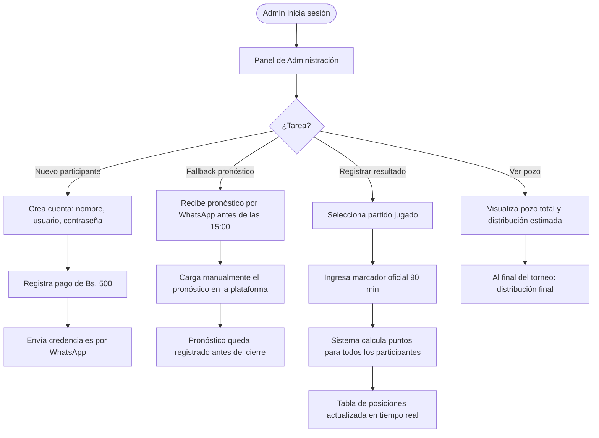
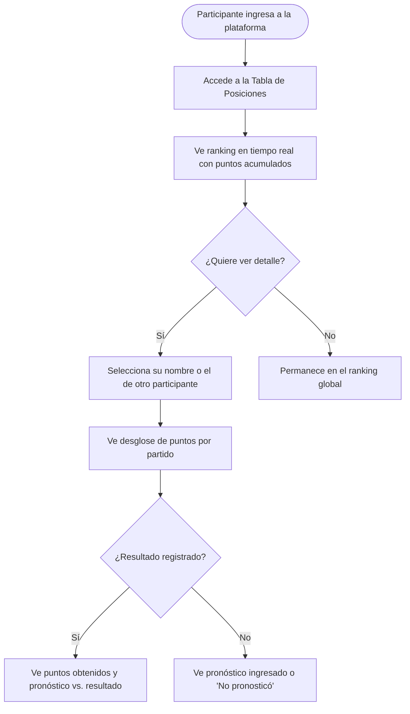

# PRD — Pronóstico Mundial 2026
## Product Requirements Document · v0.1

---

## Metadatos

| Campo            | Valor                                                    |
|------------------|----------------------------------------------------------|
| **Proyecto**     | Pronóstico Mundial 2026                                  |
| **Versión**      | 0.1 (borrador inicial)                                   |
| **Fecha**        | 2026-05-15                                               |
| **Autor**        | Alberto Gomez (carlos@brilliant.tech)                    |
| **Cliente**      | Vladimir Mariaca Vargas (organizador del torneo)         |
| **Estado**       | En revisión                                              |
| **Próxima revisión** | Aprobación por el cliente antes de iniciar el FSD   |

---

## Historial de Versiones

| Versión | Fecha      | Autor           | Descripción                          |
|---------|------------|-----------------|--------------------------------------|
| 0.1     | 2026-05-15 | Alberto Gomez   | Borrador inicial basado en reglas del cliente y documento de invitación |

---

## 1. Resumen Ejecutivo

**Pronóstico Mundial 2026** es una aplicación web privada diseñada para gestionar un torneo de predicciones del Mundial FIFA 2026 (EE.UU., México, Canadá). El torneo es organizado por Vladimir Mariaca Vargas para un grupo cerrado de participantes que compiten pronosticando el marcador exacto de cada partido.

Los participantes pagan una cuota única de Bs. 500 para inscribirse. Al final del torneo, el pozo acumulado se distribuye entre los mejores clasificados según reglas predefinidas. La plataforma centraliza la gestión de pronósticos, el cálculo de puntos, la tabla de posiciones en tiempo real y la administración del torneo — reemplazando métodos manuales como hojas de cálculo o grupos de WhatsApp.

---

## 2. Objetivos del Producto

### 2.1 Objetivo General

Proveer al organizador y a los participantes una plataforma web confiable, transparente y fácil de usar que gestione de principio a fin el torneo de pronósticos del Mundial FIFA 2026.

### 2.2 Objetivos Específicos

| ID      | Objetivo                                                                                                        |
|---------|-----------------------------------------------------------------------------------------------------------------|
| OBJ-001 | Centralizar el ingreso y la gestión de pronósticos, eliminando la dependencia de WhatsApp o Excel.             |
| OBJ-002 | Garantizar la transparencia del proceso: pronósticos publicados públicamente a las 15:00 del día anterior.     |
| OBJ-003 | Automatizar el cálculo de puntos tras el ingreso de resultados oficiales.                                       |
| OBJ-004 | Ofrecer una tabla de posiciones pública y en tiempo real durante todo el torneo.                                |
| OBJ-005 | Proveer al admin herramientas de gestión del torneo: cuentas, pagos, resultados y fallback de pronósticos.     |
| OBJ-006 | Calcular y mostrar la distribución del pozo de manera automática y auditable.                                   |

### 2.3 Indicadores de Éxito

- 100% de los partidos tienen resultados registrados antes de que inicie el siguiente partido de cada participante.
- 0 discrepancias en el cálculo de puntos reportadas por los participantes.
- La tabla de posiciones se actualiza dentro de los 60 segundos posteriores al registro de un resultado.
- El organizador puede crear una cuenta y entregar credenciales en menos de 2 minutos.

---

## 3. Contexto y Problema

### 3.1 Problema Actual

Los torneos de pronósticos entre amigos o grupos pequeños suelen gestionarse mediante hojas de cálculo compartidas o mensajes de WhatsApp, lo que genera:

- Pérdida de pronósticos enviados fuera de horario o en el hilo incorrecto.
- Errores de cálculo manual de puntos.
- Falta de transparencia: los participantes no pueden verificar qué pronosticaron los demás antes o después del cierre.
- Dificultad para rastrear pagos de cuotas y el estado del pozo.
- Disputas sobre si un pronóstico fue enviado a tiempo.

### 3.2 Solución Propuesta

Una aplicación web privada que actúa como árbitro neutral del torneo: recibe pronósticos con sello de tiempo, los bloquea automáticamente al cumplirse el plazo, los publica simultáneamente a todos, calcula puntos sin intervención humana y mantiene una tabla de posiciones confiable y pública.

### 3.3 Partes Interesadas

| Rol           | Nombre / Descripción                                      | Interés Principal                                   |
|---------------|-----------------------------------------------------------|-----------------------------------------------------|
| Organizador / Admin | Vladimir Mariaca Vargas                          | Gestionar el torneo con mínimo esfuerzo manual      |
| Participantes | Grupo cerrado de jugadores inscritos (incluye al admin)   | Ingresar pronósticos, seguir su posición, ganar     |
| Desarrollador | Brilliant Tech (carlos@brilliant.tech)                    | Entregar un producto funcional, mantenible y a tiempo |

---

## 4. Alcance

### 4.1 Dentro del Alcance — v1.0

- Autenticación de usuarios (login con usuario y contraseña gestionado por Supabase Auth).
- Gestión de cuentas por el admin: creación manual, activación, asignación de rol.
- Registro de pago de cuota de inscripción por el admin.
- Fixture del Mundial 2026 con cálculo automático del plazo de cierre (15:00 BOT del día anterior).
- Ingreso y modificación de pronósticos (score exacto) antes del plazo.
- Selección del Campeón Mundial por parte de cada participante (antes del partido inaugural).
- Visibilidad del Campeón: pública desde el inicio del torneo.
- Publicación automática de pronósticos a las 15:00 del día anterior; bloqueo inmediato.
- Fallback: el admin puede cargar manualmente pronósticos recibidos por WhatsApp antes del plazo.
- Motor de puntos: +1 resultado, +2 score exacto (solo si ingresado manualmente), +5 campeón. Máx. 3 por partido.
- Caso especial "No pronosticó": evaluado como 0-0 pero sin derecho a los +2, máximo 1 punto si el partido termina 0-0.
- Solo cuentan los 90 minutos reglamentarios (sin prórroga ni penales).
- Registro de resultado oficial por el admin con cálculo automático de puntos al guardar.
- Tabla de posiciones pública, permanente y en tiempo real (Supabase Realtime).
- Vista de detalle de puntos por participante y por partido.
- Cálculo y visualización del pozo y distribución estimada de premios.
- Reglas de distribución: ≤8 participantes → 100% al 1ro; >8 → 75% al 1ro y 25% al 2do.
- Reglas de empate en 1er y 2do lugar.
- Panel de administración para gestionar todas las funciones del admin.

### 4.2 Fuera del Alcance — v1.0

- Registro público de usuarios (autoregistro).
- Integración directa con WhatsApp API (el fallback es manual por el admin).
- Pasarela de pago en línea (el pago de cuota se verifica manualmente).
- Notificaciones push o SMS automatizadas.
- Aplicación móvil nativa (iOS / Android).
- Soporte para múltiples torneos simultáneos.
- Estadísticas avanzadas o analytics de predicciones.
- Prórroga y tiros penales en el motor de puntos.
- Exportación de reportes en PDF o Excel.
- Integración con APIs externas de resultados en vivo del Mundial.

---

## 5. Restricciones y Supuestos

### 5.1 Restricciones

| ID     | Restricción                                                                                           |
|--------|-------------------------------------------------------------------------------------------------------|
| RST-001 | El plazo de cierre de pronósticos es siempre las 15:00 hora Bolivia (BOT, UTC-4) del día anterior al partido. |
| RST-002 | Solo el administrador puede crear cuentas; no existe registro público.                                |
| RST-003 | Una vez inscrito (cuota pagada y cuenta activada), el participante no puede retirarse.                |
| RST-004 | El motor de puntos evalúa únicamente los 90 minutos reglamentarios.                                   |
| RST-005 | Un pronóstico no ingresado manualmente se marca como "No pronosticó" y se evalúa como 0-0, pero nunca puede ganar los +2 puntos adicionales por score exacto. |

### 5.2 Supuestos

| ID     | Supuesto                                                                                              |
|--------|-------------------------------------------------------------------------------------------------------|
| ASM-001 | El fixture del Mundial 2026 (fechas, horarios, equipos) estará disponible antes del inicio del desarrollo y se cargará manualmente en la base de datos. |
| ASM-002 | El organizador tiene acceso a internet y dispositivo móvil para cargar resultados y gestionar cuentas. |
| ASM-003 | Los participantes acceden a la plataforma desde navegadores web modernos (móvil o escritorio).        |
| ASM-004 | El número total de participantes no superará los 200 (dimensionamiento de la infraestructura).        |
| ASM-005 | La distribución del pozo se calcula sobre el total de cuotas pagadas registradas en la plataforma.    |

---

## 6. User Journeys

### 6.1 Journey: Participante — Pronosticar un partido


### 6.2 Journey: Admin — Gestionar el torneo



### 6.3 Journey: Participante — Ver tabla de posiciones



---

## 7. User Stories

### Épica E1 — Autenticación y Acceso

---

#### PRD-US-001: Iniciar sesión con usuario y contraseña

**Como** participante,
**quiero** iniciar sesión en la plataforma con el usuario y contraseña que me entregó el organizador,
**para** acceder a mis pronósticos, la tabla de posiciones y la información del torneo.

**Criterios de Aceptación:**

```gherkin
Feature: Inicio de sesión de participante

  Scenario: Inicio de sesión exitoso
    Given que soy un participante con cuenta activa
    And tengo el usuario "jperez" y contraseña "abc123"
    When ingreso mis credenciales en el formulario de login
    And presiono "Iniciar sesión"
    Then soy redirigido al dashboard del torneo
    And veo mi nombre en la esquina superior

  Scenario: Credenciales incorrectas
    Given que ingreso una contraseña incorrecta
    When presiono "Iniciar sesión"
    Then veo el mensaje de error "Usuario o contraseña incorrectos"
    And permanezco en la pantalla de login

  Scenario: Cuenta inactiva
    Given que el admin creó mi cuenta pero no registró mi pago
    When intento iniciar sesión con mis credenciales
    Then veo el mensaje "Tu cuenta aún no está activada. Contacta al organizador."
```

**Reglas de negocio referenciadas:** BR-001 (acceso por credenciales), BR-002 (cuentas creadas por admin)
**Prioridad:** Alta | **Story Points:** 3

---

#### PRD-US-002: Crear cuentas manualmente (Admin)

**Como** administrador del torneo,
**quiero** crear cuentas de participantes manualmente desde el panel de administración,
**para** habilitar el acceso a nuevos jugadores sin depender de un registro público.

**Criterios de Aceptación:**

```gherkin
Feature: Creación manual de cuentas por el admin

  Scenario: Crear cuenta exitosamente
    Given que estoy en el panel de administración
    When ingreso el nombre completo, usuario y contraseña del nuevo participante
    And presiono "Crear cuenta"
    Then la cuenta queda creada con estado "pendiente de pago"
    And aparece en la lista de participantes del panel

  Scenario: Usuario duplicado
    Given que el usuario "jperez" ya existe en el sistema
    When intento crear otra cuenta con el mismo usuario
    Then veo el error "El nombre de usuario ya está en uso"

  Scenario: Campos obligatorios vacíos
    Given que no completo el campo de nombre de usuario
    When presiono "Crear cuenta"
    Then veo la validación "El nombre de usuario es obligatorio"
```

**Reglas de negocio referenciadas:** BR-002 (registro manual)
**Prioridad:** Alta | **Story Points:** 3

---

### Épica E2 — Pronósticos de Partidos

---

#### PRD-US-003: Ver lista de partidos con plazos

**Como** participante,
**quiero** ver la lista completa de partidos del Mundial con la fecha del partido y el plazo límite para pronosticar,
**para** organizar mis predicciones con anticipación y no perder ningún plazo.

**Criterios de Aceptación:**

```gherkin
Feature: Lista de partidos y plazos

  Scenario: Ver partidos próximos con plazo abierto
    Given que estoy en la sección de pronósticos
    When la lista de partidos carga
    Then veo cada partido con: equipos, fecha y hora del partido, plazo límite (15:00 del día anterior)
    And los partidos con plazo abierto muestran el estado "Abierto"

  Scenario: Ver partidos con plazo vencido
    Given que ya pasaron las 15:00 del día anterior a un partido
    When veo la lista de partidos
    Then ese partido muestra el estado "Cerrado"
    And ya no puedo modificar mi pronóstico para ese partido

  Scenario: Ordenamiento de la lista
    Given que hay partidos de distintas fases
    When cargo la lista de partidos
    Then los partidos están ordenados cronológicamente por fecha y hora
```

**Reglas de negocio referenciadas:** BR-003 (plazo de cierre 15:00 BOT del día anterior)
**Prioridad:** Alta | **Story Points:** 2

---

#### PRD-US-004: Ingresar pronóstico de score exacto

**Como** participante,
**quiero** ingresar mi pronóstico de marcador exacto (goles Local y goles Visitante) para un partido antes del plazo,
**para** participar en el sistema de puntos y optar a los +3 puntos disponibles por ese partido.

**Criterios de Aceptación:**

```gherkin
Feature: Ingreso de pronóstico

  Scenario: Ingresar pronóstico exitosamente
    Given que el plazo de un partido no ha vencido
    And no tengo pronóstico ingresado para ese partido
    When ingreso "2" para el equipo local y "1" para el visitante
    And presiono "Guardar pronóstico"
    Then mi pronóstico queda registrado como "2 - 1"
    And el sistema muestra confirmación "Pronóstico guardado"
    And el pronóstico permanece privado hasta las 15:00 del día anterior

  Scenario: Intentar ingresar pronóstico con plazo vencido
    Given que ya son las 15:00 del día anterior al partido
    When intento acceder al formulario de pronóstico
    Then el formulario aparece bloqueado (solo lectura)
    And veo el mensaje "El plazo para pronosticar este partido ha vencido"

  Scenario: Pronóstico no ingresado
    Given que no ingresé pronóstico antes del plazo
    When el plazo vence
    Then el sistema registra internamente 0-0 para ese partido
    And en la UI se muestra "No pronosticó" (no "0 - 0")
```

**Reglas de negocio referenciadas:** BR-003 (plazo), BR-004 (score exacto), BR-005 (pronóstico no ingresado)
**Prioridad:** Alta | **Story Points:** 5

---

#### PRD-US-005: Modificar pronóstico antes del plazo

**Como** participante,
**quiero** poder modificar mi pronóstico para un partido hasta que venza el plazo,
**para** corregir mi predicción si cambio de opinión.

**Criterios de Aceptación:**

```gherkin
Feature: Modificación de pronóstico

  Scenario: Modificar pronóstico exitosamente
    Given que tengo un pronóstico "1 - 0" guardado para un partido
    And el plazo aún no ha vencido
    When cambio el marcador a "2 - 1" y presiono "Guardar"
    Then mi pronóstico se actualiza a "2 - 1"
    And veo la confirmación "Pronóstico actualizado"

  Scenario: Intentar modificar después del plazo
    Given que ya son las 15:00 del día anterior al partido
    And tengo un pronóstico guardado "1 - 0"
    When intento editar el formulario
    Then el campo está deshabilitado
    And veo el mensaje "Los pronósticos están bloqueados"
```

**Reglas de negocio referenciadas:** BR-003 (plazo de modificación)
**Prioridad:** Alta | **Story Points:** 2

---

#### PRD-US-006: Ver estado de mis pronósticos

**Como** participante,
**quiero** ver el estado de cada uno de mis pronósticos (ingresado, no pronosticado, o bloqueado),
**para** saber en qué partidos participé activamente y en cuáles no.

**Criterios de Aceptación:**

```gherkin
Feature: Estado de pronósticos propios

  Scenario: Pronóstico ingresado antes del plazo
    Given que ingresé "2 - 0" para un partido
    When veo mi lista de pronósticos
    Then ese partido muestra "2 - 0" con estado "Guardado"

  Scenario: Pronóstico no ingresado después del plazo
    Given que no ingresé pronóstico para un partido
    When vence el plazo y veo mi lista
    Then ese partido muestra "No pronosticó" (sin revelar el 0-0 interno)

  Scenario: Pronóstico bloqueado
    Given que ya pasaron las 15:00 del día anterior
    When veo mi pronóstico guardado
    Then el estado muestra "Bloqueado" y el campo no es editable
```

**Reglas de negocio referenciadas:** BR-005 (visualización "No pronosticó"), BR-003 (bloqueo)
**Prioridad:** Alta | **Story Points:** 2

---

#### PRD-US-007: Ver pronósticos de todos los participantes después del plazo

**Como** participante,
**quiero** ver los pronósticos de todos los demás participantes para un partido una vez que el plazo haya vencido,
**para** comparar predicciones y generar debate antes y durante el partido.

**Criterios de Aceptación:**

```gherkin
Feature: Visibilidad pública de pronósticos post-cierre

  Scenario: Ver pronósticos de todos después del plazo
    Given que ya son las 15:00 del día anterior a un partido
    When accedo a la vista de ese partido
    Then veo una tabla con todos los participantes, su pronóstico o "No pronosticó"

  Scenario: Pronósticos privados antes del plazo
    Given que el plazo aún no ha vencido
    When accedo a la vista de un partido
    Then no veo los pronósticos de los demás participantes
    And solo veo si yo ya ingresé el mío o no

  Scenario: Participante que no pronosticó
    Given que un participante no ingresó pronóstico antes del plazo
    When se publican los pronósticos a las 15:00
    Then ese participante aparece en la tabla con "No pronosticó" (no se muestra "0 - 0")
```

**Reglas de negocio referenciadas:** BR-006 (visibilidad pública post-cierre), BR-005 (texto "No pronosticó")
**Prioridad:** Alta | **Story Points:** 3

---

### Épica E3 — Campeón Mundial

---

#### PRD-US-008: Elegir equipo Campeón Mundial

**Como** participante,
**quiero** elegir mi equipo Campeón Mundial antes del primer partido del torneo,
**para** participar en el bono de +5 puntos que se otorga al final si acierto.

**Criterios de Aceptación:**

```gherkin
Feature: Elección del Campeón Mundial

  Scenario: Elegir campeón exitosamente
    Given que el torneo aún no ha iniciado (primer partido no jugado)
    And no he elegido campeón aún
    When selecciono "Argentina" del listado de selecciones
    And presiono "Confirmar mi Campeón"
    Then mi elección queda guardada como "Argentina"
    And se muestra públicamente a todos los participantes desde ese momento

  Scenario: Plazo vencido para elegir campeón
    Given que el primer partido ya comenzó
    When intento cambiar mi elección de campeón
    Then el selector está bloqueado
    And veo "Ya no es posible cambiar tu elección de Campeón"

  Scenario: Sin elección de campeón
    Given que no elegí campeón antes del inicio del torneo
    Then mi fila en la tabla de campeones muestra "No eligió"
    And no puedo ganar los +5 puntos del bono
```

**Reglas de negocio referenciadas:** BR-007 (campeón mundial, bono +5 puntos)
**Prioridad:** Alta | **Story Points:** 3

---

#### PRD-US-009: Ver elecciones de campeón de todos los participantes

**Como** participante,
**quiero** ver la elección de Campeón Mundial de todos los participantes desde el inicio del torneo,
**para** tener transparencia sobre quién apostó por qué selección.

**Criterios de Aceptación:**

```gherkin
Feature: Visibilidad pública del Campeón

  Scenario: Ver tabla de campeones desde el inicio
    Given que el torneo ha iniciado (o el primer partido ya se cargó en el fixture)
    When accedo a la sección "Campeón Mundial"
    Then veo una tabla con todos los participantes y su elección de campeón
    And si un participante no eligió, aparece "No eligió"

  Scenario: Visibilidad antes del inicio del torneo
    Given que el torneo aún no ha iniciado
    When accedo a la sección "Campeón Mundial"
    Then las elecciones ya registradas son visibles públicamente
```

**Reglas de negocio referenciadas:** BR-007 (transparencia, campeón visible desde el inicio)
**Prioridad:** Media | **Story Points:** 2

---

### Épica E4 — Tabla de Posiciones

---

#### PRD-US-010: Ver tabla de posiciones en tiempo real

**Como** participante,
**quiero** ver la tabla de posiciones con los puntos acumulados de todos los participantes actualizada en tiempo real,
**para** conocer mi posición en el torneo sin necesidad de recargar la página.

**Criterios de Aceptación:**

```gherkin
Feature: Tabla de posiciones en tiempo real

  Scenario: Ver tabla actualizada tras registrar resultado
    Given que el admin registra el resultado de un partido
    When los puntos se calculan automáticamente
    Then la tabla de posiciones se actualiza en mi pantalla sin recargar la página
    And el cambio ocurre dentro de los 60 segundos posteriores al registro

  Scenario: Ver posición propia destacada
    Given que estoy en la tabla de posiciones
    Then mi fila aparece resaltada visualmente para identificarme fácilmente

  Scenario: Ver tabla con empates
    Given que dos participantes tienen el mismo puntaje
    When veo la tabla
    Then ambos comparten la misma posición (ej. ambos en 2do lugar)
```

**Reglas de negocio referenciadas:** BR-008 (tabla de posiciones pública y en tiempo real)
**Prioridad:** Alta | **Story Points:** 5

---

#### PRD-US-011: Ver detalle de puntos por partido

**Como** participante,
**quiero** ver el desglose de puntos que obtuve partido por partido,
**para** entender por qué tengo ese puntaje total y qué partidos me dieron más o menos puntos.

**Criterios de Aceptación:**

```gherkin
Feature: Detalle de puntos por partido

  Scenario: Ver desglose de puntos de un participante
    Given que estoy en la tabla de posiciones
    When selecciono mi nombre (o el de otro participante)
    Then veo una tabla con todos los partidos disputados
    And para cada partido veo: mi pronóstico, el resultado oficial, puntos obtenidos (0, 1, 2 o 3)

  Scenario: Partido con resultado aún no registrado
    Given que un partido no tiene resultado oficial registrado
    When veo el detalle de ese partido en mi perfil
    Then ese partido muestra "Pendiente de resultado"

  Scenario: Partido no pronosticado con resultado 0-0
    Given que no ingresé pronóstico para un partido que terminó 0-0
    When veo el detalle de ese partido
    Then muestra "No pronosticó" en mi pronóstico y "1 punto" (acertó empate pero no score exacto)
```

**Reglas de negocio referenciadas:** BR-004 (sistema de puntos), BR-005 (caso "No pronosticó")
**Prioridad:** Media | **Story Points:** 3

---

### Épica E5 — Gestión del Torneo (Admin)

---

#### PRD-US-012: Registrar pago de inscripción

**Como** administrador,
**quiero** registrar el pago de la cuota de inscripción de un participante,
**para** activar su cuenta y contabilizar su aporte al pozo.

**Criterios de Aceptación:**

```gherkin
Feature: Registro de pago de inscripción

  Scenario: Activar cuenta tras confirmar pago
    Given que existe una cuenta en estado "pendiente de pago"
    When presiono "Marcar como pagado" para ese participante
    Then la cuenta cambia a estado "Activo"
    And el pozo total se incrementa en Bs. 500

  Scenario: Ver estado de pagos de todos los participantes
    Given que estoy en el panel de administración
    When accedo a la sección de participantes
    Then veo la lista con nombre, estado (pendiente / activo) y si pagó la cuota

  Scenario: No permitir participar sin pago registrado
    Given que una cuenta tiene estado "pendiente de pago"
    When el participante intenta ingresar un pronóstico
    Then el sistema no lo permite y muestra "Tu cuenta no está activada"
```

**Reglas de negocio referenciadas:** BR-001 (inscripción con cuota Bs. 500), BR-002 (gestión por admin)
**Prioridad:** Alta | **Story Points:** 3

---

#### PRD-US-013: Ver pozo acumulado y distribución estimada

**Como** administrador,
**quiero** ver el total del pozo acumulado y cómo se distribuiría entre los ganadores según las reglas actuales,
**para** informar a los participantes sobre el premio en juego en cualquier momento del torneo.

**Criterios de Aceptación:**

```gherkin
Feature: Visualización del pozo y distribución

  Scenario: Ver pozo con 8 o menos participantes activos
    Given que hay 6 participantes con pago registrado
    When accedo a la vista del pozo
    Then veo "Pozo total: Bs. 3.000"
    And veo "Distribución: 100% al 1er lugar (Bs. 3.000)"

  Scenario: Ver pozo con más de 8 participantes activos
    Given que hay 10 participantes con pago registrado
    When accedo a la vista del pozo
    Then veo "Pozo total: Bs. 5.000"
    And veo "1er lugar: Bs. 3.750 (75%) · 2do lugar: Bs. 1.250 (25%)"

  Scenario: Distribución con empate en 1er lugar
    Given que al final del torneo dos participantes empatan en 1er lugar
    When se calcula la distribución final
    Then la vista muestra: "Empate en 1er lugar: cada ganador recibe Bs. 2.500 (50%)"
```

**Reglas de negocio referenciadas:** BR-009 (distribución del pozo), BR-010 (reglas de empate)
**Prioridad:** Alta | **Story Points:** 3

---

#### PRD-US-014: Cargar pronóstico manual (Fallback WhatsApp)

**Como** administrador,
**quiero** poder ingresar manualmente el pronóstico de un participante recibido por WhatsApp antes del plazo,
**para** garantizar que ningún jugador pierda su pronóstico por problemas técnicos de la plataforma.

**Criterios de Aceptación:**

```gherkin
Feature: Carga manual de pronóstico por el admin (fallback)

  Scenario: Cargar pronóstico válido antes del plazo
    Given que el plazo de un partido no ha vencido
    And recibí el pronóstico "2-1" de "jperez" por WhatsApp
    When selecciono al participante "jperez" y el partido correspondiente en el panel admin
    And ingreso "2" local y "1" visitante
    And presiono "Guardar pronóstico manual"
    Then el pronóstico queda registrado para "jperez" como si él lo hubiera ingresado
    And se registra un log indicando "cargado manualmente por admin"

  Scenario: Intentar cargar pronóstico después del plazo
    Given que ya son las 15:00 del día anterior al partido
    When intento cargar un pronóstico manual para ese partido
    Then el sistema no lo permite
    And veo el mensaje "El plazo de cierre ya venció para este partido"

  Scenario: Pronóstico cargado manualmente cuenta como ingresado
    Given que el admin cargó "0-0" para "jperez"
    And el partido termina 0-0
    When se calculan los puntos
    Then "jperez" recibe 3 puntos (acertó resultado + score exacto)
    (porque el pronóstico fue ingresado explícitamente, aunque fuera por el admin)
```

**Reglas de negocio referenciadas:** BR-005 (pronóstico ingresado manualmente = tiene derecho a +2), BR-003 (plazo)
**Prioridad:** Alta | **Story Points:** 5

---

#### PRD-US-015: Registrar resultado oficial de un partido

**Como** administrador,
**quiero** registrar el resultado oficial (marcador a 90 minutos) de cada partido terminado,
**para** que el sistema calcule automáticamente los puntos de todos los participantes.

**Criterios de Aceptación:**

```gherkin
Feature: Registro de resultado oficial

  Scenario: Registrar resultado y calcular puntos
    Given que un partido ha terminado
    When ingreso el marcador "3 - 1" para el partido y presiono "Guardar resultado"
    Then el sistema calcula los puntos de todos los participantes para ese partido
    And la tabla de posiciones se actualiza en tiempo real
    And el partido aparece marcado como "Finalizado" con el resultado visible

  Scenario: Modificar resultado ya registrado
    Given que registré "2 - 1" por error y el resultado real fue "2 - 0"
    When corrijo el marcador y guardo nuevamente
    Then el sistema recalcula los puntos para ese partido
    And la tabla de posiciones se actualiza con los nuevos valores

  Scenario: Solo contar 90 minutos reglamentarios
    Given que un partido terminó 1-1 en 90 minutos y fue al alargue
    When registro el resultado
    Then debo ingresar "1 - 1" (el marcador de los 90 minutos), no el resultado final del alargue
    And el sistema calcula puntos sobre "1 - 1"
```

**Reglas de negocio referenciadas:** BR-004 (solo 90 minutos), BR-008 (cálculo automático de puntos)
**Prioridad:** Alta | **Story Points:** 5

---

### Épica E6 — Resultados y Premios

---

#### PRD-US-016: Ver puntos obtenidos por partido

**Como** participante,
**quiero** ver cuántos puntos obtuve en cada partido una vez que se registra el resultado oficial,
**para** entender cómo evoluciona mi puntaje total y qué tan acertadas fueron mis predicciones.

**Criterios de Aceptación:**

```gherkin
Feature: Visualización de puntos obtenidos por partido

  Scenario: Ver puntos de partido con pronóstico ingresado
    Given que pronostiqué "2 - 1" y el resultado fue "2 - 1"
    When el admin registra el resultado
    Then en mi perfil veo: "Pronóstico: 2-1 | Resultado: 2-1 | Puntos: 3 (resultado + score exacto)"

  Scenario: Ver puntos de partido sin pronóstico
    Given que no ingresé pronóstico y el partido terminó "0 - 0"
    When el admin registra el resultado
    Then veo: "No pronosticó | Resultado: 0-0 | Puntos: 1 (acertó empate, no score exacto)"

  Scenario: Ver puntos de partido con resultado diferente al pronóstico
    Given que pronostiqué "1 - 0" y el resultado fue "2 - 1"
    When el admin registra el resultado
    Then veo: "Pronóstico: 1-0 | Resultado: 2-1 | Puntos: 1 (acertó resultado, no score exacto)"
```

**Reglas de negocio referenciadas:** BR-004 (sistema de puntos), BR-005 (caso "No pronosticó")
**Prioridad:** Media | **Story Points:** 3

---

#### PRD-US-017: Ver distribución final del pozo (Admin)

**Como** administrador,
**quiero** ver la distribución final del pozo al concluir el torneo con los ganadores identificados y los montos exactos,
**para** proceder al pago de premios de manera transparente y auditada.

**Criterios de Aceptación:**

```gherkin
Feature: Distribución final del pozo

  Scenario: Distribución con ganador único (más de 8 participantes)
    Given que el torneo terminó con 12 participantes
    And "Juan Pérez" tiene el mayor puntaje y "María López" el segundo
    When accedo a la vista de distribución final
    Then veo "Ganador: Juan Pérez — Bs. 4.500 (75%)" y "2do lugar: María López — Bs. 1.500 (25%)"

  Scenario: Distribución con 8 o menos participantes
    Given que el torneo terminó con 7 participantes (Bs. 3.500 en el pozo)
    And "Carlos Soto" tiene el mayor puntaje
    When veo la distribución final
    Then veo "Ganador: Carlos Soto — Bs. 3.500 (100%)"

  Scenario: Empate en el primer lugar
    Given que "Ana" y "Luis" empatan en primer lugar con el mismo puntaje
    And hay más de 8 participantes
    When veo la distribución final
    Then veo "Empate en 1er lugar: Ana y Luis — Bs. X.XXX cada uno (50% del pozo total)"
    And no se otorga premio al 2do lugar
```

**Reglas de negocio referenciadas:** BR-009 (distribución del pozo), BR-010 (reglas de empate)
**Prioridad:** Media | **Story Points:** 3

---

## 8. Requerimientos Funcionales

| ID          | Descripción                                                                                                   | US Relacionadas              | Prioridad |
|-------------|---------------------------------------------------------------------------------------------------------------|------------------------------|-----------|
| PRD-REQ-001 | El sistema debe permitir el inicio de sesión mediante usuario y contraseña gestionados por Supabase Auth.     | PRD-US-001                   | Alta      |
| PRD-REQ-002 | El admin debe poder crear cuentas de participantes manualmente con nombre, usuario y contraseña.             | PRD-US-002                   | Alta      |
| PRD-REQ-003 | El admin debe poder registrar el pago de la cuota (Bs. 500) para activar cada cuenta.                       | PRD-US-012                   | Alta      |
| PRD-REQ-004 | El fixture del torneo debe mostrar partidos con fecha, hora y plazo de cierre calculado automáticamente.     | PRD-US-003                   | Alta      |
| PRD-REQ-005 | Los participantes deben poder ingresar y modificar pronósticos de score exacto mientras el plazo esté abierto. | PRD-US-004, PRD-US-005      | Alta      |
| PRD-REQ-006 | A las 15:00 BOT del día anterior, los pronósticos deben bloquearse y publicarse automáticamente.             | PRD-US-006, PRD-US-007       | Alta      |
| PRD-REQ-007 | Un pronóstico no ingresado debe registrarse internamente como 0-0 y mostrarse como "No pronosticó" en la UI. | PRD-US-006, PRD-US-016       | Alta      |
| PRD-REQ-008 | Los participantes deben poder elegir su Campeón Mundial antes del partido inaugural; la elección es pública. | PRD-US-008, PRD-US-009       | Alta      |
| PRD-REQ-009 | El admin debe poder registrar el resultado oficial (marcador 90 min) de cada partido.                        | PRD-US-015                   | Alta      |
| PRD-REQ-010 | Al registrar un resultado, el sistema debe calcular automáticamente los puntos de todos los participantes.   | PRD-US-015, PRD-US-016       | Alta      |
| PRD-REQ-011 | El motor de puntos debe aplicar: +1 resultado, +2 score exacto (solo si ingresado manualmente), +5 campeón. | PRD-US-016                   | Alta      |
| PRD-REQ-012 | La tabla de posiciones debe ser pública, permanente y actualizarse en tiempo real vía Supabase Realtime.     | PRD-US-010, PRD-US-011       | Alta      |
| PRD-REQ-013 | El admin debe poder cargar pronósticos manualmente (fallback) para un participante antes del plazo de cierre. | PRD-US-014                  | Alta      |
| PRD-REQ-014 | El sistema debe calcular y mostrar el pozo total y la distribución estimada/final de premios.                | PRD-US-013, PRD-US-017       | Alta      |
| PRD-REQ-015 | La distribución del pozo debe aplicar las reglas de empate: fusionar premios en 1ro, dividir en 2do.        | PRD-US-017                   | Alta      |

---

## 9. Requerimientos No Funcionales

| ID          | Categoría       | Descripción                                                                                                        |
|-------------|-----------------|--------------------------------------------------------------------------------------------------------------------|
| PRD-NFR-001 | Rendimiento     | La tabla de posiciones debe reflejar actualizaciones dentro de los 60 segundos posteriores al registro de un resultado, sin necesidad de recargar la página. |
| PRD-NFR-002 | Disponibilidad  | La plataforma debe estar disponible al menos el 99% del tiempo durante el período del torneo (junio-julio 2026). El fallback de WhatsApp mitiga interrupciones cortas. |
| PRD-NFR-003 | Seguridad       | Los pronósticos deben ser completamente privados hasta el momento del cierre. Ningún participante puede acceder a los pronósticos de otros antes del plazo, ni siquiera inspeccionando la API. |
| PRD-NFR-004 | Usabilidad      | La interfaz debe ser responsiva y funcional en navegadores móviles modernos (iOS Safari, Android Chrome). El ingreso de un pronóstico no debe requerir más de 3 interacciones desde la pantalla principal. |
| PRD-NFR-005 | Mantenibilidad  | El código debe seguir la arquitectura definida en CLAUDE.md (App Router, Drizzle en servidor, TanStack Query en cliente). Las reglas de negocio de puntos y premios deben estar en módulos aislados (`lib/points.ts`, `lib/prizes.ts`) con pruebas unitarias. |

---

## 10. Diseño de Datos (Resumen)

### Entidades principales

| Entidad          | Atributos clave                                                                                   |
|------------------|---------------------------------------------------------------------------------------------------|
| `users`          | id, nombre, username, role (admin/participante), estado (pendiente/activo), cuota_pagada         |
| `partidos`       | id, fase, equipo_local, equipo_visitante, fecha_hora, plazo_cierre, resultado_local, resultado_visitante, finalizado |
| `pronosticos`    | id, user_id, partido_id, goles_local, goles_visitante, ingresado_manualmente, puntos_obtenidos, creado_en |
| `campeon_picks`  | id, user_id, seleccion, creado_en                                                                 |
| `inscripciones`  | id, user_id, monto (500), fecha_pago, registrado_por_admin                                       |

---

## 11. Reglas de Negocio (Referencia BRD)

| ID     | Regla de Negocio                                                                                                    |
|--------|---------------------------------------------------------------------------------------------------------------------|
| BR-001 | La cuota de inscripción es de Bs. 500 por participante. No hay límite de participantes.                            |
| BR-002 | El registro es manual: el admin crea todas las cuentas y entrega credenciales. No existe autoregistro.             |
| BR-003 | El plazo de cierre de pronósticos es las 15:00 hora Bolivia (BOT, UTC-4) del día anterior al partido. Pasado ese plazo, los pronósticos se publican y se bloquean. |
| BR-004 | Sistema de puntos por partido: +1 por acertar resultado (V/E/D), +2 adicionales por score exacto (solo si ingresado manualmente). Máximo 3 por partido. Solo cuentan los 90 minutos reglamentarios. |
| BR-005 | Un pronóstico no ingresado se muestra como "No pronosticó" en la UI y se evalúa internamente como 0-0. Si el partido termina 0-0, el jugador gana 1 punto pero no los +2 adicionales. |
| BR-006 | Los pronósticos son privados hasta las 15:00 del día anterior. Después, todos los pronósticos (incluyendo "No pronosticó") son visibles públicamente. |
| BR-007 | El Campeón Mundial se elige antes del partido inaugural. Si se acierta, se suman +5 puntos al final del torneo. La elección es pública desde el inicio. |
| BR-008 | La tabla de posiciones es pública, permanente y se actualiza en tiempo real tras el registro de cada resultado. |
| BR-009 | Distribución del pozo: ≤8 participantes → 100% al 1er lugar. >8 participantes → 75% al 1er lugar y 25% al 2do lugar. |
| BR-010 | Empate en 1er lugar: se fusionan el 75% y el 25% (100%) y se dividen en partes iguales; el siguiente clasificado no recibe premio. Empate en 2do lugar: el 25% se divide en partes iguales entre los empatados. |

---

## 12. Matriz de Trazabilidad

### BRD → PRD (Reglas de Negocio → Requerimientos)

| BR ID  | Descripción (resumen)                         | PRD-REQ                              | PRD-US                           |
|--------|-----------------------------------------------|--------------------------------------|----------------------------------|
| BR-001 | Cuota Bs. 500, sin límite de participantes    | PRD-REQ-003, PRD-REQ-014            | PRD-US-012, PRD-US-013           |
| BR-002 | Registro manual por admin                     | PRD-REQ-001, PRD-REQ-002            | PRD-US-001, PRD-US-002           |
| BR-003 | Plazo 15:00 BOT día anterior, bloqueo         | PRD-REQ-004, PRD-REQ-005, PRD-REQ-006 | PRD-US-003, PRD-US-004, PRD-US-005, PRD-US-006 |
| BR-004 | Sistema de puntos (+1/+2/max 3, solo 90 min)  | PRD-REQ-010, PRD-REQ-011            | PRD-US-015, PRD-US-016           |
| BR-005 | "No pronosticó": 0-0 interno, max 1 pt        | PRD-REQ-007, PRD-REQ-011            | PRD-US-006, PRD-US-016           |
| BR-006 | Privacidad pronósticos hasta el plazo         | PRD-REQ-006                         | PRD-US-007                       |
| BR-007 | Campeón Mundial: +5 pts, visible desde inicio | PRD-REQ-008                         | PRD-US-008, PRD-US-009           |
| BR-008 | Tabla de posiciones pública y en tiempo real  | PRD-REQ-012                         | PRD-US-010, PRD-US-011           |
| BR-009 | Distribución del pozo ≤8 / >8 participantes   | PRD-REQ-014, PRD-REQ-015            | PRD-US-013, PRD-US-017           |
| BR-010 | Reglas de empate 1ro y 2do lugar              | PRD-REQ-015                         | PRD-US-017                       |

### PRD → FSD (Requerimientos → Componentes del Sistema)

| PRD-REQ     | Módulo / Componente (FSD)                                           |
|-------------|----------------------------------------------------------------------|
| PRD-REQ-001 | `app/(auth)/login` · Supabase Auth                                  |
| PRD-REQ-002 | `app/admin/users` · Route Handler `POST /api/admin/users`           |
| PRD-REQ-003 | `app/admin/users` · Route Handler `PATCH /api/admin/users/[id]/pago` |
| PRD-REQ-004 | `app/(auth)/fixture` · Server Component · Tabla de partidos         |
| PRD-REQ-005 | `app/(auth)/fixture/[partidoId]` · Route Handler `POST /api/pronosticos` |
| PRD-REQ-006 | Cron job o Supabase Edge Function · Bloqueo automático 15:00 BOT    |
| PRD-REQ-007 | `lib/points.ts` · Lógica de evaluación pronóstico vacío             |
| PRD-REQ-008 | `app/(auth)/campeon` · Route Handler `POST /api/campeon`            |
| PRD-REQ-009 | `app/admin/resultados` · Route Handler `POST /api/admin/resultados` |
| PRD-REQ-010 | `lib/points.ts` · Función `calcularPuntos(partido, pronosticos[])`  |
| PRD-REQ-011 | `lib/points.ts` · Motor de puntos completo                          |
| PRD-REQ-012 | `app/(auth)/tabla` · Supabase Realtime subscription                 |
| PRD-REQ-013 | `app/admin/fallback` · Route Handler `POST /api/admin/pronosticos/manual` |
| PRD-REQ-014 | `lib/prizes.ts` · Función `calcularPozo(participantes[])`           |
| PRD-REQ-015 | `lib/prizes.ts` · Función `resolverEmpates(ranking[])`              |

---

## 13. Criterios de Aceptación Global (Definition of Done)

Una historia de usuario se considera completada cuando:

1. La funcionalidad implementada pasa todos los escenarios Gherkin definidos en la historia.
2. El código sigue la arquitectura definida en CLAUDE.md (Drizzle solo en servidor, TanStack Query en cliente, Supabase Realtime para tabla de posiciones).
3. La UI es responsiva y funciona correctamente en móvil (iOS Safari, Android Chrome) y escritorio.
4. Las reglas de negocio críticas (`lib/points.ts`, `lib/prizes.ts`) tienen pruebas unitarias que cubren los casos normales y los casos borde (pronóstico vacío, partido 0-0, empates).
5. La funcionalidad fue revisada y aprobada por el organizador (Vladimir Mariaca Vargas) en un ambiente de staging.

---

## 14. Riesgos

| ID     | Riesgo                                                                                          | Probabilidad | Impacto | Mitigación                                                                              |
|--------|-------------------------------------------------------------------------------------------------|--------------|---------|-----------------------------------------------------------------------------------------|
| RSK-001 | Retraso o cambio en el fixture oficial del Mundial 2026                                        | Media        | Alto    | Diseñar el fixture como datos editables en la base de datos; el admin puede actualizar fechas. |
| RSK-002 | Participante intenta pronosticar después del plazo y alega que la app falló                    | Media        | Medio   | Registrar timestamp de cada acción; el fallback de WhatsApp como mecanismo oficial alternativo. |
| RSK-003 | Desacuerdo entre participantes sobre resultado oficial (especialmente en alargue/penales)       | Baja         | Alto    | El admin es el árbitro final; el sistema solo registra lo que el admin ingresa (90 min). |
| RSK-004 | Corte de servicio en Supabase/Vercel durante un partido crítico                                | Baja         | Alto    | Fallback de WhatsApp documentado y conocido por todos los participantes.                |
| RSK-005 | Número de participantes supera las estimaciones (>200)                                          | Baja         | Medio   | Monitoreo de la capa gratuita de Supabase; escalar a plan pago si es necesario.         |

---

*Documento generado el 2026-05-15. Fuentes: REGLAS_PRONOSTICO_MUNDIAL_2026.md, INVITACION_PRONOSTICO_MUNDIAL_2026.md, CLAUDE.md. Versión sujeta a revisión y aprobación por el cliente.*
